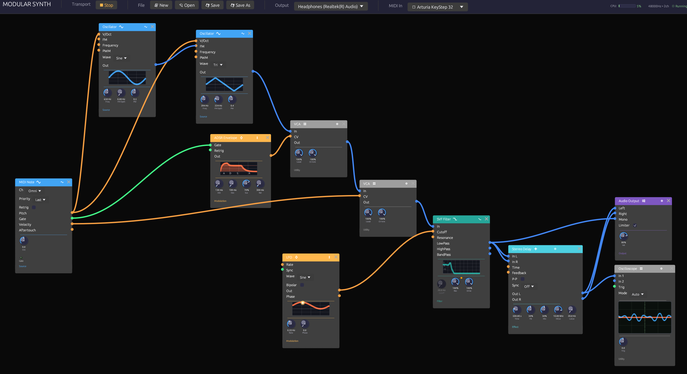

# Modular Synth

A node-based modular synthesizer, written in Rust. Patch oscillators, filters, envelopes and effects together on a canvas, the way you would in Blender's node editor, and hear the result as you go.



It doesn't imitate hardware panels. Every module is a node with jacks on its sides and knobs along its bottom, and every cable is coloured by what it carries. Knobs that are being modulated turn on their own, so you can watch the patch move.

**Documentation:** [docs.chaps.dev/modular](https://docs.chaps.dev/modular/) has a first-patch walkthrough, a page for every module, and recipes to build.

## Features

- **Colour-coded signals.** Blue cables carry audio, orange carry control voltage, green carry gates, and purple carry MIDI. Connections that can't work are refused as you make them.
- **Inputs vs. knobs.** Most parameters have a knob and a jack. Patch a cable into the jack and it takes over: the knob dims and follows the incoming signal, as on an analog modular.
- **Polyphony on a single cable.** Poly MIDI sends up to 8 voices down one cable, and every module after it plays each voice on its own. Poly cables are drawn as a bundle of strands, one per voice.
- **28 modules:**

  | Category | Modules |
  |---|---|
  | Sources | Oscillator (BLEP anti-aliasing, sync, through-zero FM, sub, supersaw unison), Noise (white, pink, brown, smooth random), Audio Input (mic or line in, envelope follower, gate), Keyboard, MIDI Note, Poly MIDI |
  | Filters | SVF Filter (self-oscillating, notch), Ladder Filter (oversampled) |
  | Modulation | ADSR Envelope, LFO, Clock |
  | Effects | Stereo Delay (with tape mode), Reverb (8-line FDN), Chorus, Distortion (oversampled, wavefolder), Compressor, Parametric EQ |
  | Utilities | VCA, Mixer (4 stereo channels, pan, mute, poly spread), Attenuverter, Sample & Hold, Quantizer (scales, custom scale from a clickable piano), Clock Divider, Logic (AND/OR/XOR/NOT, comparator), Step Sequencer |
  | Output | Audio Output (with metering and limiter), Oscilloscope, MIDI Monitor |

- **Visual feedback.** Waveform, envelope and filter-response displays sit on their modules, LEDs light on active outputs, and the scope shows what's actually there. Hover any jack or knob to see what it does.
- **Fast editing.** Space opens a fuzzy quick-add palette at the cursor. Undo and redo cover every edit. Copy, paste and duplicate work across windows, because the clipboard holds patch JSON.
- **Modules of your own.** `Ctrl+G` collapses a selection into a group: one node with its own jacks, a miniature of what's inside, and the knobs you pin to its face. Open it to edit, and save it to My Modules to use in any patch. The engine only ever sees the modules, so groups cost nothing to run.
- **Patches that explain themselves.** Frames group modules under a title, like sections of a front panel, and drag as one. Notes put a word of explanation beside them. Every example is laid out this way, so it reads as a lesson you can play.
- **Record what you hear.** **● Rec** (`Ctrl+R`) writes the output to a WAV, sample for sample, while you play and tweak. It never gets in the audio's way, and every take is saved with the patch that made it.
- **Live input.** Put a microphone, guitar or line source through the filters and effects. Audio Input follows its level and opens a gate on loud hits, so a drum loop can play a synth.
- **MIDI.** Play from any MIDI controller, map any knob to a CC with MIDI Learn, or play the computer keyboard.
- **Your work is safe.** Modular asks before New, Open or Quit would lose unsaved changes. A patch with unsaved changes is autosaved every 30 seconds and offered back after a crash. Recently opened patches are a menu away.
- **Real-time-safe engine.** The audio thread never allocates or locks. The UI sends it commands over lock-free ring buffers, and CI runs a test that fails if it ever allocates.

## Getting started

**[Try it in the browser](https://docs.chaps.dev/modular/play/)**, nothing to install: press **Play**, then play the `Z` to `M` keys or the Keyboard module's piano. The browser build has every module and example; MIDI devices, audio input and recording need the desktop app (see [`WEB.md`](WEB.md)).

To run it on your computer, build it from source. You need a [Rust toolchain](https://rustup.rs). On Linux you also need the ALSA and X11/Wayland development packages listed in `.github/workflows/ci.yml`.

```bash
cargo run --release                           # opens with the First Sound example
cargo run --release -- patches/lush-pad.json  # or open a patch
```

Ten example patches are in [`patches/`](patches) and in the app's **Examples** menu. Press **Play**, then hold a few keys on the computer keyboard (`Z` to `M` is a white-key octave, with the sharps on the row above).

### Render a patch offline

The `render` binary plays a patch to a WAV file without an audio device, and prints its peak and RMS levels:

```bash
cargo run --release --bin render -- patches/fm-synthesis.json out.wav --seconds 5
cargo run --release --bin render -- patches/lush-pad.json out.wav --audition  # plays a phrase into Keyboard/MIDI modules
```

### Shortcuts

| Keys | Action |
|---|---|
| `Space` / `Tab` | Quick-add a module at the cursor |
| `Ctrl+Z`, `Ctrl+Shift+Z` | Undo, redo |
| `Ctrl+C` / `X` / `V`, `Ctrl+D` | Copy, cut, paste, duplicate |
| `Delete` | Delete the selected modules, frames and notes |
| `Ctrl+Shift+F` | Frame the selected modules |
| `Ctrl+G`, `Ctrl+Alt+G` | Group the selected modules, ungroup a group |
| `Tab`, `Esc` | Open the selected group, go back out |
| `Ctrl+B` | Bypass the selected effects |
| `Ctrl+N`, `Ctrl+O`, `Ctrl+S`, `Ctrl+Shift+S` | New, open, save, save as |
| `Ctrl+R` | Record, or stop recording |

## How it's built

```
egui + egui_node_graph2   node editor, custom knobs, cables and displays
          │  commands and feedback over rtrb ring buffers
audio graph engine        compiled plans, pre-allocated buffers, poly channels
          │
cpal                      the audio device
```

Each DSP module declares its own ports, parameters and descriptions, and the editor generates its nodes from them, so the UI can't drift from the sound. Patches are plain JSON.

```bash
cargo test   # 800+ tests, including the audio-thread allocation guard
```

## License

MIT
