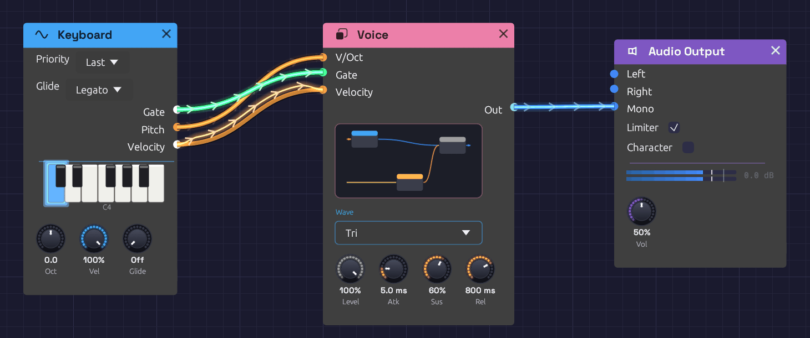
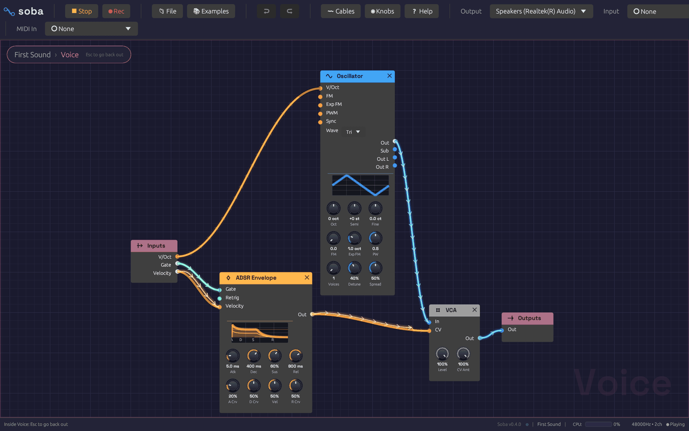

# Groups

A good voice (an oscillator, a filter, a VCA and an envelope) is the same few modules in patch after patch, and three voices side by side turn into a wall of cables. A **group** collapses modules into one node of your own. It has jacks where cables crossed into and out of the selection, plus any you add, and the controls you choose to keep on its face. Open it to work on what's inside. Save it to **My Modules**, and it's in the add menu of every patch.

*Voice holds an oscillator, an envelope and a VCA. Its face shows them in miniature, with the oscillator's **Wave** and four knobs pinned.*

## Making a group

Select some modules and press `Ctrl + G`, or right-click one of them and choose **Group**. They collapse into one rose-colored node where the top-left corner of the selection was. Type a name and press `Enter`.

Every cable that crossed the edge of the selection becomes a jack:

- **An input jack** for each output outside the group that fed something inside it. If one output fed several modules inside, as a keyboard's **Gate** might feed two envelopes, that's one jack.
- **An output jack** for each output inside the group that fed something outside it.

Jacks are named after the port inside, numbered if two names would be the same (**In**, **In 2**). They're colored by the signal they carry, like every jack, and ordered top to bottom by where their modules sit. Grouping doesn't change the sound: every module hears exactly what it heard before.

To take a group apart, select it and press `Ctrl + Alt + G`, or right-click it and choose **Ungroup**. Its modules come back out where the group was, laid out as they were, and every cable through its jacks becomes a plain cable again.

## Inside a group

Double-click a group, select it and press `Tab`, or click the miniature on its face, to go inside. A trail at the top of the canvas shows where you are, such as *First Sound › Voice*. Click any name in the trail to go back out to it, or press `Escape` to go up one level.

*Inside Voice. Inputs carries what's plugged into the group's jacks outside; Outputs sends its signals back out.*

Inside, two nodes stand for the group's jacks:

- **Inputs** has an output for each input jack. Whatever is plugged into that jack outside comes out here.
- **Outputs** has an input for each output jack. Whatever you plug in here comes out of that jack outside.

Everything else works as it does at the top of the patch. Modules you add, paste or drop from the palette land inside the group, and you can group modules inside a group too. The cables from Inputs show the signal arriving from outside. Frames and notes belong to the top level of the patch, so they're hidden while you're inside a group.

## Changing a group's jacks

A group starts with the jacks its cables gave it, and you can change them whenever you like. Inside the group, right-click a port's name:

- **Show on group**, on an output or an unplugged input, gives the group a new jack named after the port, wired to it through Inputs or Outputs. A filter's **Cutoff** shown this way can be modulated from outside, and a second output can be brought out beside the first. An input that's already plugged in inside the group can't take a jack too, so the item is greyed.
- **Hide from group**, on a port wired to one of the group's jacks, unplugs it. If that leaves the jack carrying nothing inside, the jack goes, and so does any cable into it outside. If the jack still feeds another module, as a shared **Gate** might, it stays.

Right-click a jack itself, on the group's node or on Inputs or Outputs inside, for its own menu:

- **Name** opens with the jack's name selected, so you can type a new one and press `Enter`. A **Gate** jack might become **Trig**, or **Out** might become **Wet**. The group's node and its Inputs or Outputs change together, and every cable stays plugged in. If another jack on that side already has the name, the new one is numbered.
- **Move up** and **Move down** move the jack one place along the group's jacks, with its cables.
- **Remove jack** takes the jack away, with its cables inside and out.

New jacks go at the bottom of the group's jacks. Inside a group within a group, an inner group's jacks are ports like any other, so you can show them on the group around it. Undo covers adding, renaming, moving and removing jacks, and a saved patch keeps them.

## The face

The group's face shows a miniature of what's inside: each module as a small card in its header color, wired as it is. Hover it to see **Open ▸**, and click to go inside.

Below the miniature are any controls you've **pinned** to the group. Inside the group, right-click a knob, a dropdown or a toggle and choose **Show on group**. It appears on the group's face, in its module's color: dropdowns and toggles in a row of their own, with the knobs under them. It's the module's own control, not a copy:

- Turning or changing either one changes both, and undo takes back either.
- A [MIDI Learn](../getting-started/interface-overview.md#midi-learn) mapping on a knob works from either place. Dropdowns and toggles can't learn a CC, inside or on the face.
- If a cable inside the group moves a knob, the face shows it moving. A toggle with a jack, such as the Slope's **Cycle**, is greyed on the face while a cable sets it.

Controls from modules nearer the face come first, then top to bottom by where the modules sit, then in each module's own order.

Right-click a control on the face and choose **Hide from group** to take it off. If the group is inside another group, **Show on outer group too** puts it on that group's face as well.

## My Modules

Right-click a group and choose **Save to My Modules**. The group is saved as a file named after it, in *Documents/Soba/My Modules*.

Saved groups come first in the [quick-add palette](../getting-started/interface-overview.md#quick-add) (`Space`), under **My Modules**, and in the add menu's **My Modules** submenu. Each one is described by its jacks and size, such as *In, Gate, Velocity → Out · 2 modules*. Choosing one adds a copy of the whole group at the cursor, with its modules, cables, jacks and pinned controls.

Saving a group under a name that's already there updates it. The folder holds ordinary patch files, so you can copy them to another computer or share them. To find the folder, choose **Open folder** at the bottom of the add menu's My Modules submenu.

## The Library

The **Library** is a shelf of ready-made groups that ships with Soba. Each one is an ordinary group: add it, play it from the controls on its face, then open it to see how it's made and change anything inside. Find them under **Library** at the bottom of the add menu, sorted into sections, or type a name or `lib` into the [quick-add palette](../getting-started/interface-overview.md#quick-add).

| Group | What it is | Jacks |
|-------|------------|-------|
| **Subtractive Voice** | A saw through a ladder filter, one envelope opening the filter and one shaping the level | Pitch, Gate, Velocity → Out |
| **FM Voice** | Two-operator FM at 1:1, an electric-piano bark that mellows as it rings. **Oct** and **Semi** set the ratio | Pitch, Gate, Velocity → Out |
| **FM Bell** | Two-operator FM at 1:3.5: clangorous partials that fade to a pure tone | Pitch, Gate, Velocity → Out |
| **Electric Piano** | A Rhodes-style tine: FM at 1:1 that barks the harder you play and mellows as it rings, with a 14:1 ping on the strike and a slow tremolo. **FM** is the tine, **Vel** the bark, **Dec** how long it rings, **CV Amt** and **Rate** the tremolo | Pitch, Gate, Velocity → Out |
| **Supersaw Pad** | Seven detuned saws, a slow swell and a filter that breathes | Pitch, Gate, Velocity → Out |
| **String Machine** | A Solina-style ensemble: detuned saws at 8' and 4', thinned and swelling, through a three-voice chorus. **Cutoff** is the brightness, **Depth** the ensemble, **Atk** the swell and **2** the 4' octave | Pitch, Gate, Velocity → Out |
| **Mallet** | A short strike rings a resonant filter tuned to the note, like a marimba bar | Pitch, Gate, Velocity → Out |
| **Acid Bass** | A resonant, driven ladder snapped open on every note; velocity accents. Step Sequencer [slides](../modules/utilities/sequencer.md#slides) glide it like a 303 | Pitch, Gate, Velocity → Out |
| **Reese Bass** | Three detuned saws beating against each other, with a slow LFO in the filter | Pitch, Gate, Velocity → Out |
| **Drum Kit** | Kick, snare and hats on a stereo mixer, the closed hat choking the open one | Kick, Snare, Hat, Open Hat, Accent → Out L, Out R |
| **Random Melody** | Plays itself: a wandering voltage sampled on the beat and kept in a scale, A minor pentatonic until you change **Root** and **Scale**. **Amt** is its range, **Thresh** how many beats rest | → Pitch, Gate |
| **Wind** | Plays itself: pink noise through a wandering band-pass, whistling higher as each gust rises | → Out L, Out R |
| **Stereo Space** | Chorus, ping-pong tape echo and a room, in pedalboard order | In L, In R → Out L, Out R |
| **Pump** | Each trigger ducks the sound and lets it swell back, like a compressor keyed from the kick | In, Trig → Out |
| **Auto-Pan** | An LFO sweeps a mono sound from side to side. **Tempo** locks the sweep to the Clock | In → Out L, Out R |

The voices share a shape: plug a [Keyboard](../modules/midi/keyboard.md) or [Poly MIDI](../modules/midi/poly-midi.md) into **Pitch**, **Gate** and **Velocity**, and **Out** into a mixer or the output. They're built from [polyphonic](./polyphony.md) modules, so Poly MIDI, or a [Chord Sequencer](../modules/utilities/chord-sequencer.md), plays chords through any of them. The String Machine's chorus is the one exception: like a real string machine's ensemble, it hears the whole chord at once. They're also levelled to match, so swapping one voice for another doesn't jump in volume.

A Library group you've changed can be saved to My Modules under its own name, like any other group.

## Editing and undo

Copy, paste, duplicate and delete treat a group as a whole: deleting one deletes everything inside it. Undo covers grouping, ungrouping, renaming, pinning, changing jacks and every edit you make inside a group. Undoing an edit that was made inside a group shows you that group as it happens.

## How the sound works

The audio engine never sees a group. It only hears the modules and the cables between them, followed through any number of jacks. Groups use no CPU, and grouping or ungrouping never interrupts the sound. A grouped patch plays sample for sample what the ungrouped patch plays, and the test suite checks this for every example.

Groups are saved in the patch file, each holding its own modules, cables and groups. A patch with groups needs this version of Soba or later to open. A patch without groups is saved just as before, so older versions still open it.
