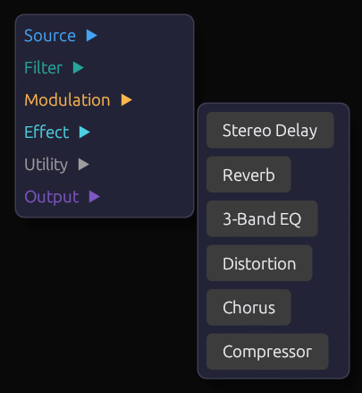
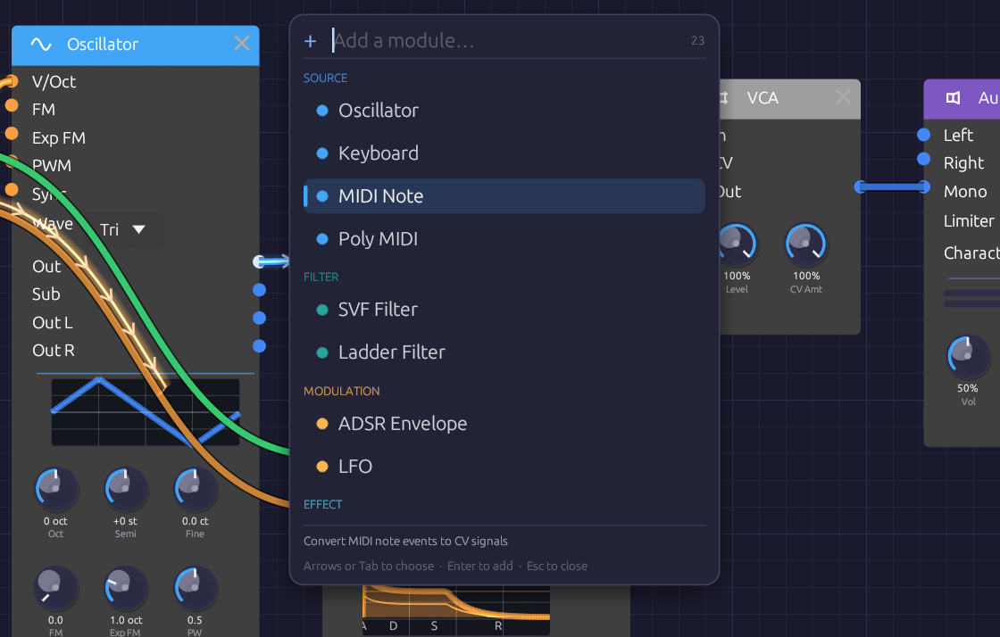
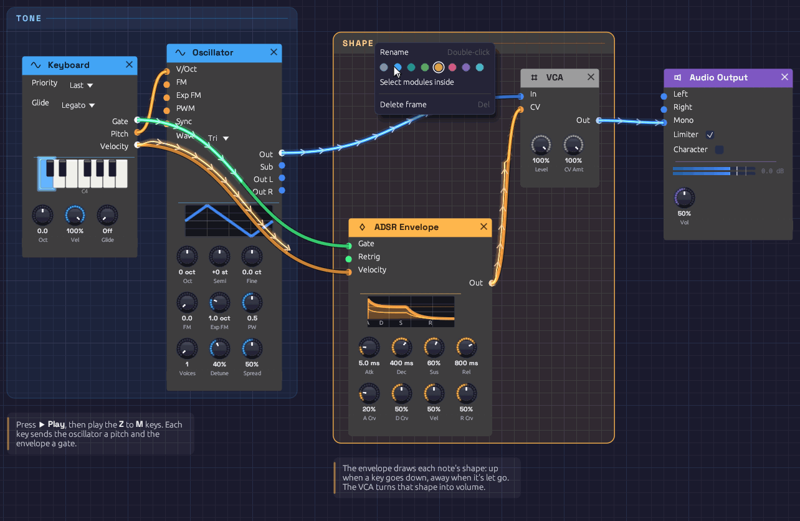

# Interface Overview

The Soba window has three parts: a toolbar along the top, the canvas where you build patches, and a status bar along the bottom.

*The toolbar, the canvas with a patch on it, and the status bar.*

## The toolbar

From left to right:

| Group | Controls |
|-------|----------|
| **Transport** | **▶ Play** starts the patch; **⏹ Stop** stops it. The app opens stopped. **● Rec** records what you hear: see [Recording](#recording). |
| **File** | **📄 New**, **📂 Open**, **🕘 Recent**, **📚 Examples**, **💾 Save**, **💾 Save As** |
| **Edit** | **↩ Undo** and **↪ Redo**. Hover either to see which edit it will undo or redo. |
| **〰 Cables** | How signal flow is drawn along cables: **Chevrons**, **Dots** or **Comets** |
| **◉ Knobs** | How knobs are drawn: **LED ring**, **Hybrid**, **Arc**, **Machined** or **Classic** |
| **❓ Help** | **📖 Manual** opens this manual. **Check for Updates…**, **Check for Updates Automatically**, and **Roll Back** after an update: see [Updates](installation.md#updates) |
| **Output** | The audio device to play through |
| **Input** | The microphone, guitar or line input that [Audio Input](../modules/sources/audio-input.md) modules hear. It starts at **None**: nothing is opened until you choose a device. A filled dot (●) means it's open. |
| **MIDI In** | The MIDI controller to listen to. A filled dot (●) means it's connected. |

At the right end, the toolbar shows a CPU meter while the patch plays, the device's sample rate and channel count, and whether the audio engine is running. While an input is open, **In** shows how much audio is held between the input and output devices, in milliseconds; it turns amber for a moment after a dropout. Hover it for details.

## The status bar

The status bar reports what just happened: a file saved, modules pasted, a cable refused and why. When there's nothing to report, it counts the modules and cables in the patch. On the right it names the open patch, with a dot (●) if it has unsaved changes. At the far right is the version, with a small dot after it that lights up blue when a newer version is out: click it to see what's new, or, while it's dark, to check.

If a patch loads with problems (a module this version doesn't know, a cable to a jack that no longer exists), a **⚠ load warning** appears on the right. Hover it to read the warnings; click it to dismiss them.

## Moving around the canvas

| To | Do this |
|----|---------|
| Zoom | Scroll the mouse wheel. A trackpad pinch, or `Ctrl` and scroll, zooms about the pointer |
| Pan | Drag with the middle mouse button, or hold `Ctrl` and drag empty canvas |
| On a touch screen | Pinch to zoom; drag empty canvas with one finger, or two, to pan |
| Select a module | Click it |
| Select several | Drag a box across empty canvas. It also takes in any frames and notes wholly inside it |
| Move modules | Drag a module by its body; a selection moves together |

The background grid moves and zooms with the patch, with a brighter line every five squares.

## Adding modules

### The add menu

Right-click empty canvas to open the add menu. It lists the six categories in their header colors; hover or click one to see its modules, then click a module to place it where you right-clicked. Hover a module's name to read what it does. Groups you've saved are under **My Modules**, in rose (see [Groups](../concepts/groups.md#my-modules)). Below the categories, **Frame** and **Note** add a [frame or a note](#frames-and-notes).

*Right-click empty canvas, pick a category, then a module.*

### Quick add

Press `Space` or `Tab` with the mouse over the canvas. A search box opens at the cursor, listing every module by category, with your saved groups first under **My Modules** and the ready-made groups of the [Library](../concepts/groups.md#the-library) last. Type a few letters to narrow the list, then press `Enter`, and the module appears where the box opened. (With a group selected, `Tab` opens the group instead.)

*Type a few letters of a module's name or category, then press Enter.*

The search is forgiving. Letters only need to appear in order, so `lfo`, `svf`, `dly` and `s&h` all find what you'd expect. Typing a category name (`effect`, `mod`) lists that category. Move through the list with the arrow keys or `Tab`, add the highlighted module with `Enter`, or close the box with `Escape`.

## Anatomy of a module

Every module has the same layout:

- **Header.** The module's name and category icon, on a bar in the category's color. Hover the header to read what the module does. The **×** at the right end deletes the module. Filters and effects also have a power switch at the left end: see [Bypass](#bypass).
- **Inputs**, down the left edge. Each jack is labeled and colored by the signal it expects.
- **Outputs**, down the right edge, colored by the signal they send. An output lights up while signal is coming out of it.
- **Displays.** Many modules draw what they're doing: the oscillator its waveform, the envelope its shape, filters their frequency response, the LFO its wave with a dot riding its phase.
- **Knobs**, along the bottom, with the current value under each.

Hover any jack's name or knob for a tooltip: what it does, its signal type in the cable's color, and for knobs, its range.

## Knobs

| To | Do this |
|----|---------|
| Change a value | Drag up or down |
| Make fine adjustments | Hold `Shift` while dragging |
| Return to the default | Double-click |
| Map to a MIDI controller | Right-click, then **Learn MIDI CC** |

A knob's ring lights up in its module's header color. Knobs with a range either side of zero, like **Semi** and **Fine**, light outward from the top, so you can see at a glance which way they're set.

Some knobs move in whole steps, like the Oscillator's **Oct** and **Semi**: they click from one value to the next as you drag.

### Knobs with a jack

Many parameters have both a knob and an input jack of the same name. Patch a cable into the jack and the knob sets the center while the incoming signal moves the value around it. Each module page gives the scale.

The knob stays live while the cable is patched, so you can keep moving the center as the signal plays. A small dot appears above the knob while a cable is patched in, orange once signal arrives. Unplug the cable and the knob alone sets the value again.

## Cables

Drag from an output to an input to patch a cable; a jack turns white when the cable is close enough to land on it. You can also drag from an input to an output. Cables only connect where the signals make sense: audio and control mix freely, and a gate can drive a control input, but a cable between jacks that can't work won't attach, and the status bar says why when it can. [Signal Types](../concepts/signal-types.md) has the full rules.

- **One output can feed many inputs.** Each gets the full signal.
- **Each input takes one cable.** Dropping a new cable onto an occupied input replaces the old one.
- **No loops.** A cable that would feed a module's output back into its own input, directly or through other modules, is refused.
- **To remove a cable,** drag its end off the input jack and let go over empty canvas.

While the patch plays, cables show what their signal has been doing over the last few seconds. [Reading the signal in a cable](../concepts/connections.md#reading-the-signal-in-a-cable) explains what you're seeing.

## Editing modules

### The module menu

Right-click a module's header or body (anywhere but a knob) to open its menu. **Bypass** appears only on filters and effects.

| Item | Shortcut | Effect |
|------|----------|--------|
| **Duplicate** | `Ctrl + D` | Copies the module, slightly below and to the right |
| **Copy** | `Ctrl + C` | Copies the module to the clipboard |
| **Bypass** / **Switch on** | `Ctrl + B` | Takes a filter or effect out of the signal path, or puts it back |
| **Reset to defaults** | | Returns every knob to its default |
| **Group** | `Ctrl + G` | Collapses the module, or the selection, into a [group](#groups) |
| **Delete** | `Delete` | Removes the module and its cables |

If the module is part of a selection, the item applies to the whole selection.

### Copy, paste and duplicate

**Duplicate** (`Ctrl + D`) copies the selected modules a little down and to the right. Cables between them are copied too; cables to the rest of the patch aren't. The copies are selected, so pressing `Ctrl + D` again makes a row of them.

**Copy** (`Ctrl + C`) and **Cut** (`Ctrl + X`) put the selected modules on the clipboard. **Paste** (`Ctrl + V`) drops them at the mouse cursor, keeping their layout, settings and the cables between them. Pasting again without moving the mouse fans the copies out.

The clipboard holds modules as patch text, so you can paste between two Soba windows, or paste the contents of a whole patch file to add its modules to the current patch. MIDI mappings stay with the original modules.

### Bypass

Filters and effects can be bypassed: their audio inputs pass straight to their outputs, as if the module weren't there. Click the power switch at the left of the header, choose **Bypass** from the module menu, or select modules and press `Ctrl + B`. A bypassed module's header fades to gray and its controls dim. Switching takes a 20 ms crossfade, so it never clicks, and a bypassed module uses no CPU.

## Frames and notes

A patch can explain itself. A **frame** is a titled, tinted backdrop behind a group of modules, like a section printed on a synth's front panel: *Voice*, *Modulation*, *Echoes*. A **note** is a card of text on the canvas. Neither makes a sound. Every example patch uses them, so you can read how it works while you play it.

*Two frames and two notes. Right-click a frame's title to rename or recolor it.*

### Frames

- **To frame some modules,** select them and press `Ctrl + Shift + F`, or right-click empty canvas and choose **Frame**. The frame is drawn around the selection and takes the color most of its modules share. Type its name and press `Enter`.
- **To add an empty frame,** right-click empty canvas with nothing selected and choose **Frame**.
- **To move a frame,** drag its title. Every module and note inside it moves with it, along with any smaller frame inside it. Its body lets clicks through to the canvas, so you can still add modules inside it or drag a selection box across it.
- **To resize it,** drag any edge or corner.
- **To rename it,** double-click its title.
- **To change its color,** right-click its title and pick a swatch. The same menu can **Select modules inside** it, or **Delete frame**. Deleting a frame leaves its modules where they are.

### Notes

- **To add a note,** right-click empty canvas, choose **Note**, and type. Click away or press `Escape` when you're done. A note left empty disappears.
- **To edit it,** double-click it. Plain text, with `**bold**` for emphasis.
- **To move it,** drag it. **To change where its lines wrap,** drag its right edge.

### Selecting, copying and undoing

Click a frame's title or a note to select it, and `Shift`-click to add to the selection. `Delete`, `Ctrl + C`, `Ctrl + X`, `Ctrl + D` and `Ctrl + V` work on selected frames and notes along with any selected modules, so a framed section copies and pastes as a whole. Undo covers adding, moving, resizing, renaming, recoloring, editing and deleting them; typing a frame's name or a note is one step.

Frames and notes are saved with the patch. Versions of Soba from before frames and notes existed open the patch without them.

## Groups

A group collapses modules into one node of your own, with jacks where cables crossed into it and the controls you choose on its face. [Groups](../concepts/groups.md) has the whole story; in short:

- **Group:** select modules and press `Ctrl + G`, then type a name and press `Enter`.
- **Go inside:** double-click the group, select it and press `Tab`, or click the miniature on its face. A trail at the top of the canvas shows where you are; click it, or press `Escape`, to go back out.
- **Pin a control:** inside the group, right-click a knob, dropdown or toggle and choose **Show on group**.
- **Add a jack:** inside the group, right-click a port's name and choose **Show on group**. Right-click a jack to rename it, move it up or down, or remove it.
- **Rename:** select the group and press `F2`, or right-click it and choose **Rename**.
- **Ungroup:** select the group and press `Ctrl + Alt + G`.
- **Keep it:** right-click the group and choose **Save to My Modules**. It's then in the add menu and quick-add palette of every patch.

A group's right-click menu also has **Open**, **Duplicate**, **Copy** and **Delete**.

## Undo and redo

**Undo** (`Ctrl + Z`) and **Redo** (`Ctrl + Shift + Z` or `Ctrl + Y`) cover adding, deleting, moving and bypassing modules, patching and unpatching cables, turning knobs, grouping and ungrouping, adding, renaming, moving and removing a group's jacks, and every change to [frames and notes](#frames-and-notes). Hover the toolbar buttons to see which edit is next, such as *Move Oscillator*, *Set SVF Filter Cutoff* or *Move frame Voice*.

A whole drag is one step: turning a knob from 200 Hz to 2 kHz and back undoes in one go. A deleted module comes back with its settings, its cables and its MIDI mappings. Knobs moved by a MIDI controller aren't recorded, and opening a patch starts a fresh history.

## Playing

### Transport

Nothing sounds until you press **▶ Play**. **⏹ Stop** silences the patch, lets the last of the signal drain out of the cables, and clears echoes and reverb tails, so they don't resume when you play again.

### The computer keyboard

The bottom row of letter keys plays like a piano, starting from C4 (middle C):

| Keys | Notes |
|------|-------|
| `Z` `X` `C` `V` `B` `N` `M` | C D E F G A B |
| `,` `.` `/` | C D E, an octave up |
| `S` `D` `G` `H` `J` | C♯ D♯ F♯ G♯ A♯ |
| `L` `;` | C♯ D♯, an octave up |

The keys play every [Keyboard](../modules/midi/keyboard.md) module in the patch; use its **Oct** knob to shift it up or down. If the patch has a [Poly MIDI](../modules/midi/poly-midi.md) module, the keys play that too, so you can play chords without a MIDI controller. Keys typed into the quick-add box, or held with `Ctrl` or `Alt`, don't play notes.

### MIDI

Choose your controller in the toolbar's **MIDI In** menu; Soba doesn't connect to one until you do. If the controller isn't listed, plug it in and click **🔄 Refresh** at the bottom of the menu. **None (Disconnect)** lets it go. Disconnecting or switching devices releases any notes that were held. If a controller can't be opened, the reason appears in the status bar.

Three modules listen to the controller: [MIDI Note](../modules/midi/midi-note.md) for a single voice, [Poly MIDI](../modules/midi/poly-midi.md) for chords, and [MIDI Monitor](../modules/midi/midi-monitor.md) to see what's arriving.

### MIDI Learn

Any knob can follow a MIDI controller's knob or fader:

1. Right-click the knob and choose **Learn MIDI CC**. A purple **M** badge blinks above it.
2. Move the control on your MIDI controller.

The badge stops blinking and stays, and the knob now follows that control across its full range. Right-click it again to **Re-learn MIDI CC** or **Clear MIDI**. Mappings are saved with the patch.

To back out before moving a control, press `Escape`, or right-click the blinking knob and choose **Cancel MIDI Learn**. Choosing **Learn MIDI CC** on a different knob moves learn mode to that knob instead.

## Recording

When something good happens (a filter sweep you rode by hand, a lucky generative passage, an improvisation on a MIDI keyboard), press **● Rec** or `Ctrl + R` to keep it. If the patch is stopped, Rec starts it.

While recording, the button turns red, with a slowly pulsing light and the length of the take so far. Press it again, press `Ctrl + R`, or press **⏹ Stop** to end the take. A note pops up in the corner with the take's name and length, and **📂 Show in folder** opens it in your file manager.

- **What's recorded:** exactly what you hear, after the output limiter, sample for sample. It's a 32-bit float WAV at your audio device's sample rate and channel count.
- **Where it goes:** `Music/Soba`, named after the patch and the minute you pressed Rec, such as `First Sound 2026-10-08 14-03.wav`. To use another folder, right-click **● Rec** and choose **Change…**; **Open Folder** opens it.
- **The patch comes too.** Every take is saved with the patch beside it, as a `.json` with the same name, so you can always open the patch that made a recording. It's saved when the take ends, so knobs you rode during the take are saved where you left them.
- **Edit freely.** Turning knobs, patching cables, even opening another patch: the recording keeps going through all of it.
- Switching the **Output** device ends the take cleanly. Closing the window while recording asks first, and then saves the take.

Recording runs alongside the audio, never in its way. If your disk ever falls more than two seconds behind, the missing audio is skipped rather than allowed to cause a glitch, and the note tells you how much was lost.

## Patches

Patches are saved as `.json` files holding every module, setting, cable and MIDI mapping.

| Action | Shortcut |
|--------|----------|
| **New** | `Ctrl + N` |
| **Open** | `Ctrl + O` |
| **Save** | `Ctrl + S` |
| **Save As** | `Ctrl + Shift + S` |

### Examples

The **📚 Examples** menu holds fourteen ready-made patches: **First Sound**, which opens when the app starts, and one for each [recipe](../recipes/basic-subtractive.md) in this manual. Hover an example to read what it is. Each one is laid out in frames, with notes on how it works and what to try. Saving an example always asks for a file name, so you save a copy and the original stays intact.

### Samples

A [Sampler](../modules/sources/sampler.md) keeps the path to its WAV file in the patch. A file beside or below the patch is saved by a path relative to it, so the patch's folder can be moved or shared whole. **Save As** copies samples from anywhere else into a `<patch name> samples` folder beside the patch, asking first if they come to more than 50 MB. A patch whose sample has gone missing still opens, with the missing file among the load warnings.

A [Looper](../modules/utilities/looper.md)'s loop is kept the same way. Saving the patch writes each loop that changed as a WAV into a `<patch name> loops` folder beside it, asking first if they come to more than 50 MB, and opening the patch brings each loop back, stopped and ready to play. A loop whose file has gone missing is a load warning, and its Looper opens empty. See [Keeping the loop](../modules/utilities/looper.md#keeping-the-loop).

### Recent patches

**🕘 Recent** lists the last eight patches you opened or saved, newest first. Hover one to see where it lives. A file that has since been moved or deleted is grayed out. **Clear Recent** empties the list.

### Unsaved changes

While a patch has unsaved changes, the window title starts with a dot (`● Lush Pad · Soba`), and so does its name in the status bar. Undoing back to the saved state clears the dot. Recording into a [Looper](../modules/utilities/looper.md#keeping-the-loop) counts as a change too.

**New**, **Open**, opening an example or a recent file, and closing the window all ask first when there are unsaved changes:

- **Save** saves the patch (asking where, if it has never been saved), then carries on. Cancelling the save dialog cancels the whole thing.
- **Don't Save** (**Quit Without Saving**, when closing) carries on and lets the changes go.
- **Cancel**, or `Escape`, goes back to the patch.

Closing the window while a [recording](#recording) is running asks too, even with nothing unsaved, and the prompt shows how long the take is. Quitting stops the take and saves it before the window closes.

### Autosave and recovery

Every 30 seconds, a patch with unsaved changes is autosaved alongside the app's settings. Saving the patch, or choosing **Quit Without Saving**, clears the autosave, so one only survives if Soba closes without asking: after a crash or a forced quit.

The next time the app starts, it offers the patch back. **Recover** reopens it exactly as it was at the last autosave, still marked unsaved; **Discard** lets it go. At most, you lose the last 30 seconds of work. An autosave doesn't keep Loopers' loops, though: they come back as last saved with the patch, and the prompt says so.

Recent files, the autosave, your cable style and the window's size and position are kept in the settings file:

- Windows: `%APPDATA%\Soba\data\app.ron`
- macOS: `~/Library/Application Support/Soba/app.ron`
- Linux: `~/.local/share/soba/app.ron`

## Keyboard shortcuts

| Shortcut | Action |
|----------|--------|
| `Space` or `Tab` | Quick add a module at the cursor |
| `Tab` | Open the selected group |
| `Ctrl + G` | Group the selected modules |
| `Ctrl + Alt + G` | Ungroup the selected group |
| `F2` | Rename the selected group |
| `Delete` or `Backspace` | Delete the selected modules, frames and notes |
| `Ctrl + D` | Duplicate the selected modules, frames and notes |
| `Ctrl + C` / `Ctrl + X` | Copy / cut the selected modules, frames and notes |
| `Ctrl + V` | Paste at the cursor |
| `Ctrl + Shift + F` | Frame the selected modules |
| `Ctrl + B` | Bypass or switch on the selected filters and effects |
| `Ctrl + Z` | Undo |
| `Ctrl + Shift + Z` or `Ctrl + Y` | Redo |
| `Ctrl + N` | New patch |
| `Ctrl + O` | Open a patch |
| `Ctrl + S` | Save |
| `Ctrl + Shift + S` | Save as |
| `Escape` | Close the add menu or quick-add box, cancel MIDI Learn, finish typing a frame's name or a note, or go back out of a group |
| `Shift` + drag | Fine knob adjustment |
| Double-click a knob | Reset it to its default |
