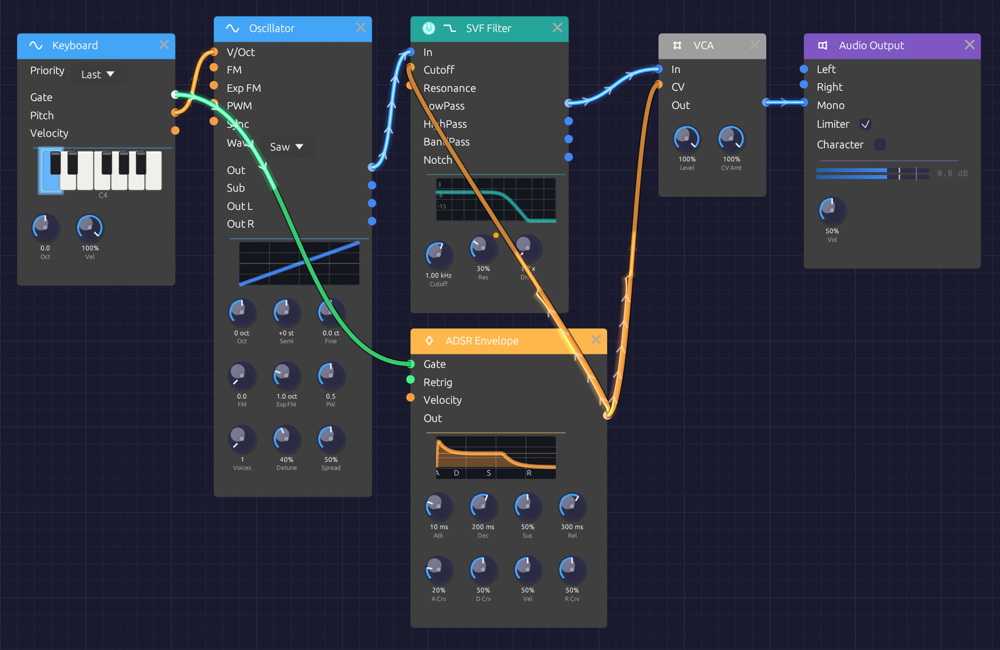

# Your First Patch

In this tutorial you build a playable synthesizer voice from an empty canvas: an oscillator for the tone, a keyboard to play it, an envelope and a VCA to shape each note, and a filter to color it. It takes about fifteen minutes, and each step adds one idea you'll use in every patch after this one.


*Where you'll end up.*

## Before you start: First Sound

When Modular Synth opens, it loads the **First Sound** example: a Keyboard, an Oscillator, an ADSR Envelope and a VCA, already patched to the Audio Output. Press **▶ Play** in the toolbar and play the `Z` to `M` keys on your computer keyboard. That patch is a smaller version of the one you're about to build, so it's worth a minute of listening first.

To start from scratch, click **📄 New** (`Ctrl + N`). The canvas empties; the status bar says *Right-click to add nodes*. Make sure **▶ Play** is still on (the button reads **⏹ Stop** while the patch plays).

## Step 1: An oscillator you can hear

Every patch needs a sound source and a way out.

1. Right-click empty canvas and choose **Source › Oscillator**.
2. Right-click to the right of it and choose **Output › Audio Output**.
3. Drag from the Oscillator's **Out** jack (right edge, blue) to the Audio Output's **Mono** jack. **Mono** sends the signal to both speakers.

You should hear a steady tone. The Oscillator starts on a sine wave at C4 (261.63 Hz), and its display draws the wave.

If you hear nothing, check that the patch is playing, that the toolbar's **Output** menu names the device you're listening on, and that the Audio Output's **Vol** knob isn't at zero.

Now change the Oscillator's **Wave** menu from **Sine** to **Saw**. The tone turns bright and buzzy: a sawtooth contains every harmonic, which gives the filter in Step 5 plenty to work with.

> **Tip:** You can also add modules by pressing `Space` over the canvas and typing a few letters, such as `osc` or `out`, then `Enter`.

## Step 2: Play it from the keyboard

A tone that never changes isn't much of an instrument.

1. Add a **Source › Keyboard** to the left of the Oscillator.
2. Patch the Keyboard's **Pitch** output into the Oscillator's **V/Oct** input.

Play the bottom row of your computer keyboard: `Z` is C, `X` is D, and so on up to `M` for B, with the sharps on `S`, `D`, `G`, `H` and `J`. The Keyboard's piano lights up the notes you hold, and the Oscillator follows.

**Pitch** is an orange control cable carrying *volts per octave*: each step of 1.0 is one octave, so the Oscillator stays in tune at every note. But the tone still never stops. For that, you need to shape each note.

## Step 3: A VCA to control the level

A **VCA** (voltage-controlled amplifier) sets the level of whatever passes through it, under the control of another signal.

1. Add a **Utility › VCA** between the Oscillator and the Audio Output.
2. Patch the Oscillator's **Out** into the VCA's **In**.
3. Patch the VCA's **Out** into the Audio Output's **Mono**. This replaces the cable that was there, because each input takes one cable.

Nothing changes yet: with nothing patched into its **CV** input, the VCA lets the sound through at full level. The next step gives it something to listen to.

## Step 4: An envelope to shape each note

An **envelope** draws a shape every time a note is played: it rises when the key goes down and falls when the key comes up.

1. Add a **Modulation › ADSR Envelope** below the VCA.
2. Patch the Keyboard's **Gate** output into the envelope's **Gate** input. Gate is green: it's on while a key is held and off when it's released.
3. Patch the envelope's **Out** into the VCA's **CV** input.

Now each key plays a note that starts and stops. The envelope runs through four stages, each with a knob:

- **Atk** (attack): how long the note takes to reach full level. The default is 10 ms.
- **Dec** (decay): how long it then takes to fall to the sustain level.
- **Sus** (sustain): the level held for as long as the key is down.
- **Rel** (release): how long the note takes to fade after you let go.

Try a pluck: turn **Sus** all the way down and **Dec** to about 300 ms, so each note dies away even while you hold the key. Then try a swell: **Atk** around 1 s, **Sus** up, **Rel** around 2 s. The display on the envelope draws each shape as you turn the knobs.

## Step 5: A filter to color the tone

A **filter** removes part of a sound's spectrum. A *lowpass* filter lets the low frequencies through and cuts the high ones, darkening the tone. This is the heart of *subtractive* synthesis: start with a bright waveform, then carve it.

1. Add a **Filter › SVF Filter** between the Oscillator and the VCA.
2. Patch the filter's **LowPass** output into the VCA's **In**, replacing the cable from the Oscillator.
3. Patch the Oscillator's **Out** into the filter's **In**.

Play a few notes and turn the filter's knobs:

- **Cutoff** sets where the filter starts cutting. Turn it down and the saw goes dark and muffled; turn it up and the brightness returns. The display draws the filter's response as you turn it.
- **Res** (resonance) adds a peak at the cutoff, giving the sound a vocal, nasal edge. The default is 0.5. Near the top of its range the filter starts to ring on its own.

## Step 6: Let the envelope open the filter

Real instruments are brightest at the start of a note. You can do the same by letting the envelope move the filter's cutoff.

1. Patch the envelope's **Out** into the filter's **Cutoff** input. One output can feed any number of inputs, so the envelope keeps driving the VCA too.
2. Turn the **Cutoff** knob down to about 400 Hz.

Each note now opens the filter and closes it again as the envelope decays. The **Cutoff** knob stays live and sets where the sweep starts; the envelope adds up to one octave on top. A small dot above the knob shows that a cable is moving it.

For a plucky, percussive bass, set **Atk** to its minimum, **Dec** to about 200 ms and **Sus** low. For a slow, brightening pad, lengthen **Atk**.

## The finished patch

```text
[Keyboard Pitch] ──> [Oscillator V/Oct]
[Keyboard Gate]  ──> [ADSR Envelope Gate]
[Oscillator Out] ──> [SVF Filter In]
[SVF Filter LowPass] ──> [VCA In]
[ADSR Envelope Out]  ──> [VCA CV]
[ADSR Envelope Out]  ──> [SVF Filter Cutoff]
[VCA Out] ──> [Audio Output Mono]
```

Save it with **💾 Save** (`Ctrl + S`).

The signal path runs left to right: the oscillator makes the tone, the filter colors it, and the VCA shapes its level. The keyboard and envelope sit off to the side, controlling the others. Nearly every subtractive synthesizer, hardware or software, is built this way.

## What you've learned

- Modules are added from the right-click menu or with `Space`, and connected by dragging from an output to an input.
- **Audio** (blue) is the sound itself; **control** (orange) moves things, like pitch and cutoff; **gates** (green) say when a note is on.
- An envelope through a VCA turns a constant tone into notes.
- One output can drive several inputs, and a cable into a knob's jack moves that knob.

## Things to try

- **Use separate envelopes.** Add a second ADSR Envelope for the filter, also gated by the Keyboard, so brightness and loudness can have different shapes.
- **Add velocity.** Patch the Keyboard's **Velocity** into the envelope's **Velocity** input, then lower the Keyboard's **Vel** knob for quieter notes.
- **Add movement.** Patch a **Modulation › LFO** into the filter's **Cutoff** for a slow sweep. Its **Out** swings the cutoff an octave either way.
- **Add space.** Put an **Effect › Reverb** between the VCA and the Audio Output: VCA **Out** into Reverb **In L**, then the Reverb's **Out L** and **Out R** into the output's **Left** and **Right**.
- **Watch it.** Patch the VCA's **Out** into a **Utility › Oscilloscope** as well as the output to see the envelope shape the wave.

## Next

- [Signal Types](../concepts/signal-types.md) explains what each cable color carries and what can connect to what.
- [Basic Subtractive Synth](../recipes/basic-subtractive.md) takes this patch further, with separate envelopes for brightness and volume. It's in **📚 Examples** too.
- The [module reference](../modules/index.md) has a page for every module.
