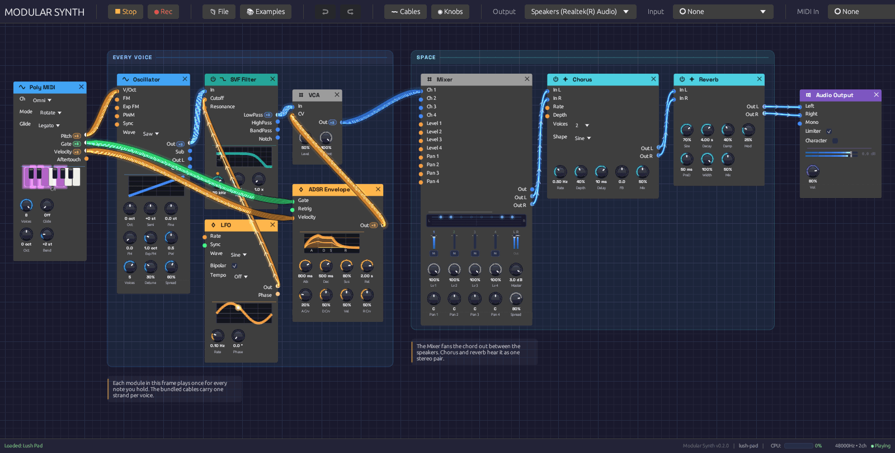

# Soba

Soba is a modular synthesizer you patch on a canvas. You place modules (oscillators, filters, envelopes, effects) as nodes, draw cables between their jacks, and hear the result as you go. Nothing is wired in advance: the patch is the instrument.

The name comes from the cables. Blender, whose node editor Soba takes after, calls the wires between nodes *noodles*, and soba are long, fine noodles. In Japanese, *soba* (傍) also means "beside": an instrument whose patches sit by you and explain themselves.

*A patch on the canvas. Cables are colored by what they carry, and light up as signal passes through them.*

## A node graph, not a rack

Most software modulars imitate hardware: rows of panels, screws, and cables that sag in front of everything. Soba borrows instead from node editors like Blender's. Every module is a rounded card with inputs on its left edge, outputs on its right, and knobs along the bottom. You can put modules anywhere, zoom out to see the whole patch, and zoom in to work on one corner of it.

What it keeps from hardware is the feedback. Cables glow with the signal they carry, so a note becomes a pulse of light running down the wire and an LFO draws its waveform along the cable. Knobs under modulation turn on their own. Oscillators, envelopes, filters and LFOs draw what they're doing on the module itself. You can see a patch working as well as hear it.

## Signals

Each cable carries one of three kinds of signal, and takes its color from it:

| Color | Signal | What it carries |
|-------|--------|-----------------|
| Blue | Audio | Sound, from −1 to 1 |
| Orange | Control | Modulation (CV): envelopes, LFOs, pitch |
| Green | Gate | On or off: a key held down, a clock tick |

A cable can also carry up to eight voices at once, which is how Soba plays chords. MIDI doesn't travel on cables: the MIDI modules listen to the controller you choose in the toolbar and turn what you play into pitch, gate and velocity. [Signal Types](./concepts/signal-types.md) and [Polyphony](./concepts/polyphony.md) cover both in depth.

## Modules

There are 38 modules in six categories. A module's header takes its category's color:

| Category | Header | Modules |
|----------|--------|---------|
| Source | Blue | Oscillator, Noise, Drum, Sampler, Audio Input, Keyboard, MIDI Note, Poly MIDI |
| Filter | Teal | SVF Filter, Ladder Filter |
| Modulation | Orange | ADSR Envelope, LFO, Slope |
| Effect | Cyan | Stereo Delay, Reverb, 3-Band EQ, Distortion, Chorus, Tape, Compressor, Vocoder |
| Utility | Gray | Clock, VCA, Attenuverter, Mix, Mixer, Sample & Hold, Quantizer, Clock Divider, Logic, Looper, Oscilloscope, Step Sequencer, Chord Sequencer, Trigger Sequencer, Arranger, MIDI Monitor |
| Output | Purple | Audio Output |

The [Module Overview](./modules/index.md) introduces each one.

## Where to start

If you're new to modular synthesis, read the Getting Started pages in order:

1. [Installation](./getting-started/installation.md) gets the app running.
2. [Interface Overview](./getting-started/interface-overview.md) shows you around the window.
3. [Your First Patch](./getting-started/your-first-patch.md) builds a playable synthesizer from an empty canvas, one cable at a time.

If you already know your way around a modular, open the **📚 Examples** menu, load a patch, and keep the [module reference](./modules/index.md) to hand. The [recipes](./recipes/basic-subtractive.md) explain how each example works.

## Under the hood

Soba is written in Rust, with [egui](https://github.com/emilk/egui) for the interface and [cpal](https://github.com/RustAudio/cpal) for audio. The audio engine runs on its own thread and never waits on the interface: edits travel to it over lock-free queues, every buffer is allocated before playback starts, and a test in the build fails if the audio thread ever allocates memory. That is what keeps the sound from glitching while you patch.

The source is on [GitHub](https://github.com/chrischaps/Soba).
