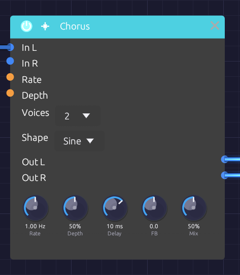

# Chorus

**Module ID** `fx.chorus` · **Category** Effect


*Voices and Shape are dropdowns; the knobs set the sweep*

The Chorus thickens a sound by layering copies of it, each delayed by a few milliseconds that keep changing. The moving delays bend each copy's pitch slightly up and down, and the copies beat against each other and against the original, the way several players on the same part never quite line up.

It is true stereo, and it makes a mono source wide on its own. Short delays and a little feedback take it into flanging.

## How it works

1. Each channel has its own delay line: left stays left, right stays right.
2. Each voice reads both lines through a pair of taps, and an LFO sweeps each tap's delay around **Delay**. At full **Depth** the delay swings all the way from zero to twice the Delay time.
3. The voices are spaced evenly around the LFO cycle, so they never move in step.
4. The voices are summed and blended with the dry signal by **Mix**.

### True stereo

A stereo source keeps its image: nothing patched into **In L** ever reaches **Out R**.

With **In R** unpatched, In L feeds both sides and the chorus creates the width itself. Each right tap's LFO sits halfway between two left taps (180° away with one voice, 90° with two), so the two sides always bend in pitch in opposite directions.

Changing **Voices** fades voices in or out and slides the rest to their new places on the cycle, so it never clicks.

## Inputs

| Port | Signal Type | Description |
|------|-------------|-------------|
| **In L** | Audio (Blue) | Left input |
| **In R** | Audio (Blue) | Right input. When unpatched, it copies In L |
| **Rate CV** | Control (Orange) | Speeds up or slows down the sweep: ±1 changes Rate by ±50% |
| **Depth CV** | Control (Orange) | Adds to Depth: ±1 adds ±50% |

## Outputs

| Port | Signal Type | Description |
|------|-------------|-------------|
| **Out L** | Audio (Blue) | Left chorus, mixed with the dry signal |
| **Out R** | Audio (Blue) | Right chorus, mixed with the dry signal |

## Parameters

| Control | Range | Default | Description |
|---------|-------|---------|-------------|
| **Rate** | 0.1 Hz – 10 Hz | 1 Hz | Speed of the sweep |
| **Depth** | 0 – 100% | 50% | How far the delay sweeps around Delay |
| **Delay** | 1 ms – 30 ms | 10 ms | Center delay time |
| **FB** (Feedback) | −0.5 – +0.5 | 0 | Feeds the voices back into the delay lines, for flanging. Negative values sound hollower |
| **Mix** | 0 – 100% | 50% | Dry (0%) to chorus only (100%) |
| **Voices** | 1 – 4 | 2 | Number of voices (dropdown on the node) |
| **Shape** | Sine / Tri | Sine | LFO waveform (dropdown on the node) |

While **Rate CV** or **Depth CV** is patched, its knob dims and follows the incoming signal, and you can't turn it. The CV still works around the knob's last position, so set Rate and Depth before you patch them.

## Shaping the sound

**Rate and Depth.** Slow rates sway gently; fast rates turn into vibrato. Light depth thickens without drawing attention; heavy depth wobbles until it sounds out of tune. The two work together, since the pitch bend depends on how fast the delay is changing: a fast rate needs less depth.

**Delay.** Below about 5 ms the copies comb-filter against the dry sound, and with some feedback it becomes a flanger. From 5 to 15 ms is classic chorus. From 15 to 30 ms the copies separate into a wide, doubled sound.

**Voices.** One voice is the simplest, almost flanger-like, with the two sides sweeping in opposite directions. Two is the classic stereo chorus. Three and four build toward a thick ensemble, at some cost in clarity. The output stays at about the same loudness whatever the voice count.

**Shape.**

| Shape | Character |
|-------|-----------|
| **Sine** | Smooth and vocal: the pitch eases in and out of each bend |
| **Tri** | The delay sweeps at a constant speed, so each half-cycle holds one steady detune. Glassier, closer to the classic bucket-brigade choruses |

Switching shape morphs between the two over 20 ms.

**Feedback.** Feedback deepens the comb-filter peaks and makes the sweep ring. The loop uses the voices' average, so its gain never exceeds the knob however many voices are running.

## Bypass

Click the power switch in the node header, press **Ctrl+B** with the module selected, or choose **Bypass** from its right-click menu. In L passes straight to Out L and In R to Out R (In R still copies In L when unpatched). The switch crossfades over 20 ms.

## Starting points

| Sound | Rate | Depth | Delay | FB | Voices | Mix |
|-------|------|-------|-------|----|--------|-----|
| Subtle thickening | 0.3 Hz | 20% | 5 ms | 0 | 2 | 30% |
| Classic chorus | 0.5 Hz | 40% | 8 ms | 0 | 2 | 50% |
| String ensemble | 0.8 Hz | 60% | 15 ms | 0 | 4 | 60% |
| Flanger | 0.2 Hz | 70% | 2 ms | +0.4 | 1 | 50% |
| Vibrato | 5 Hz | 30% | 5 ms | 0 | 1 | 100% |

At 100% Mix you hear only the moving copies, without the dry signal to beat against, so the chorus becomes pure vibrato.

On bass, keep Depth and Mix low, or the low end turns vague.

## Patch ideas

**Widen a mono voice.** Patch only In L and take both outputs:

```text
[VCA Out] ──> [Chorus In L]
[Chorus Out L] ──> [Audio Output Left]
[Chorus Out R] ──> [Audio Output Right]
```

**Before the space.** Chorus usually goes before time-based effects, so the reverb smears the movement together:

```text
[VCA Out] ──> [Chorus In L]
[Chorus Out L] ──> [Reverb In L]
[Chorus Out R] ──> [Reverb In R]
```

**Drifting chorus.** A very slow LFO into **Rate CV** makes the chorus speed itself wander.

## Related modules

- [Delay](./delay.md): longer echoes
- [Reverb](./reverb.md): chorus into reverb for ambient washes
- [Oscillator](../sources/oscillator.md): unison detune thickens at the source
- [LFO](../modulation/lfo.md): modulates Rate and Depth
