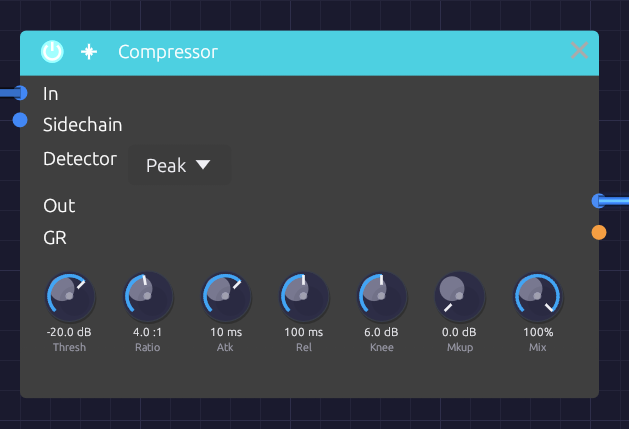

# Compressor

**Module ID** `fx.compressor` · **Category** Effect


*Threshold and Ratio set how much; Atk and Rel set how fast*

The Compressor turns down a signal when it gets loud and leaves it alone when it's quiet. That evens out the level of a bass line, adds snap to percussion, holds a pad steady, or, with a kick in the **Sidechain** input, makes a pad pump in time.

It also puts its gain reduction out as a control signal on **GR**, so the amount of compression can move other parts of the patch.

## How it works

1. The detector measures the level of **In**, or of **Sidechain** when something is patched there.
2. When the level rises above **Thresh**, the compressor works out how far to turn it down: **Ratio** sets how much of the overshoot gets through.
3. **Atk** sets how quickly that reduction is applied, and **Rel** how quickly it lets go.
4. **Mkup** adds gain back afterward, and **Mix** blends the result with the dry input.

Attack and release shape the *gain reduction*, in dB, not the measured level. So a steady tone above the threshold comes out exactly where the ratio says it should, however fast or slow the timing knobs are set; attack and release only decide how it gets there.

## Inputs

| Port | Signal Type | Description |
|------|-------------|-------------|
| **In** | Audio (Blue) | Signal to compress |
| **Sidechain** | Audio (Blue) | Signal the detector listens to instead of In. When unpatched, the detector listens to In |

## Outputs

| Port | Signal Type | Description |
|------|-------------|-------------|
| **Out** | Audio (Blue) | Compressed signal |
| **GR** | Control (Orange) | Gain reduction as CV: 0 is no reduction, 1 is 60 dB |

## Parameters

| Control | Range | Default | Description |
|---------|-------|---------|-------------|
| **Thresh** (Threshold) | −60 dB – 0 dB | −20 dB | Level above which compression begins |
| **Ratio** | 1:1 – 20:1 | 4:1 | How strongly levels above the threshold are reduced |
| **Atk** (Attack) | 0.1 ms – 100 ms | 10 ms | How fast compression clamps down |
| **Rel** (Release) | 10 ms – 1000 ms | 100 ms | How fast compression lets go |
| **Knee** | 0 dB – 12 dB | 6 dB | Width of the soft knee around the threshold. 0 is a hard knee |
| **Mkup** (Makeup) | 0 dB – +24 dB | 0 dB | Gain added after compression |
| **Mix** | 0 – 100% | 100% | Dry (0%) to compressed (100%), for parallel compression |
| **Detector** | Peak / RMS | Peak | What the detector measures (dropdown on the node) |

## The controls

### Threshold and ratio

Above the threshold, the ratio sets how many decibels go in for each decibel that comes out. At 2:1, a signal 10 dB over the threshold comes out 5 dB over. At 4:1 it comes out 2.5 dB over. At 20:1, the top of the range, the compressor is close to a limiter: almost nothing gets past the threshold.

For example, with **Thresh** at −20 dB and **Ratio** at 4:1:

| In | Out |
|----|-----|
| −30 dB | −30 dB (below the threshold, untouched) |
| −20 dB | −20 dB (at the threshold) |
| −10 dB | −17.5 dB (10 dB over becomes 2.5 dB over) |

### Knee

With a hard knee (0 dB), compression starts abruptly at the threshold. A soft knee eases it in over a band centered on the threshold: with the default 6 dB, compression starts 3 dB below the threshold and reaches the full ratio 3 dB above it. Soft knees sound more transparent; hard knees more obviously compressed.

### Attack and release

**Atk** decides whether the start of each note gets through. Below about 1 ms the compressor catches every transient, which can flatten a sound. Around 10 to 30 ms, the first moment of each hit punches through before the compressor reacts, which is how compression adds snap to drums. Slower still, and only sustained parts of the sound are reduced.

**Rel** decides how the level recovers. A fast release (under 50 ms) recovers between notes and can pump audibly; 50 to 150 ms is musical for most material; slow releases hold the reduction for a smooth, sustained squash.

### Detector: Peak or RMS

| Detector | Measures | Character |
|----------|----------|-----------|
| **Peak** | Every peak of the waveform | Catches transients and keeps peaks in check. Good for drums and limiting |
| **RMS** | Average power over about 20 ms | Follows loudness, as the ear does. Smoother, gentler leveling for pads, buses and sustained sounds |

A sine reads 3 dB lower on RMS than on Peak, so the same settings compress it a little less.

## Bypass

Click the power switch in the node header, press **Ctrl+B** with the module selected, or choose **Bypass** from its right-click menu. In passes straight to Out; the sidechain isn't passed, and **GR** stays at zero. The switch crossfades over 20 ms, which makes it easy to compare the compressed and original sound while it plays.

## Setting it up

1. Start with **Ratio** around 4:1 and lower **Thresh** until the loudest moments are being turned down.
2. Adjust **Atk** and **Rel** until the sound breathes the way you want.
3. Raise **Mkup** until the level matches the bypassed sound, then compare with **Ctrl+B**. Louder nearly always sounds better, so compare at the same level.

A few decibels of reduction on the loudest moments is usually plenty.

## Starting points

| Use | Thresh | Ratio | Atk | Rel | Detector |
|-----|--------|-------|-----|-----|----------|
| Gentle leveling | −18 dB | 2:1 | 20 ms | 200 ms | RMS |
| Punchy percussion | −10 dB | 4:1 | 10 ms | 50 ms | Peak |
| Even bass | −15 dB | 4:1 | 5 ms | 150 ms | Peak |
| Steady pad | −24 dB | 3:1 | 30 ms | 300 ms | RMS |
| Sidechain pump | −30 dB | 6:1 | 1 ms | 200 ms | Peak |
| Peak catcher | −3 dB | 20:1 | 0.1 ms | 50 ms | Peak |

## Patch ideas

**Sidechain pumping.** A kick ducks a pad, and the pad swells back between hits:

```text
[Kick VCA Out] ──> [Compressor Sidechain]
[Pad VCA Out] ──> [Compressor In]
[Compressor Out] ──> [Audio Output Mono]
```

The sidechain only drives the detector; it isn't heard through the compressor. Patch the kick to the output separately to hear it.

**Parallel compression.** Set **Ratio** high (6:1 or more) and the threshold low, then bring **Mix** down to about 50%. The heavily compressed signal thickens the quiet details while the dry signal keeps the transients.

**Moving other things with GR.** **GR** rises as the compressor works. Because 1.0 stands for 60 dB of reduction, the signal is small: 6 dB of reduction reads 0.1. Patched into a filter's **Cutoff** (1 per octave at the default **CV Amt**), that moves the cutoff a tenth of an octave: enough for the tone to brighten slightly as the compressor clamps down. Turn the filter's **CV Amt** up to make more of it.

## Related modules

- [EQ](./eq.md): often placed just before the compressor
- [VCA](../utilities/vca.md): level control under direct CV
- [Distortion](./distortion.md): saturation is a kind of compression too
- [Audio Output](../output/audio-output.md): the final output stage
