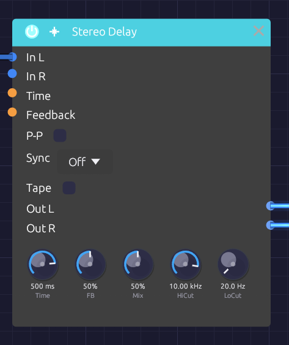

# Delay

**Module ID**: `fx.delay`
**Category**: Effects
**Header Color**: Purple


*The Delay module*

## Description

The Stereo Delay plays back a delayed copy of its input, then feeds that copy back in to make repeats. It filters the feedback, can bounce the repeats between channels, and can lock its time to the patch tempo. Its **Tape** mode turns it into a worn tape echo.

Delays are essential for:
- Adding depth and space
- Creating rhythmic patterns
- Doubling and thickening sounds
- Dub, ambient and experimental textures

### How it works

1. The input is written into a delay line for each channel.
2. A read head plays the line back **Time** later. Reads fall between samples, and a cubic (Catmull-Rom) spline fills in the gap, so time changes and modulation glide instead of clicking or dulling the top end.
3. The playback runs through the **High Cut** and **Low Cut** filters, is scaled by **Feedback**, and goes back into the line with the input. Every repeat passes through the filters once more than the repeat before it.
4. **Mix** blends the dry input with the playback.

## Inputs

| Port | Signal Type | Description |
|------|-------------|-------------|
| **In L** | Audio (Blue) | Left channel input |
| **In R** | Audio (Blue) | Right channel input (normalled to In L when unpatched) |
| **Time CV** | Control (Orange) | Swings Time by up to ±50% around the knob |
| **Feedback CV** | Control (Orange) | Added to Feedback (±50%) around the knob |

## Outputs

| Port | Signal Type | Description |
|------|-------------|-------------|
| **Out L** | Audio (Blue) | Processed left channel |
| **Out R** | Audio (Blue) | Processed right channel |

## Parameters

| Control | Range | Default | Description |
|---------|-------|---------|-------------|
| **Time** | 1 ms - 2000 ms | 500 ms | Delay time (ignored while Sync is on) |
| **FB** | 0% - 100% | 50% | Feedback: how much of each repeat comes back |
| **Mix** | 0% - 100% | 50% | Dry/wet balance |
| **HiCut** | 100 Hz - 20 kHz | 10 kHz | Low-pass filter in the feedback path |
| **LoCut** | 20 Hz - 2 kHz | 20 Hz | High-pass filter in the feedback path |
| **P-P** | On/Off | Off | Ping-pong: each repeat crosses to the other channel |
| **Sync** | Off, 1/4, 1/8, 1/8T, 1/16, 1/16T, 1/32, 1/4D, 1/8D | Off | Lock the time to a division of the patch tempo |
| **Tape** | On/Off | Off | Tape echo character (see below) |

### Feedback

In plain mode the feedback stops at 95%, and a soft clipper keeps the loop bounded:

- **0%**: one echo
- **30%**: a few echoes, natural decay
- **60%**: long trails
- **95%**: near-endless repeats

In Tape mode the knob goes further. See [Runaway](#runaway).

## Tempo Sync

Set **Sync** to a division and the delay time follows the patch tempo. A [Clock](../modulation/clock.md) anywhere in the patch sets the tempo, and turning its Tempo knob moves the echoes with it. The echoes glide to the new time, with a short pitch bend in the repeats. Without a Clock, the delay assumes 120 BPM.

| Division | Beats | At 120 BPM |
|----------|-------|-----------|
| 1/4D | 1½ | 750 ms |
| 1/4 | 1 | 500 ms |
| 1/8D | ¾ | 375 ms |
| 1/8 | ½ | 250 ms |
| 1/8T | ⅓ | 167 ms |
| 1/16 | ¼ | 125 ms |
| 1/16T | ⅙ | 83 ms |
| 1/32 | ⅛ | 62.5 ms |

Synced times are capped at 2 seconds. Time CV still works while synced, and swings the synced time.

## Tape Mode

**Tape** makes the delay behave like a tape echo: a loop of tape passing a record head and a play head. The switch crossfades over a few tens of milliseconds, so you can flip it while the echoes are sounding.

- **Wow and flutter.** The read head wanders: a slow wow (about 0.5 Hz, plus a slower drift) and a fast flutter (6–10 Hz). The pitch of the repeats wavers by a few cents. The motions run at unrelated rates, so the pattern doesn't loop.
- **Record-head saturation.** The input and the feedback are recorded together through a soft, slightly lopsided saturation curve. Quiet signals pass unchanged; loud ones round off and pick up the even harmonics of magnetised tape. Because it sits inside the loop, a busy echo squashes and thickens as it builds.
- **Tape loss.** The tape loses top end each time it records, so every repeat is darker than the one before. Longer delays mean slower tape and darker repeats: the loss starts around 7 kHz at 250 ms and falls to about 3.5 kHz at a second. High Cut still works on top of it.
- **Motor glide.** Time changes glide over about a quarter second, like a motor finding its new speed. The repeats swoop in pitch as they go.

### Runaway

In Tape mode, Feedback past about 90% pushes the loop above unity, and the echoes build until the record head holds them. This is the classic dub runaway. The record head bounds the loop, so the output stays in range at any setting. Pull Feedback back below 90% and the echoes die away again.

## Usage Tips

### Slapback

```
Time: 80-120 ms
FB: 0%
Mix: 30%
Tape: On
```

A single, slightly smeared echo, like a 1950s vocal.

### Dotted-Eighth Rhythm

```
Sync: 1/8D
FB: 40%
Mix: 40%
P-P: On (with a stereo source)
```

The repeats fall between the beats.

### Dub Throw

```
Sync: 1/4 or 1/8D
FB: 60%, then up to 95-100% to throw
LoCut: 150 Hz
Tape: On
```

Push Feedback up for a bar to let it run away, then pull it back.

### Chorus-like Modulation

```
[LFO (0.5 Hz)] ──> [Delay Time CV]
Time: 15-30 ms
FB: 0-20%
```

The moving read head bends the pitch of the copy.

### Pumping Feedback

```
[Kick Gate] ──> [Envelope] ──> [Attenuverter (inverted)] ──> [Feedback CV]
```

The feedback ducks on each kick.

## Sound Design Tips

| Sound | Time | FB | Filters | Tape |
|-------|------|----|---------|------|
| Slapback | 80-120 ms | 0% | Open | On |
| Clean echo | 250-500 ms | 30% | Open | Off |
| Tape echo | 1/8D | 50% | LoCut 120 Hz | On |
| Dub | 1/4 | 70-100% | LoCut 150 Hz, HiCut 4k | On |
| Ambient | 700-1500 ms | 70% | LoCut 100, HiCut 8k | Off |

## Related Modules

- [Reverb](./reverb.md) - For ambient space
- [Chorus](./chorus.md) - For thickening without echoes
- [Clock](../modulation/clock.md) - Sets the tempo Sync follows
- [LFO](../modulation/lfo.md) - For time modulation
