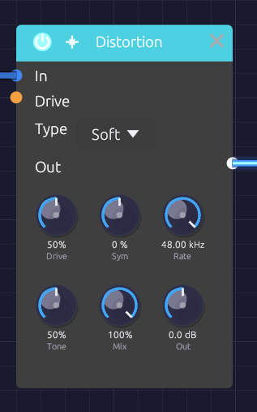

# Distortion

**Module ID** `fx.distortion` · **Category** Effect


*The character of the curve on top, its color and level below*

The Distortion adds harmonics by pushing a signal into a curve: rounding it off, clipping it, folding it back on itself, or crushing it into steps. Five types cover everything from a touch of warmth on a bass to a sine folded into a buzzing, vocal tone.

Every curve runs at four times the sample rate with antiderivative anti-aliasing (ADAA). Even full drive on a high note adds only harmonics of that note, not the inharmonic "digital fizz" a naive distortion folds back into the audible range. The dry signal is mixed in at the same oversampled rate and aligned to the sample, so **Mix** blends cleanly without comb filtering.

## Inputs

| Port | Signal Type | Description |
|------|-------------|-------------|
| **In** | Audio (Blue) | Signal to distort |
| **Drive CV** | Control (Orange) | Moves Drive around the knob: ±1 adds ±50% |

## Outputs

| Port | Signal Type | Description |
|------|-------------|-------------|
| **Out** | Audio (Blue) | Distorted signal |

## Parameters

| Control | Range | Default | Description |
|---------|-------|---------|-------------|
| **Type** | Soft / Hard / Fold / Bit / Tube | Soft | Distortion curve (dropdown on the node) |
| **Drive** | 0 – 100% | 50% | How hard the signal is pushed into the curve |
| **Sym** (Symmetry) | −100% – +100% | 0% | Fold only: shifts the wave off center before it folds |
| **Rate** | 100 Hz – 48 kHz | 48 kHz | Bit only: the crushed sample rate. The top of the range is off |
| **Tone** | 0 – 100% | 50% | Lowpass after the curve, from 200 Hz to 20 kHz |
| **Mix** | 0 – 100% | 100% | Dry (0%) to distorted (100%) |
| **Out** (Output) | −12 dB – +12 dB | 0 dB | Level after distortion |

Drive keeps working while Drive CV is patched: the knob sets the center and the CV moves around it.

## Types

### Soft

Smooth `tanh` saturation that rounds off peaks. Drive raises the input gain from 1x to 11x. It produces odd harmonics that fall away smoothly, and compresses as it goes: warmth at low drive, fuzz at high drive.

### Hard

Clipping that flattens the peaks. Drive lowers the clipping point from full scale to a tenth of it. Bright, buzzy odd harmonics, with a transistor-fuzz edge.

### Fold

A wavefolder in the West Coast tradition of the Serge and Buchla folders. Past the clipping point, the wave reflects back toward zero instead of flattening, then reflects again. Drive raises the gain from 1x to 6x, and each step adds another fold and another pair of peaks, up to about three folds per half-wave at full scale. The corners of each fold are rounded, as a real diode folder's are.

A plain sine comes out bright, vocal or metallic, and sweeping Drive with CV gives the classic wavefolder sweep.

**Sym** shifts the wave off center before it folds. The two halves then fold differently and even harmonics appear. Near ±100%, a quiet sine sits on a fold's peak and comes out an octave up.

### Bit

Bit-depth and sample-rate reduction, for lo-fi character.

- **Drive** lowers the bit depth from 16 bits at 0% to 2 bits at 100%.
- **Rate** holds each sample for longer, like an old sampler. Below a few kHz, the crushed rate's mirror images ring out as metallic, inharmonic tones; that aliasing is the sound. It depends only on Rate: the engine's own sample rate adds none.

### Tube

Asymmetric saturation, like a triode biased off center. Drive raises the input gain from 1x to 11x. The two halves of the wave saturate at different levels, so even harmonics appear from the first touch of drive: warm, thick, slightly hollow. The DC offset this creates is removed automatically.

## Tone

**Tone** is a gentle lowpass on the distorted signal, spaced evenly in octaves from 200 Hz at 0% to 20 kHz at 100%. 50% is about 2 kHz, 65% about 4 kHz, 75% about 6 kHz. Distortion creates a lot of high harmonics, and Tone is the quickest way to take the harshness off them. It affects only the distorted signal, not the dry.

## Bypass

Click the power switch in the node header, press **Ctrl+B** with the module selected, or choose **Bypass** from its right-click menu. In passes straight to Out. The switch crossfades over 20 ms.

## Starting points

| Sound | Type | Drive | Tone | Mix |
|-------|------|-------|------|-----|
| Subtle warmth | Soft | 20% | 100% | 50% |
| Bass grit | Soft | 40% | 50% | 70% |
| Tape-ish thickening | Tube | 25% | 60% | 60% |
| Aggressive lead | Hard | 80% | 65% | 100% |
| Lo-fi sampler | Bit | 50% (Rate 8 kHz) | 100% | 80% |

Distortion raises the level, especially at high drive. Use **Out** to match the bypassed level before you judge whether it sounds better.

## Patch ideas

**Wavefolded sine.** A sine has nothing for a filter to remove; folding gives it harmonics first:

```text
[Oscillator Out] ──> [Distortion In]      Type Fold, Drive 50%
[Distortion Out] ──> [SVF Filter In]
```

**Octave fold.** With Type Fold, Drive 0% and Sym 100%, a sine comes out an octave up.

**Envelope-driven drive.** More distortion on the attack, cleaner as the note sustains:

```text
[ADSR Out] ──> [Distortion Drive CV]
```

**Before or after the filter.** Distortion before the filter gives the filter more harmonics to work on, and the filter tames them. Distortion after the filter adds grit to whatever the filter left, so it changes character as the cutoff moves. Before the VCA, the amount of distortion stays constant; after it, quiet notes stay clean and loud ones break up.

## Related modules

- [SVF Filter](../filters/svf-filter.md) and [Ladder Filter](../filters/ladder-filter.md): shape the harmonics distortion adds. The Ladder has its own saturating Drive
- [Compressor](./compressor.md): control dynamics before or after
- [EQ](./eq.md): fine-tune the distorted tone
