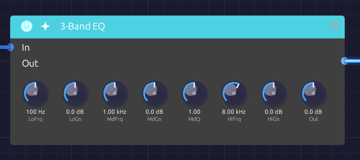

# 3-Band EQ

**Module ID** `fx.eq` · **Category** Effect


*Low shelf, mid band and high shelf, left to right, with the output level last*

The 3-Band EQ boosts or cuts three regions of the spectrum: a **low shelf** for the bass, a fully parametric **mid band**, and a **high shelf** for the treble. Use it to fit a sound into a patch, take the mud out of a pad, put an edge on a lead, or darken a reverb tail.

Where a filter removes whole parts of the spectrum, an EQ leans on them, up to 15 dB either way. Every knob glides, so you can sweep the mid band while a note plays without zipper noise.

## Inputs

| Port | Signal Type | Description |
|------|-------------|-------------|
| **In** | Audio (Blue) | Signal to equalize |

## Outputs

| Port | Signal Type | Description |
|------|-------------|-------------|
| **Out** | Audio (Blue) | Equalized signal |

## Parameters

| Knob | Range | Default | Description |
|------|-------|---------|-------------|
| **LoFrq** (Low Freq) | 20 Hz – 500 Hz | 100 Hz | Low shelf frequency |
| **LoGn** (Low Gain) | −15 dB – +15 dB | 0 dB | Boost or cut below the low shelf frequency |
| **MdFrq** (Mid Freq) | 100 Hz – 10 kHz | 1 kHz | Center of the mid band |
| **MdGn** (Mid Gain) | −15 dB – +15 dB | 0 dB | Boost or cut at the mid frequency |
| **MdQ** (Mid Q) | 0.1 – 10 | 1.0 | Width of the mid band. Higher is narrower |
| **HiFrq** (High Freq) | 2 kHz – 20 kHz | 8 kHz | High shelf frequency |
| **HiGn** (High Gain) | −15 dB – +15 dB | 0 dB | Boost or cut above the high shelf frequency |
| **Out** (Output) | −12 dB – +12 dB | 0 dB | Level after the EQ |

With every gain at 0 dB the EQ is transparent.

## The bands

The three bands run in series: low shelf, then mid, then high shelf.

### Low and high shelves

A shelf raises or lowers everything beyond its frequency by the same amount, like a bass or treble knob on a stereo. The **LoFrq** and **HiFrq** knobs set the shelf's midpoint: the frequency where it has reached half its gain. The shelves are as steep as they can be without overshooting, so a boost rises cleanly to its level with no bump at the corner.

The shelves have no Q of their own. To affect a narrower region at the bottom or top, use the mid band.

### Mid band

The mid band is a bell-shaped peak or dip centered on **MdFrq**. **MdQ** sets its width:

- **0.1 to 1**: broad and gentle, spanning several octaves. Good for tonal shaping.
- **1 to 4**: focused but still musical.
- **4 to 10**: narrow and surgical, for picking out a single resonance.

A good rule is to cut narrow and boost wide: narrow boosts sound unnatural, while narrow cuts can remove a problem without anyone hearing that it's gone.

## Bypass

Click the power switch in the node header, press **Ctrl+B** with the module selected, or choose **Bypass** from its right-click menu. In passes straight to Out. The switch crossfades over 20 ms, so you can compare the EQ'd and original sound mid-note.

## Finding a problem frequency

1. Set **MdQ** high, around 5 to 8.
2. Boost **MdGn** to +10 dB or so.
3. Sweep **MdFrq** slowly until the ringing or boominess jumps out.
4. Turn **MdGn** down below 0 dB to cut it.

## Where things live

| Region | Frequency | Character |
|--------|-----------|-----------|
| Sub | 20 – 60 Hz | Felt more than heard |
| Bass | 60 – 250 Hz | Weight, warmth, punch |
| Low mids | 250 – 500 Hz | Body; too much is muddy |
| Mids | 500 Hz – 2 kHz | Presence; too much is boxy or nasal |
| Upper mids | 2 – 5 kHz | Definition and attack; too much is harsh |
| Highs | 5 – 10 kHz | Brightness |
| Air | 10 – 20 kHz | Sparkle and openness |

## Starting points

| Goal | Settings |
|------|----------|
| Take out mud | MdFrq 300 Hz, MdGn −4 dB, MdQ 2 |
| Remove boxiness | MdFrq 500 Hz, MdGn −3 dB, MdQ 2.5 |
| Add warmth | LoFrq 100 Hz, LoGn +3 dB |
| Add presence | MdFrq 3 kHz, MdGn +3 dB, MdQ 0.8 |
| Add air | HiFrq 12 kHz, HiGn +3 dB |
| Thin, telephone-like | LoFrq 400 Hz, LoGn −15 dB; HiFrq 3 kHz, HiGn −15 dB; MdFrq 1.5 kHz, MdGn +6 dB |

Boosts raise the overall level. Pull **Out** down to match the bypassed level before deciding whether the EQ is helping.

## Patch ideas

**After distortion.** Distortion's harshness usually sits in the upper mids. A broad mid cut around 3 kHz after it smooths the edge without dulling the sound the way a lowpass would:

```text
[Distortion Out] ──> [EQ In] ──> [Audio Output Mono]
```

**Darker reverb.** The EQ is mono, so to shape a stereo reverb use one EQ per side, each cutting the lows (LoGn −6 dB) to keep the tail from clouding the bass.

**Channel strip.** EQ, then compress: the compressor then responds to the tone you chose rather than to the frequencies you were about to cut.

```text
[VCA Out] ──> [EQ In]
[EQ Out] ──> [Compressor In]
```

## Related modules

- [SVF Filter](../filters/svf-filter.md): for removing whole ranges, or sweeping dramatically
- [Compressor](./compressor.md): often follows the EQ
- [Distortion](./distortion.md): creates harmonics worth shaping
- [Reverb](./reverb.md): an EQ after it shapes the tail
