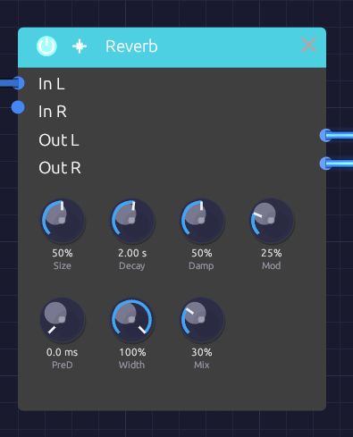

# Reverb

**Module ID** `fx.reverb` · **Category** Effect


*The room on the top row, its place in the mix below*

The Reverb puts a sound in a space: a dense wash of reflections that builds, blooms and dies away. It reaches from a small, splashy room to a tail that rings for half a minute.

Its knobs sit in two rows. The top row shapes the room and its tail (**Size**, **Decay**, **Damp**, **Mod**); the bottom row places it in the mix (**PreD**, **Width**, **Mix**).

## How it works

The Reverb is an eight-line **feedback delay network** (FDN).

1. **Pre-delay** holds the input back before anything else happens.
2. A four-step **diffuser** spreads the sound across eight channels. Each step delays the channels by different amounts, flips the polarity of some, and mixes them all together, so one click becomes 8 echoes, then 64, then 512, then 4,096. These are the early reflections.
3. Eight **delay lines** circulate the sound. On every pass the lines are mixed into each other, so each echo spawns eight more and the tail thickens into a smooth, noise-like decay.
4. Each line has its own gain and **damping filter**, both calculated from that line's length, so the whole tail decays at the rate Decay sets and every line loses its highs at the same rate.
5. The lines **drift** slowly in length (the **Mod** knob). This keeps resonances from settling in and adds a gentle chorus to the tail.

Simpler reverbs built from a few fixed comb filters tend to ring at the comb lengths, and sound metallic on snares and claps. The FDN's tail has no repeating period, so sharp transients spread into an even wash.

## Inputs

| Port | Signal Type | Description |
|------|-------------|-------------|
| **In L** | Audio (Blue) | Left input |
| **In R** | Audio (Blue) | Right input. When unpatched, it copies In L |

## Outputs

| Port | Signal Type | Description |
|------|-------------|-------------|
| **Out L** | Audio (Blue) | Left reverb, mixed with the dry signal |
| **Out R** | Audio (Blue) | Right reverb, mixed with the dry signal |

## Parameters

| Knob | Range | Default | Description |
|------|-------|---------|-------------|
| **Size** | 0 – 100% | 50% | Room size: scales every delay in the network |
| **Decay** | 0.1 s – 30 s | 2.0 s | Time for the tail to fall by 60 dB |
| **Damp** (Damping) | 0 – 100% | 50% | How much faster the highs die than the lows |
| **Mod** | 0 – 100% | 25% | Slow drift of the delay lines: a chorus in the tail |
| **PreD** (Pre-Delay) | Off – 100 ms | Off | Silence before the reverb begins |
| **Width** | 0 – 100% | 100% | Stereo width of the reverb |
| **Mix** | 0 – 100% | 30% | Dry (0%) to reverb only (100%) |

## The controls

### Size

Size sets the dimensions of the room. The shortest delay line runs from 12 ms at 0% to 100 ms at 100%, and the early reflections scale with it. Small settings build up quickly, like a booth or a small room; large settings build slowly, like a hall.

Size and Decay are independent, so a small room can still ring for a long time. Turn Size while a tail is sounding and the lines glide to their new lengths, bending the tail's pitch for a moment instead of clicking.

### Decay

Decay is the reverb time (RT60): how long the tail takes to fall by 60 dB. Measured on rendered impulse responses, it lands within about 5% of the knob across the whole Size range.

| Decay | Space |
|-------|-------|
| 0.1 – 0.5 s | Small room, booth |
| 0.5 – 1.5 s | Studio, medium room |
| 1.5 – 3 s | Hall, church |
| 3 – 10 s | Cathedral, warehouse |
| 10 s and up | Endless ambient wash |

### Damp

Damping models soft surfaces absorbing high frequencies. It sets how fast 4 kHz dies relative to the lows: at 0% it lasts the full Decay time, and at 100% it dies ten times faster. Low frequencies always keep the full Decay. Low settings sound like tile and glass; high settings like carpet and curtains, and a darker reverb is easier to sit in a mix.

### Mod

Mod lets each of the eight lines drift slowly in length, each at its own rate between about 0.3 and 1.1 Hz. The early reflections stay still.

At 0% the tail is static, the most literal setting, though long tails can show faint resonances. Around 15–35% (the default is 25%) the movement smooths long tails without drawing attention to itself. From 60% up it becomes an audible chorus in the tail: lush on pads, seasick on piano.

### PreD

Pre-delay is the gap between the dry sound and the start of the reverb. Up to about 10 ms the reverb starts at once and the source feels close. At 20–40 ms the attack of each note comes through clearly before the room answers, which keeps vocals and plucks distinct. Toward 100 ms the gap becomes an audible sense of depth.

### Width

Width sets how far apart the two sides of the reverb are. At 0% the reverb is mono, centered; at 100% the two sides come from different delay lines and are almost completely uncorrelated, so the tail fills the stereo field. Width affects only the reverb, not the dry signal.

### Mix

Mix sets how far away the sound seems. Around 10–20% it sounds close and present, 20–40% places it at a natural distance in the room, and above 50% it recedes into the space. At 100% you hear only the reverb.

## Bypass

Click the power switch in the node header, press **Ctrl+B** with the module selected, or choose **Bypass** from its right-click menu. In L passes straight to Out L and In R to Out R (In R still copies In L when unpatched). The switch crossfades over 20 ms. A bypassed reverb stops running, and it starts from silence when you switch it back in, so no old tail comes back with it.

## Starting points

| Space | Size | Decay | Damp | Mod | PreD |
|-------|------|-------|------|-----|------|
| Small bright room | 15% | 0.6 s | 20% | 10% | 0 ms |
| Room | 30% | 0.8 s | 50% | 20% | 10 ms |
| Chamber | 50% | 1.5 s | 40% | 25% | 20 ms |
| Hall | 70% | 3 s | 50% | 30% | 40 ms |
| Cathedral | 90% | 6 s | 40% | 30% | 80 ms |
| Endless | 100% | 20 s | 30% | 50% | 100 ms |

For a vocal or lead, start from the Chamber with Mix around 20% and Damp near 60%; the pre-delay keeps the words clear and the damping keeps the tail from hissing. For a pad, try the Hall with Mix 50% and Mod 70%: the chorus lives only in the tail, so the dry note stays steady.

## Patch ideas

**Stereo insert.** A stereo source keeps its image through the reverb:

```text
[Oscillator Out L] ──> [Reverb In L]
[Oscillator Out R] ──> [Reverb In R]
[Reverb Out L] ──> [Audio Output Left]
[Reverb Out R] ──> [Audio Output Right]
```

**Shared room.** Mix several voices into one reverb so they sound like they're in the same space:

```text
[VCA 1 Out] ──> [Mix In 1]
[VCA 2 Out] ──> [Mix In 2]
[Mix Out] ──> [Reverb In L] ──> [Audio Output]
```

**Echoes of the room.** Put a [Delay](./delay.md) after the reverb and the tail itself repeats in rhythm.

## Related modules

- [Delay](./delay.md): distinct echoes instead of a diffuse space
- [Chorus](./chorus.md): width and movement without a room
- [EQ](./eq.md): shape the reverb's tone
- [Mix](../utilities/mix.md): feed several voices into one reverb
- [Mixer](../utilities/mixer.md): send each channel to one shared reverb and bring it back
