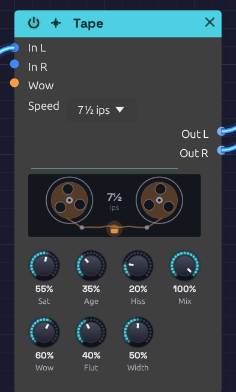

# Tape

**Module ID** `fx.tape` · **Category** Effect


*The reels turn at the tape speed and sway with the wow; the head glows as Saturation drives it*

The Tape module is a tape machine for a bus. Much of what makes vintage-flavoured music sound warm happens on tape, after the instruments: the record head's soft squash, the head bump in the low end, the slow sway and fast shiver of the transport, the top end the tape can't hold, and, on an old reel, dropouts and hiss. Put it on a mix bus or in front of the [Audio Output](../output/audio-output.md) to give the whole patch that sound.

It shares its transport and record head with the [Stereo Delay](./delay.md)'s Tape mode, which puts the same machine on the echoes only.

## How it works

Each channel is recorded onto tape, then played back:

1. **Record.** Pre-emphasis lifts the treble, the drive pushes the signal into the record head, and de-emphasis takes the treble back down, so the highs squash first, as they do on tape. The head bump and the speed's top end follow. **Saturation** sets the drive.
2. **Transport.** The play head reads the tape a moment behind the record head, and that moment keeps changing with the wow and flutter, which bends the pitch. The right track sways a little differently from the left, by **Width**.
3. **Playback.** **Hiss** is added, then the tape's **Age**: gap loss rolls off the top, and dropouts dip the sound where the oxide has worn away.

With every knob at zero, Tape passes its input through bit for bit. It adds no latency: at rest the play head reads exactly what was just recorded, and the wobble only ever pulls it back in time, never ahead.

## Inputs

| Port | Signal Type | Description |
|------|-------------|-------------|
| **In L** | Audio (Blue) | Left of the bus |
| **In R** | Audio (Blue) | Right of the bus. When unpatched, it copies In L |
| **Wow** | Control (Orange) | Adds to Wow: +1 adds 100%. The knob stays live and sets the center the CV works around |

## Outputs

| Port | Signal Type | Description |
|------|-------------|-------------|
| **Out L** | Audio (Blue) | Left, off tape |
| **Out R** | Audio (Blue) | Right, off tape |

## Parameters

| Control | Range | Default | Description |
|---------|-------|---------|-------------|
| **Sat** (Saturation) | 0 – 100% | 30% | Drive into the record head, up to +18 dB, with the head bump |
| **Age** | 0 – 100% | 15% | From new to found in an attic: duller, with dropouts and a little hiss |
| **Hiss** | 0 – 100% | 15% | Tape hiss, up to −34 dBFS |
| **Mix** | 0 – 100% | 100% | Dry (0%) to tape only (100%) |
| **Wow** | 0 – 100% | 25% | The slow sway of the reels: up to ±40 cents at 15 ips |
| **Flut** (Flutter) | 0 – 100% | 20% | The fast shiver of the capstan: up to ±12 cents at 15 ips |
| **Width** | 0 – 100% | 30% | How differently the right track sways from the left |
| **Speed** | 7½, 15, 30 ips | 15 ips | Tape speed (dropdown on the node) |

## Speed

Slower tape sways further and more slowly, holds less top end, and bumps lower:

| Speed | Wow and flutter | Head bump | Top end | Full Age leaves | Emphasis |
|-------|-----------------|-----------|---------|-----------------|----------|
| **7½ ips** | 1.6× deeper, half as fast | 40 Hz | 12 kHz | 3.5 kHz | NAB, 50 µs |
| **15 ips** | as the knobs say | 70 Hz | 18 kHz | 5.5 kHz | IEC, 35 µs |
| **30 ips** | 0.6× as deep, twice as fast | 120 Hz | 22 kHz | 8 kHz | AES, 17.5 µs |

Changing speed glides: the play head eases to its new sway rather than jumping, like a motor finding its speed.

## Shaping the sound

**Saturation.** Turning Saturation up puts the signal on tape: the head bump and the speed's top end come in over the first tenth of the knob, and the drive rises from there. Tape is calibrated to the studio convention, where a sine at −18 dBFS RMS sits at 0 VU and keeps its level at any drive. Quieter material comes up a little, louder material is squashed, and the louder it is the more it's squashed, with the treble first. On a full mix that sounds like glue at 20–40%, and like a cassette deck pushed into the red past 70%.

**Wow and Flutter.** Both knobs work on a square law, so the bottom of each is fine and the top is extreme. The pitch swings by:

| Knob | Wow at 15 ips | Flutter at 15 ips |
|------|---------------|-------------------|
| 25% | ±2.5 cents | ±0.75 cents |
| 50% | ±10 cents | ±3 cents |
| 75% | ±22.5 cents | ±6.75 cents |
| 100% | ±40 cents | ±12 cents |

Multiply by 1.6 at 7½ ips and by 0.6 at 30. A couple of cents of wow is felt more than heard; ten is a gentle seasickness; forty is a warped record. Wow is two slow sways at unrelated rates, so it never quite repeats.

Turning Wow up quickly pulls the play head back and sags the pitch for a moment, as a dragging reel would. The depth glides over about a third of a second to keep that brief.

**Width.** A mono source comes out mono at Width 0, and sways apart into stereo as Width rises. Hiss is always independent between the two sides.

**Age.** Age rolls off the top, from nothing at 0 to the speed's worn cutoff at 100%. Dropouts start to appear around 30%. At 100% there are about two every three seconds, each 15–150 ms long, dipping the highs more than the lows. Age also adds a little hiss of its own, up to −48 dBFS.

**Hiss.** Mostly treble, as tape hiss is, and it runs through the Age stage: an old tape hisses darker, and the hiss drops out with the music.

**Mix.** Below 100%, the wobbling tape copy is blended with the dry signal, which beats against it like a chorus. With Saturation and Age at 0 that's all you hear: a slow, natural tape chorus. A 50% blend sounds about 3 dB quieter than either side alone, because the two copies drift apart.

## Bypass

Click the power switch in the node header, press **Ctrl+B** with the module selected, or choose **Bypass** from its right-click menu. In L passes straight to Out L and In R to Out R (In R still copies In L when unpatched).

## Starting points

| Sound | Speed | Sat | Age | Hiss | Wow | Flut | Width | Mix |
|-------|-------|-----|-----|------|-----|------|-------|-----|
| Mix-bus glue | 30 | 30% | 0% | 0% | 0% | 5% | 0% | 100% |
| Warm seventies | 15 | 40% | 20% | 10% | 20% | 15% | 30% | 100% |
| Warped cassette | 7½ | 35% | 45% | 25% | 55% | 30% | 40% | 100% |
| Lo-fi house | 7½ | 60% | 50% | 30% | 25% | 20% | 20% | 100% |
| Found in an attic | 7½ | 50% | 100% | 40% | 70% | 50% | 60% | 100% |
| Tape chorus | 15 | 0% | 0% | 0% | 50% | 0% | 100% | 50% |

Each was checked by rendering [Afterglow](../../recipes/afterglow.md) through it: all but the chorus come out within about 1 dB of the dry patch's loudness, with the peaks lower.

## Patch ideas

**On the master.** Put Tape last, in front of the Audio Output:

```text
[Mixer Out L] ──> [Tape In L]
[Mixer Out R] ──> [Tape In R]
[Tape Out L] ──> [Audio Output Left]
[Tape Out R] ──> [Audio Output Right]
```

**A warped moment.** Patch an [Arranger](../utilities/arranger.md) lane into **Wow**, with the knob low. Ramp the lane up through a breakdown and back down for the drop, and the whole mix bends out of shape and back.

**Breathing tape.** A slow [LFO](../modulation/lfo.md), around 0.05 Hz, into **Wow** with a small depth makes the sway itself come and go.

**Only the pads.** Put Tape between the pad voice and its [Mixer](../utilities/mixer.md) channel, so the drums stay steady while the pads drift.

## Related modules

- [Stereo Delay](./delay.md): the same tape machine, on the echoes only
- [Distortion](./distortion.md): Tube saturates without the wobble or the dulling
- [Audio Output](../output/audio-output.md): Character, a fixed soft clip on the master
- [Arranger](../utilities/arranger.md) and [LFO](../modulation/lfo.md): move Wow
