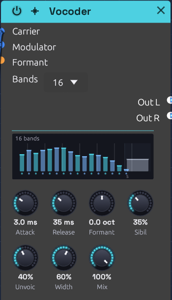

# Vocoder

**Module ID** `fx.vocoder` · **Category** Effect


*Mid-word: a bar for each band shows how loud the voice is there, and the column on the right shows its highs*

The Vocoder makes one sound speak with another's mouth. It takes the **spectral envelope** of a **modulator**, usually a voice: which parts of the spectrum are loud and which are quiet, moment to moment. It then lays that envelope over a **carrier**, usually a synth chord. The chord takes on the voice's vowels and consonants and keeps its own pitch and harmony. It's the sound of Kraftwerk's robots, Herbie Hancock's *I Thought It Was You*, and Air's *Sexy Boy*.

## How it works

1. The modulator is split into **Bands**, a bank of band-pass filters spaced evenly in pitch from 100 Hz to 6.4 kHz.
2. A follower on each band tracks how loud the voice is there. It rises at the **Attack** rate and falls at the **Release** rate.
3. The carrier is split by a second, matching bank.
4. Each carrier band is turned up and down by its twin's follower, and the bands are summed. Where the voice has a formant, the carrier gets one too.

Each band is two band-pass sections in a row, so it's steep enough to keep neighbours apart. Neighbouring bands cross at −3 dB, so a carrier with every follower open comes through with an even spectrum.

Three more paths help speech come through:

- **Formant** slides the carrier's bank against the voice's, by up to an octave either way, so the vowels land higher or lower on the chord.
- **Sibilance** lets the voice's own highs, above the bank, straight through.
- **Unvoiced** swaps the carrier for noise while the voice hisses.

## Inputs

| Port | Signal Type | Description |
|------|-------------|-------------|
| **Carrier** | Audio (Blue) | The sound that's played: a synth, a chord, noise. A polyphonic cable is summed, so a whole chord can come in on one cable |
| **Modulator** | Audio (Blue) | The sound whose spectrum the carrier wears: a voice from a [Sampler](../sources/sampler.md) or an [Audio Input](../sources/audio-input.md), or drums |
| **Formant** | Control (Orange) | Adds to the Formant knob: +1 moves the carrier's bands an octave up |

## Outputs

| Port | Signal Type | Description |
|------|-------------|-------------|
| **Out L** | Audio (Blue) | The odd bands (the 1st, 3rd, 5th...), leaning left as **Width** opens |
| **Out R** | Audio (Blue) | The even bands, leaning right |

The sibilance and the dry carrier (below 100% **Mix**) sit in the middle of both.

## Parameters

| Control | Range | Default | Description |
|---------|-------|---------|-------------|
| **Bands** | 8 / 16 / 24 | 16 | How finely the spectrum is split (dropdown on the node) |
| **Attack** | 0.5 – 200 ms | 4 ms | How fast a band opens when the voice gets louder there |
| **Release** | 5 ms – 2 s | 40 ms | How fast a band closes again |
| **Formant** | −1 – +1 oct | 0 | The carrier's bands against the voice's: up for a smaller throat, down for a larger one |
| **Sibil** (Sibilance) | 0 – 100% | 25% | How much of the voice's highs pass straight through |
| **Unvoic** (Unvoiced) | 0 – 100% | 25% | How far noise replaces the carrier while the voice hisses |
| **Width** | 0 – 100% | 50% | How far apart the odd and even bands sit |
| **Mix** | 0 – 100% | 100% | From the carrier alone (0%) to the vocoded sound (100%) |

The **Formant** input adds to the knob, and the sum stops at an octave either way. While it's patched, the knob stays live and sets the centre the CV works around.

Attack and Release are the time a band takes to cover most of a change (63%), like the RC follower on an analog vocoder's band.

## The display

Bars stand on a frequency axis, one per band, each as tall as the voice is in that band right now. Watch them while the voice speaks and you can see the vowels change. An "ee" lifts the bars at both ends, and an "oo" piles them up at the left.

- **Colours.** Odd bands are cyan and even bands violet. The colours part as **Width** opens, to show which side each band plays on.
- **Formant.** When Formant moves the carrier's bands, each bar leaves a white cap where the carrier plays it, joined to its own foot by a slanting line. The shift shows top right.
- **Sibilance.** The strip on the right is the range Sibilance passes. Its column is the voice's level up there, lit as brightly as the knob lets it through.
- **Unvoiced.** While the voice hisses and Unvoiced lets noise in, the bank glitters.

## Shaping the sound

**Bands.** Eight bands sound like a machine talking: rough, buzzy and only just readable, the classic robot. Sixteen is the all-rounder. Twenty-four is the clearest and most like the voice itself. Loudness stays within a few dB whichever you choose. Changing Bands fades the bank out and in over a few milliseconds, so it never clicks.

**Attack and Release.** Speech wants a fast attack (2 to 5 ms) and a short release (20 to 50 ms), so each syllable starts and stops cleanly. Lengthen the release past a few hundred milliseconds and the words smear into a choir that lingers on each vowel. Very short times on the low bands start to buzz, because the follower begins to trace the waveform itself.

**Formant.** Moving the carrier's bank up makes a smaller throat: the voice turns childlike, then cartoonish. Moving it down makes a giant. The pitch you hear doesn't move, because that comes from the carrier. Small amounts (a quarter octave or so) change the character without hurting the words. An LFO on the Formant input makes the voice wobble between the two.

**Sibilance and Unvoiced.** Consonants like "s", "t" and "f" are mostly noise above 4 kHz, where many carriers have little to give. **Sibilance** passes the voice's own highs straight through, so they stay crisp. **Unvoiced** handles the hiss inside the bank. When the voice's level above 4 kHz grows past 30% of its whole level, noise starts replacing the carrier, and by 60% it has replaced it as far as the knob allows. The "s" is then spoken by noise, through the voice's own bands. With no carrier at all, Unvoiced still lets the consonants through on their own. Vowels don't trigger it.

**Width.** At 0% the vocoder is mono. Wider, neighbouring bands split left and right, and the voice seems to fill the space between the speakers. At 100% each side carries only its own bands.

**Mix.** At 0% you hear only the carrier, centred. In between, a little of the raw chord fills the gaps between the words.

## Carriers that work

The vocoder can only carry what the carrier has to give. A **bright, sustained** carrier works best: saws, pulses, a supersaw, a chord on a polyphonic cable, or noise for a whisper. A dark, filtered pad has nothing up high for the voice's upper bands to open, so the words come out muffled. Filter the carrier after the vocoder, not before.

The output follows both inputs: a loud chord and a loud voice make a loud vocoder. A five-note chord of detuned saws arrives several times louder than one voice, so turn the vocoder down after it, on a [Mixer](../utilities/mixer.md) strip.

## Bypass

Click the power switch in the node header, press **Ctrl+B** with the module selected, or choose **Bypass** from its right-click menu. The **Carrier** passes straight to both outputs, and the modulator is heard nowhere, like a pedal's footswitch. The switch crossfades over 20 ms.

## Starting points

| Sound | Bands | Attack | Release | Formant | Sibil | Unvoic |
|-------|-------|--------|---------|---------|-------|--------|
| Classic vocoder | 16 | 3 ms | 35 ms | 0 | 35% | 40% |
| Robot | 8 | 2 ms | 20 ms | 0 | 20% | 0% |
| Clear speech | 24 | 2 ms | 30 ms | 0 | 50% | 50% |
| Choir smear | 24 | 30 ms | 600 ms | −0.2 oct | 10% | 0% |
| Small and bright | 16 | 3 ms | 35 ms | +0.5 oct | 35% | 40% |

## Patch ideas

**A phrase that speaks on every chord.** A [Sampler](../sources/sampler.md) in One-Shot plays a recorded line, and a [Clock Divider](../utilities/divider.md) fires it every two bars. A [Chord Sequencer](../utilities/chord-sequencer.md) plays the chords on a saw voice. The [Soba Speaks](../../recipes/soba-speaks.md) example is built this way:

```text
[Sampler L] ──> [Vocoder Modulator]
[Oscillator Out] ──> [Vocoder Carrier]     (a saw, on the Chord Sequencer's Pitch)
[Vocoder Out L] ──> [Mixer Ch 1]
[Vocoder Out R] ──> [Mixer Ch 2]
```

**Your own voice.** Patch an [Audio Input](../sources/audio-input.md)'s **L** into **Modulator**, and speak or sing into a microphone while the chords play. Wear headphones, or the mic will hear the speakers and the vocoder will start to howl.

**Drums that play chords.** Patch a drum loop into **Modulator** and a held chord into **Carrier**. The chord pulses in the rhythm of the drums: the kick opens the low bands, and the hats open the high ones.

**A whisper.** Patch [Noise](../sources/noise.md) (white) into **Carrier** and the voice comes back whispered, with no pitch at all.

## Related modules

- [Audio Input](../sources/audio-input.md): a live voice to vocode
- [Sampler](../sources/sampler.md): a recorded voice that plays itself
- [Chord Sequencer](../utilities/chord-sequencer.md): chords for the carrier, on one cable
- [Compressor](./compressor.md): the other effect that listens to a second signal
- [Chorus](./chorus.md) and [Reverb](./reverb.md): space for the voice afterwards
