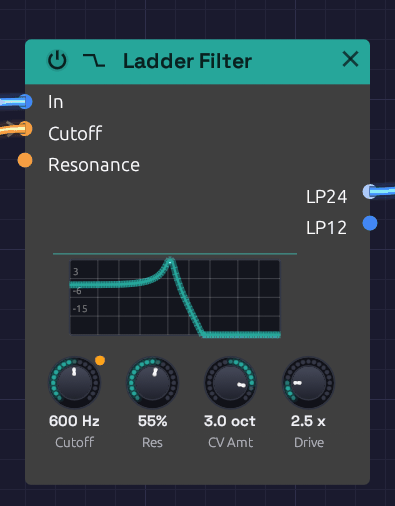

# Ladder Filter

**Module ID** `filter.ladder` · **Category** Filter


*The ladder's response curve, drawn from the filter's own transfer function.*

The Ladder Filter models the transistor ladder Robert Moog patented in 1969: the filter behind the Minimoog, and still the sound most people mean by "analog". It is a 4-pole lowpass, built from four one-pole stages in a row, with the last stage's output fed back to the first to make the resonance.

What gives it its character:

- **A steep 24 dB/octave slope** that darkens a sound decisively, plus a gentler 12 dB/octave tap from the middle of the ladder.
- **Saturation at every stage.** Push it with **Drive** and it rounds off and thickens rather than clipping. The output never goes past full scale, however hard you drive it.
- **Bass compensation.** The original ladder loses low end as resonance rises. This one adds the lost bass back, so turning up the resonance adds a peak without thinning the sound.
- **Self-oscillation** over the top fifth of the resonance knob: a sine at the cutoff frequency, in tune to within a cent or two.
- **2x oversampling.** The saturators run at twice the sample rate, so a high note driven hard stays clean instead of picking up inharmonic aliasing.

## Inputs

| Port | Signal Type | Description |
|------|-------------|-------------|
| **In** | Audio (Blue) | Audio to filter |
| **Cutoff** | Control (Orange) | Cutoff CV, in octaves: each unit moves the cutoff by **CV Amt** octaves. At the default of 1, +1 doubles the cutoff and -1 halves it: the V/Oct scale, so a keyboard's pitch tracks directly |
| **Resonance** | Control (Orange) | Adds to the **Res** knob: +1 adds 50% |

**Cutoff** and **Resonance** modulate around their knobs. The knob sets the center, and stays live while a cable is patched in.

## Outputs

| Port | Signal Type | Description |
|------|-------------|-------------|
| **LP24** | Audio (Blue) | 4-pole lowpass, 24 dB/octave: the classic ladder sound |
| **LP12** | Audio (Blue) | 2-pole lowpass, 12 dB/octave, tapped halfway down the same ladder. Brighter, with the same resonance |

## Parameters

| Knob | Range | Default | Description |
|------|-------|---------|-------------|
| **Cutoff** | 20 Hz – 20 kHz | 1000 Hz | Filter cutoff frequency |
| **Res** (Resonance) | 0 – 100% | 50% | Peak at the cutoff. Self-oscillates above 80% |
| **CV Amt** (Cutoff CV) | -4 – +4 oct | 1 oct | Octaves the cutoff moves per unit at the **Cutoff** input. Negative turns the CV upside down |
| **Drive** | 1x – 10x | 1x | Input gain into the saturating stages |

## Ladder or SVF?

Both filters cover the musical range, self-oscillate, and take cutoff CV in octaves, scaled by **CV Amt**. They differ in character:

| | Ladder | SVF |
|---|---|---|
| Slope | 24 dB/oct (and 12) | 12 dB/oct |
| Modes | Lowpass only | LowPass, HighPass, BandPass, Notch |
| Saturation | At every stage: thick, rounded | At the input and in the resonance |
| Self-oscillation | Top fifth of the knob, about -20 dBFS | Top few percent, about -12 dBFS |

Reach for the ladder for basses, leads and anything that should sound fat. Reach for the [SVF Filter](./svf-filter.md) when you want the other modes, or a lighter, more transparent touch.

## CV Amt

**CV Amt** sets how far the **Cutoff** input reaches: how many octaves one unit of CV moves the cutoff. It runs from -4 to +4 octaves per unit, and starts at 1, the V/Oct scale.

An envelope runs from 0 to 1, so **CV Amt** is the size of its sweep, the knob a hardware synth calls *Env Amount* or *Contour*:

- **1** opens the filter one octave at the envelope's peak. Gentle: a sound that brightens a little at each note.
- **2 to 3** suits a pluck or a brassy swell.
- **3 to 4** is acid: a resonant peak that shoots up from the bass to the treble and falls back.
- **Negative** values turn the CV upside down. An envelope then closes the filter as the note starts and opens it again as it releases, so set the **Cutoff** knob high.

With pitch on **Cutoff**, **CV Amt** is the keyboard tracking: 1 keeps the filter's brightness the same on every note, 0.5 tracks at half the rate, and 0 ignores the keys.

**CV Amt** scales whatever is patched into **Cutoff** before it's added to the **Cutoff** knob, so the knob still sets where the sweep starts. With a polyphonic envelope, each voice's sweep is scaled the same way.

## Drive

At 1x, a full-scale signal is already warmed slightly. Around 2x to 4x the ladder thickens audibly and the resonance takes on a growl. At 10x it is a distortion in its own right. The level stays roughly constant as you turn Drive up, because the saturating stages cap it.

## Self-oscillation

Turn **Res** above about 80%. With nothing patched into **In**, a sine rises out of a tiny noise floor (like the hiss of real components) within a second or so. Its pitch is the **Cutoff** knob, accurate to a cent or two from bass to treble, and the same saturators that shape the sound hold it at about -20 dBFS.

Feed audio in while it oscillates and the two fight, with the classic squelch.

## Patch examples

### Fat bass

```text
[Oscillator Out (Saw)] ──> [Ladder Filter In]
[Ladder Filter LP24] ──> [VCA In] ──> [Audio Output]
```

A saw through LP24 with the cutoff at a few hundred Hz is the classic fat bass. Switch to LP12 for a brighter, buzzier version of the same sound.

### Envelope sweep

```text
[Keyboard Gate] ──> [ADSR Gate]
[ADSR Out] ──> [Ladder Filter Cutoff]
```

The envelope's 0-to-1 output raises the cutoff by up to **CV Amt** octaves above the knob. Set the knob where the sweep should start and **CV Amt** to how far it should go, then add resonance and a little Drive to make it bite. For a 303-style squelch, try **Cutoff** 300 Hz, **Res** 80%, **CV Amt** 3 and a 300 ms decay.

### Keyboard tracking

```text
[Keyboard Pitch] ──> [Oscillator V/Oct]
                 ──> [Ladder Filter Cutoff]
```

At the default **CV Amt** of 1, the Cutoff input is 1 per octave, so a pitch CV patched straight in keeps the filter's brightness the same on every note. With the resonance high enough to self-oscillate and nothing patched into **In**, this turns the ladder into a sine oscillator that plays in tune.

## Starting points

| Sound | Cutoff | Res | Drive | Cutoff input | Output |
|-------|--------|-----|-------|--------------|--------|
| Fat bass | 200 – 400 Hz | 30% | 2x | Nothing | LP24 |
| Squelchy acid | 250 – 400 Hz | 70 – 80% | 3x | An envelope, **CV Amt** 3 | LP24 |
| Buzzy lead | 1 – 3 kHz | 40% | 1.5x | An envelope, **CV Amt** 1 – 2 | LP12 |
| Warm pad | 600 Hz | 20% | 1x | A slow LFO, **CV Amt** 0.5 | LP24 |
| Sine voice | Played from the keyboard | 90% | 1x | Pitch, **CV Amt** 1 | LP24, nothing in **In** |

## Polyphony

The Ladder Filter is polyphonic. Each voice on a polyphonic cable gets its own ladder, with its own resonance and saturation, and the knobs are shared by every voice. See [Polyphony](../../concepts/polyphony.md).

## Bypass

Click the power switch at the left of the header, choose **Bypass** from the module's right-click menu, or press `Ctrl + B`. Both outputs then pass **In** straight through, with a 20 ms crossfade so the switch doesn't click.

## Technical notes

- Each stage is a one-pole lowpass with a `tanh` at its input. The first stage's input is the signal minus the fed-back output, so the same `tanh` saturates the resonance. The loop is solved with zero delay (TPT), with the saturators linearized around a one-pass estimate of the current sample. That keeps the resonance in tune at high cutoffs.
- The oversampler uses polyphase IIR halfband filters: flat to within 0.01 dB up to 20 kHz, with about 100 dB of stopband. In tests, a 5 kHz tone driven into the filter has 30 to 55 dB less audible aliasing than the same filter run at the base rate. At extreme Drive combined with high resonance the gain is smaller (about 10 dB), because the harmonics reach beyond even twice the sample rate.

## Related modules

- [SVF Filter](./svf-filter.md), the multi-mode, lighter-touch filter
- [Oscillator](../sources/oscillator.md), the usual thing to filter
- [ADSR Envelope](../modulation/adsr.md) to sweep the cutoff with each note
- [LFO](../modulation/lfo.md) for wobbles and sweeps
- [Library](../../concepts/groups.md#the-library): **Acid Bass** and **Subtractive Voice** are ladders with an envelope on **Cutoff**, and **CV Amt** on their faces
