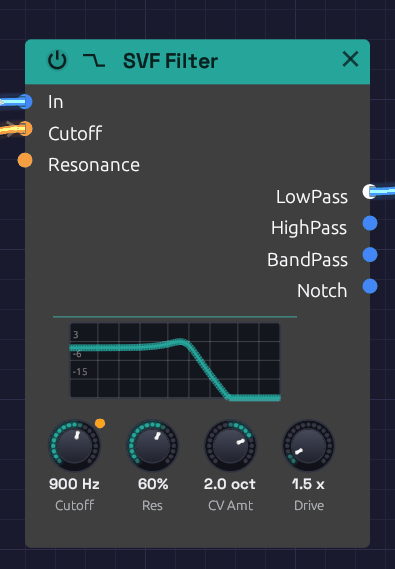

# SVF Filter

**Module ID** `filter.svf` · **Category** Filter


*The response curve on the node is computed from the filter itself, so it matches what you hear.*

The SVF (state variable filter) is the all-purpose filter: one input, four outputs, all running at once. **LowPass** darkens, **HighPass** thins, **BandPass** keeps a band around the cutoff and **Notch** takes one out. Patch whichever you need, or several at once, without switching modes.

It is a 12 dB/octave filter with an analog-style resonance. Turn the resonance up and the peak grows and saturates rather than getting louder without limit; turn it all the way and the filter sings on its own as a clean sine at the cutoff. Cutoff moves in octaves, so a sweep sounds even from bass to treble, and it stays stable right up to 20 kHz.

For a thicker, steeper lowpass, see the [Ladder Filter](./ladder-filter.md).

## Inputs

| Port | Signal Type | Description |
|------|-------------|-------------|
| **In** | Audio (Blue) | Audio to filter |
| **Cutoff** | Control (Orange) | Cutoff CV, in octaves: each unit moves the cutoff by **CV Amt** octaves. At the default of 1, +1 doubles the cutoff and -1 halves it: the V/Oct scale, so a keyboard's pitch tracks directly |
| **Resonance** | Control (Orange) | Adds to the **Res** knob: +1 adds 50% |

**Cutoff** and **Resonance** modulate around their knobs. The knob sets the center, and stays live while a cable is patched in.

## Outputs

| Port | Signal Type | Description |
|------|-------------|-------------|
| **LowPass** | Audio (Blue) | Passes frequencies below the cutoff |
| **HighPass** | Audio (Blue) | Passes frequencies above the cutoff |
| **BandPass** | Audio (Blue) | Passes a band around the cutoff |
| **Notch** | Audio (Blue) | Removes a band around the cutoff and passes the rest |

## Parameters

| Knob | Range | Default | Description |
|------|-------|---------|-------------|
| **Cutoff** | 20 Hz – 20 kHz | 1000 Hz | Where the filter starts cutting |
| **Res** (Resonance) | 0 – 100% | 50% | Peak at the cutoff. Self-oscillates above about 97% |
| **CV Amt** (Cutoff CV) | -4 – +4 oct | 1 oct | Octaves the cutoff moves per unit at the **Cutoff** input. Negative turns the CV upside down |
| **Drive** | 1x – 10x | 1x | Input gain into a soft saturator, for warmth and grit |

## The four outputs

**LowPass** is the classic subtractive synth filter. It rolls off everything above the cutoff at 12 dB per octave, taking the edge off a bright oscillator. Most patches start here.

**HighPass** is the mirror image: it removes everything below the cutoff. Use it to thin a sound out, clear rumble, or leave room for a bass part.

**BandPass** keeps a band around the cutoff and rolls off both sides. The band narrows as resonance rises. It gives vocal, nasal and telephone-like tones, and swept by an envelope or LFO it becomes a wah.

**Notch** removes a band around the cutoff and leaves the rest. The notch is deepest exactly at the cutoff and narrows as resonance rises. It equals **LowPass** and **HighPass** added together. Swept slowly, it gives a phaser-like movement that hollows a sound without darkening it.

## Resonance and self-oscillation

Resonance feeds part of the filter's output back into itself, which adds a peak at the cutoff. A little (20 to 40%) adds character; a lot (70 to 90%) gives the squelchy, whistling peak of an acid bassline. The feedback runs through a saturator, so a loud input at high resonance pushes back instead of running away.

Above about 97% the filter self-oscillates:

- It produces a sine at the cutoff frequency, with nothing patched into **In**. The oscillation grows out of a tiny noise floor, like circuit noise in an analog filter.
- The pitch lands within a few cents of the **Cutoff** knob, so the knob reads as a pitch.
- The saturator holds the level at about -12 dBFS.
- Patch a keyboard's **Pitch** into **Cutoff** and it plays in tune.

Feed audio in while it oscillates and the two interact, with the resonance pushing back against loud input.

## CV Amt

**CV Amt** sets how far the **Cutoff** input reaches: how many octaves one unit of CV moves the cutoff. It runs from -4 to +4 octaves per unit, and starts at 1, the V/Oct scale.

An envelope runs from 0 to 1, so **CV Amt** is the size of its sweep, the knob a hardware synth calls *Env Amount* or *Contour*:

- **1** opens the filter one octave at the envelope's peak. Gentle: a sound that brightens a little at each note.
- **2 to 3** suits a pluck or a brassy swell.
- **3 to 4** is acid: a resonant peak that shoots up from the bass to the treble and falls back.
- **Negative** values turn the CV upside down. An envelope then closes the filter as the note starts and opens it again as it releases, so set the **Cutoff** knob high.

With pitch on **Cutoff**, **CV Amt** is the keyboard tracking: 1 keeps the filter's brightness the same on every note, 0.5 tracks at half the rate, and 0 ignores the keys.

**CV Amt** scales whatever is patched into **Cutoff** before it's added to the **Cutoff** knob, so the knob still sets where the sweep starts. With a polyphonic envelope, each voice's sweep is scaled the same way.

## Drive

**Drive** raises the level into a soft saturator before the filter. At 1x it is nearly clean. Turning it up thickens the sound and then adds grit, and the louder signal also pushes harder against the resonance.

## Patch examples

### Basic filtering

```text
[Oscillator Out (Saw)] ──> [SVF Filter In]
[SVF Filter LowPass] ──> [VCA In] ──> [Audio Output]
```

Start with the cutoff around 1000 Hz and **Res** at 20 to 40%, then turn the cutoff down for a darker sound.

### Filter envelope

```text
[Keyboard Gate] ──> [ADSR Gate]
[ADSR Out] ──> [SVF Filter Cutoff]
```

Set the **Cutoff** knob low (200 to 500 Hz) and **CV Amt** to 2 or 3. The envelope's 0-to-1 output raises the cutoff by up to **CV Amt** octaves as it plays, so the knob sets where the sweep starts and **CV Amt** how far it goes. Add resonance to make the sweep more pronounced. A fast attack and decay gives a pluck; a slow attack, a swell.

### Keyboard tracking

```text
[Keyboard Pitch] ──> [Oscillator V/Oct]
                 ──> [SVF Filter Cutoff]
```

The filter follows the notes you play, so high notes are as bright as low ones. At the default **CV Amt** of 1 the Cutoff input is on the V/Oct scale, so no scaling is needed. Turn **CV Amt** down to 0.5 for half tracking, so high notes come out a little darker.

### Parallel modes

```text
[Oscillator Out] ──> [SVF Filter In]
[SVF Filter LowPass] ──> [Mix In 1]
[SVF Filter BandPass] ──> [Mix In 2]
[Mix Out] ──> [Audio Output]
```

Blending lowpass with a little bandpass gives body plus a resonant edge.

### Moving notch

```text
[Oscillator Out (Saw)] ──> [SVF Filter In]
[LFO Out (slow)] ──> [SVF Filter Cutoff]
[SVF Filter Notch] ──> [Audio Output]
```

A slow LFO sweeping the notch gives a phaser-like whoosh.

## Polyphony

The SVF Filter is polyphonic. Each voice on a polyphonic cable gets its own filter, with its own resonance, so a chord into **In** with an envelope on **Cutoff** opens each note separately. The knobs are shared by every voice. See [Polyphony](../../concepts/polyphony.md).

## Bypass

Click the power switch at the left of the header, choose **Bypass** from the module's right-click menu, or press `Ctrl + B` to take the filter out of the signal path. All four outputs then pass **In** straight through, and the header and controls dim. Switching takes a 20 ms crossfade, so it doesn't click.

## Related modules

- [Ladder Filter](./ladder-filter.md), the steeper, saturating lowpass
- [ADSR Envelope](../modulation/adsr.md) to sweep the cutoff with each note
- [LFO](../modulation/lfo.md) for wobbles and phaser sweeps
- [Attenuverter](../utilities/attenuverter.md) to offset a cutoff sweep, or to scale one CV for several modules at once
