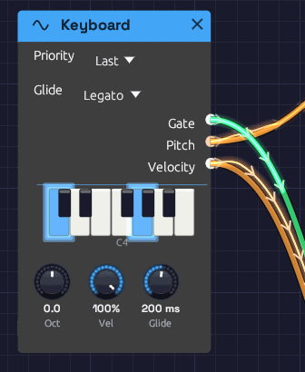

# Keyboard

**Module ID** `input.keyboard` · **Category** Source


*The piano display lights the keys you're holding.*

The Keyboard turns your computer keyboard into a monophonic controller. Press a key and it sends the note's pitch as V/Oct, raises a gate for as long as you hold it, and sends a fixed velocity. It needs no setup and no hardware, which makes it the quickest way to hear a patch. The [First Sound](../../getting-started/your-first-patch.md) example that opens with the app is played from it.

It plays one note at a time. To play chords from the same keys, use [Poly MIDI](./poly-midi.md) instead: while a Poly MIDI module is in the patch, the computer keyboard plays it too.

## Outputs

| Port | Signal Type | Description |
|------|-------------|-------------|
| **Gate** | Gate (Green) | High while a key is held. Patch it into an envelope's **Gate** |
| **Pitch** | Control (Orange) | The held note as V/Oct. C4 is 0.0, C5 is +1.0, C3 is −1.0 |
| **Velocity** | Control (Orange) | The **Vel** knob's value, sent with every note |

The **Gate** output lights up on the node while a note is held.

## Parameters

| Control | Range | Default | Description |
|---------|-------|---------|-------------|
| **Oct** (Octave) | −2 to +2 | 0 | Shifts the whole keyboard up or down by octaves |
| **Vel** (Velocity) | 0 – 100% | 100% | The strength sent for every note. A computer key can't tell soft from hard, so this sets it for all of them |
| **Priority** | Last / Lowest / Highest | Last | Which key sounds when several are held: the one pressed most recently, the lowest or the highest (see [Playing](#playing)) |

## Key layout

The bottom two letter rows form a piano keyboard starting at C4. The bottom row plays the white keys and the row above it plays the black keys, sitting between them as they would on a piano:

```text
Black keys:    S   D       G   H   J       L   ;
White keys:  Z   X   C   V   B   N   M   ,   .   /
Note:        C   D   E   F   G   A   B   C   D   E
```

That's C4 to E5, a little over an octave. The top letter row plays too, in the same octave: **Q** is C4, **R** is E4 and **I** is B4, and **W E T Y U O P** are the black keys from C♯4 to D♯5. Turn **Oct** to move the whole range.

## Playing

The Keyboard plays legato. The first key raises the gate, and while any key is held the gate stays up: pressing another key moves **Pitch** to it without retriggering the envelope, so overlapping your key presses slurs one note into the next. To retrigger, release every key before playing the next one.

When several keys are held, **Priority** picks the one that sounds:

- **Last** plays the key pressed most recently. Release it and the pitch falls back to the most recent key still held, which makes trills between two fingers easy.
- **Lowest** plays the lowest held key, so a held bass note wins over anything played above it.
- **Highest** plays the highest held key, the classic choice for a lead line over a held drone.

A change to **Priority** applies from the next key you press or release. Every held key lights on the piano display, whichever one is sounding.

After you let go, **Pitch** stays on the last note, so the release tail stays in tune. Even a very quick tap holds the gate high for at least 30 ms, so every key press triggers a full envelope.

Keys don't play notes while you hold **Ctrl** or **Alt** (those are shortcuts), while you're typing in a text field, or while the quick-add palette is open. **Space** and **Tab** open the palette, so they're never notes. The app has to have keyboard focus: if nothing happens, click the canvas.

Like everything else, the Keyboard only sounds while the patch is playing. Press **Play** in the toolbar first.

## Patch examples

The smallest playable voice, as in the First Sound example:

```text
[Keyboard Pitch] ──> [Oscillator V/Oct]
[Keyboard Gate] ──> [ADSR Gate]
[Oscillator Out] ──> [VCA In]
[ADSR Out] ──> [VCA CV]
[VCA Out] ──> [Audio Output Mono]
```

Two oscillators following one keyboard, the second a fifth up (**Semi** +7):

```text
[Keyboard Pitch] ──> [Oscillator 1 V/Oct]
                 ──> [Oscillator 2 V/Oct]
```

Turn **Vel** down and patch **Velocity** into the envelope's **Velocity** input to audition how a patch responds to softer playing:

```text
[Keyboard Velocity] ──> [ADSR Velocity]
```

## Related modules

- [Poly MIDI](./poly-midi.md) – chords, from a MIDI keyboard or these same keys
- [MIDI Note](./midi-note.md) – a monophonic voice played from a MIDI device
- [Oscillator](../sources/oscillator.md) – where **Pitch** usually goes
- [ADSR Envelope](../modulation/adsr.md) – where **Gate** usually goes
