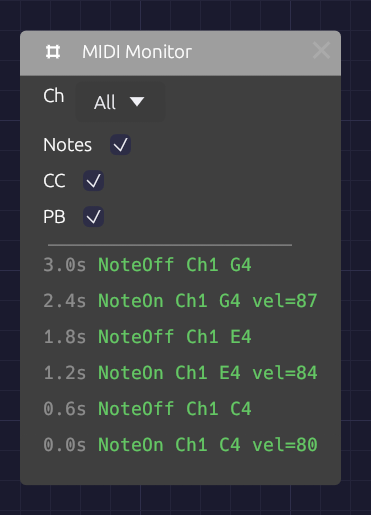

# MIDI Monitor

**Module ID** `util.midi_monitor` · **Category** Utility

*The newest event is at the top, colored by kind.*

The MIDI Monitor shows the MIDI arriving from your device as it happens. Use it when you connect new gear, when a note won't play, or to find out which CC number a knob on your controller sends before you map it.

It has no ports and makes no sound. It listens to the same device as every other MIDI module (the one chosen in **MIDI In** on the toolbar; see [Choosing a MIDI device](./midi-note.md#choosing-a-midi-device)), so you can drop it anywhere in a patch without patching anything.

## Controls

| Control | Options | Default | Description |
|---------|---------|---------|-------------|
| **Ch** (Channel) | All / 1 – 16 | All | Shows only events on this MIDI channel |
| **Notes** | On / Off | On | Shows Note On and Note Off |
| **CC** | On / Off | On | Shows control changes: knobs, faders, pedals |
| **PB** (Pitch Bend) | On / Off | On | Shows pitch bend wheel movements |

## Reading the log

The log shows the most recent events, newest at the top. Each line starts with the time it arrived, in seconds since the first event the app received, then the event itself:

| Event | Example | Color |
|-------|---------|-------|
| Note On | `NoteOn Ch1 C4 vel=100` | Green |
| Note Off | `NoteOff Ch1 C4` | Green |
| Control change | `CC Ch1 #1 val=64` | Orange |
| Pitch bend | `PitchBend Ch1 2048` | Purple |
| Channel pressure | `Pressure Ch1 45` | Gray |
| Polyphonic pressure | `PolyPres Ch1 C4 45` | Gray |
| Program change | `Program Ch1 #5` | Gray |

Note names put middle C (MIDI note 60) at C4. Pitch bend runs from −8192 to 8191, with 0 at the center. Pressure and program change can't be filtered out.

The log holds the last few events and applies the filters to those, so turning a filter on hides lines rather than reaching further back. Notes played on the computer keyboard into a [Poly MIDI](./poly-midi.md) module show up here too, on channel 1.

## Uses

**Is anything arriving?** Play a note. If the log still says *No MIDI events*, the problem is upstream: check that the device is selected and connected in **MIDI In**, and that the controller is sending.

**Which channel?** Play each device in turn and read the channel off the log. Then set **Ch** on your [MIDI Note](./midi-note.md) or Poly MIDI modules to match, or leave them on Omni.

**Which CC?** Move a knob on your controller and read its number after the `#`. You don't need the number for [MIDI Learn](./midi-note.md#midi-learn), which listens for you, but it helps when a controller sends more than you expect.

**A stuck note?** Look for a Note On without a matching Note Off. If the Note Off never arrives, the controller or its connection dropped it.

**Is velocity working?** Play softly, then hard, and watch `vel=`. A controller that always sends the same number has fixed velocity switched on in its own settings.

## Related modules

- [MIDI Note](./midi-note.md) – turns the notes into CV, and covers MIDI Learn
- [Poly MIDI](./poly-midi.md) – polyphonic MIDI
