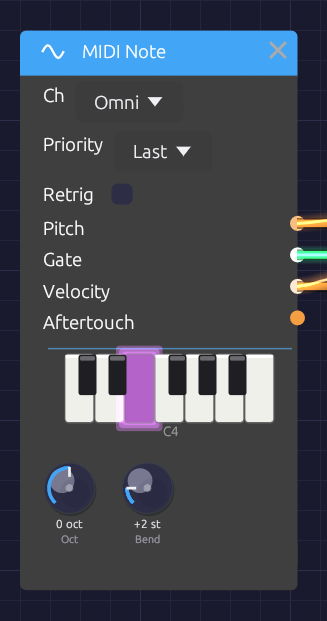

# MIDI Note

**Module ID** `input.midi_note` · **Category** Source


*Held notes light up on the piano display.*

MIDI Note plays a monophonic voice from a MIDI device: a keyboard, a pad controller, or a DAW or sequencer sending MIDI. It turns the notes into a V/Oct **Pitch**, a **Gate**, a **Velocity** and an **Aftertouch** signal that any module can use.

When several keys are held, **Priority** decides which one sounds, as on a classic monosynth. To play chords, use [Poly MIDI](./poly-midi.md).

## Outputs

| Port | Signal Type | Description |
|------|-------------|-------------|
| **Pitch** | Control (Orange) | The sounding note as V/Oct, with pitch bend. C4 (MIDI note 60) is 0.0 |
| **Gate** | Gate (Green) | High while any key is held |
| **Velocity** | Control (Orange) | The sounding note's velocity, 0 to 1 |
| **Aftertouch** | Control (Orange) | Channel pressure, 0 to 1 |

## Parameters

| Control | Range | Default | Description |
|---------|-------|---------|-------------|
| **Ch** (Channel) | Omni / 1 – 16 | Omni | The MIDI channel to listen to. Omni hears all of them |
| **Priority** | Last / Low / High | Last | Which held key sounds |
| **Retrig** (Retrigger) | Off / On | Off | Restarts the gate when you move between held keys |
| **Oct** (Octave) | −4 to +4 | 0 | Shifts every note by whole octaves |
| **Bend** (Bend Range) | 0 – 12 semitones | 2 | How far the pitch bend wheel bends at full travel |

## Choosing a MIDI device

MIDI comes in from the device chosen in **MIDI In** on the toolbar. The menu lists every MIDI input the system can see. Pick one and the dot beside its name fills in (●) once it's connected. **None (Disconnect)** lets go of it.

- **Plugged in a device after starting Modular Synth?** Open the menu and click **🔄 Refresh**.
- **Connection failed?** The reason appears in the status bar at the bottom of the window, and the selection goes back to None. On Windows, a device another app already has open (a DAW, a browser, a controller's editor) can't be opened a second time, so close the other app and pick the device again.
- **Switching or disconnecting a device** releases any notes still held on it, so nothing sticks.

The choice isn't saved with the patch or between sessions. One device feeds every MIDI Note, Poly MIDI and [MIDI Monitor](./midi-monitor.md) module in the patch.

## How notes become CV

- **Note On** raises the gate and moves **Pitch** to the note.
- **Note Off** drops the gate once every key is up. **Pitch** stays on the last note, so a release tail stays in tune.
- **Pitch bend** moves **Pitch** by up to ±**Bend** semitones. It glides over about 5 ms between the wheel's steps, so bends never zipper.
- **Channel pressure** appears on **Aftertouch**.
- **All Notes Off** (CC 123) and **All Sound Off** (CC 120) release every held key.

Each semitone is 1/12 on **Pitch**, so MIDI note 72 (C5) is +1.0 and note 48 (C3) is −1.0. With every tune knob at 0, the [Oscillator](../sources/oscillator.md) plays C4 at 0.0, so MIDI Note plays it in tune with nothing to set.

### Timing

MIDI is handled on the audio thread. Each message is stamped the moment it arrives and placed at the matching sample of the next audio buffer. Every note is delayed by the same amount, one audio buffer (a few milliseconds), so a steady sequence from a DAW plays back steady, with no jitter. Even the shortest note produces a gate.

### Priority

When more than one key is held:

| Priority | The key that sounds | Good for |
|----------|---------------------|----------|
| **Last** | The most recently pressed | Most playing |
| **Low** | The lowest | Basslines |
| **High** | The highest | Leads |

Release the sounding key and another held key takes over, so you can trill against a held note.

### Retrigger

With **Retrig** off, playing legato (pressing a new key before releasing the old one) changes the pitch but keeps the gate high. The envelope carries on, for smooth, connected lines.

With **Retrig** on, each legato note drops the gate for a single sample, so the envelope starts again on every note.

## MIDI Learn

Any knob in the patch can follow a MIDI controller (a mod wheel, a fader, a knob on your keyboard). This works with or without a MIDI Note module in the patch.

1. Right-click the knob and choose **Learn MIDI CC**. A purple **M** badge blinks above it, and the status bar asks you to move a control.
2. Move the knob or fader on your controller. The badge stops blinking: the knob is mapped.

Changed your mind, or no controller to hand? Press `Escape`, or right-click the blinking knob and choose **Cancel MIDI Learn**, and nothing is mapped. Starting learn on another knob moves it there instead.

The controller sweeps the knob's whole range, on any MIDI channel. Right-click a mapped knob to see its CC number, to **Re-learn MIDI CC**, or to **Clear MIDI**. Mappings are saved with the patch. Moves made by a controller aren't added to the undo history.

## Patch examples

A monophonic voice:

```text
[MIDI Note Pitch] ──> [Oscillator V/Oct]
[MIDI Note Gate] ──> [ADSR Gate]
[MIDI Note Velocity] ──> [ADSR Velocity]
[Oscillator Out] ──> [SVF Filter In]
[SVF Filter LowPass] ──> [VCA In]
[ADSR Out] ──> [VCA CV]
[VCA Out] ──> [Audio Output Mono]
```

Velocity on the [ADSR Envelope](../modulation/adsr.md) makes harder notes louder. Patch **Aftertouch** into the filter's **Cutoff** to brighten a note as you press into the key.

Two voices on two channels, for a bass and a lead from one DAW:

```text
[MIDI Note (Ch 1, Priority Low)] ──> [Bass voice]
[MIDI Note (Ch 2, Priority High)] ──> [Lead voice]
```

## Troubleshooting

**No sound.** Press **Play**: MIDI only sounds while the patch is playing. Check that the device is selected in **MIDI In** and that its dot is filled. Set **Ch** to Omni in case the device sends on another channel. A [MIDI Monitor](./midi-monitor.md) shows whether anything is arriving at all.

**Wrong pitch.** Check **Oct**, and that the pitch bend wheel is centered.

**Stuck note.** Send All Notes Off from your controller, or select the device again in **MIDI In**. Either releases every held note.

## Related modules

- [Poly MIDI](./poly-midi.md) – polyphonic MIDI, for chords
- [Keyboard](./keyboard.md) – play from the computer keyboard instead
- [MIDI Monitor](./midi-monitor.md) – see the MIDI that's arriving
- [ADSR Envelope](../modulation/adsr.md) – where **Gate** and **Velocity** usually go
