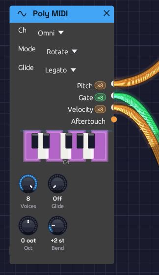

# Poly MIDI

**Module ID** `input.poly_midi` · **Category** Source


*Each output carries one channel per voice.*

Poly MIDI plays chords. Every note you play gets a voice of its own, and its **Pitch**, **Gate** and **Velocity** cables carry all the voices at once, one channel per voice. Patch them into the polyphonic modules (Oscillator, SVF and Ladder filters, ADSR, VCA) and each held note plays through its own oscillator, filter and envelope. Let go of one note and only that note fades. See [Polyphony](../../concepts/polyphony.md) for how polyphonic cables work.

It plays from the MIDI device chosen in **MIDI In** on the toolbar (see [Choosing a MIDI device](./midi-note.md#choosing-a-midi-device)). While a Poly MIDI module is in the patch, the computer keyboard plays it too, on the same keys as the [Keyboard](./keyboard.md#key-layout) module, so you can play chords without a MIDI keyboard. Those notes arrive on channel 1 at velocity 100.

## Outputs

| Port | Signal Type | Channels | Description |
|------|-------------|----------|-------------|
| **Pitch** | Control (Orange) | One per voice | Each voice's note as V/Oct, with pitch bend |
| **Gate** | Gate (Green) | One per voice | High while the voice's key, or the sustain pedal, holds its note |
| **Velocity** | Control (Orange) | One per voice | Each note's velocity, 0 to 1 |
| **Aftertouch** | Control (Orange) | 1 | Channel pressure, 0 to 1, shared by every voice |

Once the patch is playing, each polyphonic output shows its channel count in a small pill beside its label: **×8** means it carries eight voices.

## Parameters

| Control | Range | Default | Description |
|---------|-------|---------|-------------|
| **Ch** (Channel) | Omni / 1 – 16 | Omni | The MIDI channel to listen to. Omni hears all of them |
| **Mode** (Allocation) | Rotate / Reuse | Rotate | How a new note picks its voice |
| **Voices** | 1 – 8 | 8 | How many notes can sound at once, and so how many channels the cables carry |
| **Oct** (Octave) | −4 to +4 | 0 | Shifts every note by whole octaves |
| **Bend** (Bend Range) | 0 – 12 semitones | 2 | How far the pitch bend wheel bends every voice |
| **Glide** | Off – 2 s | Off | How long the pitch takes to slide to a new note (see [Glide](#glide)) |
| **Glide** (Glide Mode) | Always / Legato | Legato | Which notes slide: all of them, or only those played while another key is held |

Each voice runs a full copy of every polyphonic module downstream, so eight voices cost about eight times the CPU of one. If a patch is heavy, turn **Voices** down.

## Voice allocation

**Rotate** gives each new note the next free voice in turn. A released note keeps ringing through its release while the next note sounds on a different voice, so release tails overlap naturally.

**Reuse** sends a note played again back to the voice that last played it, the way a piano string is struck again. Any other note takes the voice that has been free the longest, which gives release tails the most time to finish.

In either mode, a note played again while it's still sounding (held by the sustain pedal, say) restarts on its own voice rather than taking a second one.

### Voice stealing

When every voice is busy, a new note takes one over. It chooses:

1. a voice the sustain pedal is holding (its key already up), oldest first;
2. otherwise, the oldest note still held.

The taken voice's gate drops for one sample, so its envelope starts again for the new note.

## Sustain pedal

The sustain pedal (CC 64) holds notes after their keys come up. Lifting it releases them all. **All Notes Off** (CC 123) and **All Sound Off** (CC 120) release everything, pedal or not.

Pitch bend glides over about 5 ms, as on [MIDI Note](./midi-note.md), and MIDI arrives on the exact sample it's scheduled for.

## Glide

Glide works as on [MIDI Note](./midi-note.md#glide): the knob sets how long a slide takes, from Off to 2 seconds, and every slide takes the same time whatever the distance. On Poly MIDI, each voice slides from **its own** previous note. Change chords with Glide up and every voice takes its own path, crossing and converging, the way the voices of a vintage polysynth do. A stolen voice slides from wherever it was.

**Mode** decides where each slide starts. With **Reuse**, a note played again returns to the voice that last played it, so it doesn't slide at all. With **Rotate**, the voices take turns, so each slide starts from a different note of the last chord or two.

In **Legato** mode, only notes played while another key is held slide. A chord struck from nothing starts on its own pitches: notes arriving within 30 ms of the first note count as part of that chord, since no hand strikes every key at once. Hold one chord and play the next over it, and the new voices slide.

## Patch example

```text
[Poly MIDI Pitch] ──> [Oscillator V/Oct]
[Poly MIDI Gate] ──> [ADSR Gate]
[Poly MIDI Velocity] ──> [ADSR Velocity]
[Oscillator Out] ──> [Ladder Filter In]
[Ladder Filter LP24] ──> [VCA In]
[ADSR Out] ──> [VCA CV]
[VCA Out] ──> [Audio Output Mono]
```

Hold a chord and each note has its own oscillator, filter and envelope. The Audio Output is a mono module, so it hears the voices summed. Voices add up, so a four-note chord is about four times as loud as one note: leave headroom with the VCA's **Level**. The [Lush Pad](../../recipes/lush-pad.md) example is built this way.

## Related modules

- [MIDI Note](./midi-note.md) – monophonic MIDI, with note priority
- [Keyboard](./keyboard.md) – the computer keyboard, monophonic
- [ADSR Envelope](../modulation/adsr.md) – one envelope per voice
