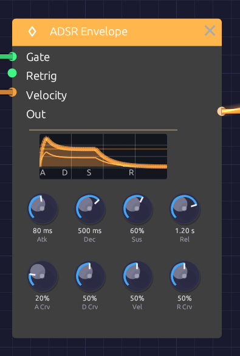

# ADSR Envelope

**Module ID** `mod.adsr` · **Category** Modulation


*The display draws the same curve the audio follows.*

The ADSR Envelope gives each note a shape in time. When a gate goes high (a key goes down), it rises, falls to a held level, and when the gate goes low (the key comes up), it fades away: **Attack**, **Decay**, **Sustain**, **Release**. Patch it into a [VCA](../utilities/vca.md) to shape a note's loudness, or into a filter's **Cutoff** to shape its brightness.

Every stage takes exactly the time on its knob: a 100 ms release is silent 100 ms after you let go. Each stage's curve knob sets its shape, from a straight line to a deep analog curve.

## Inputs

| Port | Signal Type | Description |
|------|-------------|-------------|
| **Gate** | Gate (Green) | A rising edge starts the attack; a falling edge starts the release |
| **Retrig** | Gate (Green) | While the gate is held, a rising edge restarts the attack from the current level |
| **Velocity** | Control (Orange) | Note velocity (0.0 to 1.0), read at each note-on. Scales the peak; see **Vel** |

## Outputs

| Port | Signal Type | Description |
|------|-------------|-------------|
| **Out** | Control (Orange) | Envelope level, 0.0 to 1.0 |

## Parameters

The knobs sit in two rows: the times and level on top, and under each time the curve of that stage.

| Knob | Range | Default | Description |
|------|-------|---------|-------------|
| **Atk** (Attack) | 1 ms – 10 s | 10 ms | Time to rise from the current level to the peak |
| **Dec** (Decay) | 1 ms – 10 s | 100 ms | Time to fall from the peak to the sustain level |
| **Sus** (Sustain) | 0 – 100% | 70% | Level held while the gate is high, as a fraction of the peak |
| **Rel** (Release) | 1 ms – 10 s | 300 ms | Time to fall from the current level to 0 after the gate goes low |
| **A Crv** (Attack Curve) | 0 – 100% | 20% | Attack shape: 0% is a straight ramp, higher bows it outward |
| **D Crv** (Decay Curve) | 0 – 100% | 50% | Decay shape: 0% is a straight ramp, higher drops fast then eases in |
| **Vel** (Velocity Amount) | 0 – 100% | 50% | How much the Velocity input scales the peak |
| **R Crv** (Release Curve) | 0 – 100% | 50% | Release shape: 0% is a straight ramp, higher drops fast then trails off |

## The four stages

**Attack** begins when the gate goes high. The envelope rises from where it is (0, or wherever a release had got to) to its peak in exactly the attack time. A few milliseconds gives a percussive start; tens of milliseconds, the soft start of strings or a bowed pad; hundreds, a slow swell.

**Decay** begins the moment the attack reaches the peak. The envelope falls to the sustain level in exactly the decay time. Short decays are plucky; long ones ease gradually into the held note.

**Sustain** is a level, not a time: what the envelope holds for as long as the gate stays high. At 0% the note dies away even with the key held, like a plucked string. At 100% it holds at full level, like an organ. Turning it while a note is held glides to the new level over a few milliseconds, so it never clicks.

**Release** begins when the gate goes low. The envelope falls from wherever it is to 0 in exactly the release time, even if the key was let go mid-attack. Short releases stop abruptly; long ones leave a tail that lingers after the key comes up.

## Curves

Each stage is an analog-style RC curve aimed *past* its target, so that it lands on time instead of creeping toward the target forever. The curve knob sets how far past:

- **0%**: aimed far past, so the stage is a straight line.
- **20%** (the attack default): aimed about 15% past the peak. The rise is nearly straight, which is what makes an analog attack sound punchy.
- **50%** (the decay and release default): a classic RC fall. It drops quickly, then eases into its target, which suits how the ear hears loudness.
- **100%**: a deep curve. Most of the change happens in the first fifth of the stage, followed by a long tail.

Curves change only the *shape* of a stage. Its time stays exactly the knob's.

## Velocity

Patch a velocity source (the **Velocity** output of [Keyboard Input](../midi/keyboard.md), [MIDI Note](../midi/midi-note.md) or [Poly MIDI](../midi/poly-midi.md)) into **Velocity**, and the **Vel** knob sets how much it matters:

- **Vel 0%**: every note peaks at 1.0.
- **Vel 50%**: the softest note peaks at 0.5 and the hardest at 1.0.
- **Vel 100%**: the peak equals the velocity.

Sustain is a fraction of the peak, so a soft note sustains lower too. With velocity patched, the node's display draws a faint second envelope for the softest note. The gap between the two lines is your dynamic range.

With nothing patched into **Velocity**, every note peaks at 1.0, whatever the knob says.

## Patch examples

### Volume envelope

```text
[Keyboard Gate] ──> [ADSR Gate]
[ADSR Out] ──> [VCA CV]
[Oscillator Out] ──> [VCA In] ──> [Audio Output]
```

The basic shaped note. Without an envelope, an oscillator plays one endless tone.

### Two envelopes: loudness and brightness

```text
[Keyboard Gate] ──> [ADSR 1 Gate]
                ──> [ADSR 2 Gate]
[ADSR 1 Out] ──> [VCA CV]
[ADSR 2 Out] ──> [SVF Filter Cutoff]
```

Separate envelopes let the brightness move independently of the volume: a long release on ADSR 1 for sustained notes, and a short decay on ADSR 2 for a bright pluck at the start of each one.

### Velocity to brightness

```text
[Keyboard Velocity] ──> [ADSR 2 Velocity]
```

Add this to the two-envelope patch and harder notes come out brighter but no louder.

### Inverted envelope

```text
[ADSR Out] ──> [Attenuverter In]   (Amount -1)
[Attenuverter Out] ──> [SVF Filter Cutoff]
```

The filter closes as the note opens and opens again as it releases, for "backwards" sweeps.

### Retriggering a held note

```text
[Clock Gate] ──> [ADSR Retrig]
```

While the key is held, each clock pulse restarts the attack from the current level, re-articulating the note in rhythm.

## Starting points

| Shape | Attack | Decay | Sustain | Release | Notes |
|-------|--------|-------|---------|---------|-------|
| Pluck | 1 ms | 200 ms | 0% | 100 ms | D Crv toward 80% for a sharper snap |
| Pad | 500 ms | 1 s | 70% | 2 s | A Crv near 0% for an even swell |
| Organ | 1 ms | 10 ms | 100% | 50 ms | |
| Brass | 100 ms | 300 ms | 80% | 200 ms | The attack is the breath |
| Percussion | 1 ms | 100 ms | 0% | 50 ms | |

## Polyphony

The ADSR Envelope is polyphonic. Patch a polyphonic gate (from [Poly MIDI](../midi/poly-midi.md)) into **Gate** and every voice gets its own envelope, with its own stage and level, so each note of a chord attacks and releases on its own. See [Polyphony](../../concepts/polyphony.md).

## Related modules

- [VCA](../utilities/vca.md) to shape loudness with the envelope
- [SVF Filter](../filters/svf-filter.md) and [Ladder Filter](../filters/ladder-filter.md) to shape brightness
- [Keyboard Input](../midi/keyboard.md), [MIDI Note](../midi/midi-note.md) and [Poly MIDI](../midi/poly-midi.md) for gates and velocity
- [LFO](./lfo.md) for modulation that repeats instead of following the note
- [Slope](./slope.md) for an envelope a trigger plays whole, however short the trigger
