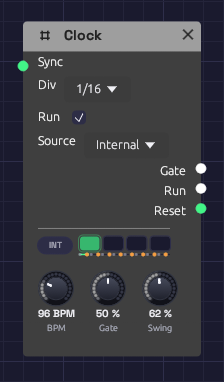

# Clock

**Module ID** `util.clock` · **Category** Utility


*Four lamps count the beats of the bar, and INT says the Clock keeps its own time. Jacks light while their gates are high.*

The Clock is the patch's metronome. It sends a steady stream of gate pulses at a tempo you set, for stepping a [Sequencer](../utilities/sequencer.md), firing envelopes on the beat, or triggering a [Sample & Hold](../utilities/sample-hold.md).

It also sets the **patch tempo and beat**. Tempo-synced modules follow it without a cable: the [Delay](../effects/delay.md) with its **Sync** set to a note length, and the [LFO](./lfo.md) with its **Tempo** set to a division. See [Tempo and Sync](../../concepts/tempo-and-sync.md).

The Clock can keep its own time, or follow the **MIDI clock** of a DAW, drum machine or another synth, so the patch plays in time with them.

## The display

Four lamps show the beats of the bar. The lamp of the beat playing flashes as the beat lands and fades through it, and the downbeat flashes brightest. A thin line under the lamps sweeps across the bar. When the Clock stops, the beat it stopped on keeps a faint outline.

Beside the lamps, a badge shows where the time comes from: **INT** for the Clock's own **BPM**, or **MIDI** when it follows a MIDI clock. The MIDI badge fills in while clock ticks are coming in. Hover over the display to see what the Clock is doing.

## Inputs

| Port | Signal Type | Description |
|------|-------------|-------------|
| **Sync** | Gate (Green) | A rising edge restarts the beat, so the next pulse starts right away |

## Outputs

| Port | Signal Type | Description |
|------|-------------|-------------|
| **Gate** | Gate (Green) | One pulse per division. The jack lights while the gate is high |
| **Run** | Gate (Green) | High while the Clock runs. Patch it into a sequencer's **Run** so it stops when the Clock does |
| **Reset** | Gate (Green) | A 5 ms pulse when the Clock starts from the top: when **Run** is ticked, or a MIDI **Start** arrives. Patch it into a sequencer's **Reset** |

## Parameters

| Control | Range | Default | Description |
|---------|-------|---------|-------------|
| **BPM** | 20 – 300 BPM | 120 | Tempo in beats (quarter notes) per minute |
| **Gate** | 1 – 99% | 50% | How much of each pulse the gate stays high |
| **Div** | 1, 1/2, 1/4, 1/8, 1/16 | 1/4 | Dropdown on the node. Pulse rate relative to the beat |
| **Run** | On / Off | On | Checkbox on the node. Off holds the gate low and pauses the clock; on starts it from the top |
| **Source** | Internal / MIDI | Internal | Dropdown on the node. Internal keeps time at **BPM**; MIDI follows the MIDI clock on the MIDI input |

## Divisions

**BPM** counts quarter notes, and **Div** sets how many pulses that makes:

| Div | One pulse every | At 120 BPM |
|-----|-----------------|------------|
| **1** | 4 beats (a bar of 4/4) | 2 s |
| **1/2** | 2 beats | 1 s |
| **1/4** | Beat | 500 ms |
| **1/8** | Half beat | 250 ms |
| **1/16** | Quarter beat | 125 ms |

A Clock has one output. For a second rhythm, divide its pulses with [Logic](../utilities/logic.md): a sixteenth Clock divided by 3 plays dotted eighths against it, and divided by 64 pulses once every four bars, slower than the Clock's slowest setting. Logic counts the Clock's own pulses, so the two can never drift apart, and changing the BPM moves both.

## Gate length

**Gate** sets how long each pulse stays high, as a share of the time between pulses. At 50% the gate is high for half of each pulse. Short gates (5 to 20%) suit drums and plucks: the envelope gets its attack and goes straight to release. Long gates (80 to 99%) hold an envelope in its sustain, so notes run nearly into one another.

## Sync and Run

A rising edge at **Sync** restarts the beat from the top. Use it to line the Clock up with another Clock, a sequencer's **EOC**, or any trigger. The Clock keeps its own tempo; Sync only moves where the beat falls. While the Clock follows MIDI, Sync does nothing: the MIDI clock places the beat.

Unticking **Run** holds the gate low and stops the clock where it is. Ticking it again starts from the top of the bar, the way a drum machine's Play button does, and fires **Reset**. Patch **Run** and **Reset** into a [Sequencer](../utilities/sequencer.md) and the sequence stops and starts with the Clock, always from step 1.

The Clock counts its beats with enough precision that even the slowest clock lands every pulse on its exact sample, however long it runs. Two Clocks at related tempos stay locked together.

## The patch tempo

The Clock's **BPM** is the tempo for the whole patch, and its beat is the patch's beat. A Delay set to sync to 1/8 echoes on the eighth note of whatever the Clock is playing, and if you change the BPM the echoes move with it. An LFO synced to 1 bar sweeps once per bar, starting on the Clock's downbeat. Without a Clock in the patch, synced modules assume 120 BPM.

If a patch has more than one Clock, synced modules follow the first one in the patch's processing order (usually the one nothing else feeds), so give them all the same BPM.

## Following MIDI clock

Set **Source** to **MIDI** to slave the Clock to a MIDI clock master, such as a DAW, a drum machine or a hardware sequencer. Choose the master's port in the MIDI device menu, and set the master to send MIDI clock to it. In most DAWs this is a *Send MIDI Clock* or *Sync* setting on the MIDI output.

- **Tempo.** The Clock measures the master's tempo from the spacing of its clock ticks (24 per beat), fitted over the last two beats so that MIDI timing jitter averages out. The **BPM** knob dims and reads the received tempo, and every synced module follows it. When the master changes tempo, the Clock catches up within two beats. Until ticks arrive, the knob reads *No clock*.
- **Position.** The Clock counts the ticks, so its beat is always exactly where the master's is, whatever the tempo. It can't drift.
- **Start** restarts from the top: the next tick is the downbeat. The Clock fires **Reset**, and **Run** goes high with the downbeat.
- **Stop** holds the Clock where it is, and drops **Run** and the gate.
- **Continue** plays on from where it stopped. If the master located first (a **Song Position** message, which DAWs send when you move the playhead), it plays on from there.
- **Run** still works as an on/off switch: the Clock runs only when it's ticked *and* the master is playing.
- Some clock sources send only ticks, never Start or Stop. The Clock runs on their ticks alone.

The **Gate** follows the master's beat too, so Div 1/16 pulses on every sixteenth of the DAW's grid. Patch **Run** and **Reset** into a sequencer to have it start, stop and restart with the DAW's transport.

Modular's own **Play** button still has to be on: while Modular is stopped, it doesn't listen.

## Patch examples

### Stepping a sequencer

```text
[Clock Gate] ──> [Sequencer Clock]
[Sequencer Pitch] ──> [Oscillator V/Oct]
[Sequencer Gate] ──> [ADSR Gate]
```

Set **Div** to 1/8 or 1/16 for a running bassline.

### Notes on the beat

```text
[Clock Gate] ──> [ADSR Gate]
[ADSR Out] ──> [VCA CV]
[Oscillator Out] ──> [VCA In] ──> [Audio Output]
```

A drone that sounds once per pulse. Lower the **BPM** to 40 to 60 and lengthen the envelope's release for slow, ambient swells.

### A sequencer that starts and stops with the Clock

```text
[Clock Gate]  ──> [Sequencer Clock]
[Clock Run]   ──> [Sequencer Run]
[Clock Reset] ──> [Sequencer Reset]
```

Untick and tick the Clock's **Run**, or press Stop and Play in your DAW with **Source** on MIDI, and the sequence starts again from step 1 on the downbeat.

### An LFO in time

Set the LFO's **Tempo** to a division, such as 1 bar. It needs no cable from the Clock: it sweeps once a bar, from the Clock's downbeat.

### Echoes in time

```text
[Clock] (BPM 100)
[Synth voice] ──> [Delay In L]   (Delay Sync: 1/8D)
```

The Delay needs no cable from the Clock to follow its tempo.

## Notes

- The Clock is monophonic. It sends the same gate to every voice of a polyphonic module.
- The Clock runs with the transport. **Stop** halts it with the rest of the patch, and **Play** starts it again from the top of the beat.
- Following MIDI, the Clock ignores MIDI channels: clock messages have none.
- Clock ticks don't scroll through the [MIDI Monitor](../midi/midi-monitor.md), which would show little else. Start, Stop, Continue and Song Position do.

## Related modules

- [Sequencer](../utilities/sequencer.md), the Clock's most common partner
- [Logic](../utilities/logic.md) to divide the Clock's pulses into longer phrases and odd rhythms
- [ADSR Envelope](./adsr.md) to turn pulses into notes
- [LFO](./lfo.md), which locks to the Clock's beat when synced
- [Delay](../effects/delay.md), which follows the Clock's tempo when synced
