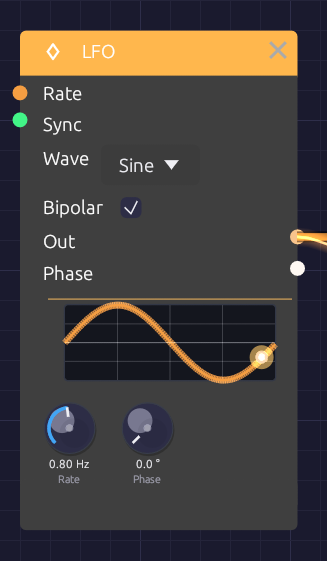

# LFO

**Module ID** `mod.lfo` · **Category** Modulation


*A dot rides the waveform display, in step with the LFO's real phase.*

The LFO (low-frequency oscillator) makes slow, repeating shapes for moving other modules: a filter that breathes, a vibrato, a tremolo, a pulse width that drifts. It runs from one cycle every 100 seconds up to 100 Hz, so it can also be pushed into the audio range for rough, buzzy modulation.

The display on the node draws one cycle of the selected waveform, with a dot that travels along it at the LFO's actual phase. What you see is where the modulation is right now.

## Inputs

| Port | Signal Type | Description |
|------|-------------|-------------|
| **Rate** | Control (Orange) | Rate CV, 1 per octave: +1 doubles the rate, -1 halves it |
| **Sync** | Gate (Green) | A rising edge restarts the cycle |

## Outputs

| Port | Signal Type | Description |
|------|-------------|-------------|
| **Out** | Control (Orange) | The modulation signal: -1 to 1 when **Bipolar** is on, 0 to 1 when it's off |
| **Phase** | Control (Orange) | Position in the cycle, as a ramp from 0 to 1 |

## Parameters

| Control | Range | Default | Description |
|---------|-------|---------|-------------|
| **Rate** | 0.01 – 100 Hz | 1 Hz | Speed of the cycle. The knob is logarithmic |
| **Phase** | 0 – 360° | 0° | Shifts where in the cycle the waveform starts |
| **Wave** | Sine / Triangle / Square / Saw | Sine | Dropdown on the node |
| **Bipolar** | On / Off | On | Checkbox on the node. On swings -1 to 1; off stays between 0 and 1 |

## Waveforms

- **Sine** moves smoothly with no corners. The natural choice for vibrato, tremolo and slow sweeps.
- **Triangle** rises and falls in straight lines. It sounds steadier than a sine at the turnarounds.
- **Square** jumps between its two extremes, half the cycle at each. Use it for trills, choppy tremolo and two-step filter jumps.
- **Saw** ramps steadily up, then drops back. A rising sweep that resets each cycle.

At the start of a cycle the sine and triangle sit at the midpoint, heading up, the square is high, and the saw is at its lowest.

## Bipolar and unipolar

With **Bipolar** on (the default), **Out** swings evenly around zero. Into a filter's **Cutoff** or an oscillator's **V/Oct**, that sweeps both above and below the knob's setting, which is what you want for vibrato.

With **Bipolar** off, **Out** stays between 0 and 1: the same shape, lifted and halved. Use it where modulation should only add, as with a VCA's **CV**, where a bipolar LFO would spend half its cycle silent.

## Rate CV

The **Rate** input works in octaves, like V/Oct. +1 doubles the rate, +2 quadruples it, -1 halves it. The knob stays live while it's patched and sets the base rate the CV works from, so you can keep turning it.

```text
[LFO 2 (slow)] ──Out──> [LFO 1 Rate]
```

A slow LFO into another's Rate makes modulation that speeds up and slows down on its own.

## Sync and phase

Each rising edge at **Sync** restarts the cycle from the **Phase** setting. Patch a [Clock](./clock.md) into it and the LFO starts over on every pulse, so its movement lines up with the beat.

**Phase** shifts the starting point. Two LFOs at the same rate, one at 0° and one at 180°, move in opposite directions; at 90° they chase each other.

The **Phase** output is the LFO's position in its cycle, a 0-to-1 ramp whatever waveform is selected. Use it as an extra rising sawtooth, unipolar, alongside **Out**.

## Patch examples

### Vibrato

```text
[LFO Out] ──> [Oscillator Exp FM]
```

Rate around 5 to 6 Hz, Sine, Bipolar on. Turn the oscillator's **Exp FM** knob down to about 0.02 octaves (Shift-drag for fine steps) for a gentle ±24 cents.

### Tremolo

```text
[Oscillator Out] ──> [VCA In]
[LFO Out] ──> [VCA CV]
```

Rate 4 to 8 Hz, Sine or Triangle, **Bipolar off**, so the level dips and returns rather than cutting out for half of each cycle.

### Filter sweep

```text
[LFO Out] ──> [SVF Filter Cutoff]
```

The Cutoff input works in octaves, so a bipolar LFO at full level sweeps one octave either side of the knob. A slow Triangle gives a smooth wah; a Square jumps between two brightnesses. To sweep less, pass the LFO through an [Attenuverter](../utilities/attenuverter.md).

### Pulse-width modulation

```text
[LFO Out] ──> [Oscillator PWM]
```

With the oscillator on Square, a slow LFO (0.3 to 2 Hz) makes the tone shimmer and thicken like a chorus.

### Stepped random

```text
[LFO Out (fast Triangle)] ──> [Sample & Hold In]
[Clock Gate]              ──> [Sample & Hold Trig]
```

Each Clock pulse freezes wherever the LFO happens to be, and [Sample & Hold](../utilities/sample-hold.md) holds that value until the next one. Set the LFO's rate so it isn't a simple multiple of the Clock's and the steps take a long time to repeat. (The trigger has to be a gate: an LFO can't patch into **Trig**.)

## Notes

- The LFO is monophonic. One LFO patched into a polyphonic module moves every voice together. See [Polyphony](../../concepts/polyphony.md).
- The Rate and Phase knobs are smoothed, so turning them while the LFO runs doesn't click or jump.
- Pressing **Play** starts every LFO from the beginning of its cycle.

## Related modules

- [ADSR Envelope](./adsr.md) for modulation that follows each note instead of repeating
- [Clock](./clock.md) to restart the LFO on the beat
- [Attenuverter](../utilities/attenuverter.md) to scale, invert or offset the LFO
- [Sample & Hold](../utilities/sample-hold.md) for stepped patterns
