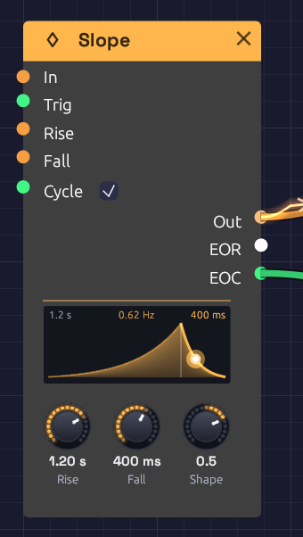

# Slope

**Module ID** `mod.slope` · **Category** Modulation · Polyphonic


*Cycling, with a 1.2 s rise and a 400 ms fall, Shape 0.5. The dot is on its way down the fall, which is lit, and EOR glows until the fall ends.*

A Slope rises and falls at rates you set. That one idea does four everyday jobs. Patch a signal into **In** and Out follows it, slowly or quickly: slew, glide, portamento, lag. A gate into **In** makes that an attack-release envelope. A trigger into **Trig** plays one whole rise and fall, however short the trigger: a function generator. Turn on **Cycle** and each fall starts the next rise: an LFO whose rising and falling halves you set apart. It is the slope generator from a Make Noise Maths, where all four are one circuit.

The node draws the rise and the fall side by side, each as wide as its share of the time, both bent by **Shape**. A dot rides the curve where the slope is, the stage it's in lights up, and the glow under the curve swells with Out, so a cycling Slope breathes. Above, the two times, and the rate when it cycles.

## Inputs

| Port | Signal Type | Description |
|------|-------------|-------------|
| **In** | Control (Orange) | A signal to follow. Out moves toward it at the **Rise** rate going up and the **Fall** rate going down, and rests on it exactly once it gets there |
| **Trig** | Gate (Green) | A rising edge runs one full rise to 1 and fall back to In (0 if nothing is patched), however short the trigger. A trigger mid-fall turns round and rises from where it is |
| **Rise** | Control (Orange) | CV around the **Rise** knob, exponential: +1 halves the time, -1 doubles it |
| **Fall** | Control (Orange) | CV around the **Fall** knob, the same way |
| **Cycle** | Gate (Green) | While high, every fall starts a new rise. Patched, it takes over from the **Cycle** switch |

## Outputs

| Port | Signal Type | Description |
|------|-------------|-------------|
| **Out** | Control (Orange) | The slope: 0 to 1 from a trigger or a cycle, or following In in In's own range, a pitch or a bipolar signal included |
| **EOR** | Gate (Green) | End of rise: high from the top of each rise until the fall ends. A new rise turns it off |
| **EOC** | Gate (Green) | End of cycle: a 1 ms pulse each time a fall ends, on the sample it ends. Cycling, that's once per cycle |

## Parameters

| Control | Range | Default | Description |
|---------|-------|---------|-------------|
| **Rise** | 1 ms – 20 s | 100 ms | The time to rise from 0 to 1. The knob is logarithmic |
| **Fall** | 1 ms – 20 s | 300 ms | The time to fall from 1 to 0 |
| **Shape** | -1 – 1 | 0 | The curve of both stages: -1 log, 0 linear, 1 exponential |
| **Cycle** | On / Off | Off | Checkbox on the node. On starts a new rise at the end of every fall |

## How it works

### Rates, not times

Rise and Fall are **rates**: the time to move a whole unit, from 0 to 1. A trigger always runs a whole unit, so its rise takes exactly **Rise** and its fall exactly **Fall**. Following In, a smaller move takes less time: half a unit takes half the time. Pitch is in octaves, so with **Rise** at 60 ms an octave leap glides in 60 ms and a semitone in 5 ms. That's the analog way, and it's different from the **Glide** on the [Keyboard](../midi/keyboard.md#glide) and the MIDI modules, which takes the same time for any interval.

With the linear Shape, Out moves at a constant rate. When it reaches In it stops on it exactly, to the last bit, and stays there for as long as In holds still.

### A trigger, a gate, and In

**Trig** sends the slope up to 1 and back down to In. It doesn't matter how long the trigger lasts: a single sample plays the whole shape, so a sequencer's gate length no longer shapes the sound. A trigger that arrives mid-fall starts a new rise from where Out is, with no jump.

A gate into **In** behaves differently. Out rises toward 1 while the gate is high, holds there, and falls when the gate goes low: an attack-release envelope that sustains for as long as you hold the note.

```text
Trig: _|‾|____________________   In:  __|‾‾‾‾‾‾‾‾‾‾|_________
Out:  _/‾‾‾\__________________   Out: __/‾‾‾‾‾‾‾‾‾‾‾‾\_______
EOR:  ____|‾|_________________   EOR: ____|‾‾‾‾‾‾‾‾‾‾‾|______
EOC:  _______|‾|______________   EOC: _________________|‾|___
```

### Shape

**Shape** bends both stages the same way, without changing how long they take.

- **-1, log:** the rise shoots up and eases in at the top; the fall eases off the top and drops to the bottom.
- **0, linear:** straight lines, at a constant rate.
- **1, exponential:** the rise starts slowly and accelerates; the fall drops fast and tails off, the way a struck sound decays. This is the shape for drums and plucks.

Turning Shape while the slope moves never makes Out jump: only the road ahead bends. Outside 0 to 1, where a pitch or a bipolar signal can take Out, the slope is always a straight line.

### Cycle

With **Cycle** on, the end of each fall starts the next rise, so the Slope runs as an LFO at 1 / (Rise + Fall): 2 Hz at the defaults' 100 ms and 300 ms. Each stage ends between samples, and the next starts from exactly there, so the period is exact and doesn't drift, after ten minutes as after ten seconds. Turn Cycle off and the run in progress finishes its fall and stops.

## Patches

### Glide on a sequence

```text
[Step Sequencer Pitch] ──> [Slope In]          (Rise 60 ms, Fall 60 ms, Shape 0)
[Slope Out] ──> [Oscillator V/Oct]
```

Every note slides into the next: an octave in 60 ms, a fifth in 35 ms. Set Rise and Fall apart for a line that swoops up and drops down, or the other way round. [Rhythmic Sequence](../../recipes/rhythmic-sequence.md#variations) has this as a variation. Because it's polyphonic, a chord from [Poly MIDI](../midi/poly-midi.md) glides voice by voice, each at its own pace.

### Trigger drums

```text
[Step Sequencer Gate] ──> [Slope Trig]          (Rise 1 ms, Fall 450 ms, Shape 1)
[Slope Out] ──> [VCA CV]
```

A snap up and an exponential decay, from any length of gate. With an [ADSR](./adsr.md), a gate that falls during the attack sends it straight to release, so a short trigger can't play a long envelope; a Slope can.

### A skewed LFO

```text
Slope: Cycle on, Rise 2 s, Fall 50 ms
[Slope Out] ──> [VCA CV]
```

A slow swell that drops away, every 2.05 s. Turn Rise and Fall the other way round for a ramp down, or set them equal for a triangle.

### A bouncing ball

```text
[Clock Gate] ──> [Slope "Energy" Trig]           (Energy: Rise 1 ms, Fall 2.5 s; Clock 20 BPM, Div 1)
[Energy Out] ──> [Attenuverter In]               (Amount -1, Offset 1)
[Attenuverter Out] ──> [Mix In 1] [Mix In 2]
[Mix Out] ──> [Slope "Bounce" Rise] [Bounce Fall]  (Bounce: Rise 150 ms, Fall 150 ms)
[Energy EOR] ──> [Bounce Cycle]
[Bounce EOC] ──> [Drum Trig]                    (Rim, Tune 7 st)
[Energy Out] ──> [Drum Accent]
```

One Slope is the ball's energy, draining away over 2.5 s. While it drains, its EOR keeps the second Slope cycling, and the second's EOC taps the drum once a bounce. As the energy falls, the Attenuverter turns it upside down and the Mix doubles it, so the CV into the bounce's times climbs and the bounces close up, from a gap of 240 ms to about 110 ms, while the Accent lets each one land softer. A patch can't feed a module back into itself, so the ball's energy lives in a Slope of its own.

### An envelope follower

```text
[Drum Out] ──> [Slope In]                       (Rise 5 ms, Fall 1 s)
[Slope Out] ──> [VCA CV]
```

Out climbs to each peak of the sound and sinks slowly between them, so a second sound swells and fades with the drum. Fall is the time for a whole unit, so from a peak of 0.3, Out is back to zero in 300 ms. Lengthen Fall for a slower release. For a microphone or guitar, the [Audio Input](../sources/audio-input.md)'s **Follow** output does this already.

### A delayed trigger, and a delayed gate

```text
[Clock Gate] ──> [Slope Trig]                   (Rise 300 ms, Fall 10 ms, Shape 0)
[Slope Out] ──> [Logic CV]                      (Threshold 0.9)
[Logic Above] ──> [Drum Trig]
```

Each clock pulse starts a rise, and [Logic](../utilities/logic.md)'s **Above** goes high when it crosses the Threshold, 270 ms later: each hit delayed by Rise × Threshold.

Patch the gate into **In** instead of **Trig**, and Out holds at the top for as long as the gate is high. Then **Above** is the same gate, opening 270 ms late and closing 1 ms after the gate does (the Fall, from the top down to the Threshold). Turn Rise to set the delay.

## Related modules

- [ADSR Envelope](./adsr.md): four stages, following a gate
- [LFO](./lfo.md): fixed shapes, and tempo sync
- [Sample & Hold](../utilities/sample-hold.md): its **Slew** glides between held values
- [Logic](../utilities/logic.md): turns a slope into a gate
- [Clock Divider](../utilities/divider.md): longer gaps between triggers
