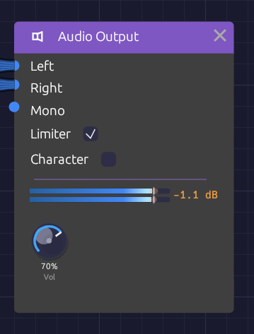

# Audio Output

**Module ID** `output.audio` · **Category** Output


*The meter shows what reaches your speakers, and in orange, what the limiter caught.*

Audio Output is where a patch meets your speakers. Whatever arrives at its inputs goes through a short mastering chain (DC blocking, volume, optional saturation and a peak limiter) and on to your audio device.

Every patch that makes sound needs one. If a patch has more than one Audio Output, only one of them is heard, so route everything to a single output.

## Inputs

| Port | Signal Type | Description |
|------|-------------|-------------|
| **Left** | Audio (Blue) | Left speaker |
| **Right** | Audio (Blue) | Right speaker |
| **Mono** | Audio (Blue) | Sent equally to both speakers. The easiest way to hear a patch |

The module has no outputs.

## Parameters

| Control | Range | Default | Description |
|---------|-------|---------|-------------|
| **Vol** (Volume) | 0 – 100% | 80% | Master volume |
| **Limiter** | On / Off | On | Catches peaks before they can clip |
| **Character** | On / Off | Off | Gentle soft-clip saturation, for color |

## Routing

**Mono** is added to both channels, on top of anything patched into **Left** and **Right**. Left and Right stay separate: a cable into **Left** alone plays only in the left speaker. For a mono source, use **Mono**. For stereo, patch a module's left and right outputs (an Oscillator's **Out L** and **Out R**, or any effect's **Out L** and **Out R**) into **Left** and **Right**.

The inputs are audio inputs, so a polyphonic cable is summed to one channel on the way in. A whole polyphonic voice can go straight to the output.

## The output stage

The signal passes through these stages, in order:

1. **Mix.** Left and Right, with Mono added to both. Any sample that isn't a valid number (NaN or infinity) is replaced by silence, so a misbehaving module can never send a burst of noise to your speakers.
2. **DC blocker.** A 5 Hz high-pass removes any constant offset, such as a stray control signal or the lopsided output of an asymmetric distortion. It is far below anything you can hear.
3. **Volume.**
4. **Character** (when on). A soft clipper that leaves everything below about -3 dBFS untouched and rounds off peaks above it, never going past full scale. It adds a little warmth and density to loud material and none at all to quiet passages.
5. **Limiter** (when on). A stereo-linked, look-ahead peak limiter with a ceiling of -0.3 dBFS. It sees each peak 1 ms before it arrives and turns the gain down just in time, so peaks are caught rather than clipped. It lets go quickly after a single transient and more slowly when it's working continuously, so it neither ducks audibly nor pumps. Linking the channels keeps the stereo image from shifting. The output never goes over the ceiling.

The limiter's look-ahead delays the output by 1 ms. The delay stays in place when the limiter is off, so switching it doesn't shift the timing.

## The meter

The node shows a stereo peak meter, one bar per channel, scaled from -48 to +6 dBFS.

- The **bar** is the level you hear, after the limiter. It runs blue through the body of the signal and warms to amber near full scale.
- A faint **orange extension** beyond the bar appears while the limiter is working. It reaches as far as the patch drove into it: the longer the extension, the harder the limiter is working.
- A thin **tick** marks the ceiling: -0.3 dBFS with the limiter on, 0 dBFS with it off.
- A **peak-hold mark** stays at the highest recent level for a moment and then falls.
- The **readout** to the right shows the limiter's gain reduction, such as **-2.4 dB**. It reads **off** when the limiter is switched off.

With the limiter off, anything over 0 dBFS shows in **red**. Those peaks will clip your audio device.

Hover the meter for exact levels: what's going out, what's going into the limiter, and how much it's reducing.

## Setting levels

The limiter is a safety net, not a volume knob. A few decibels of reduction on the loudest peaks is inaudible. Constant reduction of 6 dB or more squashes the patch and dulls its transients. If the orange extension is always showing, turn something down earlier in the chain (the VCA's **Level**, the Mixer's levels, or an effect's output) rather than leaning on the limiter.

Remember that voices add up. A four-note polyphonic chord is about four times as loud as one note.

Turn **Limiter** off when you want to hear exactly what the patch produces, for example while checking how an effect behaves at full scale. Keep **Vol** low while you do.

## Patches

### Mono

```text
[VCA Out] ──> [Audio Output Mono]
```

### Stereo, through effects

```text
[VCA Out] ──> [Delay In L]
[Delay Out L] ──> [Reverb In L]
[Delay Out R] ──> [Reverb In R]
[Reverb Out L] ──> [Audio Output Left]
[Reverb Out R] ──> [Audio Output Right]
```

The Delay plays a mono input on both sides when **In R** is empty, so a mono voice becomes stereo at the first effect.

### Supersaw

```text
[Oscillator Out L] ──> [Audio Output Left]
[Oscillator Out R] ──> [Audio Output Right]
```

With **Voices** above 1, the Oscillator spreads its unison voices across the two outputs.

## Troubleshooting

**No sound.** Press **Play** in the toolbar. Check that something is patched into the output, that **Vol** is up, and that the meter moves. If the meter moves but you hear nothing, check your audio device and system volume.

**Sound in one speaker only.** A cable into **Left** or **Right** plays on that side alone. Move it to **Mono**, or patch the other side too.

**Distortion.** If the limiter's readout shows large, constant reduction, the patch is too hot. Bring levels down before the output. If **Character** is on, the soft clipper also colors peaks above -3 dBFS.

## Related modules

- [Mixer](../utilities/mixer.md): combine sources before the output
- [VCA](../utilities/vca.md): shape and set the level of each voice
- [Reverb](../effects/reverb.md) and [Delay](../effects/delay.md): stereo effects that usually come last
