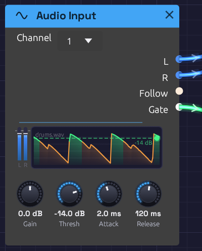

# Audio Input

**Module ID** `source.audio_input` · **Category** Source


*A drum loop coming in. Follow scrolls past the Threshold line, turning green wherever the gate opened: the kicks get through, the snares stay under.*

Audio Input brings sound from outside into the patch: a microphone, a guitar, a synth on a line input. Put your voice through the reverb, a guitar through the ladder filter and a tape delay, or let a drum loop play a synth.

Choose the device in the toolbar's **Input** menu. It starts at **None**, so Modular never opens a microphone you didn't ask it to. Every Audio Input module in the patch hears that one device; until you choose one, they're silent.

Alongside the audio, the module listens to how loud the input is. **Follow** traces the level as a control signal, and **Gate** opens when it rises above the **Threshold**, so a drum hit or a picked note can trigger envelopes.

## Outputs

| Port | Signal Type | Description |
|------|-------------|-------------|
| **L** | Audio (Blue) | The input's left side, after **Gain**. A mono microphone is heard on both **L** and **R** |
| **R** | Audio (Blue) | The input's right side, after **Gain** |
| **Follow** | Control (Orange) | How loud the input is, on a dB scale: 0 at -60 dB, 1 at full scale |
| **Gate** | Gate (Green) | High while **Follow** is above the **Threshold** |

The module has no inputs: its signal comes from the device.

## Parameters

| Knob | Range | Default | Description |
|------|-------|---------|-------------|
| **Gain** | -24 – +24 dB | 0 dB | Level of the input, before everything else. Follow and Gate hear it too |
| **Thresh** | -60 – 0 dB | -30 dB | Where the gate opens |
| **Attack** | 0.1 – 100 ms | 5 ms | How fast **Follow** rises when the input gets louder |
| **Release** | 5 – 2000 ms | 150 ms | How fast **Follow** falls when the input gets quieter |

## The display

On the left, two slim meters show the input's peaks after **Gain**, on the same scale as the Audio Output meter. Hover them for the levels in dBFS. Set **Gain** so your loudest playing stays out of the red.

On the right, the last three seconds of **Follow** scroll past, newest at the right edge. The **Threshold** lies across them as a dashed green line, and the trace turns green wherever the gate was open, so you can see which hits got through. **Drag the line** up or down to move the Threshold; the lamp at its end lights while the gate is open.

The name of the device it's listening to sits faintly in the corner.

## Follow and Gate

**Follow** is an envelope follower: it rises with the input's peaks at the **Attack** speed and falls back at the **Release** speed. Its scale is in decibels, not raw level. A whisper and a shout are 40 dB apart, which is a hundredth to one in raw level but 0.3 to 1 in Follow, so quiet and loud playing both move what it's patched to.

Short **Attack** times catch the front of a drum hit. Longer ones, 20–50 ms, smooth out the fast wiggles of a voice. **Release** sets how long Follow hangs on after a sound stops: around 100 ms for a tight pumping effect, a second or more for a slow swell.

**Gate** opens when Follow rises above the **Threshold**, and closes again only once Follow falls 6 dB below it. That gap stops the gate chattering open and shut when the level hovers right at the threshold. Because the gate follows Follow, a longer **Release** also holds the gate open longer.

## Latency and devices

Live input passes through two devices, each with its own clock and buffer: the input and the output. To keep the sound smooth, Modular holds a little audio between them, about one buffer of each. While an input is open, the status bar shows **In** and the round trip: how long a sound takes from the input jack to the speakers, often around 40 ms on Windows. Hover it for the parts that add up to it, then the device and any dropouts so far. It turns amber for a few seconds after a dropout.

| Part | Typical (Windows) | What it is |
|------|-------------------|------------|
| **Input device** | ~10 ms | The input device's own buffer: audio waits there until a packet is full |
| **Buffer** | ~20 ms | What Modular holds between the two devices to ride out their uneven timing |
| **Output device** | ~10 ms | The output device's own buffer, before the speakers play it |
| **Limiter** | 1 ms | The Audio Output limiter's look-ahead |

Each device's figure comes from the timestamps it puts on its audio. Windows doesn't time captured audio usefully, so there the input is counted as one packet, the least it can be, and the hover marks it with **~**. If a device reports nothing at all, the label gets a **+** (**In 22+ ms**): the real round trip is longer than the parts Modular can count. Neither figure includes the converters inside the interface, usually another millisecond or two each way.

- **Different sample rates are fine.** Windows often runs a microphone at 48 kHz and speakers at 44.1 kHz, even on one interface. Modular converts the input to the output's rate on the way in. For the cleanest sound, set both to the same rate in your system's sound settings; the status bar tooltip says when it's converting.
- **Changing the Output device** reopens the input at the new device's rate.
- If the input device is unplugged, the status bar shows **⚠ Input lost**. Choose it again under **Input**.
- A mono device is heard on both sides. An interface with more than two inputs gives its first two.

## Feedback

A microphone near speakers hears the speakers. Through a reverb or a delay with feedback, that can build into a howl. The first time you turn on an input while the output is speakers, the status bar says so. Use headphones, or keep the volume low. If it does run away, the Audio Output's limiter keeps it from getting dangerously loud. Press **⏹ Stop** to silence it.

## Rendering and filming

The `render` tool has no input device, so Audio Input renders silence. Give it a WAV file to hear instead with `--input`:

```bash
cargo run --release --bin render -- my-patch.json out.wav --input voice.wav
```

The file plays from the start of the render. It must be at the render's sample rate (48 kHz unless you pass `--sample-rate`). In a capture script, the cue `input voice.wav` does the same from the moment it fires.

## Patches

### Voice in a room

```text
[Audio Input L] ──> [Reverb In L]
[Audio Input R] ──> [Reverb In R]
[Reverb Out L] ──> [Audio Output Left]
[Reverb Out R] ──> [Audio Output Right]
```

Talk or sing into the microphone. Raise the Reverb's **Size** and **Decay** for a hall, or a cathedral. Use headphones.

### Guitar through a ladder filter and tape echo

```text
[Audio Input L] ──> [Ladder Filter In]
[Audio Input Follow] ──> [Ladder Filter Cutoff]
[Ladder Filter LP24] ──> [Stereo Delay In L]           (Tape on)
[Stereo Delay Out L / Out R] ──> [Audio Output Left / Right]
```

**Follow** opens the filter as you dig in, like an auto-wah: each pick attack sweeps it up, and it closes as the note decays. Start with the Ladder's cutoff low and its **Resonance** around 50%. **Attack** at 5 ms and **Release** at 200 ms give a classic quack. The tape echo then repeats each sweep, darker every time.

### Drums that play a synth

```text
[Audio Input Gate] ──> [ADSR Gate]                    (Thresh just under the kicks)
[ADSR Out] ──> [VCA CV]
[Oscillator Out] ──> [VCA In]                          (Octave -2)
[VCA Out] ──> [Audio Output Mono]
```

Play a drum loop, or hit a table near the microphone. Drag the Threshold line until only the hits you want turn green, usually the kicks. Each one fires the envelope, and a sub-bass note follows the drummer. Give the ADSR a fast attack and a short decay for a tight thump, or patch the Gate into a [Step Sequencer](../utilities/sequencer.md) to step through a bassline in time with the playing.

### Ducking a pad

```text
[Audio Input Follow] ──> [Attenuverter In]             (Amount -1, Offset 1)
[Attenuverter Out] ──> [VCA CV]
[Pad] ──> [VCA In]
```

The louder the input, the quieter the pad: it dips under each word and swells back in the gaps. That's the sidechain pumping of dance music, played by a voice or a drum loop.

## Related modules

- [Reverb](../effects/reverb.md) and [Stereo Delay](../effects/delay.md): put the input in a space
- [Ladder Filter](../filters/ladder-filter.md) and [SVF Filter](../filters/svf-filter.md): shape it, with Follow on the cutoff
- [ADSR Envelope](../modulation/adsr.md): triggered by Gate
- [Compressor](../effects/compressor.md): evens out a voice or a guitar
- [Audio Output](../output/audio-output.md): its limiter catches feedback
