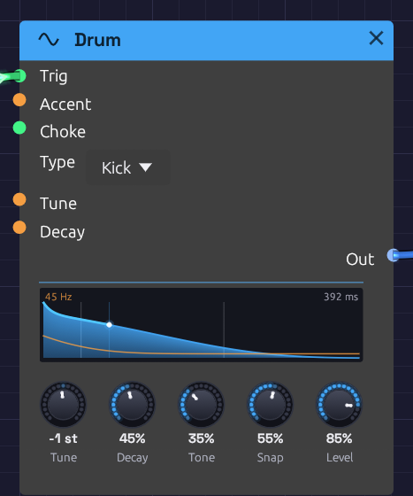

# Drum

**Module ID** `source.drum` · **Category** Source


*A kick just after a hit. The orange line is its pitch, falling two and a half octaves to 45 Hz in the first few milliseconds. The blue curve is its level, lit up to the playhead.*

Drum is one analog drum voice. Its **Type** turns it into a kick, snare, tom, clap, closed hat, open hat, cymbal, rim or cowbell, each built the way an 808 or 909 builds that sound: a few oscillators, a noise source, filters and decays. Send it a trigger and it plays one hit.

The same five knobs serve every type, and each means what it would on that drum's own panel. **Tune** sets the pitch of a kick and the metal of a hat. **Snap** sets a kick's beater and a snare's wires. The names never change, so a MIDI mapping keeps working when you change the Type.

Drum is polyphonic. A polyphonic gate, from [Poly MIDI](../midi/poly-midi.md) say, plays a new voice for each note, so fast hits ring on over each other instead of cutting each other off.

## The types

Each type has its own pitch, its own range of decay, and its own meaning for Tone and Snap. The times are how long a hit takes to fall 60 dB, from **Decay** at 0 to **Decay** at 100%.

| Type | Built from | Tune 0 | Decay | Tone | Snap |
|------|-----------|--------|-------|------|------|
| **Kick** | A sine that falls in pitch, and a beater click | 48 Hz | 0.12 – 2.5 s | Drive, from a pure sine to a rounded, 909-like thump | How far the pitch falls (half an octave to four) and how hard the beater clicks |
| **Snare** | Two drumhead tones, and noise for the wires | 185 Hz | 0.08 – 0.8 s | The wires, from dull to bright | Wires against the drum: more rattle, less tone |
| **Tom** | A sine that falls half an octave, and a stick click | 110 Hz | 0.12 – 1.8 s | Drive | The stick on the head |
| **Clap** | Four bursts of noise a few milliseconds apart, then a tail | 1150 Hz band | Tail 0.08 – 1.0 s | Narrow and dark to wide and bright | The bursts against the tail |
| **Closed Hat** | Six square waves at the 808's inharmonic ratios, ringing in a band around 6 kHz, with hiss above it | 205 – 800 Hz squares | 25 – 300 ms | Where the band sits, and how much air is over it | Hiss against metal |
| **Open Hat** | The same | The same | 0.15 – 1.8 s | The same | The same |
| **Cymbal** | The same squares through a low and a high band, a bright splash over a long wash | The same | 0.6 – 5 s | From the low band to the high | Sizzle against metal |
| **Rim** | Two tones, 1667 and 455 Hz, and a crack of noise | 1667 Hz | 15 – 200 ms | Drive | The crack |
| **Cowbell** | Two squares a sixth apart, through a bandpass | 540 and 800 Hz | 0.1 – 1.2 s | The bandpass, dark to bright | The clank of the strike over the ring |

The hats' six squares run all the time, as the 808's do. They are never caught at the same place twice, so no two hits sound exactly alike.

## Inputs

| Port | Signal Type | Description |
|------|-------------|-------------|
| **Trig** | Gate (Green) | A rising edge strikes the drum. Patch a sequencer's **Gate**, a clock, or a MIDI gate |
| **Accent** | Control (Orange) | How hard each hit is, from 0 to 1, read as the hit lands. Patch a sequencer's **Velocity**. Unpatched, every hit is full |
| **Choke** | Gate (Green) | A rising edge damps the drum within 5 ms. A choke that arrives before a hit does nothing to that hit |
| **Tune** | Control (Orange) | V/Oct, added to the **Tune** knob at each hit: 1 V is an octave |
| **Decay** | Control (Orange) | Added to the **Decay** knob at each hit |

## Outputs

| Port | Signal Type | Description |
|------|-------------|-------------|
| **Out** | Audio (Blue) | The drum. At default settings a full-accent kick peaks around -4 dBFS, and the hats and the rim sit a few dB lower |

## Parameters

| Control | Range | Default | Description |
|---------|-------|---------|-------------|
| **Type** | Kick … Cowbell | Kick | Which drum. The knobs keep their settings when it changes |
| **Tune** | ±24 st | 0 st | Pitch in semitones from the drum's own |
| **Decay** | 0 – 100% | 50% | How long it rings, over the type's own range |
| **Tone** | 0 – 100% | 50% | Dark to bright, as the table describes |
| **Snap** | 0 – 100% | 50% | The noise or click in the hit, as the table describes |
| **Level** | 0 – 100% | 80% | Output level |

**Tune**, **Decay**, **Tone** and **Snap** are read when a hit lands, as on a drum machine. A hit keeps its sound however the knobs move while it rings, and the next hit takes the new settings. **Level** follows the knob at once.

## Accent

**Accent** scales the hit's level, so at 0.4 it plays 8 to 10 dB quieter, and at 0 not at all. A softer hit is also darker and less snappy, as on a real drum: Tone drops by up to a quarter and Snap by up to half, and a soft kick falls a little less far in pitch. A ghost note on a snare is a different sound from a backbeat, not just a quieter one.

## Choke

A hi-hat is two drums that can't ring at once: closing the pedal stops the open hat. To do this, patch the closed hat's trigger into the open hat's **Choke** as well as its **Trig**:

```text
[Closed lane Gate] ──> [Drum (Closed Hat) Trig]
                  └──> [Drum (Open Hat) Choke]
[Open lane Gate]   ──> [Drum (Open Hat) Trig]
```

The open hat rings until the next closed hat lands, then dies in a few milliseconds, the way a drummer's foot shuts it. Any gate can choke any drum: a kick that chokes a long cymbal makes a cut-off crash.

A voice struck again while it's still ringing starts the new hit at once. It lets go of the old one over a millisecond or two, so a fast roll on a long kick doesn't click.

## The display

The display draws the hit the knobs will play next. The blue curve is its level. Time runs on a warped axis that is wide at the start, so a kick's 10 ms drop and a cymbal's five-second wash both fit, with faint marks at 10 ms, 100 ms and each second. The ring time is at the top right.

The orange line is pitch. For a kick, snare, tom or rim it is the fall from the strike to the drum's resting pitch, which is printed at the top left. For the hats, cymbal and cowbell it is one line per square wave, each fading as the ring dies. For a clap it marks the band the noise rings in.

When the drum is hit, the fill flashes, and a playhead travels along the curve, lighting it as it goes. The lit curve is as tall as the hit's Accent, so ghost notes and backbeats read at a glance. A choked hit drops to nothing where the choke caught it. Hover the display for the numbers.

## Patches

### A kit in a few modules

The [Drum Machine](../../recipes/drum-machine.md) example is a whole kit in 14 modules: a Clock, five sequencer lanes, five Drums, a Mixer, a Reverb and the Output. Each sequencer's **Gate** goes to its Drum's **Trig** and its **Velocity** to **Accent**.

### Tuned toms, or a cowbell melody

```text
[Sequencer Pitch]    ──> [Drum (Tom) Tune]
[Sequencer Gate]     ──> [Drum (Tom) Trig]
[Sequencer Velocity] ──> [Drum (Tom) Accent]
```

Each step's note sets the tom's pitch, with middle C at the Tune knob's pitch. Set the Type to **Cowbell** for the classic 808 cowbell line, or to **Kick** with a long **Decay** for an 808 bass.

### A layered snare

Patch one sequencer's **Gate** into two Drums, a Snare and a Clap, and mix them. The clap's bursts sit on top of the snare's crack. Turn the clap's **Snap** down so only its tail comes through, as a short room.

### Rolls and flams

From a [Poly MIDI](../midi/poly-midi.md) module, two notes very close together each get a voice, so a flam rings as two hits rather than one cut short. A Clock at 1/16 with a high **Swing** into **Trig** makes a shuffled roll. Patch a falling envelope into **Decay** and the roll tightens as it goes.

## Related modules

- [Trigger Sequencer](../utilities/trigger-sequencer.md): a whole kit's hits from one module, a lane per Drum, with velocity for Accent
- [Step Sequencer](../utilities/sequencer.md): one lane of hits, with velocity for Accent and pitch for Tune
- [Clock](../modulation/clock.md) and [Clock Divider](../utilities/divider.md): the pulses that play it
- [Noise](./noise.md) and [Oscillator](./oscillator.md): build your own drum from parts, as the [Backbeat](../../recipes/backbeat.md) example does
- [Mixer](../utilities/mixer.md): pans each drum to its place and shares a reverb among them
