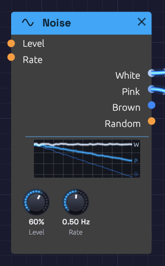

# Noise

**Module ID** `source.noise` · **Category** Source


*White and Pink are patched, so their lines are lit; Brown, unpatched, is dimmed.*

Noise is a sound with no pitch: every frequency at once, at random. Through a filter and an envelope it becomes a snare, a hi-hat, a breath, wind or surf. Sampled by a clock, it becomes a melody that never repeats.

The module makes three colours of noise, and a fourth output that wanders smoothly at modulation speed:

- **White**: equal energy at every frequency. Bright, hissing, like steam or an untuned radio.
- **Pink**: falls 3 dB per octave, so every octave holds the same energy. To the ear it is the most balanced noise: rain, surf, a waterfall.
- **Brown**: falls 6 dB per octave. A deep, soft rumble, like wind or thunder far away. The name is for Robert Brown, whose random walk of pollen grains it imitates, not the colour.
- **Random**: a smooth random voltage that glides to a new value **Rate** times a second.

Noise is polyphonic. Patch a polyphonic cable into **Level** or **Rate** and each voice plays noise of its own, so a four-note chord of filtered noise is four different hisses, not one copied four times.

## Inputs

| Port | Signal Type | Description |
|------|-------------|-------------|
| **Level** | Control (Orange) | Added to the **Level** knob. An envelope here, with the knob at 0, shapes the noise into a hit |
| **Rate** | Control (Orange) | Speeds up or slows down **Random**. Each +1 doubles the rate; -1 halves it |

## Outputs

| Port | Signal Type | Description |
|------|-------------|-------------|
| **White** | Audio (Blue) | White noise, spread evenly over ±1 at full Level |
| **Pink** | Audio (Blue) | Pink noise, about -12 dBFS RMS at full Level |
| **Brown** | Audio (Blue) | Brown noise, about -12 dBFS RMS at full Level |
| **Random** | Control (Orange) | A smooth random voltage between -1 and 1. **Level** doesn't affect it |

## Parameters

| Knob | Range | Default | Description |
|------|-------|---------|-------------|
| **Level** | 0 – 100% | 50% | Level of White, Pink and Brown |
| **Rate** | 0.01 – 20 Hz | 1 Hz | How many new values **Random** glides to each second |

## The display

The display draws the three noises the way a spectrum analyzer would read them, on a frequency axis from 20 Hz to 20 kHz. All three start from one point at the low end and fan out: **W** stays flat, **P** falls gently and **B** falls twice as steeply. The lines shimmer as a real reading of noise does, most at the low end, where an analyzer has fewer frequencies to average in each octave.

Patched outputs light up and unpatched ones dim, so you can see at a glance which noise a patch is using. The lines sink as **Level** comes down.

## Levels

White uses the whole ±1 range, so it makes a full-range random source for [Sample & Hold](../utilities/sample-hold.md). Pink and Brown are set about 7 dB lower, so their rare peaks stay inside ±1. A gentle ceiling holds those peaks in without touching anything below 0.8.

Brown is a *leaky* random walk: it rises 6 dB per octave as frequency falls, down to about 10 Hz, then levels off. That keeps it from drifting away from zero and pushing your speakers with a slow offset.

## Random

**Random** picks a new value between -1 and 1 **Rate** times a second, and glides to it along a cosine curve. It arrives at each value at rest and leaves it smoothly, so it has no corners. It sounds less like a stepped sample-and-hold and more like something drifting: a filter that breathes, or a pitch that wavers like an old tape.

At 0.05 Hz it takes twenty seconds to move, which is slow enough to change the character of a whole pad over time. At 10–20 Hz it becomes a fast flutter.

## Patches

### Random melody

The classic: noise, sampled on every clock pulse, played as pitch.

```text
[Clock Gate] ──> [Sample & Hold Trig]
[Noise White] ──> [Sample & Hold In]
[Sample & Hold Out] ──> [Oscillator V/Oct]
[Clock Gate] ──> [ADSR Gate]
```

Each pulse catches a new value of the noise and holds it as a note. **Level** sets the range: at 50%, the notes wander up to half an octave either side of the oscillator's pitch. The pitches are unquantized, so they fall between the keys of a piano. A little **Slew** on the Sample & Hold turns the jumps into glides.

### Hi-hat

```text
[Noise White] ──> [SVF Filter In]               (Cutoff 8 kHz, take HighPass)
[SVF Filter HighPass] ──> [VCA In]
[Clock Gate] ──> [ADSR Gate]                    (Atk 1 ms, Dec 40 ms, Sus 0, Rel 40 ms)
[ADSR Out] ──> [VCA CV]
```

A short decay gives a closed hat; lengthen **Dec** and **Rel** to 300 ms for an open one.

### Snare

Mix a short burst of noise with a pitched body. Patch Pink through a bandpass around 2 kHz, open it with a 120 ms decay, and add a sine at 180 Hz with a shorter envelope. The noise is the snare wires; the sine is the drum.

### Wind and surf

```text
[Noise Pink] ──> [SVF Filter In]                (Res 60%, take BandPass)
[Noise Random] ──> [SVF Filter Cutoff]          (Noise Rate 0.1 Hz)
```

Random sweeps a resonant band slowly through the noise, so it rises and falls like gusts. Use Brown for a deeper, more distant wind. Put a slow LFO on a VCA after it, at about 0.1 Hz, and the swell of waves comes and goes.

## Related modules

- [Sample & Hold](../utilities/sample-hold.md): turns noise into stepped random values
- [SVF Filter](../filters/svf-filter.md): shapes noise into drums, wind and breath
- [ADSR Envelope](../modulation/adsr.md): gives noise a shape in time
- [LFO](../modulation/lfo.md): regular movement, where Random is irregular
