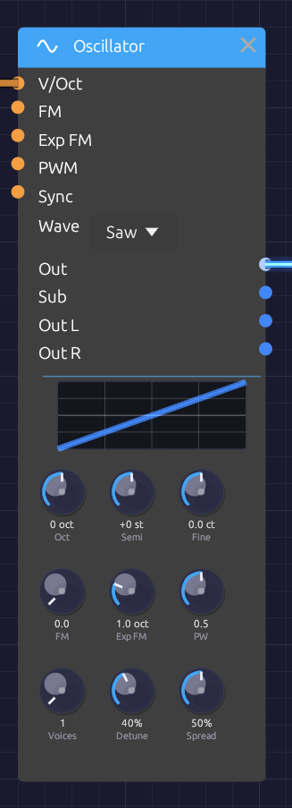

# Oscillator

**Module ID** `osc.sine` · **Category** Source


*The tune, timbre and ensemble rows, under a preview of the selected waveform.*

The Oscillator is the main sound source in Soba. It is a **VCO** (voltage-controlled oscillator): a tuned waveform whose pitch follows a keyboard, an LFO or another oscillator.

Beyond the four classic waveforms, it has the features that make an oscillator an instrument:

- a **tune section** in octaves, semitones and cents;
- **hard sync** to another oscillator;
- **through-zero linear FM** and **exponential FM**;
- a **sub-oscillator** one octave down;
- **unison** of up to seven voices, with stereo spread. Seven detuned saws is the classic *supersaw*.

Every waveform is band-limited. Each voice runs at twice the sample rate with polyBLEP corrections on its edges and polyBLAMP corrections on its corners, then a halfband filter brings it back down. A 5 kHz saw's aliasing sits around -80 dB, so high notes and sync sweeps stay clean.

## Inputs

| Port | Signal Type | Description |
|------|-------------|-------------|
| **V/Oct** | Control (Orange) | Pitch, 1 per octave. Each +1.0 raises the pitch one octave, on top of the tune section |
| **FM** | Control (Orange) | Through-zero linear FM, scaled by the **FM** knob |
| **Exp FM** | Control (Orange) | Exponential FM, **Exp FM** knob octaves per unit |
| **PWM** | Control (Orange) | Pulse-width modulation around the **PW** knob (±1 moves it ±0.4) |
| **Sync** | Control (Orange) | Hard sync. Each rising zero crossing restarts the cycle. Accepts audio, control or gates |

## Outputs

| Port | Signal Type | Description |
|------|-------------|-------------|
| **Out** | Audio (Blue) | All unison voices, mixed to mono |
| **Sub** | Audio (Blue) | Square wave one octave below the tuned pitch |
| **Out L** | Audio (Blue) | Unison voices spread to the left |
| **Out R** | Audio (Blue) | Unison voices spread to the right |

## Parameters

The knobs sit in three rows: **tune**, **timbre** and **ensemble**.

| Control | Range | Default | Description |
|---------|-------|---------|-------------|
| **Oct** | -4 to +4 | 0 | Octaves above or below C4. Clicks in whole octaves |
| **Semi** | -12 to +12 | 0 | Semitones. Clicks in whole semitones |
| **Fine** | ±100 cents | 0 | Fine tuning |
| **FM** | 0 – 5 | 0 | Linear FM index (see below) |
| **Exp FM** | 0 – 4 oct | 1 | Octaves of pitch change per unit at the Exp FM input |
| **PW** | 0.1 – 0.9 | 0.5 | Pulse width of the square (0.5 is a 50% duty cycle) |
| **Voices** | 1 – 7 | 1 | Unison voices |
| **Detune** | 0 – 100% | 40% | How far apart the unison voices are tuned |
| **Spread** | 0 – 100% | 50% | How wide the unison voices sit across Out L and Out R |
| **Wave** | Sine / Saw / Square / Tri | Sine | Dropdown on the node |

With every tune knob at 0, the oscillator plays **C4 (261.63 Hz)**. The keyboard and MIDI modules send 0.0 for C4, so they play in tune with nothing else to set. MIDI note 69 plays 440 Hz to within a tenth of a cent.

Pitch is smoothed in octaves, not Hz, so a jump of an octave up takes as long as an octave down.

## Waveforms

The preview at the top of the node draws one cycle of the selected waveform, and follows the **PW** knob on the square.

- **Sine** is a pure tone with no harmonics: sub-bass, FM carriers and modulators, flute-like tones.
- **Saw** has every harmonic, falling as 1/n: classic leads and basses, strings, brass. It is the richest source for filtering, and the one to use for a supersaw.
- **Square** has odd harmonics only, for hollow, woody, clarinet-like tones. Pulse width reshapes it, from the square at 0.5 to thin and nasal near 0.1 or 0.9.
- **Tri** (triangle) has odd harmonics that fall away fast: softer than the square, brighter than the sine.

## Tune section

**Oct** and **Semi** set the note; **Fine** trims it in cents. To tune a second oscillator a fifth up, set **Semi** to +7. To make it beat slowly against the first, add a few cents of **Fine**.

## Hard sync

Patch another oscillator's **Out** into **Sync**:

```text
[Osc 2 Out] ──> [Osc 1 Sync]
```

Every time Osc 2's waveform rises through zero, Osc 1 starts its cycle again. The result repeats at Osc 2's pitch, but its tone comes from Osc 1's pitch. Tune Osc 1 above Osc 2 and sweep its pitch (a slow LFO or envelope on **V/Oct** or **Exp FM**) for the classic tearing sync sweep.

The reset itself is band-limited, so sync sweeps don't fizz with aliasing.

## Through-zero FM

The **FM** input multiplies the pitch by `1 + FM × input`, where FM is the knob:

- At an FM of 1, an input of -1 just reaches 0 Hz.
- Past 1, the frequency swings *through* zero and the waveform runs backward for a moment, instead of stalling at 0 Hz.

That keeps the average pitch where it was, so deep FM stays in tune and keeps the bright, glassy character of DX-style FM. Because the depth is relative to the pitch, the timbre stays the same as you play up the keyboard.

```text
[Osc 2 Out] ──> [Osc 1 FM]
[Osc 1 Out] ──> [VCA In] ──> [Audio Output]
```

- Sine into sine gives the cleanest FM tones.
- Whole-number pitch ratios (Semi +12, or +19 for 3:1) sound harmonic.
- Other ratios sound bell-like and metallic.
- Shape the modulator's level with an envelope (through a VCA) to make the brightness decay like a struck bell.

The [FM Synthesis](../../recipes/fm-synthesis.md) recipe builds a complete patch around this.

## Exponential FM

**Exp FM** works like a second V/Oct input with its own depth knob. An LFO into it gives a vibrato that's even in pitch: the same width in cents on every note. Keep the depth small (Shift-drag the knob for fine steps): 0.02 octaves is about ±24 cents. At audio rates it gives a rougher, less pitch-stable kind of FM than the linear input.

## Sub-oscillator

**Sub** is a square wave one octave below the tuned pitch. It divides the main oscillator's own cycle, so it follows V/Oct, FM and sync. Mix it in under a saw for weight:

```text
[Oscillator Out] ──> [Mix In 1]
[Oscillator Sub] ──> [Mix In 2]
[Mix Out] ──> [Ladder Filter In]
```

## Unison and supersaw

**Voices** stacks copies of the oscillator, each slightly detuned:

- **Detune** sets how far apart they are. Its curve is gentle at the bottom: 20% puts the outer voices about ±4 cents apart, 40% about ±16 cents, and 100% a full ±100 cents.
- The voices bunch toward the middle, close to Roland's JP-8000 supersaw. The spacing is deliberately uneven, so the voices never beat in lockstep.
- Each voice starts at a different point in its cycle, so the stack doesn't open with one loud spike.
- **Out** sums all the voices at about the loudness of one voice.
- **Out L** and **Out R** pan the voices across the stereo field, outer voices widest. **Spread** sets the width.

For a supersaw: **Wave** on Saw, **Voices** at 7, **Detune** about 40%, and **Out L** and **Out R** into the output's **Left** and **Right**.

## Pulse-width modulation

With the square wave selected, modulate the pulse width with an LFO:

```text
[LFO Out] ──> [Oscillator PWM]
```

Slow rates give a chorus-like shimmer; fast rates, a more dramatic wobble in the tone.

## Patch examples

### Sync lead

```text
[Keyboard Pitch] ──> [Osc 2 V/Oct]
                 ──> [Osc 1 V/Oct]   (Osc 1 Oct +1)
[Osc 2 Out] ──> [Osc 1 Sync]
[ADSR Out] ──> [Osc 1 Exp FM]
[Osc 1 Out] ──> [SVF Filter In]
```

Each note sweeps Osc 1's pitch up with the envelope, while sync holds it to Osc 2's pitch.

### Supersaw pad

```text
[Keyboard Pitch] ──> [Oscillator V/Oct]   (Saw, 7 voices)
[Oscillator Out L] ──> [Reverb In L]
[Oscillator Out R] ──> [Reverb In R]
[Reverb Out L] ──> [Audio Output Left]
[Reverb Out R] ──> [Audio Output Right]
```

## Polyphony

The Oscillator is polyphonic. Patch a polyphonic **Pitch** cable from [Poly MIDI](../midi/poly-midi.md) into **V/Oct** and each note gets its own oscillator, with its own phase, sync and unison stack. The knobs are shared by every voice. Unison multiplies the cost: eight notes of a seven-voice supersaw is 56 oscillators. See [Polyphony](../../concepts/polyphony.md).

## Notes

- **Older patches** load at the same pitch. Their Frequency setting is split into Oct, Semi and Fine. FM Depth, which used to be in Hz, becomes the matching index at that pitch. A MIDI controller mapped to Frequency moves to Oct over the same range. The old *Frequency* input jack is gone; a cable into it is skipped with a load warning.
- Band-limited edges overshoot a little. Saw and square peak at about 1.3 for a few samples after each edge. This is ringing near 24 kHz, which is inaudible, and any filter or the output stage takes it away.
- The tune section reaches from about 7.7 Hz to 8.9 kHz. Use V/Oct or Exp FM to go further.

## Related modules

- [LFO](../modulation/lfo.md) for vibrato and PWM
- [SVF Filter](../filters/svf-filter.md) to shape the oscillator's harmonics
- [Ladder Filter](../filters/ladder-filter.md), the fat, saturating 24 dB alternative
- [VCA](../utilities/vca.md) and [ADSR Envelope](../modulation/adsr.md) to turn a tone into notes
