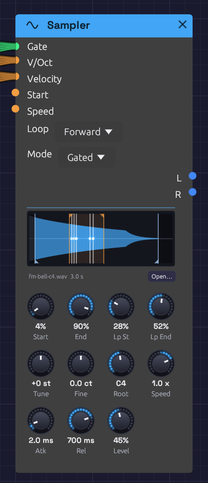

# Sampler

**Module ID** `source.sampler` · **Category** Source


*A five-note chord on a looped bell. The orange flags mark the loop and the blue ones what plays. Each white line is a voice, circling inside the loop at its own speed.*

Sampler plays a WAV file. Patch a gate in and it plays one-shots: a kick under a sequencer, a vocal chop, a door slam. Patch in V/Oct as well and a polyphonic gate, and it becomes an instrument: one recorded note spread across the keyboard, each key playing it at its own pitch.

Every other sound in Soba is synthesized. The Sampler brings in sound you've recorded, or one Soba rendered itself, and keeps it with the patch.

## Loading a file

- Click **Open…** under the waveform, or click an empty Sampler's display, and choose a WAV.
- Drag a WAV from your file manager onto a Sampler to replace its file. Drop one on empty canvas and a new Sampler appears there, already playing it. The node lights up under the file while you drag, to show where it will land.
- In the browser, drag a file onto the page the same way.

Loading a file is a step you can undo. A file is read and converted once. Samplers that play the same file share it.

## Inputs

| Port | Signal Type | Description |
|------|-------------|-------------|
| **Gate** | Gate (Green) | A rising edge starts a note. In **Gated** mode the falling edge lets it go. A polyphonic gate plays a voice per channel |
| **V/Oct** | Control (Orange) | Pitch, 1 V an octave. 0 V (C4) plays the **Root** note: the recording as it was made. Read all the time, so pitch bend and glide work |
| **Velocity** | Control (Orange) | Each note's level, 0 to 1, read as the note starts. Unpatched, every note is full |
| **Start** | Control (Orange) | Added to the **Start** knob as each note begins. 1 V is the whole recording |
| **Speed** | Control (Orange) | Added to the **Speed** knob while the note plays, as on tape: pitch follows, and below zero it plays backwards |

## Outputs

| Port | Signal Type | Description |
|------|-------------|-------------|
| **L** | Audio (Blue) | The left channel. A mono file plays the same on both outputs |
| **R** | Audio (Blue) | The right channel |

Both outputs carry a channel per voice when the gate is polyphonic.

## Parameters

| Control | Range | Default | Description |
|---------|-------|---------|-------------|
| **Loop** | Off, Forward, Ping-Pong | Off | Off plays once. Forward jumps from Loop End back to Loop Start. Ping-Pong plays back and forth between them |
| **Mode** | One-Shot, Gated | One-Shot | One-Shot plays to the end whatever the gate does. Gated lets go when the gate falls |
| **Start** | 0 – 100% | 0% | Where notes start, through the recording |
| **End** | 0 – 100% | 100% | Where notes end |
| **Lp St** (Loop Start) | 0 – 100% | 0% | Where the loop begins. Kept between Start and End |
| **Lp End** (Loop End) | 0 – 100% | 100% | Where the loop turns back. Kept between Start and End |
| **Tune** | ±24 st | 0 st | Transpose in semitones |
| **Fine** | ±100 cents | 0 | Fine tuning |
| **Root** | C-1 – G9 | C4 | The note the recording was made at. Playing it plays the recording unchanged |
| **Speed** | −2 – 2× | 1× | Tape speed. 2 is twice as fast and an octave up, 0.5 half as fast and an octave down, and below 0 plays backwards |
| **Atk** (Attack) | 1 ms – 2 s | 2 ms | How long each note takes to fade in |
| **Rel** (Release) | 1 ms – 5 s | 10 ms | How long a note takes to fade out once let go |
| **Level** | 0 – 100% | 80% | Output level |

The four region knobs sit in the top row, under the waveform where their markers are. You can drag the markers instead of the knobs.

## Playing it

### One-shots

Patch a sequencer's **Gate** into **Gate**, and its **Velocity** into **Velocity**. Leave **V/Oct** unpatched and every hit plays at the recording's own pitch. **One-Shot** mode plays each hit to the end, however short the gate.

### Across the keyboard

Patch [Poly MIDI](../midi/poly-midi.md)'s **Pitch**, **Gate** and **Velocity** into **V/Oct**, **Gate** and **Velocity**, and set **Root** to the note the file was recorded at. Each key plays the recording faster or slower: an octave up is twice as fast and half as long, as on tape. Set **Mode** to **Gated** so that letting go of a key lets its note go, over **Rel**.

### Pitch and speed

Pitch and speed are one thing here, as on a tape machine. **Tune**, **Fine**, **Root**, **V/Oct** and **Speed** all set how fast the recording is read, and so how high it sounds and how long it lasts. A recording made at a different sample rate from your audio device still plays at its own pitch.

At negative **Speed** a note plays backwards, starting at **End** and finishing at **Start**. A Speed that changes sign mid-note turns the note around where it is: an LFO into **Speed** scratches, and an envelope that falls to zero is a tape stop.

## What plays

**Start** and **End** set the part of the recording a note plays. The rest of the waveform sinks into the background. A note fades out over its last 3 ms, so a recording cut mid-sound doesn't click at the end.

With **Loop** on, a note plays from **Start** to **Lp End**, then goes round. **Forward** jumps back to **Lp St**. **Ping-Pong** turns around and plays backwards to **Lp St**, then forwards again. A loop over whole cycles of a steady sound is seamless. Elsewhere, set the loop points where the waveform crosses zero, or use Ping-Pong, which never jumps.

In **Gated** mode a looping note keeps looping through its release, then fades. In **One-Shot** mode a looping note never ends. It plays until a new note takes its voice or the transport stops. That's a drone: a field recording slowed down an octave, looping forever.

## Voices

Sampler is polyphonic. Each channel of the **Gate** cable is a voice of its own, with its own pitch, velocity and place in the recording. [Poly MIDI](../midi/poly-midi.md) hands each new note the next voice. When all its voices are busy, it takes the oldest note's voice, which lets go of the old note over 5 ms as the new one starts. Retriggering a note that's still sounding does the same, so fast repeated notes never click.

Loading a new file while notes play fades them out over 5 ms. The next notes play the new file.

## The display

The waveform shows the whole recording, scaled to fill the panel. What plays is lit blue, and the loop is washed orange. **Start** and **End** have blue flags at the foot, and the loop points orange flags at the head. Drag any of them like a knob. Hover a marker to see what it is, or the waveform to see the file's path, length and format.

Every voice draws a white playhead where it is in the recording, as bright as it is loud. A chord is several lines moving at their own speeds, and a released note fades where it stands.

Under the waveform are the file's name and length. A file that can't be found shows its name in orange. An empty Sampler asks for a file.

## Files and patches

The Sampler plays WAV files: 8-, 16-, 24- or 32-bit integer, or 32-bit float. Mono files play on both sides. Files with more than two channels play their first two. Each file is resampled to your audio device's rate when it loads, and again if the device's rate changes.

A Sampler keeps up to **five minutes** of audio, about 115 MB of stereo at 48 kHz. A longer file is cut to its first five minutes, and the status bar says so.

A patch saves each Sampler's file as a path:

- **Beside or below the patch**, the path is relative: `samples/kick.wav`. Move or zip the patch's folder and it still finds its samples.
- **Elsewhere**, the path is absolute: `C:/Music/choir.wav`.

**Save As** copies samples from outside the patch's folder into a folder beside it named `<patch name> samples`, and points the patch at the copies. The patch's folder then holds everything it needs to be shared. If the samples come to more than 50 MB, it asks first. Saving an example works the same way, so its samples come with the copy.

A patch whose sample is missing still opens. The Sampler keeps the path but plays nothing, and the status bar lists the missing file with the other load warnings. Open the file again to fix it.

In the patch file, the path is the module's `file` field. Modules without a file leave it out, so patches from before the Sampler read and save as they always did:

```json
{
  "id": 2,
  "module_id": "source.sampler",
  "position": [300.0, 74.0],
  "parameters": [{ "name": "Mode", "type": "Select", "value": 1 }],
  "file": "samples/fm-bell-c4.wav"
}
```

The [`render`](../../getting-started/installation.md#command-line) tool finds a patch's samples the same way, relative to the patch file.

### Sound quality

Voices read between samples on a cubic (Hermite) curve. That's clean at ordinary speeds and pitches. Played more than an octave or so above its root, a bright recording begins to alias: its highest harmonics fold back as a faint metallic edge. Record the sample nearer the range you'll play it in, or filter it after the Sampler.

## Patches

### Sampled keys

The [Sampled Keys](../../recipes/sampled-keys.md) example plays a bell across the keyboard: one strike of the FM Synthesis example, rendered by Soba and loaded into a Sampler.

### A drum kit from recordings

```text
[Trigger Sequencer Gate 1] ──> [Sampler (kick.wav) Gate]
[Trigger Sequencer Vel 1]  ──> [Sampler (kick.wav) Velocity]
[Trigger Sequencer Gate 2] ──> [Sampler (snare.wav) Gate]
...
```

One Sampler per sound, each in **One-Shot** mode, into a [Mixer](../utilities/mixer.md) to place them. Mix them with [Drum](./drum.md) voices for a kit that's part recorded and part synthesized.

### A drone from anything

Load a long recording (rain, a room, a held note) and set **Speed** to 0.5, **Loop** to **Ping-Pong** with the loop over a steady stretch, **Atk** to 2 s and **Mode** to **One-Shot**. One gate starts a drone an octave down that never ends. Two Samplers on the same file, one at **Speed** 0.5 and one at 0.749 (a fifth above it), make a chord.

### Scrubbing

Patch a slow [LFO](../modulation/lfo.md) into **Start**, and a Clock into **Gate**. Each note starts a little further into the recording, so a spoken phrase or a melody comes out in stutters that wander through it.

## Related modules

- [Poly MIDI](../midi/poly-midi.md): plays the Sampler as an instrument, a voice per key
- [Trigger Sequencer](../utilities/trigger-sequencer.md) and [Step Sequencer](../utilities/sequencer.md): one-shots in time
- [Audio Input](./audio-input.md): outside sound live, as it happens, where the Sampler plays it back from a file
- [Drum](./drum.md): synthesized drums to sit beside recorded ones
