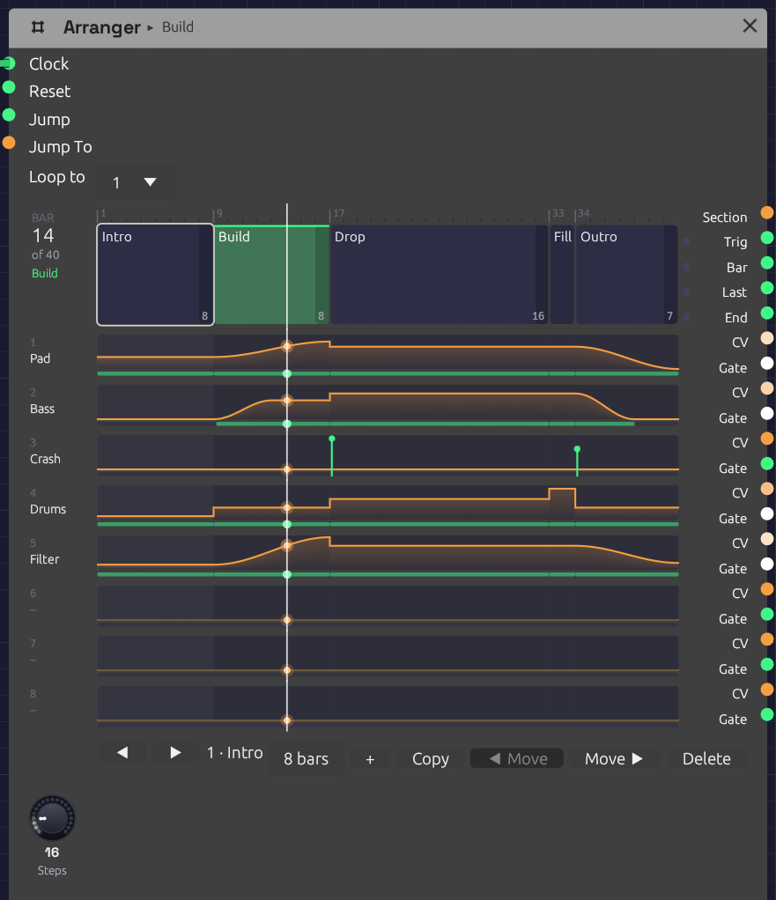

# Arranger

**Module ID** `seq.arranger` · **Category** Utility

*A five-section song, playing its Build. Each section is a block as wide as its bars, and each lane's level runs under them as an orange line, with a green strip wherever its gate is high. The ticks on the Crash lane are Hits. The white line is the playhead.*

The Arranger is a song's timeline. It holds up to 32 named **sections**, each some bars long, played in order, and eight **lanes** of automation that the sections move. A lane can ride a part's fader, pick a drum pattern, open a filter over a build or press a Looper's button, and each section says what it does when the section starts: hold, jump, ramp or hit.

It counts bars from a [Clock](../modulation/clock.md), like the sequencers, so the song stays in step with everything else the Clock drives. Press **▶ Play** and it starts from the first section.

## Inputs

| Port | Signal Type | Description |
|------|-------------|-------------|
| **Clock** | Gate (Green) | Each rising edge is a step, and **Steps** of them make a bar. Patch the Clock that drives the sequencers |
| **Reset** | Gate (Green) | A rising edge starts over: the next clock starts section 1 |
| **Jump** | Gate (Green) | A rising edge goes to the section **Jump To** picks, at the next bar line |
| **Jump To** | Control (Orange) | The section a Jump goes to, as its number ÷ 32 (section 1 is 0, section 5 is 4/32). It reads the same as the **Section** output |

## Outputs

| Port | Signal Type | Description |
|------|-------------|-------------|
| **Section** | Control (Orange) | The section playing, its index ÷ 32 |
| **Section Trig** | Gate (Green) | A trigger on each section's downbeat |
| **Bar** | Gate (Green) | A trigger on every bar's downbeat |
| **Last Bar** | Gate (Green) | High through each section's final bar, for a fill |
| **End** | Gate (Green) | A trigger when the last section finishes, whether the song loops or stops |
| **Lane 1** – **Lane 8** | Control (Orange) | Each lane's level, 0 to 1. A ramp is smooth enough to drive a [Mixer](./mixer.md)'s **Level** directly |
| **Gate 1** – **Gate 8** | Gate (Green) | High while the lane is above zero, and for a moment on each Hit |

Triggers last half a step.

## Parameters

| Control | Range | Default | Description |
|---------|-------|---------|-------------|
| **Steps** | 1 – 96 | 16 | How many clocks make a bar: 16 for a Clock at 1/16 in 4/4, 12 for 3/4 |
| **Loop to** | Off, 1 – 32 | 1 | The section to go back to after the last one, or **Off** to stop there |

The sections, their names and lengths, the lanes' names and glides, and every section's cue for every lane are edited on the timeline, and patches save them.

## Writing a song

The song runs left to right across the node. Each section is a block as wide as its share of the bars, though a short one keeps enough room to click. The blocks sit beside the song's own jacks: Section, Trig, Bar, Last and End. Each lane is drawn on the two rows its **CV** and **Gate** jacks hang from, so a lane reads straight across into its cables.

A lane is named for what its cable drives (a Mixer's **Level 2**, say) until you give it a name. The bar count at the top left shows where the song is, and the section playing is lit green, with its name in the header too.

- **Click** a section to pick it. The bar under the timeline shows it.
- **Double-click** a section to rename it. Press Enter to keep the name, or Escape to leave it.
- **Drag** a lane up or down inside a section to set the level that section takes it to. A section that held the lane now jumps it.
- **Right-click** a lane inside a section for how it gets there (see [Cues](#cues)), its level, and a ramp's length.
- **Double-click** a lane's name to rename it. **Right-click** it to set its **Glide**, or to clear it.
- **Right-click** a section for its length, and to add, copy, move or delete it.

The bar under the timeline does the same for the section you picked. **◀** and **▶** step through the sections. The bars field sets its length. **+** adds a blank section after it, and **Copy** adds a copy. **◀ Move** and **Move ▶** swap it with its neighbours, and **Delete** takes it out. **Loop to** follows the section it named when sections move.

A section's final bar is shaded, since that's where a fill goes. Every edit is one step of [undo](../../getting-started/interface-overview.md#the-toolbar), named for what it did ("Groove · Pad jumps to 48%").

## Cues

Each section gives each lane one of four cues as the section starts:

| Cue | What the lane does |
|-----|--------------------|
| **Hold** | Carries on as it was. If it was ramping, the ramp carries on. A new section holds every lane |
| **Jump** | Goes straight to the level, on the downbeat |
| **Ramp** | Glides from wherever it is to the level, over the whole section or over a number of bars. A ramp longer than its section carries on through the sections after it that hold |
| **Hit** | Goes to the level for half a step, then back: a trigger, with the level riding on the CV, for a Drum's **Trig** and **Accent** or a Looper's **Rec** |

A ramp follows an S-curve: it leaves gently and arrives gently. That makes a Mixer's **Level** fade without a click, however slow or quick the ramp.

### The gate

A lane's **Gate** is high while the lane is above zero. One lane can therefore be a part's level and its envelope's gate at once. A riser that jumps to 30% for a section and back to 0 is heard for that section and gated for exactly as long.

When a Jump or Hit lands while the gate is already high, the gate drops for one sample first, so an envelope starts again. A ramp up from zero opens the gate as it leaves zero.

### Glide

A Jump moves on one sample, and a Mixer's **Level** adds its CV without smoothing, so a jump under a ringing note clicks. **Glide** smooths the lane's CV: it's how long the CV takes to move all the way from 0 to 1, so 1 s brings a half-way fader up in half a second, the same as a [Sample & Hold](./sample-hold.md)'s **Slew**. A second or so suits a pad, and 40 ms keeps a rhythmic part on the beat while still saving its tails. The gate follows the cue, not the glide.

Leave **Glide** at 0 on a lane that picks something: a [Trigger Sequencer](./trigger-sequencer.md)'s or [Step Sequencer](./sequencer.md#pattern-cv)'s **Pattern**, say. The sequencer reads the CV on the downbeat, the same sample the lane jumps on, and a glide would still be on its way there.

## Timing

The Arranger has no tempo of its own. It counts clock edges: a bar is **Steps** of them, and a section is its length in bars. It changes section on the clock edge that starts the section's first bar, the same edge the sequencers step on, so it can't drift from them, swing or not.

A ramp moves between clock edges too, smoothly. It measures each step from the clock, as the sequencers do, so on a swung clock it moves a little faster through the short steps. It still lands on the clock edge that ends it.

Before the Arranger has seen two clock pulses it can't measure a step. For the first triggers it assumes a sixteenth at the patch's tempo, or at 120 BPM if nothing sets one.

### Looping, ending and jumping

After the last section, the song goes back to **Loop to**, and **End** fires. With **Loop to** off, **End** fires and the song stops where it is. The lanes keep their last levels, and the bars stop counting, until a Reset, a Jump or the next Play.

**Jump** waits for the next bar line, so a live change of section always lands on the beat. Patch a button, a [Keyboard](../midi/keyboard.md) gate or a [Logic](./logic.md) decision into **Jump**, and a constant or a [Sample & Hold](./sample-hold.md) into **Jump To**. While a Jump waits, the section it's going to is outlined green.

## How patches store it

Every section's cue for every lane is one parameter, named for both: `Section 03 Lane 2` is section 3's cue for lane 2. Its value reads as digits, **move**, **ramp bars** and **level** in tenths of a percent:

| Value | Cue |
|-------|-----|
| `0` | Hold |
| `1000700` | Jump to 70% |
| `2000500` | Ramp to 50% over the section |
| `2080250` | Ramp to 25% over 8 bars |
| `3000850` | Hit at 85% |

The sections' lengths are `Length 01` to `Length 32`, the lanes' glides `Glide 1` to `Glide 8`, and **Sections** is how many sections the song has. The names you give sections and lanes are saved with the module as labels.

## Tips

1. **Faders at zero.** On a [Mixer](./mixer.md), set a channel's **Level** knob to 0 and patch a lane into its **Level** input. The lane then is the fader.
2. **Fills.** Either give each phrase a one-bar **Fill** section that jumps the drum lane to the fill pattern, or patch **Last Bar** into something that plays a fill.
3. **Two Arrangers, one song.** Arrangers on the same Clock play in lockstep. When eight lanes aren't enough, give a second Arranger the same sections. [From One Sine](../../recipes/from-one-sine.md) splits its score into faders and cues this way.
4. **Pedals.** Hit a Looper's **Rec** at the start of a section to record it, and its **Clear** at the top of the song so each pass starts fresh.
5. **A brightness lane.** Ramp a lane over a build and patch it through an [Attenuverter](./attenuverter.md) into filter cutoffs or drive amounts: the whole build opens up together.
6. **A shorter song.** Set **Loop to** a later section, and the intro plays only once.

## Related

- [From One Sine](../../recipes/from-one-sine.md) – a whole song on two Arrangers: eight faders, and the drums, crash, riser, brightness and Looper pedals
- [Trigger Sequencer](./trigger-sequencer.md) – patterns for an Arranger lane to pick
- [Mixer](./mixer.md) – the faders a lane rides
- [Clock](../modulation/clock.md) – tempo and swing
- [Clock Divider](./divider.md) – phrases without a timeline
