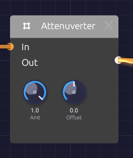

# Attenuverter

**Module ID** `util.attenuverter` · **Category** Utility


*Amount scales and flips the input; Offset slides the result up or down.*

An attenuverter turns a signal down, turns it upside down, or both. The name joins *attenuate* and *invert*. It also has an **Offset** knob that adds a fixed value afterwards. Between them, the two knobs adapt one module's output to what another module's input expects. Use it to tame an LFO that swings too wide, to make an envelope close a filter instead of opening it, or to turn a 0–1 signal into a -1–1 one.

With nothing patched into **In**, the output is just the Offset: a steady, hand-set control value you can patch anywhere.

The Attenuverter is polyphonic. Each channel of a polyphonic cable is scaled on its own, with the same knob settings.

## Inputs

| Port | Signal Type | Description |
|------|-------------|-------------|
| **In** | Control (Orange) | The signal to scale, invert or shift. Audio patches in too |

## Outputs

| Port | Signal Type | Description |
|------|-------------|-------------|
| **Out** | Control (Orange) | In × Amount + Offset, kept within -1 to +1 |

## Parameters

| Knob | Range | Default | Description |
|------|-------|---------|-------------|
| **Amt** (Amount) | -1 to +1 | +1 | Scales the input. Negative values flip it upside down |
| **Offset** | -1 to +1 | 0 | A constant added after scaling |

## How it works

```text
Out = In × Amount + Offset        (limited to -1 … +1)
```

| Amount | Effect |
|--------|--------|
| +1 | The input passes unchanged (the default) |
| +0.5 | Half as strong |
| 0 | The input is gone; only Offset remains |
| -0.5 | Half as strong, upside down |
| -1 | Full strength, upside down |

The output never goes past ±1. The Attenuverter can make a signal smaller or flip it, but it can't make it bigger. A sum that would exceed ±1 flattens at the limit, so if a large Offset clips the peaks of your signal, turn Amount down to make room.

Both knobs are smoothed, so turning them doesn't step or click.

## Patches

### Reduce modulation depth

An LFO at full strength is too much for vibrato. Turn it down before it reaches the oscillator:

```text
[LFO Out] ──> [Attenuverter In] ──> [Oscillator Exp FM]
               (Amt 0.2)
```

### Invert an envelope

A negative Amount turns the envelope upside down, so the filter closes as the note starts and opens again as it releases:

```text
[ADSR Out] ──> [Attenuverter In] ──> [SVF Filter Cutoff]
                (Amt -1)
```

The SVF's Cutoff input moves the cutoff in octaves around its knob, so set the **Cutoff** knob high and let the inverted envelope pull it down. (On a filter, a negative **CV Amt** does the same without an Attenuverter. This patch is for anything else an envelope should close.)

### Unipolar to bipolar

An envelope runs from 0 to 1. With Amount 1 and Offset -0.5, it runs from -0.5 to +0.5, centered on zero. (A full -1 to +1 swing would need a gain of 2, which the Attenuverter can't give.)

```text
[ADSR Out] ──> [Attenuverter In]      (Amt 1, Offset -0.5)
```

### Bipolar to unipolar

A bipolar LFO swings from -1 to +1. Halve it and lift it by half to get 0 to 1:

```text
[LFO Out] ──> [Attenuverter In]       (Amt 0.5, Offset 0.5)
```

The LFO's own **Bipolar** switch does the same thing; this is for sources without one.

### A fixed control value

Leave **In** empty and use **Offset** as a knob you can patch. One Attenuverter can hold several destinations at the same value:

```text
[Attenuverter Out] ──> [SVF Filter Resonance]
                   ──> [Ladder Filter Resonance]
```

### Velocity to brightness, per voice

In a polyphonic patch, scale each voice's velocity before it moves the filter, so harder notes are brighter without the filter jumping a full octave. (The filter's own **CV Amt** at 0.5 does the same, if nothing else is patched into its **Cutoff**.)

```text
[Poly MIDI Velocity] ──> [Attenuverter In] ──> [SVF Filter Cutoff]
                          (Amt 0.5)
```

## Related modules

- [VCA](./vca.md): scale a signal by another signal instead of by a knob
- [Mix](./mix.md): add two signals together
- [LFO](../modulation/lfo.md) and [ADSR Envelope](../modulation/adsr.md): the signals you'll most often scale
