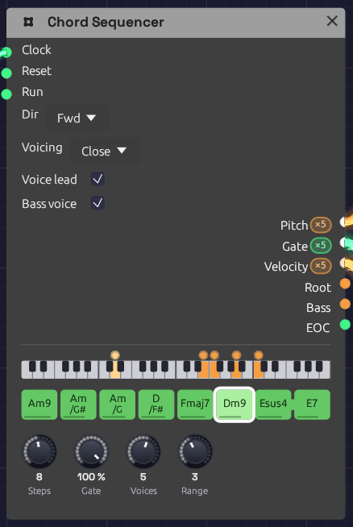
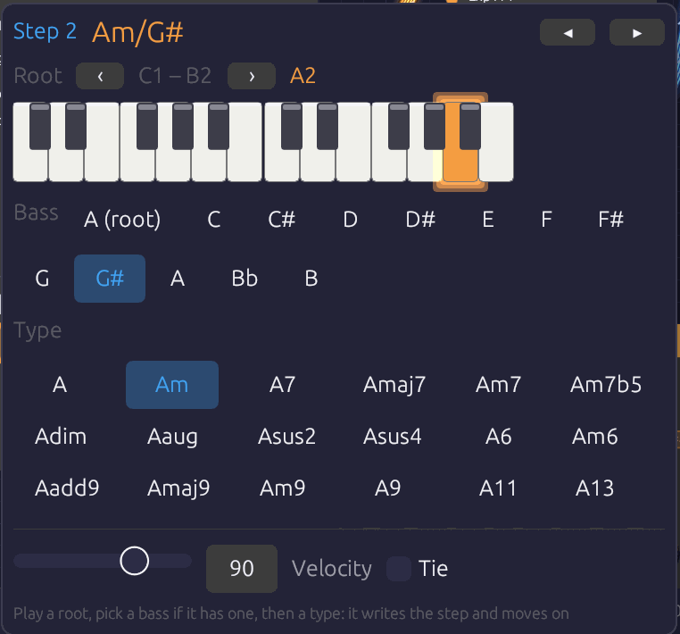

# Chord Sequencer

**Module ID** `seq.chord` · **Category** Utility · **Poly**


*A line cliché, Am9 to E7. The keyboard strip shows Dm9 sounding: the bass voice in amber on D2, and the chord in orange above it, a dot for each voice. Esus4 is tied into E7, so the suspension resolves without a new attack.*

The Chord Sequencer plays a progression. Each of its 16 steps holds a chord: a root, a chord type and, if you like, a slash bass. Each clock pulse moves it on one chord. It sends that chord out as polyphonic **Pitch**, **Gate** and **Velocity**, one channel per note, the way [Poly MIDI](../midi/poly-midi.md) sends the notes you hold. So any polyphonic voice, every [Library](../../concepts/groups.md) voice included, plays it with nothing else in between.

It voices the chords itself. The notes go close together, opened out, or spread wide, in the octave you choose. With **Voice Leading** on, each chord takes the inversion nearest the one before. The voices then move a step or stay put from chord to chord, the way a pianist's hands do, rather than jumping in parallel. Changing one chord means changing one step.

The **Root** and **Bass** outputs carry single notes as well: a bass line to play on a second voice, or a pitch to move an arpeggio around (see [Afterglow](../../recipes/afterglow.md)).

## Inputs

| Port | Signal Type | Description |
|------|-------------|-------------|
| **Clock** | Gate (Green) | Each rising edge moves to the next chord |
| **Reset** | Gate (Green) | A rising edge jumps back to step 1 |
| **Run** | Gate (Green) | Steps advance only while this is high. With nothing patched, the sequencer runs |

## Outputs

| Port | Signal Type | Description |
|------|-------------|-------------|
| **Pitch** | Control (Orange), poly | One channel per note of the chord, as V/Oct, lowest first |
| **Gate** | Gate (Green), poly | The chord's gate, the same on every channel. Stays high across a tie |
| **Velocity** | Control (Orange), poly | The step's velocity, 0 to 1, on every channel |
| **Root** | Control (Orange) | The chord's root as V/Oct, in the octave the step was written in |
| **Bass** | Control (Orange) | The slash chord's bass note, at or below the root; the root when there's no slash |
| **EOC** | Gate (Green) | End of cycle: a 1 ms pulse each time the progression comes round |

## Parameters

| Control | Range | Default | Description |
|---------|-------|---------|-------------|
| **Steps** | 1 – 16 | 4 | How many chords play before the progression loops |
| **Gate** (Gate Length) | 1 – 100% | 100% | How long each chord is held, as a share of the step. 100% holds it up to the next clock |
| **Voices** | 1 – 8 | 4 | How many channels the cables carry: the notes in each chord |
| **Range** | 1 – 6 | 3 | The octave the chord's lowest note sits in. 4 is middle C's octave |
| **Dir** (Direction) | Fwd / Bwd / P-P / Rnd | Fwd | Playback order |
| **Voicing** | Close / Open / Spread | Close | How the notes are spread out (below) |
| **Voice lead** (Voice Leading) | on / off | on | Each chord takes the inversion nearest the last |
| **Bass voice** | on / off | off | Puts the bass note under the chord as the first channel (below) |

Each step also stores a root (a note, with its octave), a type, a bass (the root, or one of the twelve notes), a gate, a velocity and a tie. A new Chord Sequencer starts on Cmaj7, Am7, Fmaj7, G7, with the roots walking down from C2. Patch a [Clock](../modulation/clock.md) into it and it plays a progression straight away.

## Writing chords

Each step shows its chord's name, with a slash bass written under it. A line along the foot of the step shows its velocity. Steps beyond **Steps** are hidden, not lost.

- **Click** a step to switch it on (green) or make it a rest (dark).
- **Shift + click** a step to tie it into the next step. A bar joins the two.
- **Drag** a step up or down to move its root by semitones, or by octaves with **Shift**. The chord it will become shows as you drag.
- **Right-click** a step to open its chord (below).

While the patch plays, the chord sounding is drawn brighter, with a white outline. The keyboard strip above the steps shows its notes, with the bass voice in amber. The strip covers four octaves, starting two below the **Range** octave, so a bass two octaves down still shows. Each voice has a dot that glides to its next note when the chord changes, which makes the voice leading easy to watch. Most dots creep by a step or stay where they are.

### The chord popover


*Am/G# being written into step 2. The bass row is spelled from the root, so the note a half step under A reads G#, as a line cliché writes it.*

Right-click a step and its chord opens under it:

- **Root.** A two-octave piano with the root lit. Click a key to set the root. **‹ ›** move the piano an octave.
- **Bass.** The root, or a note to put under the chord. The notes are spelled from the root (D/F#, Am/G#), the same way the step writes the name.
- **Type.** All 18 chord types, each named on this root. Clicking a type writes the step, switches it on if it was a rest, and moves to the next step.
- **Velocity** and **Tie**, for this step.

So a progression goes in the way a lead sheet reads: a root, then a type, then the next root and type. The popover stays where it opened, and an outline marks the step it's writing. **◂ ▸** (or **←** **→**) move between steps without writing. **Esc**, or a click outside, closes it. Each change is one undo step.

## Chord types

The tones are listed in the order the sequencer keeps them. With fewer **Voices** than tones, it plays the first ones, so the 5th, which adds the least colour, is the first to go. With more voices than tones, it doubles the chord's notes an octave up, in the same order.

| Type | On C | Tones, kept in this order | Notes |
|------|------|---------------------------|-------|
| maj | C | 1 3 5 | |
| min | Cm | 1 ♭3 5 | |
| 7 | C7 | 1 3 ♭7 5 | Dominant seventh |
| maj7 | Cmaj7 | 1 3 7 5 | |
| m7 | Cm7 | 1 ♭3 ♭7 5 | |
| m7b5 | Cm7b5 | 1 ♭3 ♭5 ♭7 | Half-diminished; the ♭5 is what makes it, so it's kept |
| dim | Cdim | 1 ♭3 ♭5 | |
| aug | Caug | 1 3 ♯5 | |
| sus2 | Csus2 | 1 2 5 | |
| sus4 | Csus4 | 1 4 5 | |
| 6 | C6 | 1 3 6 5 | |
| m6 | Cm6 | 1 ♭3 6 5 | |
| add9 | Cadd9 | 1 3 9 5 | A triad with the 9th, no 7th |
| maj9 | Cmaj9 | 1 3 7 9 5 | In four voices: C E B D |
| m9 | Cm9 | 1 ♭3 ♭7 9 5 | |
| 9 | C9 | 1 3 ♭7 9 5 | |
| 11 | C11 | 1 ♭7 9 11 5 | No 3rd: it would clash with the 11th. A B♭ triad over C, the soft suspended 11 of soul and jazz |
| 13 | C13 | 1 3 ♭7 13 9 5 | No 11th, for the same reason. In four voices: C E B♭ A |

The app writes flats and sharps as `b` and `#`, as in Bbmaj7 and F#m7b5.

## Voicing

**Voicing** decides how the notes are spread out. Cmaj7 with **Range** 3:

| Voicing | Cmaj7 | Sound |
|---------|-------|-------|
| **Close** | C3 E3 G3 B3 | Packed inside an octave, the way a hand plays a chord. Compact, for keys and comping |
| **Open** | G3 C4 E4 B4 | Drop-2: the second note from the top goes down an octave. The jazz guitar and horn-section sound, more open than Close and still in one hand |
| **Spread** | C3 G3 E4 B4 | Every other note goes up an octave, spanning two. Wide and airy, for pads and strings |

**Range** puts the chord's lowest note in its octave. With voice leading on, the lowest note can wander up to a fifth either side of that octave to stay close to the last chord, and no further. A long progression can't climb off the top of the keyboard.

## Voice leading

With **Voice lead** off, every chord is in root position. With it on, the sequencer tries each inversion of the new chord and keeps the one whose notes are nearest the last chord's, note for note. Common tones stay where they are and the rest move by step.

The textbook ii–V–I in C, with **Range** 3 and four voices:

| | Dm7 | G7 | Cmaj7 |
|---|---|---|---|
| Voice lead off | D3 F3 A3 C4 | G3 B3 D4 F4 | C3 E3 G3 B3 |
| Voice lead on | D3 F3 A3 C4 | D3 F3 G3 B3 | C3 E3 G3 B3 |

With voice leading on, D and F hold through G7 while A falls to G and C to B. Then B holds and the rest fall a step into Cmaj7. No voice moves more than two semitones. That's the movement a pad or string section needs: the chords change while the sound stays smooth.

The first chord after **Reset** or a stop is in root position, and the rest lead on from it.

## Slash chords and the bass

A step's **Bass** puts a different note under the chord: C/E is C major over E, and D/F# is D over F#. That's how a line cliché writes a moving bass under a held chord: Am, Am/G#, Am/G, D/F#. The sequencer places the bass note at or below the root you wrote, so write roots where you want the bass line to sit, usually octave 2.

The bass is always on the **Bass** output. Patch it into a second voice for a bass part. **Root** carries the root itself, ignoring the slash.

To hear the bass in the chord itself, switch on **Bass voice**. The cables' first channel then carries the bass note, under the chord, and the chord takes the remaining channels. A single pad then plays the whole slash chord. Because the bass already has the root, the chord drops its own root first when there are more tones than voices. With **Voices** 4, Cmaj9 is C under E, B and D (its 3rd, 7th and 9th), and with 5 it's C under E G B D. These are the rootless voicings a jazz pianist's left hand plays.

## Timing

Timing works as on the [Step Sequencer](./sequencer.md#timing). The sequencer moves on each rising edge at **Clock**, and **Gate** is a share of the time between the last two pulses, so chords follow the tempo and a swung clock.

- At 100%, a chord holds right up to the next clock. The gate then drops for one sample, so each envelope starts again on the new chord.
- A **tie** carries the gate into the next step without that drop. The notes change, but nothing is struck again: the envelope carries on rising or sustaining across the change. A sus4 tied into its major chord resolves this way, as do pads that glide from chord to chord.
- A **rest** lets the gate fall but leaves the notes where they were, so a long release fades out on the chord it began on.
- **Before two clocks** the sequencer has no step to measure. A held first chord then lasts until the next clock, so the first chord after **▶ Play** is as long as the rest. A shorter gate is a share of half a second until the clock is measured.
- **Before the first clock**, the cables already carry the first chord, with the gate low. A voice whose VCA is always a little open plays that chord quietly from the start.

Edits are heard at once. Change the chord that's playing, or **Voices**, **Voicing** or **Range**, and the notes move to match without waiting for the next clock.

## Example patches

### A pad that plays a progression

```text
[Clock Gate] ──> [Chord Sequencer Clock]
[Chord Sequencer Pitch]    ──> [Supersaw Pad Pitch]
[Chord Sequencer Gate]     ──> [Supersaw Pad Gate]
[Chord Sequencer Velocity] ──> [Supersaw Pad Velocity]
[Supersaw Pad Out] ──> [Reverb] ──> [Audio Output]
```

Add the Supersaw Pad from the Library, set the Clock to a slow division (1/1, a chord a bar), and leave **Voice lead** on. Try **Voicing** Spread with **Voices** 5 or 6 for strings.

### Electric piano comping with a bass

```text
[Chord Sequencer Pitch / Gate / Velocity] ──> [a mallet or FM voice]
[Chord Sequencer Bass] ──> [Oscillator V/Oct] (a second, mono voice)
[Chord Sequencer Gate] ──> [ADSR Gate]       (the bass's envelope)
```

**Voicing** Close, **Range** 4, **Gate** around 60%, and velocities that vary from step to step. Write the roots in octave 2 so **Bass** plays a real bass line, slash notes included.

### Moving an arpeggio through the chords

Patch **Root** into an oscillator's **Exp FM** (at 1.0 octave per volt) while a Step Sequencer plays an arpeggio into its **V/Oct**. The oscillator adds the two pitches, so the arpeggio follows the chord roots. [Afterglow](../../recipes/afterglow.md) is built this way, with the chords themselves on a pad underneath.

## Tips

1. **Voices sets the colour.** Three voices give shells (root, 3rd, 7th), and four give full seventh chords. Five or more add the 9ths and doublings that make pads lush.
2. **Bass voice and four Voices** give the classic rootless voicings for jazz and neo-soul.
3. **Ties on a pad** turn a progression into one long breath.
4. **Dir Rnd** over a set of related chords (Fmaj7, Am7, Cmaj7, Em7) makes ambient harmony that never quite repeats.
5. **EOC** can clock a second sequencer once per progression, or a Clock Divider for a turnaround every few passes.

## Related Modules

- [Step Sequencer](./sequencer.md): one note per step, and the same clocking and ties
- [Poly MIDI](../midi/poly-midi.md): chords played live, on the same kind of cable
- [Polyphony](../../concepts/polyphony.md): how one cable carries several voices
- [Arranger](./arranger.md): a song's sections, which can clock or reset the progression
