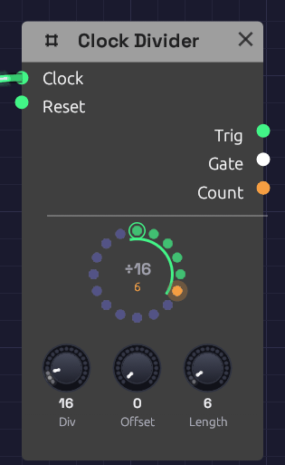

# Clock Divider

**Module ID** `util.divider` · **Category** Utility


*Dividing a sixteenth clock by 16, once a bar, with the Gate open for six clocks. The count is on bead 6, the last of the six, so the arc is lit.*

A Clock Divider fires once every so many clock pulses. Patch a sixteenth-note [Clock](../modulation/clock.md) into it and it can mark every bar, every fourth bar, or the third beat of each bar. Its **Gate** stays open for as many pulses as you choose, so it can hold a whole bar or a whole phrase. That makes it the way to play something less often than every bar: a fill every fourth bar, a crash every eighth, a change of chord every two.

The node shows the count as a **ring** of beads, one per count, read clockwise from the top like a clock face. The count that fires wears a ring. The counts the Gate stays open for lie along a green arc, which lights while the gate is open. An orange bead travels round as the clock ticks, with its number under the **÷**.

## Inputs

| Port | Signal Type | Description |
|------|-------------|-------------|
| **Clock** | Gate (Green) | Each rising edge counts one |
| **Reset** | Gate (Green) | A rising edge starts the count over and closes the Gate. The next clock is count 0, even one on the same sample |

## Outputs

| Port | Signal Type | Description |
|------|-------------|-------------|
| **Trig** | Gate (Green) | The clock's own pulse, on the counts that fire. ÷1 passes every pulse through |
| **Gate** | Gate (Green) | Opens on a count that fires and stays open for **Length** clocks |
| **Count** | Control (Orange) | Where the count is: 0 on count 0, rising in even steps to 1 on the last count, like the sequencer's **Step** |

## Parameters

| Knob | Range | Default | Description |
|------|-------|---------|-------------|
| **Div** | 1 – 128 | 4 | Fires once every this many clocks |
| **Offset** | 0 – 127 | 0 | Which count fires. 0 is the first clock after a reset; offsets past **Div** wrap round |
| **Length** | 1 – 128 | 1 | How many clocks the Gate stays open |

## How it works

The Clock Divider counts rising edges on **Clock**. The first edge is count 0, then 1, 2, and so on up to **Div** − 1, and round again. It fires on the count set by **Offset**:

```text
Clock:  _|‾|_|‾|_|‾|_|‾|_|‾|_|‾|_|‾|_|‾|_|‾|_    (Div 4, Offset 0, Length 2)
Count:   0   1   2   3   0   1   2   3   0
Trig:   _|‾|_____________|‾|_____________|‾|_
Gate:   _|‾‾‾‾‾‾‾|_______|‾‾‾‾‾‾‾|_______|‾‾‾
```

Because it counts pulses rather than timing them, it can't drift from its clock. Every pulse it fires on is one of the clock's own pulses, on the same sample, after ten minutes as after ten seconds, at any tempo. Change the Clock's **BPM** and the phrase follows. That's also why it's better than a second, slower Clock: two Clocks drift apart unless something re-syncs them, the slowest a Clock goes is 20 BPM, and the second Clock might become the patch's [transport](../../concepts/tempo-and-sync.md#the-transport).

**Trig** is the clock's own pulse, as long as the clock's gate. **Gate** is measured in whole clocks: at **Length** 1 it's open from the pulse that fires to the next one, and at **Length** 16 for sixteen. It closes on the clock edge that ends it, before any module it drives hears that edge. A Length of **Div** or more keeps it open all the time, dipping for a single sample each time the count fires, so an envelope it drives still sees a new edge.

If the clock stops while the Gate is open, the Gate lets go once two clock periods have passed with no pulse, so a stopped clock can't leave it open.

## Patches

### A fill every fourth bar

```text
[Clock Gate] ──> [Clock Divider Clock]         (Clock Div 1/16; Divider Div 64, Length 17)
[Clock Divider Gate] ──> [Tom Sequencer Run]  [Tom Sequencer Reset]
```

At sixteenths, 64 clocks are four bars. The Gate opens on the downbeat of bar 1 and resets the tom sequencer to step 1 as it starts it running. It stays open for 17 clocks: the fill bar and the downbeat after it, so the sequencer takes one more step, wraps round, and its **EOC** can strike a crash where the fill lands. This is how [Backbeat](../../recipes/backbeat.md#the-fill-and-the-crash) schedules its fill. Set **Div** to 128 for a fill every eighth bar, or **Offset** to 48 to put the fill in bar 4.

### A beat that isn't every beat

```text
[Clock Gate] ──> [Clock Divider Clock]         (Clock Div 1/4; Divider Div 4, Offset 2)
[Clock Divider Trig] ──> [ADSR Gate]
```

A clap on beat 3 of every bar, and nowhere else. Turn **Offset** to move it round the bar.

### Changes in threes

```text
[Clock Gate] ──> [Clock Divider Clock]         (Div 3)
[Clock Divider Trig] ──> [Sample & Hold Trig]
```

A Sample & Hold that samples every third note, against a melody of eight, gives a pattern that takes three passes of the melody to come round. [Generative Ambient](../../recipes/generative-ambient.md#brightness-in-threes) shades its notes this way.

### Polyrhythm

Two Clock Dividers on the same sixteenth clock, one at **Div** 3 and one at **Div** 4, play three against four. They meet again every twelve sixteenths. Patch their **Trig** outputs into **A** and **B** of a [Logic](./logic.md) module, and its **AND** fires only where they meet.

## Related modules

- [Clock](../modulation/clock.md): the pulses to divide
- [Step Sequencer](./sequencer.md): its **Run** and **Reset** take the Gate; its **EOC** marks the end of each pass
- [Logic](./logic.md): combine divided rhythms, or gate them with a control voltage
- [Sample & Hold](./sample-hold.md): **Trig** makes a sparser trigger to sample on
