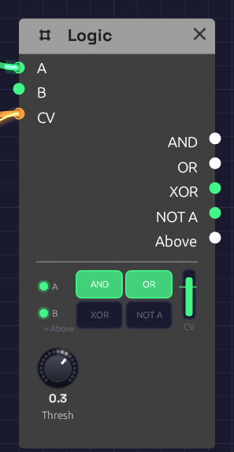

# Logic

**Module ID** `util.logic` · **Category** Utility


*A clock in A, an LFO in CV, nothing in B. The LFO is above the Threshold line, so B, standing in for Above, is lit. A clock pulse is high in A, so AND and OR are high too.*

Logic answers questions about gates. Are both of these high? Is either? Is exactly one? Its other half answers a question about a control voltage: is it above this line? The answer is a gate, so Logic is how a control signal reaches a gate input, which a cable alone can't do.

The node shows its working. Two small lamps at the left light while **A** and **B** are high. The four big lamps light while **AND**, **OR**, **XOR** and **NOT A** are, so the truth table plays out as the gates come and go. The **column** at the right is the CV, rising past the **Threshold** line and turning green when it's above. Drag the line to move the Threshold.

## Inputs

| Port | Signal Type | Description |
|------|-------------|-------------|
| **A** | Gate (Green) | The first gate for AND, OR, XOR and NOT A |
| **B** | Gate (Green) | The second gate for AND, OR and XOR. With nothing patched, B is **Above** (see below) |
| **CV** | Control (Orange) | A voltage to compare with **Threshold**. Audio patches in too |

## Outputs

| Port | Signal Type | Description |
|------|-------------|-------------|
| **AND** | Gate (Green) | High while A and B are both high |
| **OR** | Gate (Green) | High while A or B is high |
| **XOR** | Gate (Green) | High while exactly one of A and B is high |
| **NOT A** | Gate (Green) | High while A is low. With nothing in A it's always high |
| **Above** | Gate (Green) | High while CV is above **Threshold** |

## Parameters

| Knob | Range | Default | Description |
|------|-------|---------|-------------|
| **Thresh** | -1 – 1 | 0.5 | Where **Above** switches |

## How it works

### Combining

The logic outputs follow A and B sample by sample, with no memory. Anything above 0.5 counts as high, as on every gate input.

| A | B | AND | OR | XOR | NOT A |
|---|---|-----|----|-----|-------|
| low | low | low | low | low | high |
| high | low | low | high | high | low |
| low | high | low | high | high | high |
| high | high | high | high | low | low |

### Comparing

**Above** goes high when CV rises past **Threshold** + 0.01, and low again when it falls below **Threshold** − 0.01. That little gap is hysteresis: a slow or noisy signal crossing the threshold switches once instead of chattering.

Gate outputs can feed control inputs, but control outputs can't feed gate inputs, because a control signal has no clear on and off. **Above** is how you say where on and off are.

### B is normalled to Above

With nothing patched into **B**, B reads **Above**, the way a jack on a hardware module can be wired to a signal until a cable is plugged in. The lamp under B says **= Above** while it does. So one Logic, with a clock in **A** and a control voltage in **CV**, gives a clock that runs only while the CV is high, at **AND**. Patch anything into B and it's an ordinary input again.

With nothing in CV either, Above is low at the default Threshold, so an empty B behaves like an empty jack.

## Patches

### A clock that waits for the wind

```text
[Clock Gate] ──> [Logic A]
[Noise Random] ──> [Logic CV]                  (Thresh -0.3; B empty)
[Logic AND] ──> [ADSR Gate]
```

Clock pulses reach the envelope only while Noise's slow **Random** is above the threshold. The notes come in gusts and stop in the calms between them. This is the chime in [Shoreline](../../recipes/shoreline.md#the-wind).

### Make a gate from an LFO

```text
[LFO Out] ──> [Logic CV]                       (Thresh 0.5)
[Logic Above] ──> [ADSR Gate]
```

The envelope opens each time the LFO rises past the threshold and closes as it falls back. Raise the threshold and the gates get shorter. Patch a [Sequencer](./sequencer.md)'s **Pitch** into **CV** instead, with the threshold between two notes, and the high notes open a gate the low ones don't.

### Only on the beat

```text
[Audio Input Gate] ──> [Logic A]
[Clock Gate] ──> [Logic B]
[Logic AND] ──> [ADSR Gate]
```

Hits from a drummer or a microphone come through only while the clock's gate is high, so loose playing is cut back to the grid.

### Where two rhythms meet

```text
[Clock Divider 1 Trig] ──> [Logic A]           (Div 3)
[Clock Divider 2 Trig] ──> [Logic B]           (Div 4)
[Logic AND] ──> [ADSR Gate]
```

Two [Clock Dividers](./divider.md) on one sixteenth clock play three against four. **AND** fires only where they meet, once every twelve sixteenths. **XOR** fires where exactly one of them plays. XOR **OR** with the clock itself in a second Logic and you get every pulse neither played: the gaps. [Interlock](../../recipes/interlock.md) gives each of the three its own voice, so together they play every sixteenth exactly once.

### Turn a gate upside down

**NOT A** is high while A is low. Patch a sequencer's **Gate** into A and NOT A is high in the rests, ready to open a second envelope that fills the gaps.

## Related modules

- [Clock Divider](./divider.md): rhythms to combine
- [Interlock](../../recipes/interlock.md): a gamelan-style example built around AND, OR, XOR and an empty B
- [Clock](../modulation/clock.md): the pulse to gate
- [Audio Input](../sources/audio-input.md): gates from a microphone or instrument
- [Attenuverter](./attenuverter.md): scale a control signal before **CV**, or turn a gate into a control voltage
