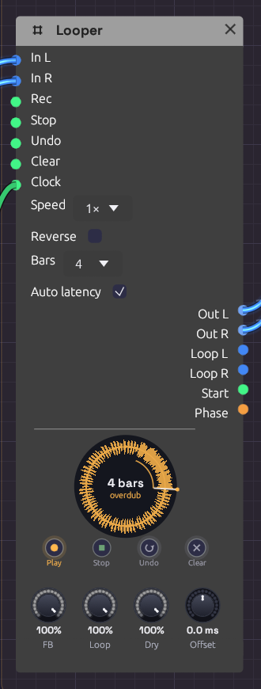

# Looper

**Module ID** `util.looper` · **Category** Utility


*Overdubbing a four-bar loop. The ring is amber while it overdubs, and the thin arc inside it is the pass being laid down.*

A Looper works like a looper pedal. Play into it and tap **Rec** to start recording. Tap again to close the loop, and it plays back while you play over it. Keep tapping to overdub layers, undo the last one, or stop and clear. It's how one player builds a piece out of layers in real time.

It also works inside a patch, not just at the end of one. Loop a sequencer phrase, then sweep a filter over the frozen loop. Send **Loop L/R** through effects of their own, or use **Phase** as modulation so the whole patch moves with the loop.

The node draws the loop as a **ring**, read clockwise from twelve o'clock like a record, with the waveform around it and a playhead sweeping round. Each overdub pass lays a thin band inside the ring, newer ones brighter, like the rings of a tree, so you can see how many layers you've built and where each one reached. The ring's colour is the state: **red** while recording, **amber** while overdubbing, **green** while playing, dim while stopped, and grey dashes when empty. The first take draws its arc as it grows and closes into a circle when the loop closes. The loop's length is in the middle, in bars when a Clock is patched.

## Inputs

| Port | Signal Type | Description |
|------|-------------|-------------|
| **In L** | Audio (Blue) | What to loop. With only one side patched, it plays on both |
| **In R** | Audio (Blue) | Right input |
| **Rec** | Gate (Green) | The footswitch: record, close the loop, then overdub and play in turn (see below) |
| **Stop** | Gate (Green) | Stops the loop. A second Stop while stopped plays it again from the top |
| **Undo** | Gate (Green) | Takes back the last overdub layer. A second Undo brings it back |
| **Clear** | Gate (Green) | Empties the loop |
| **Clock** | Gate (Green) | Optional. Patched, recording starts on a pulse and the loop closes on a whole bar. See [Sync](#sync) |

Each input acts on its rising edge.

## Outputs

| Port | Signal Type | Description |
|------|-------------|-------------|
| **Out L**, **Out R** | Audio (Blue) | The input (at **Dry**) and the loop (at **Loop**) together |
| **Loop L**, **Loop R** | Audio (Blue) | The loop alone, at **Loop**, to send through its own effects |
| **Start** | Gate (Green) | A 1 ms pulse each time the loop comes round to its top. Patch it into a sequencer's **Reset** or a drum's **Trig** |
| **Phase** | Control (Orange) | A ramp from 0 to 1 across the loop |

## Footswitches

The four buttons under the ring do what the gate inputs do. Each one is labelled with what it does next: **Rec** reads *Play* while recording, *Dub* while playing, and *Play* while overdubbing, and **Undo** reads *Redo* once a layer has been taken back. Pressing a footswitch plays the Looper rather than editing the patch, so it isn't an undo step.

Right-click a footswitch and choose **Learn MIDI CC** to press it from a MIDI controller. A footswitch pedal on a MIDI interface works this way: any CC value from 64 up presses it. A learned footswitch wears a small purple dot.

## Parameters

| Control | Range | Default | Description |
|---------|-------|---------|-------------|
| **Speed** | ½×, 1×, 2× | 1× | Playback speed, as on tape: ½× plays an octave down and twice as long |
| **Reverse** | on/off | off | Plays the loop backwards |
| **Bars** | Free, 1, 2, 4, 8, 16 | Free | With a Clock patched, how many bars a take lasts. Ignored without one |
| **Auto latency** | on/off | on | Writes overdubs fed by an [Audio Input](../sources/audio-input.md) earlier by the round trip the input takes, so they land where you played them. See [Offset](#offset-and-latency) |
| **FB** (Feedback) | 0 – 100% | 100% | How much of the loop each overdub pass keeps. Below 100% the old layers fade away |
| **Loop** | 0 – 100% | 100% | The loop's level, on **Out** and on **Loop** |
| **Dry** | 0 – 100% | 100% | The input's level on **Out**. Turn it down when the input is heard some other way |
| **Offset** | −50 – +50 ms | 0 ms | Moves what's recorded earlier (+) or later (−), on top of Auto latency |

**Speed** and **Reverse** change how the loop plays, not what's kept: set them back and the loop is as it was. Overdubbing at another speed records at that speed, so an overdub played at ½× comes back an octave up at 1×.

## The Rec cycle

One footswitch does almost everything, as on a Boss RC or an EHX 720:

```text
              tap               tap                tap
   Empty ──────────> Record ──────────> Play ──────────> Overdub
                                         ^                  │
                                         └──────────────────┘
                                                 tap

   Stop:  Play / Overdub ──> Stopped ──(Stop or Rec)──> Play from the top
   Undo:  takes the last overdub layer back, or brings it back
   Clear: any state ──> Empty
```

- The tap that ends the first take sets the loop's length, and the loop starts playing at once.
- Each run of **Overdub**, from the tap that starts it to the tap that ends it, is one layer, however many times it goes round. **Undo** takes back the layer you just made, and a second Undo brings it back. Starting a new layer makes the last one permanent. Undo during an overdub ends it and takes it back.
- **Stop** during the first take closes the loop and leaves it stopped.
- Stopping the transport keeps the loop, stopped at the top: tap Rec or Stop to hear it again. A take still recording when the transport stops is dropped.

**Feedback** below 100% makes each overdub pass fade what was there before, tape-loop style. At 50%, a layer is down 6 dB after one more pass. Overdub with nothing playing in and **FB** low to let a loop die away gradually. Robert Fripp built whole pieces this way with two tape machines.

## Sync

With nothing in **Clock**, the loop is exactly as long as the time between the two taps.

With a clock patched, timing follows it:

- **Recording starts on the next pulse.** Tap early and the ring shows red dashes until the pulse comes. A tap up to 50 ms *after* a pulse counts as on time: the take begins on the pulse just gone, with what you played since, so a late foot doesn't cost you a whole bar.
- **The loop closes on the nearest whole bar.** Tap a little early and it records on to the bar; tap a little late and it closes back on the bar, already playing. A bar is the patch [transport](../../concepts/tempo-and-sync.md#the-transport)'s, from the Clock's tempo and time signature (four pulses of the **Clock** input if there's no transport).
- **With Bars set**, the take closes itself after that many bars, so one tap is enough.

To start takes on a downbeat rather than any beat, patch a [Clock Divider](./divider.md) at ÷4 between the Clock and the Looper, as the [Live Looper](../../recipes/live-looper.md) example does.

## Offset and latency

Live input arrives late. Your guitar reaches the patch one input latency after you played it, and you played along with what you heard one output latency earlier. Left alone, every overdub would land late by the whole **round trip**, typically 20 to 50 ms, and the layers would flam.

Soba measures that round trip (the **In** figure in the status bar, see [Audio Input](../sources/audio-input.md)). With **Auto latency** on, the Looper writes everything fed by an Audio Input that much earlier, through any chain of modules in between, so each layer lines up with what you heard while you played it. Sound made inside the patch (a sequencer, an oscillator) has no round trip, so nothing is moved even with Auto latency on.

**Offset** trims by ear on top of that. If your interface's converters add latency no timestamp reports, layers will still sit a little late: turn Offset up until they're tight. Turn Auto latency off if the input isn't something played along with the loop, such as a drum machine slaved to the patch's clock.

## Memory

A Looper holds up to **two minutes** of stereo, plus room for one undo layer: about 92 MB at 48 kHz, set aside when the module is added and never on the audio thread. Recording past two minutes closes the loop there. Changing the device's sample rate empties the loop.

## Clean loop points

Nothing clicks at the seam. The first take keeps recording for 5 ms past where the loop closes, and that tail is crossfaded over the loop's first 5 ms, so the wrap runs on into what you really played next. Overdubs punch in and out over 5 ms, and stopping, clearing and undoing fade rather than cut.

## Patches

### A looper pedal

```text
[Audio Input L/R] ──> [Looper In L/R]
[Looper Out L/R] ──> [Audio Output Left/Right]
```

Tap the footswitches on the node, or learn a MIDI pedal onto them.

### Freeze a phrase, then play over it

```text
[Step Sequencer] ──> [Oscillator] ──> [Looper In L]
[Looper Loop L] ──> [SVF Filter In] ──> [Audio Output]
[LFO] ──> [SVF Filter Cutoff]
```

Loop four bars of the sequence, stop the sequencer, and sweep the filter over the frozen loop. **Dry** at 0 keeps the sequencer out of the output once it's looped.

### Lock the patch to the loop

Patch **Start** into a sequencer's **Reset** so its phrase restarts with the loop, or **Phase** into a filter's cutoff for a sweep that rises across the loop and drops as it comes round.

## Related

- [Audio Input](../sources/audio-input.md): live sound in, and the round trip
- [Clock](../modulation/clock.md) and [Clock Divider](./divider.md): bar-synced takes
- [Live Looper](../../recipes/live-looper.md): the example patch
- [From One Sine](../../recipes/from-one-sine.md): a Looper pressed by the patch itself, keeping its opening to play back reversed in the breakdown
