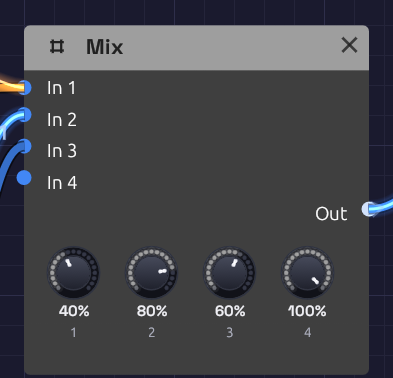

# Mix

**Module ID** `util.mix` · **Category** Utility


*Four inputs, a level each, one sum.*

Mix adds up to four signals into one, each at its own level. It's the plain sum a patch reaches for most often: two envelopes into one filter's **Cutoff**, two noise colours into one VCA, a pad's oscillators into one filter, or an LFO and an envelope moving the same knob together.

Audio and control signals both patch in, so the same module mixes sound or modulation. To place sounds left and right, send them to a shared reverb, or mute and solo them as you play, use the [Mixer](./mixer.md).

Mix is polyphonic. A polyphonic cable stays one: each voice is summed on its own, with the same levels, and a mono cable into another input joins every voice.

## Inputs

| Port | Signal Type | Description |
|------|-------------|-------------|
| **In 1** – **In 4** | Audio (Blue) | The signals to add. Control signals patch in too |

## Outputs

| Port | Signal Type | Description |
|------|-------------|-------------|
| **Out** | Audio (Blue) | Every input at its level, added together |

## Parameters

| Knob | Range | Default | Description |
|------|-------|---------|-------------|
| **1** – **4** (Level 1 – 4) | 0 – 100% | 100% | How much of each input joins the sum |

The levels are smoothed, so you can ride them while the patch plays without clicks.

## How it works

```text
Out = In 1 × Level 1 + In 2 × Level 2 + In 3 × Level 3 + In 4 × Level 4
```

### Headroom

Anything within ±1 passes through untouched. Past that, the sum soft-clips: it bends smoothly over and eases toward ±1.5 without ever reaching it, so two full-scale signals come out at about 1.48. The same bend is on the Mixer's outputs.

The headroom above 1 is deliberate: summed control signals can add up past 1 without being clipped flat. (To open a filter further, turn up its **CV Amt** rather than summing envelopes.) For audio, the bend rounds off loud peaks, so bring the levels down to around 50–70% each when you add loud sources and want them clean.

## Patches

### Two modulation sources

A slow LFO and an envelope together: the filter follows each note and drifts as well.

```text
[LFO Out]  ──> [Mix In 1]           (Level 1 around 30%)
[ADSR Out] ──> [Mix In 2]
[Mix Out]  ──> [SVF Filter Cutoff]
```

The [Afterglow](../../recipes/afterglow.md) example sweeps its arpeggio's filter this way.

### Layered oscillators

Two oscillators, one quieter, into one filter:

```text
[Oscillator A Out] ──> [Mix In 1]
[Oscillator B Out] ──> [Mix In 2]   (Level 2 at 50%)
[Mix Out] ──> [SVF Filter In]
```

[Generative Ambient](../../recipes/generative-ambient.md) starts from this: a triangle melody over a steady second oscillator, slightly out of tune with each other, so they beat.

## Related modules

- [Mixer](./mixer.md): a stereo console, with pan, width, sends, mute and solo
- [Attenuverter](./attenuverter.md): scale or invert a signal before it joins the sum, to subtract one CV from another
- [VCA](./vca.md): a level set by a CV
