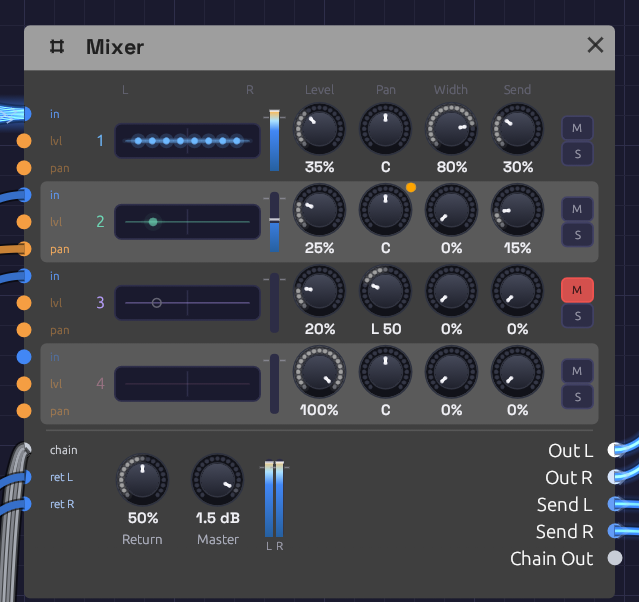

# Mixer

**Module ID** `util.mixer` · **Category** Utility


*Two channels, two levels, one sum.*

The Mixer adds two signals together, each at its own level. Use it to layer two oscillators, blend a dry signal with an effect, or combine two modulation sources into one CV.

It works on any signal that isn't MIDI. Audio and control signals both patch straight in, so the same module mixes sound or modulation.

## Inputs

| Port | Signal Type | Description |
|------|-------------|-------------|
| **Ch 1** | Audio (Blue) | First signal to mix |
| **Ch 2** | Audio (Blue) | Second signal to mix |

## Outputs

| Port | Signal Type | Description |
|------|-------------|-------------|
| **Out** | Audio (Blue) | Both channels, each at its level, added together |

## Parameters

| Knob | Range | Default | Description |
|------|-------|---------|-------------|
| **Lv 1** (Level 1) | 0 – 100% | 100% | Level of channel 1 |
| **Lv 2** (Level 2) | 0 – 100% | 100% | Level of channel 2 |

Both levels are smoothed, so you can ride them while the patch plays without clicks.

## How it works

```text
Out = Ch 1 × Level 1 + Ch 2 × Level 2
```

At the default levels, two full-scale signals add up to twice full scale. Anything within ±1 passes through untouched. Past that the Mixer soft-clips: the sum bends smoothly over and eases toward ±1.5 without ever reaching it, so two full-scale signals come out at about 1.48. The bend rounds off the peaks of loud audio, so when you mix two loud sources and want them clean, bring the levels down to around 50–70% each.

The headroom above 1 is deliberate. Summing two envelopes for a filter's **Cutoff**, as the [Rhythmic Sequence](../../recipes/rhythmic-sequence.md) example does, opens the filter further than one envelope can.

### Polyphonic cables

The Mixer isn't polyphonic: it mixes down. A polyphonic cable into **Ch 1** or **Ch 2** is summed to one channel, so a whole polyphonic voice goes straight in. Each note adds to the total, so leave more headroom the more voices you play.

## Patches

### Two oscillators

Two oscillators a few cents apart beat slowly against each other and sound thicker than either alone:

```text
[Keyboard Pitch] ──> [Oscillator 1 V/Oct]
[Keyboard Pitch] ──> [Oscillator 2 V/Oct]      (Fine +7 cents)
[Oscillator 1 Out] ──> [Mixer Ch 1]
[Oscillator 2 Out] ──> [Mixer Ch 2]
[Mixer Out] ──> [SVF Filter In]
```

Set the second oscillator's **Oct** to +1 and its level to about 50% to add brightness without losing the fundamental. For a thick stack from one module, try the Oscillator's own **Voices** and **Sub** instead (see [Oscillator](../sources/oscillator.md)).

### Two modulation sources

A slow LFO and an envelope together: the filter follows each note and drifts as well.

```text
[LFO Out] ──> [Mixer Ch 1]          (Lv 1 around 30%)
[ADSR Out] ──> [Mixer Ch 2]
[Mixer Out] ──> [SVF Filter Cutoff]
```

### Wet and dry

Most effects have their own **Mix** knob, but the Mixer keeps the dry and wet signals on separate channels, so you can set their balance by hand or process one without the other:

```text
[VCA Out] ──> [Mixer Ch 1]          (dry)
[VCA Out] ──> [Reverb In L]
[Reverb Out L] ──> [Mixer Ch 2]     (wet, Reverb Mix at 100%)
[Mixer Out] ──> [Audio Output Mono]
```

### More than two channels

Chain Mixers: the output of one feeds a channel of the next.

```text
[Oscillator 1 Out] ──> [Mixer A Ch 1]
[Oscillator 2 Out] ──> [Mixer A Ch 2]
[Mixer A Out] ──> [Mixer B Ch 1]
[Oscillator 3 Out] ──> [Mixer B Ch 2]
[Mixer B Out] ──> [Audio Output Mono]
```

## Related modules

- [VCA](./vca.md): level control from a CV
- [Attenuverter](./attenuverter.md): scale, invert or offset a signal before mixing
- [Audio Output](../output/audio-output.md): the final mix, with metering and a limiter
