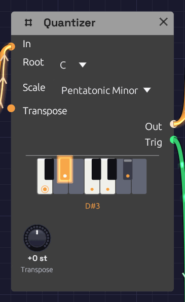

# Quantizer

**Module ID** `util.quantizer` · **Category** Utility


*C minor pentatonic: its five keys are lit, the root C is ringed, and D#, the note playing now, glows.*

A Quantizer snaps a pitch to the nearest note of a scale. Random voltages, LFOs and [Sample & Hold](./sample-hold.md) can produce any pitch at all, most of them between the keys of a piano. Through a Quantizer, every one of them lands on a note of the key you choose, so chance plays melodies.

The node shows its scale on a one-octave piano. Keys in the scale are lit and carry a dot, and the root's dot is ringed. Keys outside the scale are dimmed. The note the Quantizer is playing glows, and its name appears under the keys. **Click a key** to add it to the scale or take it out, and the **Scale** menu switches to **Custom**.

The Quantizer is polyphonic. Patch in a polyphonic cable and each voice is quantized on its own, so a chord from [Poly MIDI](../midi/poly-midi.md) comes out as a chord in the scale. The piano lights every note playing.

## Inputs

| Port | Signal Type | Description |
|------|-------------|-------------|
| **In** | Control (Orange) | The pitch to quantize, in V/Oct: 0 is C4, +1 is C5, -1 is C3, as on [MIDI Note](../midi/midi-note.md) |
| **Transpose** | Control (Orange) | Added to the **Transpose** knob, in V/Oct and rounded to whole semitones. A sequencer's **Pitch** here moves the key by the interval it plays |

## Outputs

| Port | Signal Type | Description |
|------|-------------|-------------|
| **Out** | Control (Orange) | The nearest note of the scale, plus Transpose, in V/Oct |
| **Trig** | Gate (Green) | A 10 ms pulse each time **Out** moves to a new note, and never while it holds one |

## Parameters

| Control | Range | Default | Description |
|---------|-------|---------|-------------|
| **Root** | C – B | C | The scale's first note |
| **Scale** | See below | Major | Which notes **Out** may play |
| **Transpose** | ±12 st | 0 st | Shifts **Out**, and so the key, in semitones |

### Scales

| Scale | Notes in C | Sound |
|-------|------------|-------|
| Chromatic | all twelve | Every semitone. Steps pitches without choosing a key |
| Major | C D E F G A B | Bright, settled |
| Natural Minor | C D E♭ F G A♭ B♭ | Dark, sad |
| Dorian | C D E♭ F G A B♭ | Minor, with a hopeful sixth |
| Mixolydian | C D E F G A B♭ | Major, with a bluesy seventh |
| Harmonic Minor | C D E♭ F G A♭ B | Minor, with a tense, exotic leading note |
| Pentatonic Major | C D E G A | Five notes with no half steps: nothing clashes |
| Pentatonic Minor | C E♭ F G B♭ | The same calm, in minor. Rock and blues riffs |
| Blues | C E♭ F G♭ G B♭ | Minor pentatonic plus the "blue" flat fifth |
| Whole Tone | C D E F♯ G♯ B♭ | Every step a whole tone: dreamy, without a home |
| Custom | the keys you click | Your own scale, saved with the patch |

## How it works

The input is measured in semitones, and **Out** takes the scale note closest to it. A pitch exactly between two scale notes can go either way, so the Quantizer adds a little **hysteresis**: once on a note, it stays there until the input passes the halfway point by a fifth of a semitone. A slow LFO wobbling at a boundary then holds one note instead of chattering between two.

**Transpose** is added after quantizing. With C major and Transpose at +2, a melody plays in D major, a step higher. To keep the register and only change the key, turn **Root** instead.

**Trig** fires on every change of **Out**, whether the input moved, the scale changed or Transpose did. If notes change faster than 10 ms apart, each still gets a pulse of its own: Trig drops for one sample between them.

### Custom scales

Click keys on the piano to build any scale. The first click copies the current scale into **Custom** and toggles that key, so you can start from a scale you know and bend it: take E and B out of C major for a bare, open sound, or add F♯ to C major for Lydian.

A Custom scale is stored as a pattern above the root, so changing **Root** carries it to the new key. With every key turned off, the Quantizer passes its input through unquantized (Transpose still applies), and Trig stays quiet.

## Patches

### A random melody, in key

```text
[Clock Gate] ──> [Sample & Hold Trig]
[Noise White] ──> [Sample & Hold In]
[Sample & Hold Out] ──> [Quantizer In]         (Root C, Scale Pentatonic Minor)
[Quantizer Out] ──> [Oscillator V/Oct]
[Quantizer Trig] ──> [ADSR Gate]               (Atk 5 ms, Dec 300 ms, Sus 0)
```

The classic random melody from the [Noise](../sources/noise.md) page, now in C minor pentatonic. **Trig** strikes the envelope only when the note changes, so a repeated note is held rather than struck again, and the phrasing breathes.

### An LFO that plays scales

```text
[LFO Out] ──> [Quantizer In]                   (LFO Triangle, Bipolar, 0.25 Hz)
[Quantizer Out] ──> [Oscillator V/Oct]
[Quantizer Trig] ──> [ADSR Gate]
```

A triangle LFO sweeps up and down an octave either side of C4, and the Quantizer turns the sweep into a scale run, each note plucked by **Trig**. Raise the LFO's rate and the runs become arpeggios.

### A wandering voice

```text
[Noise Random] ──> [Quantizer In]              (Noise Rate 0.2 Hz)
[Quantizer Out] ──> [Oscillator V/Oct]
```

**Random** glides rather than jumps, so the Quantizer walks to each new value one scale step at a time. The result is a slow melody that moves by step, on its own schedule. The [Generative Ambient](../../recipes/generative-ambient.md) example sings a descant this way.

### Changing key from a sequencer

Patch a [Step Sequencer](./sequencer.md)'s **Pitch** into **Transpose**. A step on C4 leaves the key alone, F4 moves it up a fourth, G3 down a fourth, so a slow sequence of steps becomes a chord progression for whatever is playing through the Quantizer.

## Related modules

- [Sample & Hold](./sample-hold.md): turns a moving voltage into steps to quantize
- [Noise](../sources/noise.md): random voltages, smooth or stepped
- [LFO](../modulation/lfo.md): regular sweeps that become scale runs
- [ADSR Envelope](../modulation/adsr.md): strike it from **Trig**
