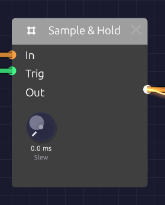

# Sample & Hold

**Module ID** `util.sample_hold` · **Category** Utility


*Each trigger freezes the input; the output holds until the next one.*

Sample & Hold takes a snapshot of its input each time a trigger arrives, and holds that value steady until the next trigger. A smooth, continuous signal goes in; a staircase of held steps comes out, one step per trigger.

That staircase is the sound of classic analog randomness: a filter that jumps to a new brightness on every beat, or a melody that wanders. The **Slew** knob softens the steps into glides.

Sample & Hold is polyphonic. Patch polyphonic cables in and each voice samples and holds its own channel. A mono trigger is shared by every voice, so all of them step together.

## Inputs

| Port | Signal Type | Description |
|------|-------------|-------------|
| **In** | Control (Orange) | The signal to sample. Audio patches in too |
| **Trig** | Gate (Green) | Each rising edge (crossing 0.5 on the way up) captures the input. Takes gate cables only |

## Outputs

| Port | Signal Type | Description |
|------|-------------|-------------|
| **Out** | Control (Orange) | The held value, steady until the next trigger |

## Parameters

| Knob | Range | Default | Description |
|------|-------|---------|-------------|
| **Slew** | Off – 1 s | Off | Glide time to each new value. Off, the output jumps |

## How it works

```text
In:    ~~~~~/\/\~~~~~/\~~~~        (moving signal)
Trig:  _|‾|____|‾|____|‾|__        (rising edges)
Out:   __‾‾‾‾‾‾____‾‾‾‾‾‾‾‾        (one held value per edge)
```

Only the rising edge counts: how long the trigger stays high makes no difference. With nothing patched into **In** the module holds 0.

### Slew

With **Slew** above zero, the output glides to each new value at a steady rate instead of jumping. The knob is the time a change of 1.0 takes, so a 0.2 s Slew moves from 0 to 1 in 0.2 s and from 0 to 0.5 in 0.1 s. Small steps arrive sooner than large ones, the way a portamento circuit behaves.

Short slews (a few tens of milliseconds) take the click off stepped modulation while keeping its rhythm. Long ones turn the staircase into a slow, wandering curve.

## Patches

### Stepped random modulation

Sample [Noise](../sources/noise.md) on every clock and each step lands on a value with no relation to the last:

```text
[Noise White] ──> [Sample & Hold In]
[Clock Gate] ──> [Sample & Hold Trig]
[Sample & Hold Out] ──> [SVF Filter Cutoff]
```

The filter jumps to a new brightness on every clock. Add a little **Slew** to smooth the jumps. Patch **Out** into an [Oscillator](../sources/oscillator.md)'s **V/Oct** instead and you have the classic random melody; the Noise **Level** knob sets how far it wanders.

A fast oscillator sampled by a slower clock does a similar job with a pattern you can hear. Tune it to a frequency with no simple relation to the clock (Saw, **Oct** +2, **Fine** a few cents off) and every sample lands at a different point in its cycle.

### Stepped LFO

Sample a slow LFO with a faster clock and it climbs and falls in steps:

```text
[LFO Out] ──> [Sample & Hold In]               (LFO Rate 0.2 Hz)
[Clock Gate] ──> [Sample & Hold Trig]          (Clock Div 1/16)
[Sample & Hold Out] ──> [Oscillator V/Oct]
```

Into **V/Oct**, this gives a gliding arpeggio of unquantized pitches. Run it through an [Attenuverter](./attenuverter.md) first to narrow the range.

### Hold a value per note

Trigger from a keyboard gate and each note gets a fresh value that stays put while the key is held:

```text
[LFO Out] ──> [Sample & Hold In]
[Keyboard Gate] ──> [Sample & Hold Trig]
[Sample & Hold Out] ──> [SVF Filter Cutoff]
```

Every note sounds a little different, like a player who never strikes the same way twice. In a polyphonic patch, feed **Trig** from [Poly MIDI](../midi/poly-midi.md)'s **Gate** and each voice holds its own value.

### Gliding steps

Raise **Slew** to 0.1–0.3 s on any of the patches above and the steps become smooth curves that still move in time with the clock.

## Related modules

- [Noise](../sources/noise.md): the classic signal to sample
- [Clock](../modulation/clock.md): steady triggers
- [LFO](../modulation/lfo.md): a slow signal to sample
- [Attenuverter](./attenuverter.md): scale the held values to a useful range
- [Quantizer](./quantizer.md): snap held values to the notes of a scale
- [Step Sequencer](./sequencer.md): stepped values you choose yourself
