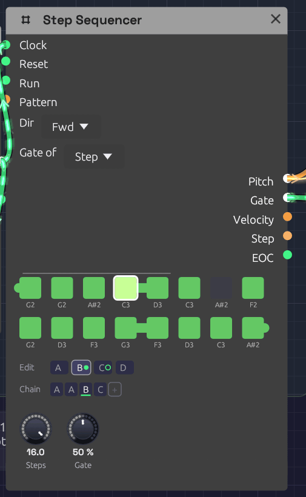

# Step Sequencer

**Module ID** `seq.step` · **Category** Utility


*Green steps play, dark steps rest; the outlined step is the one sounding now.*

The Step Sequencer plays a repeating pattern of up to 16 notes. Each clock pulse moves it one step along, and each step sends out its own pitch, a gate if the step is switched on, and a velocity. Patch **Pitch** into an oscillator and **Gate** into an envelope, and a [Clock](../modulation/clock.md) turns it into a bass line, an arpeggio or a riff.

The pattern lives on the node itself: a grid of step buttons with each step's note name underneath.

## Inputs

| Port | Signal Type | Description |
|------|-------------|-------------|
| **Clock** | Gate (Green) | Each rising edge advances one step |
| **Reset** | Gate (Green) | A rising edge jumps back to step 1 |
| **Run** | Gate (Green) | Steps advance only while this is high. With nothing patched, the sequencer runs |

## Outputs

| Port | Signal Type | Description |
|------|-------------|-------------|
| **Pitch** | Control (Orange) | The current step's note as V/Oct. Middle C (C4) is 0.0, the same as the Keyboard and MIDI modules |
| **Gate** | Gate (Green) | A pulse on each clock when the current step is switched on |
| **Velocity** | Control (Orange) | The current step's velocity, 0 to 1 |
| **Step** | Control (Orange) | The current position as a ramp: 0 on the first step, 1 on the last |
| **EOC** | Gate (Green) | End of cycle: a 1 ms pulse each time the pattern comes round |

## Parameters

| Control | Range | Default | Description |
|---------|-------|---------|-------------|
| **Steps** | 1 – 16 | 8 | How many steps play before the pattern loops |
| **Gate** (Gate Length) | 1 – 99% | 50% | How long each gate stays high, as a percentage of 100 ms |
| **Dir** (Direction) | Fwd / Bwd / P-P / Rnd | Fwd | Playback order |

Each of the 16 steps also stores a note (default C4), a gate on/off (default on) and a velocity (default 100 of 127). Patches save all of them.

## Programming a pattern

The grid shows one button per active step, in rows of eight. Steps beyond **Steps** are hidden, not lost: turn **Steps** back up and they return as you left them.

- **Click** a step to switch its gate on (green) or off (dark). An off step is a rest: Pitch still moves to its note, but no gate fires.
- **Right-click** a step to change its note: **Pitch +12 (Octave Up)**, **Pitch +1 (Semitone Up)**, **Pitch -1 (Semitone Down)** or **Pitch -12 (Octave Down)**. The note name under the step updates as you go.

While the patch plays, the current step is drawn brighter, with a white outline.

Velocities can't be edited on the node yet. Every step plays at 100 unless the patch file says otherwise. If you do set them there, patch **Velocity** into an envelope's **Velocity** input for accents.

## Timing

### Clock and gate length

The sequencer has no tempo of its own. It moves on each rising edge at **Clock**, so the clock you patch in sets the speed, and its swing or irregularity carries through.

**Gate** sets the length of each note as a share of a fixed 100 ms, not of the step. At 50% each gate lasts 50 ms; at 99%, 99 ms. Fast patterns (sixteenths at 120 BPM are 125 ms apart) stay detached at every setting, which suits plucks and basses. For longer notes, give the envelope a longer **Decay** and higher **Sustain**, or a longer **Release**.

### Reset and the first step

Each clock moves to the next step and sounds it, except the first clock after a **Reset**, which sounds the step the pattern starts from without moving past it. So a reset on the downbeat puts step 1 on the downbeat. The same goes for the first clock after the patch starts playing.

The start step is step 1 in every direction but **Bwd**, which starts from the last step. **Rnd** starts on step 1 too, then picks at random from the next clock on.

### Directions

| Dir | Order (with 4 steps) | EOC |
|-----|---------------------|-----|
| **Fwd** | 1 2 3 4 1 2 3 4 … | After step 4 |
| **Bwd** | 4 3 2 1 4 3 2 1 … | After step 1 |
| **P-P** (ping-pong) | 1 2 3 4 3 2 1 2 … | At each end |
| **Rnd** | A random step on each clock | Never |

Ping-pong doesn't repeat the end steps, so a four-step pattern bounces over six clocks.

## Patches

### A sequenced voice

```text
[Clock Gate] ──> [Step Sequencer Clock]
[Step Sequencer Pitch] ──> [Oscillator V/Oct]
[Step Sequencer Gate] ──> [ADSR Gate]
[Oscillator Out] ──> [SVF Filter In]
[SVF Filter LowPass] ──> [VCA In]
[ADSR Out] ──> [VCA CV]
[VCA Out] ──> [Audio Output Mono]
```

Set the Clock's **Div** to 1/8 or 1/16, switch a few steps off to make rests, and use the Oscillator's **Oct** knob to move the whole pattern up or down.

### Modulation sequences

**Pitch** is a control signal like any other. Patch it into a filter's **Cutoff** and each step sets a brightness instead of a note: one octave of cutoff for each octave of pitch. Combine with a second sequencer for melody, both clocked together.

### Patterns of different lengths

Two sequencers on the same clock with different **Steps** settings drift against each other and line up again only every few bars. Eight steps against five repeats every 40 clocks.

```text
[Clock Gate] ──> [Step Sequencer A Clock]      (Steps 8)
[Clock Gate] ──> [Step Sequencer B Clock]      (Steps 5)
```

### Stop and start

Patch a gate into **Run** to pause the pattern in place. While Run is low, clocks are ignored and the sequencer stays on its current step.

## Related modules

- [Clock](../modulation/clock.md): drives the sequencer
- [ADSR Envelope](../modulation/adsr.md): shapes each step's note from the Gate output
- [Oscillator](../sources/oscillator.md): plays the Pitch output
- [Sample & Hold](./sample-hold.md): stepped values that aren't programmed by hand
