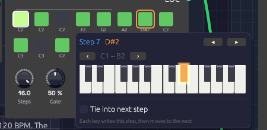
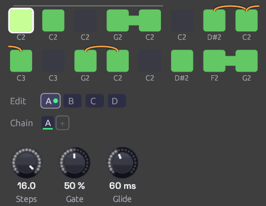

# Step Sequencer

**Module ID** `seq.step` · **Category** Utility


*Pattern B, playing. Green steps play, dark steps rest, and the outlined step is the one sounding now. A tied step reaches into the next one: here step 4 into 5, 12 into 13, and 16 round into the next pattern. The Chain plays A A B C; B wears the green dot, and C, ringed, comes next.*

The Step Sequencer plays a repeating pattern of up to 16 notes. Each clock pulse moves it one step along, and each step sends out its own pitch, a gate if the step is switched on, and a velocity. Patch **Pitch** into an oscillator and **Gate** into an envelope, and a [Clock](../modulation/clock.md) turns it into a bass line, an arpeggio or a riff.

The pattern lives on the node itself: a grid of step buttons with each step's note name underneath. Ties join a step to the next one for held notes and legato lines, and slides glide the pitch into chosen notes, the way a 303 or a Minimoog lead slurs a phrase. It holds four patterns, A to D, and plays them in the order its **Chain** gives, so a melody can run to 64 steps without repeating, and a verse and a chorus can share one sequencer.

## Inputs

| Port | Signal Type | Description |
|------|-------------|-------------|
| **Clock** | Gate (Green) | Each rising edge advances one step |
| **Reset** | Gate (Green) | A rising edge jumps back to step 1 |
| **Run** | Gate (Green) | Steps advance only while this is high. With nothing patched, the sequencer runs |
| **Pattern** | Control (Orange) | Picks the pattern for each pass in place of the Chain: 0 to 0.25 is A, 0.25 to 0.5 is B, then C, and D from 0.75 up |

## Outputs

| Port | Signal Type | Description |
|------|-------------|-------------|
| **Pitch** | Control (Orange) | The current step's note as V/Oct. Middle C (C4) is 0.0, the same as the Keyboard and MIDI modules. Glides into a slide step |
| **Gate** | Gate (Green) | High for each step that's switched on, for **Gate** of the step. Stays high across a tie and into a slide |
| **Velocity** | Control (Orange) | The current step's velocity, 0 to 1 |
| **Step** | Control (Orange) | The current position as a ramp: 0 on the first step, 1 on the last |
| **EOC** | Gate (Green) | End of cycle: a 1 ms pulse each time the whole Chain comes round. With a cable in **Pattern**, each time a pattern does |

## Parameters

| Control | Range | Default | Description |
|---------|-------|---------|-------------|
| **Steps** | 1 – 16 | 8 | How many steps play before the pattern loops |
| **Gate** (Gate Length) | 1 – 100% | 50% | How long each gate stays high, as a share of the step. 100% holds it until the next clock |
| **Glide** | 0 – 1 s | 60 ms | How long a [slide](#slides) takes to reach its note |
| **Dir** (Direction) | Fwd / Bwd / P-P / Rnd | Fwd | Playback order |
| **Gate of** (Gate Mode) | Step / 100 ms | Step | What **Gate** is a share of: the time between clock pulses, or a fixed 100 ms |

Each of the 16 steps of each pattern also stores a note (default C4), a gate on/off (default on), a tie (default off), a slide (default off) and a velocity (default 100 of 127). The Chain has up to eight slots. Patches save all of them. **Steps**, **Dir**, the gate settings and **Glide** are shared by all four patterns.

## Programming a pattern

The grid shows one button per active step, in rows of eight. Steps beyond **Steps** are hidden, not lost: turn **Steps** back up and they return as you left them.

- **Click** a step to switch its gate on (green) or off (dark). An off step is a rest: Pitch still moves to its note, but no gate fires.
- **Shift + click** a step to tie it into the next step. A bar joins the two. Shift + click again to untie.
- **Ctrl + click** a step to [slide](#slides) into it from the step before. An orange slur arches over the two. Ctrl + click again to strike it instead.
- **Drag** a step up or down to change its note, a semitone for every few pixels. The note it will land on shows above the step as you drag. Hold **Shift** while dragging to move by whole octaves. A drag is one undo step, however far it goes.
- **Right-click** a step to open its piano (below).

While the patch plays, the current step is drawn brighter, with a white outline.

### Writing a melody on the piano


*E2, G2 and A2 have just gone into steps 4 to 6. Step 6 was a rest, and playing a note on it switched it on. The orange outline on step 7 shows where the next key will land.*

Right-click a step and a two-octave piano opens under it, with the step's note lit. Click a key and three things happen: the step takes that note, the step switches on if it was a rest, and the outline moves along to the next step. Play a line of keys and you write the melody into the pattern one step after another, the way step-record works on a hardware sequencer. The piano stays where it opened, so the keys don't move while you play. After the last step it carries on at step 1.

- **◂ ▸** (or the **←** **→** keys) move to the previous or next step without writing anything. Use them to skip a step you want to keep, or to leave a rest as it is.
- **‹ ›** move the piano down or up an octave. It stays on that octave as you move from step to step.
- **Tie into next step** ties the step being written, the same as Shift + click.
- **Slide into this step** slides into the step being written, the same as Ctrl + click.
- **Esc**, or a click anywhere outside the piano, closes it.

Each note you write is its own undo step, so **Ctrl+Z** takes back the last key you played.

Velocities can't be edited on the node yet. Every step plays at 100 unless the patch file says otherwise. If you do set them there, patch **Velocity** into an envelope's **Velocity** input for accents.

## Patterns and the Chain

The tabs under the grid pick which pattern you're editing: clicking, dragging and the piano all write to the pattern on show. The one playing wears a green dot, and the one coming next a green ring. The playhead's outline only shows on the pattern playing. Which tab is open is the editor's choice: it isn't saved with the patch, and it isn't an edit. **Right-click** a tab to copy its pattern to another (to start a variation from it), or to clear it. Clearing turns every step into a rest but keeps the notes, ready for the piano to write a new line over.

The **Chain** is the order the patterns play in, a pass each, round and round. The pass playing is underlined. It works as on the [Trigger Sequencer](./trigger-sequencer.md#patterns-and-the-chain):

- **Click** a slot to change its pattern: A, B, C, D, then A again.
- **Right-click** it to pick a pattern, or to remove the slot. The slots after it move up.
- **+** adds a pass of the pattern you're editing to the end. The Chain holds up to eight.

A new Step Sequencer plays `A`, and so do patches saved before it had patterns, exactly as they always did. For a 64-step line, write four bars of it into A, B, C and D, and make the Chain `A B C D`. For a 16-bar verse whose first half repeats, `A A B C` will do.

A pass ends where the pattern comes round: after the last step going **Fwd**, after step 1 going **Bwd**, and at each turn in **P-P**, so a ping-pong bounces from one pattern into the next. In **Rnd** a pass is **Steps** clocks long. A tie on the last step carries into the first step of the next pattern, so a phrase can hold a note over the join, and a slide on the next pattern's first step slurs in from this one's last note.

### Pattern CV

With a cable in **Pattern**, the CV picks the patterns instead, and the Chain dims. The CV is read once a pass, on the clock that starts it, in the same four zones as the Trigger Sequencer's, so one CV means the same pattern on both. An [Arranger](./arranger.md) lane is made for this: a verse section that holds the lane at A and a chorus that holds it at B make one sequencer play the song's two melodies. The Arranger moves its lanes on the same clock edge the sequencer steps on, so a section's first note comes from its own pattern, with no lag. Leave that lane's **Glide** at 0.

## Timing

### Clock and gate length

The sequencer has no tempo of its own. It moves on each rising edge at **Clock**, so the clock you patch in sets the speed, and its swing or irregularity carries through.

**Gate** sets the length of each note as a share of the step. The sequencer measures the step from the clock itself, as the time between the last two pulses, so the notes follow the tempo. At 60 BPM in quarter notes, 50% is a 500 ms gate; at 120 BPM in sixteenths, it's 62.5 ms. Lower settings give staccato plucks, higher ones legato. If the tempo changes, the next step uses the new length. On a [swung](../modulation/clock.md#swing) clock, whose steps go long, short, long, short, each note is a share of its own step: long on the beat and short off it, so the shuffle keeps its shape.

At **100%** the gate stays high right up to the next clock. If the next step plays, the gate drops for a single sample there, so an envelope still starts a new note. If the next step is a rest, the gate falls on that clock.

Until it has seen two clock pulses, the sequencer has no step to measure. The first note after the patch starts uses the 100 ms rule below.

A **Reset** doesn't count the time since the last pulse as a step. That gap might be a pause while the clock was stopped, so the sequencer keeps the step it measured before.

### Ties

A tied step holds its gate across the next clock. If the next step plays, it continues the same note: **Pitch** moves to the new step's note, but the gate never drops, so an envelope stays in its sustain instead of starting again. Tie several steps in a row for one long note over all of them. Tie two steps with different notes and the second is played legato: one envelope, two pitches, the way a monosynth player slurs a phrase.

A tie into a rest just holds the note to the end of the tied step. A tie on a step that's switched off does nothing.

The next step is whichever plays next, so in **Bwd**, **P-P** or **Rnd** a tie carries into that one, though the bar on the grid always points right. Tie the last step to carry the note round into the first. At the end of a row the bar reaches out of the step's right side and into the left side of the next row's first step.

A held gate (a tie, or **Gate** at 100%) lets go after two steps' time if no clock comes, so stopping the clock doesn't leave a note hanging.

### Slides


*D#2 slides down to C2, and G2 slides to C2. The slur into step 9 breaks at the end of the row: C2 slides up an octave to C3. Steps 4 to 5 and 15 to 16 are ties.*

A slide step is slurred into from the note before it. Two things happen at its clock:

- **Pitch glides** from the last note to this one over the **Glide** time, instead of jumping. The glide is the Keyboard's [Glide](../midi/keyboard.md): even in pitch, and as quick across an octave as across a semitone, so a sequenced slide and a hand-played one sound alike. **Glide** is the time to get 99% of the way there.
- **The gate stays high.** The note before holds its gate until the slide begins, whatever **Gate** is set to, and the slide carries on from it without a new rising edge. An envelope isn't struck again, so a filter envelope with no sustain keeps falling through the slide instead of snapping open. That's the 303's sound: most notes are plucked, and the slid ones melt into the note before.

A slide needs a note to come from. After a rest, or as the first note after a **Reset**, a slide step is struck like any other and starts on its own pitch. Its slur on the grid is drawn faint after a rest. A slide on a step that's switched off does nothing.

Slides and ties combine. Tie a slide step into the next one on the same note to hold the slid note longer: a slow glide keeps gliding across the tie. A plain step after a slide jumps to its note and is struck as usual. With **Glide** at 0, a slide step jumps to its note but still keeps the gate high: one envelope, two pitches, the same as a tie into a different note.

The note before is whichever plays before, so in **Bwd**, **P-P** or **Rnd** a slide comes from that step, though the slur on the grid always comes from the left. A slide on step 1 slurs in from the note before it, in this pattern or the last one: round the loop, or over the join from the Chain's previous pattern. Each pattern keeps its own slides.

To hold the gate across the join, the note before a slide looks ahead to the step the next clock plays, in the pattern it will be in. With **Pattern** patched, it reads the CV as it is then, so a CV that changes pattern on the very clock of a slide can turn it back into a struck note.

### 100 ms gates

With **Gate of** at **100 ms**, **Gate** is a share of a fixed 100 ms instead of the step: 50% is always 50 ms, whatever the tempo. Short, even triggers like this suit drums. Ties still work in this mode. If a gate is still high when the next note starts, as 99% is at fast tempos, the two notes run together without a new attack.

Patches saved before the sequencer measured its steps open in this mode, so they sound as they always did. Switch them to **Step** for gates that follow the tempo.

### Reset and the first step

Each clock moves to the next step and sounds it, except the first clock after a **Reset**, which sounds the step the pattern starts from without moving past it. So a reset on the downbeat puts step 1 on the downbeat. The same goes for the first clock after the patch starts playing.

The start step is step 1 in every direction but **Bwd**, which starts from the last step. **Rnd** starts on step 1 too, then picks at random from the next clock on.

### Directions

| Dir | Order (with 4 steps) | EOC |
|-----|---------------------|-----|
| **Fwd** | 1 2 3 4 1 2 3 4 … | After step 4 |
| **Bwd** | 4 3 2 1 4 3 2 1 … | After step 1 |
| **P-P** (ping-pong) | 1 2 3 4 3 2 1 2 … | At each end |
| **Rnd** | A random step on each clock | Never |

Ping-pong doesn't repeat the end steps, so a four-step pattern bounces over six clocks.

## Patches

### A sequenced voice

```text
[Clock Gate] ──> [Step Sequencer Clock]
[Step Sequencer Pitch] ──> [Oscillator V/Oct]
[Step Sequencer Gate] ──> [ADSR Gate]
[Oscillator Out] ──> [SVF Filter In]
[SVF Filter LowPass] ──> [VCA In]
[ADSR Out] ──> [VCA CV]
[VCA Out] ──> [Audio Output Mono]
```

Set the Clock's **Div** to 1/8 or 1/16, switch a few steps off to make rests, and use the Oscillator's **Oct** knob to move the whole pattern up or down.

### An acid line

```text
[Clock Gate] ──> [Step Sequencer Clock]        (Div 1/16)
[Step Sequencer Pitch] ──> [Acid Bass Pitch]
[Step Sequencer Gate] ──> [Acid Bass Gate]
[Step Sequencer Velocity] ──> [Acid Bass Velocity]
[Acid Bass Out] ──> [Audio Output Mono]
```

The [Library](../../concepts/groups.md#the-library)'s **Acid Bass** snaps its filter open on every new gate. Write a 16-step line in the octave around C2, then Ctrl + click two or three of its notes to slide into them: an octave leap, or a step back down to the root. Those notes glide in under a filter that's still closing, and the rest stay plucked. Keep **Glide** short, 40 to 80 ms, for the 303's quick slur, or raise it to 200 ms or more for a lazier Minimoog lead.

### Modulation sequences

**Pitch** is a control signal like any other. Patch it into a filter's **Cutoff** and each step sets a brightness instead of a note: one octave of cutoff for each octave of pitch. Combine with a second sequencer for melody, both clocked together.

### Patterns of different lengths

Two sequencers on the same clock with different **Steps** settings drift against each other and line up again only every few bars. Eight steps against five repeats every 40 clocks.

```text
[Clock Gate] ──> [Step Sequencer A Clock]      (Steps 8)
[Clock Gate] ──> [Step Sequencer B Clock]      (Steps 5)
```

### Stop and start

Patch a gate into **Run** to pause the pattern in place. While Run is low, clocks are ignored and the sequencer stays on its current step.

The [Clock](../modulation/clock.md)'s **Run** and **Reset** outputs are made for this. Patch them into **Run** and **Reset** and the pattern stops with the Clock and starts again from step 1 when it does, including when the Clock follows a DAW's MIDI clock and you press Play there.

## Related modules

- [Clock](../modulation/clock.md): drives the sequencer
- [Arranger](./arranger.md): picks the pattern for each section of a song, through **Pattern**
- [Chord Sequencer](./chord-sequencer.md): a chord per step instead of a note, on polyphonic cables
- [Trigger Sequencer](./trigger-sequencer.md): eight lanes of drum hits from one module, with chained patterns for fills
- [Clock Divider](./divider.md): divides the clock, so a sequencer can play once every few bars from its **Run** and **Reset**
- [ADSR Envelope](../modulation/adsr.md): shapes each step's note from the Gate output
- [Slope](../modulation/slope.md): slews any signal, every change alike, where a slide picks its notes
- [Oscillator](../sources/oscillator.md): plays the Pitch output
- [Sample & Hold](./sample-hold.md): stepped values that aren't programmed by hand
