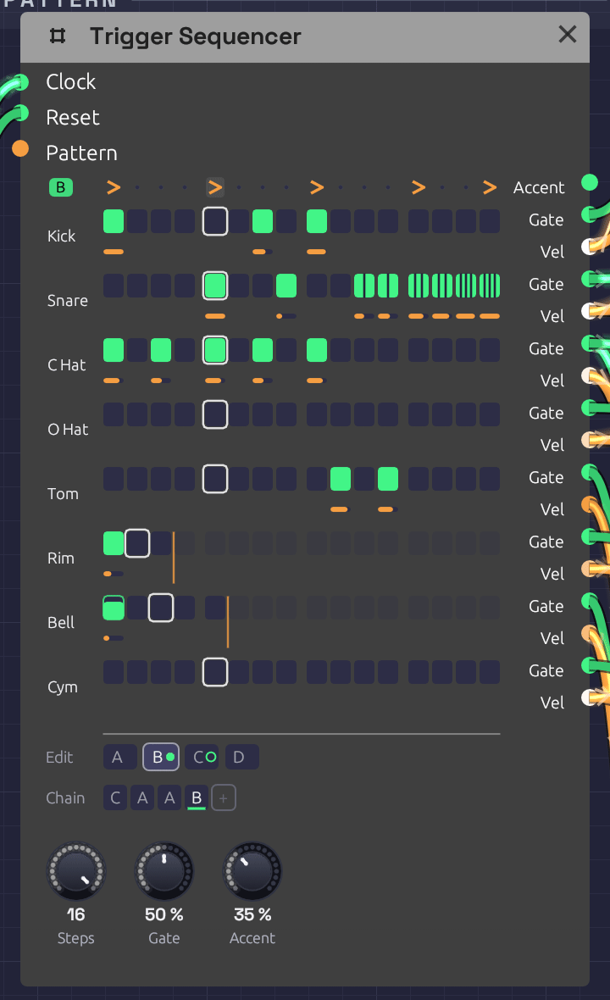

# Trigger Sequencer

**Module ID** `seq.trigger` · **Category** Utility

*Pattern B of the [Roll Call](../../recipes/roll-call.md) example, playing: a fill whose snare roll splits into ratchets, two, then three, then four hits a step. Each lane sits beside its own Gate and Vel jacks. The rim loops every 3 steps and the cowbell every 5, and the orange lines mark where they turn round. The Chain plays C A A B, and C, ringed, comes next.*

The Trigger Sequencer is a drum machine's sequencer. It has eight lanes of sixteen steps, and each lane has its own **Gate** and **Vel** output, so one module plays a whole kit: patch each lane into a [Drum](../sources/drum.md). It holds four patterns, A to D, and plays them in the order its **Chain** gives, so `A A A B` is a groove with a fill every fourth bar. Each step can play only some of the time, or roll two to four hits across its length.

Where the [Step Sequencer](./sequencer.md) plays a melody, one note at a time, the Trigger Sequencer plays rhythm, many hits at once. It has no pitch.

## Inputs

| Port | Signal Type | Description |
|------|-------------|-------------|
| **Clock** | Gate (Green) | Each rising edge plays the next step |
| **Reset** | Gate (Green) | A rising edge starts over: the next clock plays step 1 of the Chain's first pattern |
| **Pattern** | Control (Orange) | Picks the pattern for each new bar in place of the Chain: 0 to 0.25 is A, 0.25 to 0.5 is B, then C, and D from 0.75 up |

## Outputs

| Port | Signal Type | Description |
|------|-------------|-------------|
| **Accent** | Gate (Green) | A gate on every accented step, whichever lanes play on it |
| **Gate 1** – **Gate 8** | Gate (Green) | Each lane's hits. Patch into a Drum's **Trig**, or an envelope's **Gate** |
| **Vel 1** – **Vel 8** | Control (Orange) | The velocity of the lane's last hit, 0 to 1, raised on accented steps. It holds until the lane's next hit. Patch into a Drum's **Accent** |

## Parameters

| Control | Range | Default | Description |
|---------|-------|---------|-------------|
| **Steps** | 1 – 16 | 16 | How many steps make a bar. The pattern changes, and the Chain moves on, only where a bar starts |
| **Gate** (Gate Length) | 1 – 100% | 50% | How long each gate stays high, as a share of its step, or of its share of the step in a ratchet |
| **Accent** (Accent Amount) | 0 – 100% | 50% | How far an accented step raises every lane's velocity toward full |

Each pattern also stores, for every lane and step, whether the step plays, its velocity, its probability and its ratchet. It also stores an accent row. Each lane has a length, and the Chain has up to eight bars. The grid, the tabs and the Chain under it edit all of these, and patches save them.

## Programming a beat

Each lane is drawn on the two rows its jacks hang from. Pads sit on the **Gate** row, and each hit's velocity is an orange bar on the **Vel** row below. A lane is named after what its Gate cable plays: a Drum's type (Kick, Snare, C Hat, …), or the name of the module it feeds. A lane with nothing patched shows its number.

- **Click** a pad to add a hit, or take it away. A new hit plays at 80%, so an accent has room above it.
- **Drag** a pad up or down to set its velocity. Dragging an empty pad adds a hit at the velocity you drag to.
- **Shift + click** steps the ratchet through ×1, ×2, ×3 and ×4. A ratcheted pad splits into slivers, one per hit.
- **Ctrl + click** steps the probability through 100, 75, 50, 25 and 10%. A pad that only sometimes plays is outlined and filled only as far as its chance.
- **Alt + click** ends the lane at that step, so it loops on its own length (see [Polymeter](#polymeter)). Alt + click the last step again and the lane follows the bar.
- **Right-click** a pad for all of these in a menu.
- **Right-click** a lane's name to set its length from a grid of 1 to 16, or to clear the lane in this pattern.
- **Click** a step on the top row to accent it. Notation's accent mark, **>**, shows on accented steps.

Steps past the end of a lane fade. Each one keeps its settings for when the lane grows again.

Every click, and every drag, is one step of [undo](../../getting-started/interface-overview.md#the-toolbar), with a name that says what it did ("Ratchet ×3 on Snare step 14 of B"). Fast clicks on the grid don't run together.

While the patch plays, each lane's current step has a white outline, and a pad lights as it fires. The outline is faint while the grid shows a pattern other than the one playing.

## Patterns and the Chain

The tabs under the grid pick which pattern you're editing. The one playing wears a green dot, and the one coming next a green ring. Which tab is open is the editor's choice: it isn't saved with the patch, and it isn't an edit. **Right-click** a tab to copy its pattern to another, which is the quick way to start a fill from the groove, or to clear it.

The **Chain** is the order the patterns play in, a bar each, round and round. The bar playing is underlined.

- **Click** a bar to change its pattern: A, B, C, D, then A again.
- **Right-click** it to pick a pattern, or to remove the bar. The bars after it move up.
- **+** adds a bar of the pattern you're editing to the end. The Chain holds up to eight.

A new Trigger Sequencer plays `A`. For a fill every fourth bar, write the groove in A, copy it to B, change B's last few steps, and make the Chain `A A A B`. Every pattern change lands on a bar line, counted from the same clock as the steps, so the fill never drifts, however long the patch runs.

### Pattern CV

With a cable in **Pattern**, the CV picks the patterns instead, and the Chain dims. The CV is read once a bar, as the bar starts, so a pattern change always waits for the next bar line. A [Clock Divider](./divider.md)'s **Gate** through an [Attenuverter](./attenuverter.md) can switch to a fill on a phrase of its own, and an [LFO](../modulation/lfo.md) or [Sample & Hold](./sample-hold.md) can wander between patterns.

## Timing

### The clock

The sequencer has no tempo of its own. Each rising edge at **Clock** plays the next step, so a [Clock](../modulation/clock.md) at 1/16 plays sixteenths, and its [swing](../modulation/clock.md#swing) carries through.

**Gate** is a share of the step, which the sequencer measures from the clock, as the [Step Sequencer](./sequencer.md#clock-and-gate-length) does. On a swung clock, each step's gates are a share of that step, long or short. A Drum only listens for the rise of its trigger, so for drums **Gate** hardly matters. Envelopes care.

When a hit lands while its lane's gate is still high, the gate drops for one sample first, so every hit starts with a rising edge.

### Ratchets

A ratchet plays 2, 3 or 4 hits, evenly spaced across the step: ×3 on a sixteenth at 120 BPM is three hits 41.7 ms apart. The spacing comes from the measured step, so ratchets follow the tempo. On a swung clock, a step that runs long spreads its hits wider than a short one. Each hit has the step's velocity, and a gate that's **Gate** of its share of the step. The next clock ends any hits still to come.

Before the sequencer has seen two clock pulses it can't measure a step, so for the very first step it assumes a sixteenth at the patch's tempo (120 BPM if nothing sets one).

### Probability

A step with a probability below 100% rolls the dice each time its turn comes. If it plays, all of its ratchet's hits play. The dice fall the same way every time you press Play, so a take you liked can be played again.

### Accents

An accented step raises the velocity of every lane that plays on it, part of the way to full: at 50% **Accent**, a 60% hit plays at 80%, and a 100% hit stays at 100%. At 0% the accent row does nothing to the velocities. **Accent** also fires its own gate on every accented step, for anything else that should hear it: a filter's envelope, say, or a VCA.

### Polymeter

A lane left at its default follows the bar. Give a lane its own length and it loops that many steps however long the bar is. A lane 3 steps long against a 16-step bar plays a figure of three over a bar of four, and the two only line up again after 3 bars. Two lanes of 3 and 5 against 16 meet the bar again after 15 bars.

The bar and every lane count the same clock, so they drift against each other only on purpose. **Reset** starts them all together again.

## How patches store it

Every step is one parameter, named for its pattern, lane and step: `Step A1 01` is pattern A, lane 1, step 1. Its value reads as digits, **ratchet**, **probability**, **velocity**, and it's negative while the step is off:

| Value | Step |
|-------|------|
| `1100080` | One hit, always, at 80% |
| `3050100` | Three hits, half the time, at 100% |
| `-1100080` | Off. Click it and it plays one hit, always, at 80% |

An off step keeps its settings, so turning it off and on again changes nothing else. The accent row is `Accent A 01` to `Accent D 16`, the lanes' lengths `Length 1` to `Length 8` (0 follows the bar), and the Chain `Chain 1` to `Chain 8`.

## Tips

1. **One lane per drum.** Patch **Gate 1** into the kick's **Trig** and **Vel 1** into its **Accent**, and so on down the kit. The lane names follow.
2. **A choke group.** Patch the closed hat's **Gate** into the open hat's **Choke** as well as the closed hat's **Trig**, and a closed hat cuts an open one short.
3. **Ghost notes.** Drop a snare hit to 25–35% velocity. Through a Drum's **Accent** it plays darker as well as quieter.
4. **Rolls.** A ×2 on the last hat of a bar is a flam into the downbeat. ×3 and ×4 on the last snare hits of a fill are a press roll.
5. **Humanize.** A few hats at 75% or 50% chance keep a loop from sounding like one.
6. **Two kits.** A second Trigger Sequencer on the same Clock and Reset plays in lockstep with the first.

## Related

- [Roll Call](../../recipes/roll-call.md) – a full kit on one Trigger Sequencer, with a fill and crash every four bars
- [Arranger](./arranger.md) – a song's sections, with a lane that can pick this sequencer's pattern for each one
- [Drum](../sources/drum.md) – the voice each lane plays
- [Step Sequencer](./sequencer.md) – notes rather than hits
- [Clock](../modulation/clock.md) – tempo and swing
- [Clock Divider](./divider.md) – phrases, for Pattern or Reset
