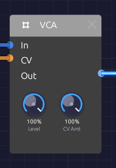

# VCA

**Module ID** `util.vca` · **Category** Utility


*Level sets the ceiling; whatever arrives at CV opens the gate up to it.*

A VCA (voltage-controlled amplifier) sets how loud a signal is, moment to moment, from a control signal. Patch an envelope into **CV** and a droning oscillator becomes a note that starts when you press a key and fades when you let go. Patch an LFO in instead and you have tremolo.

The VCA doesn't care what it's amplifying. Run an LFO through it instead of audio and the CV now sets how much modulation gets through, which is how you make vibrato that fades in or a filter wobble that follows an envelope.

The VCA is polyphonic. Patch a polyphonic voice through it and every voice gets its own gain, set by its own channel of the CV cable.

## Inputs

| Port | Signal Type | Description |
|------|-------------|-------------|
| **In** | Audio (Blue) | The signal to shape |
| **CV** | Control (Orange) | Gain, from 0 to 1. Values outside that range are clamped. With nothing patched, CV sits at 1 (fully open) |

## Outputs

| Port | Signal Type | Description |
|------|-------------|-------------|
| **Out** | Audio (Blue) | The input, scaled by Level and CV |

## Parameters

| Knob | Range | Default | Description |
|------|-------|---------|-------------|
| **Level** | 0 – 100% | 100% | Overall output level |
| **CV Amt** (CV Amount) | 0 – 100% | 100% | How much CV controls the level. At 0% the CV is ignored |

## How it works

The VCA multiplies the input by a gain:

```text
gain = Level × (1 - CV Amount + CV × CV Amount)
Out  = In × gain
```

With **CV Amt** at 100% (the default), the gain is **Level** times the CV: silent at CV 0, full Level at CV 1. Lower **CV Amt** and the VCA never closes completely. At 50%, a CV of 0 leaves the signal at half Level, so the envelope or LFO only takes away half the volume. That's a quick way to get a gentle tremolo, or a note that dips rather than stops.

The response is linear: a CV of 0.5 gives half the amplitude. Envelopes with curved stages (see [ADSR Envelope](../modulation/adsr.md)) give the fade its shape.

Both knobs are smoothed, so turning them while a note plays doesn't click.

### Bipolar signals into CV

CV is clamped to 0–1, so the negative half of a bipolar signal shuts the VCA. A bipolar LFO into CV gives a tremolo that's silent half the time. For an even tremolo, switch the LFO's **Bipolar** off so it swings from 0 to 1.

For the same reason, an audio-rate oscillator into CV doesn't give true ring modulation. The VCA passes the top half of the modulator's wave and blocks the bottom half: a rougher amplitude modulation with the carrier still audible.

## Patches

### Envelope-shaped note

The VCA's main job. The envelope opens it on each key press and closes it on release:

```text
[Keyboard Pitch] ──> [Oscillator V/Oct]
[Keyboard Gate] ──> [ADSR Gate]
[Oscillator Out] ──> [VCA In]
[ADSR Out] ──> [VCA CV]
[VCA Out] ──> [Audio Output Mono]
```

Without the VCA, the oscillator drones forever.

### Tremolo

```text
[LFO Out] ──> [VCA CV]          (LFO Bipolar off, Rate 4–8 Hz)
[Oscillator Out] ──> [VCA In] ──> [Audio Output Mono]
```

Turn **CV Amt** down to make the tremolo shallower.

### Modulation that follows a note

Put an LFO through the VCA and let an envelope set how much of it reaches the filter. The wobble swells as the note develops:

```text
[LFO Out] ──> [VCA In]
[ADSR Out] ──> [VCA CV]          (slow Attack)
[VCA Out] ──> [SVF Filter Cutoff]
```

### A polyphonic voice

With [Poly MIDI](../midi/poly-midi.md) feeding a polyphonic oscillator and envelope, one VCA handles every voice. Each voice's envelope opens its own channel:

```text
[Poly MIDI Gate] ──> [ADSR Gate]
[Oscillator Out] ──> [VCA In]
[ADSR Out] ──> [VCA CV]
[VCA Out] ──> [Audio Output Mono]
```

Voices add up at the output, so a four-note chord is about four times as loud as one note. Pull **Level** down to leave headroom. A mono cable into **CV** (a single LFO, say) is shared by every voice.

## Placement

The VCA usually sits after the filter and before the effects:

```text
[Oscillator] ──> [Filter] ──> [VCA] ──> [Delay] ──> [Reverb] ──> [Audio Output]
```

That way the delay and reverb hear each note's release and carry its tail on after the VCA has closed.

## Related modules

- [ADSR Envelope](../modulation/adsr.md): the usual CV source
- [LFO](../modulation/lfo.md): tremolo and modulation depth
- [Attenuverter](./attenuverter.md): scale or invert a CV before it reaches the VCA
- [Mixer](./mixer.md): combine several VCA outputs
