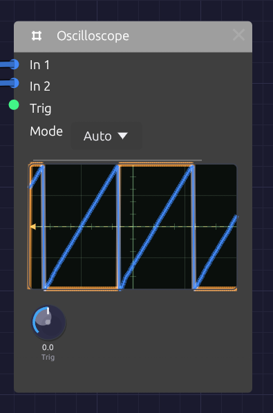

# Oscilloscope

**Module ID** `util.oscilloscope` · **Category** Utility


*Two traces, blue and orange, locked to the trigger level marked on the left edge.*

The Oscilloscope draws the shape of a signal as it plays. Patch an oscillator into it and you see its waveform; patch in the same oscillator after a filter and you see the filter rounding off its corners. It's the quickest way to check what a module is doing, and a good way to learn what a sound looks like.

It has two inputs, drawn as two overlaid traces, so you can compare a signal before and after a module. It passes nothing on: the scope only watches.

## Inputs

| Port | Signal Type | Description |
|------|-------------|-------------|
| **In 1** | Audio (Blue) | The first trace, drawn in blue. Its signal also starts each sweep |
| **In 2** | Audio (Blue) | The second trace, drawn in orange |
| **Trig** | Gate (Green) | External trigger. A rising edge starts a sweep |

Control signals patch into **In 1** and **In 2** as well. A polyphonic cable is summed into one trace.

## Parameters

| Control | Range | Default | Description |
|---------|-------|---------|-------------|
| **Mode** | Auto / Normal / Single / Free | Auto | How sweeps start (see below) |
| **Trig** (Trigger Level) | -1 to +1 | 0 | The level In 1 must rise through to start a sweep |

## Reading the display

The screen spans **-1 to +1** from bottom to top, the full range of an audio signal, with the center line at zero. A 4 × 4 grid helps you judge levels: each horizontal division is 0.5.

Each sweep shows 512 samples: about 11.6 ms at 44.1 kHz, or 10.7 ms at 48 kHz. That's a few cycles of a note in the middle of the keyboard: one cycle of C4 lasts 3.8 ms. The time scale is fixed.

The trigger point sits a quarter of the way across, so you see a little of what came just before each trigger. A small arrow and a dashed line on the left edge mark the trigger level.

## Triggering

Without triggering, each sweep would start at a random point in the wave and the picture would jitter. Triggering starts every sweep at the same point (where **In 1** rises through the trigger level), so a steady waveform stands still on the screen.

A rising edge at **Trig** starts a sweep too. Both work at once: whichever comes first starts the sweep.

| Mode | Behavior |
|------|----------|
| **Auto** | Sweeps on each trigger. If none arrives within about 50 ms, it sweeps anyway, so you always see something, even a flat line |
| **Normal** | Sweeps only on a trigger. With no trigger, the last picture stays on screen |
| **Single** | Captures one sweep on the next trigger and then holds it. Use it to freeze a transient, such as the attack of a note |
| **Free** | Ignores triggers and sweeps continuously. The picture scrolls unless the signal happens to line up |

In **Single** mode the held picture stays until the scope's state is reset, for example by stopping and restarting the transport.

If the picture won't stand still in Auto or Normal, the trigger level is probably outside the signal's range. A quiet signal that never rises through 0.5 never triggers at that level. Bring **Trig** back toward 0.

## What it's good for

The scope is built for audio-rate signals, where a few milliseconds show whole cycles.

- **Waveforms.** Compare the Oscillator's four waves, watch pulse width change the square, or see unison voices drift in and out of phase.
- **Filters.** Put the raw oscillator on In 1 and the filter's output on In 2. Watch the corners round off as the cutoff falls, and resonance ring at the cutoff frequency.
- **Distortion and saturation.** See the Ladder filter's Drive or the Distortion module flatten and fold a sine.
- **Levels.** A trace that runs flat along the top or bottom edge is at full scale, and may be clipping.

Slow signals (LFOs, envelopes, sequences) take far longer than one sweep, so here they show as a near-flat line moving up and down. To see their shape, watch their cables instead: control cables draw their signal as it travels. See [Reading the signal in a cable](../../concepts/connections.md#reading-the-signal-in-a-cable).

## Patches

### Before and after

```text
[Oscillator Out] ──> [SVF Filter In]
[Oscillator Out] ──> [Oscilloscope In 1]
[SVF Filter LowPass] ──> [Oscilloscope In 2]
```

Sweep the filter's **Cutoff** and watch the orange trace smooth out while the blue one stays sharp.

### Hard sync

With In 1 on the master oscillator, the picture locks to its pitch, and In 2 shows the synced oscillator restarting its cycle in time:

```text
[Oscillator 2 Out] ──> [Oscillator 1 Sync]
[Oscillator 2 Out] ──> [Oscilloscope In 1]
[Oscillator 1 Out] ──> [Oscilloscope In 2]
```

### Catch a note's attack

Set **Mode** to **Single**, patch the VCA's output into **In 1**, and set **Trig** a little above zero, such as 0.1. Play a note and the scope freezes its first few milliseconds.

## Related modules

- [Oscillator](../sources/oscillator.md): the first thing to look at
- [SVF Filter](../filters/svf-filter.md) and [Ladder Filter](../filters/ladder-filter.md): see what filtering does to a waveform
- [Audio Output](../output/audio-output.md): its meter shows levels at the end of the chain
