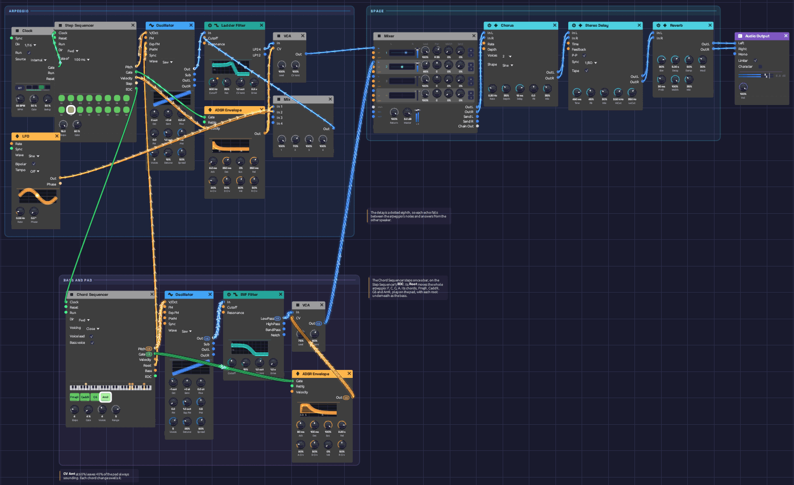

# Afterglow

A patch that plays itself and sounds finished: a soft, plucked arpeggio rolls through a four-chord progression over a warm pad. Its notes bounce between the speakers on dotted-eighth tape echoes. A Step Sequencer plays the arpeggio. A Chord Sequencer moves it from chord to chord and plays the same chords on the pad: Fmaj9, Cadd9, G6, Am9.

> **Load it:** choose **📚 Examples → Afterglow** in the toolbar and press **▶ Play**. It needs no keyboard.
> The patch file is [`patches/afterglow.json`](https://github.com/chrischaps/Soba/blob/master/patches/afterglow.json).

<iframe class="patch-embed" src="../play/?patch=afterglow" title="Afterglow, playable in the browser" loading="lazy"></iframe>
*Or play it here: press **▶ Play** in the corner. The full app is a click away under **Open in Soba**.*


*The arpeggio voice and the effects run along the top, and the pad runs along the bottom. The cable from the Chord Sequencer's **Root** up to the arpeggio's oscillator is what moves the arpeggio from chord to chord.*

## What it teaches

- **Transposing with a second sequencer.** Pitch inputs add up, so one sequencer can shift another's notes. Here the Chord Sequencer's **Root** moves the arpeggio over four chords.
- **Clocking from end of cycle.** A sequencer's **EOC** output can clock a second sequencer, so the second one moves once per bar.
- **Chords on one cable.** The Chord Sequencer sends each chord down a polyphonic cable, voiced and voice-led, with the bass underneath. One pad voice plays the whole progression.
- **Chords without a third.** Sus2 shapes are neither major nor minor, so the same arpeggio shape works on any root.
- **Two voices, one space.** A bright lead and a dark pad share one chorus, delay and reverb, so they sound as if they're in the same room.

## Modules

| Module | Settings |
|--------|----------|
| [Clock](../modules/modulation/clock.md) | **BPM** 92, **Div** 1/16 |
| [Step Sequencer](../modules/utilities/sequencer.md) (arpeggio) | **Steps** 16, **Gate** 60%, **Gate of** 100 ms. Notes C4 G4 D5 C5 G5 D5 G4 C5 C4 G4 D5 G5 C6 G5 D5 G4, step 10 off |
| [Chord Sequencer](../modules/utilities/chord-sequencer.md) | **Steps** 4, **Gate** 4%, **Voices** 4, **Range** 5, **Voicing** Close, **Voice lead** on, **Bass voice** on. Chords Fmaj9 (F3), Cadd9 (C4), G6 (G3), Am9 (A3) |
| [Oscillator](../modules/sources/oscillator.md) 1 | **Wave** Saw, **Voices** 2, **Detune** 12%, **Exp FM** 1.0 oct |
| [Ladder Filter](../modules/filters/ladder-filter.md) | **Cutoff** 900 Hz, **Res** 35%, **Drive** 2.2x |
| [ADSR Envelope](../modules/modulation/adsr.md) 1 | **Atk** 2 ms, **Dec** 350 ms, **Sus** 0%, **Rel** 350 ms, **Vel** 60% |
| [LFO](../modules/modulation/lfo.md) | **Rate** 0.04 Hz, **Wave** Sine, **Bipolar** on |
| [Mix](../modules/utilities/mix.md) (filter sweep) | **Level 1** 100%, **Level 2** 70% |
| [VCA](../modules/utilities/vca.md) 1 | Defaults |
| [Oscillator](../modules/sources/oscillator.md) 2 | **Wave** Saw, **Oct** −1, **Voices** 5, **Detune** 25%, **Spread** 60% |
| [SVF Filter](../modules/filters/svf-filter.md) | **Cutoff** 420 Hz, **Res** 15% |
| [ADSR Envelope](../modules/modulation/adsr.md) 2 | **Atk** 80 ms, **Dec** 100 ms, **Sus** 100%, **Rel** 2.2 s, **Vel** 0% |
| [VCA](../modules/utilities/vca.md) 2 | **Level** 75%, **CV Amt** 60% |
| [Mixer](../modules/utilities/mixer.md) | **Level 1** 100%, **Level 2** 65%, **Pan 1** R 35, **Master** +3 dB |
| [Chorus](../modules/effects/chorus.md) | **Rate** 0.3 Hz, **Depth** 35%, **Delay** 12 ms, **Voices** 2, **Mix** 35% |
| [Stereo Delay](../modules/effects/delay.md) | **Sync** 1/8D, **FB** 45%, **Mix** 30%, **HiCut** 3.5 kHz, **LoCut** 350 Hz, **P-P** on, **Tape** on |
| [Reverb](../modules/effects/reverb.md) | **Size** 80%, **Decay** 5 s, **PreD** 30 ms, **Mix** 35%, **Mod** 30% |
| [Audio Output](../modules/output/audio-output.md) | **Vol** 100% |

## How it's built

### One shape, four chords

```text
[Clock Gate] ──> [Step Sequencer Clock]
[Step Sequencer Pitch] ──> [Oscillator 1 V/Oct]
[Step Sequencer EOC] ──> [Chord Sequencer Clock]
[Chord Sequencer Root] ──> [Oscillator 1 Exp FM]
```

The Step Sequencer plays a sixteen-step arpeggio at one note per sixteenth. It uses four notes: C, G, D and the octave C, which are a chord's root, fifth, ninth and octave. They're spread over two octaves.

The Chord Sequencer holds the chord. It's clocked by the Step Sequencer's **EOC** output, which pulses each time the arpeggio wraps around, so it steps once per bar. Its **Root** output carries each chord's root as a single pitch: F3, C4, G3, A3. That goes into Oscillator 1's **Exp FM** input, and with **Exp FM** at 1.0 octave per volt that input works exactly like a second **V/Oct**. The oscillator adds the two pitches together. C4 is zero volts, so a chord on F3 moves the whole arpeggio down seven semitones, and C4 leaves it where it is.

The arpeggio's shape has no third. Without one, a chord is neither major nor minor (it's a *sus2*). So moving the shape doesn't change its mood, and on these four roots every note it plays stays on the white keys, in C major. The pad decides what the chords are (below). Fmaj9, Cadd9, G6 and Am9 each contain the root, fifth and ninth the arpeggio plays over them, so the two parts always agree.

### The pluck

```text
[Oscillator 1 Out] ──> [Ladder Filter In]
[Ladder Filter LP24] ──> [VCA 1 In]
[Step Sequencer Gate] ──> [ADSR 1 Gate]
[Step Sequencer Velocity] ──> [ADSR 1 Velocity]
[ADSR 1 Out] ──> [VCA 1 CV]
             ──> [Mix In 1]
[LFO Out] ──> [Mix In 2]
[Mix Out] ──> [Ladder Filter Cutoff]
```

Two slightly detuned saws go through the ladder filter's 24 dB lowpass. A fast envelope opens both the VCA and the filter, so each note starts bright and dulls as it fades, like a plucked string. Each step has its own velocity. The loud ones fall on steps 1, 4, 7, 11 and 14, a 3-3-4-3-3 pattern that pushes against the even sixteenths, so the line grooves instead of ticking.

The Mix adds a very slow LFO to the envelope before both reach **Cutoff**. Over 25 seconds the whole arpeggio gets darker and then brighter again. One cycle of the LFO lasts nearly ten bars, so each pass through the progression sounds a little different.

### The pad

```text
[Chord Sequencer Pitch] ──> [Oscillator 2 V/Oct]     (poly, 4 channels)
[Oscillator 2 Out] ──> [SVF Filter In]
[SVF Filter LowPass] ──> [VCA 2 In]
[Chord Sequencer Gate] ──> [ADSR 2 Gate]
[ADSR 2 Out] ──> [VCA 2 CV]
```

The Chord Sequencer plays the bass and the chords on one cable. With **Bass voice** on and **Voices** at 4, its **Pitch** carries the root on its first channel and three chord tones above it. The oscillator, filter, envelope and VCA are all polyphonic, so each channel gets its own five detuned saws, an octave down. The Mixer hears the four channels summed.

The bass is the root: F2, C3, G2, A2. Because the bass already has it, each chord leaves out its own root and plays its colour tones instead. For Fmaj9 that's its 3rd, 7th and 9th (A, E, G), and for Am9 the same (C, G, B). With **Voice lead** on, each chord takes the inversion nearest the last, so from bar to bar each of the pad's voices holds its note or moves a third at most. The SVF filter at 420 Hz keeps it all dark and round: a glow under the arpeggio rather than a second part.

VCA 2's **CV Amt** of 60% means the envelope controls only part of the level, and the other 40% is always there. So the pad never stops. On each chord change, the sequencer's short gate (4% of the bar, about 100 ms) fires ADSR 2, and the pad swells, then settles back over two seconds. The very first bar plays over Fmaj9 before the Chord Sequencer has had a clock. The sequencer already sends that first chord, with its gate low, so the pad comes in quietly and blooms on the first change.

### Echoes and space

```text
[VCA 1 Out] ──> [Mixer Ch 1]       (Pan R 35)
[VCA 2 Out] ──> [Mixer Ch 2]       (Pan C)
[Mixer Out L/R] ──> [Chorus In L/R]
[Chorus Out L/R] ──> [Stereo Delay In L/R]
[Stereo Delay Out L/R] ──> [Reverb In L/R]
[Reverb Out L/R] ──> [Audio Output Left/Right]
```

The Mixer sets the arpeggio a little to the right and keeps the pad, which carries the bass, in the middle. Its **Master** at +3 dB wins back the 3 dB that panning takes from a centred sound on each side. The Chorus widens both parts. The Stereo Delay is synced to a dotted eighth, which is three sixteenths. Each echo therefore falls between the notes of the arpeggio, and **Ping-Pong** moves it to the other speaker. The arpeggio sounds busier than it is, the echoes stay in time with it, and the rhythm keeps moving. **Tape** gives the repeats a little wobble and wear. **LoCut** keeps the bass out of the echoes, so the low end stays clean. The first echo of each note leaves from the arpeggio's side and lands on the other, so the echoes answer the notes across the room. A medium reverb with a five-second tail puts everything in the same room.

## Variations

**A new progression.** Right-click a Chord Sequencer step to change its root and type. Roots on C, D, F, G and A keep the arpeggio in C major, and types like Dm9 or G6 suit them. E and B roots add an F♯ or a C♯ to the arpeggio, which can sound lovely, but the arpeggio and the pad won't share a key.

**A longer progression.** Set the Chord Sequencer's **Steps** to 8 and fill in four more chords, for example Fmaj9 Cadd9 G6 Am9 Fmaj9 Cadd9 Dm9 G6.

**A bigger pad.** Turn **Voices** up to 5 or 6, for the 5ths and doubled notes, and set **Voicing** to Spread. Lower VCA 2's **Level** to keep the arpeggio on top.

**The original sus2 pad.** Switch **Bass voice** off and set **Voices** to 1. The pad then plays only the roots, as Afterglow did before the Chord Sequencer.

**A different arpeggio.** Set the Step Sequencer's **Dir** to P-P to rock back and forth, or Rnd for a new order every bar. Any order of the four notes still fits the chord.

**Triplet shimmer.** Set the delay's **Sync** to 1/8T. The echoes now land in threes against the sixteenths.

**Glassier.** Switch Oscillator 1's **Wave** to Tri and raise the Ladder Filter's **Cutoff** to 2 kHz. The pluck goes from felt to glass.

**Slower and wider.** Turn the Clock down to 70 BPM. The delay follows the new tempo. Then raise the Reverb's **Decay** to 9 s and its **Mix** to 50%.

## Related

- [Chord Sequencer](../modules/utilities/chord-sequencer.md) – chord types, voicing and the bass voice
- [Step Sequencer](../modules/utilities/sequencer.md) – editing steps and the EOC output
- [Oscillator](../modules/sources/oscillator.md) – V/Oct and Exp FM
- [Generative Ambient](./generative-ambient.md) – one sequencer, and a second voice that wanders in key
- [Rhythmic Sequence](./rhythmic-sequence.md) – the same dotted-eighth delay under an acid bassline
