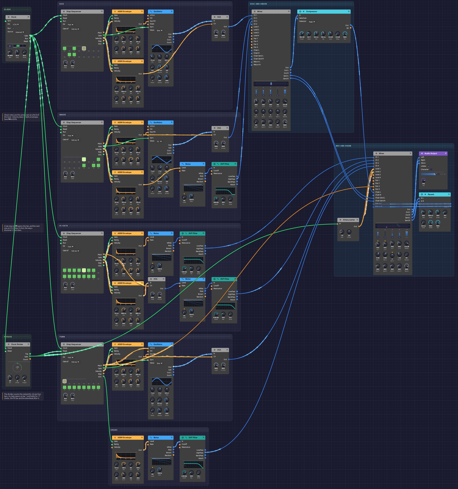

# Backbeat

A whole drum kit with no samples in it: a kick that drops in pitch, a snare with ghost notes between the backbeats, a hi-hat that opens and gets choked shut, a run down the toms every fourth bar, and a crash where the fill lands. Every drum is an oscillator or a noise source shaped by an envelope. It plays itself; press Play and let it run.

> **Load it:** choose **📚 Examples → Backbeat** in the toolbar and press **▶ Play**. It needs no keyboard.
> The patch file is [`patches/backbeat.json`](https://github.com/chrischaps/Modular/blob/master/patches/backbeat.json).

<iframe class="patch-embed" src="../play/?patch=backbeat" title="Backbeat, playable in the browser" loading="lazy"></iframe>
*Or play it here: press **▶ Play** in the corner. The full app is a click away under **Open in Modular**.*


*One lane per drum, from the top: kick, snare, hi-hats, toms, crash. The clock is at the top left. The Clock Divider that schedules the fill sits lower down in the same column. Kick and snare mix to the centre at the top right. Below and to the right, the main Mixer brings the whole kit together, shares one small room among every drum, and feeds the output.*

## What it teaches

- **Drums from oscillators and noise.** A kick is a sine that falls in pitch. A snare is a tone plus a burst of filtered noise. Hats and cymbals are noise with the low end removed.
- **Accents and ghost notes.** Each sequencer step has a velocity, and the envelopes turn velocity into loudness. The same snare plays a backbeat and a whisper.
- **A sequencer's pitch as a switch.** The hi-hat lane's pitch output is a flag that says whether the hat is open. That flag also chokes it.
- **Phrases longer than a bar.** A 16-step sequencer loops every bar. For a fill every fourth bar, a Clock Divider counts the sixteenths and opens a gate once every 64.
- **One room for the whole kit.** Two Mixers chain together, and each drum sends its own amount to a single reverb, as on a mixing console.

## The pattern

Sixteen steps a bar at 96 BPM. `X` is an accent, `x` a softer hit, `g` a ghost note, `o` an open hat, `~` a hat still ringing.

```text
step     1 . . . 5 . . . 9 . . . 13. . .
kick     X . x . . . . . . x X . . . . .
snare    . . . . X . . g . . . . X . g g
hats     X x x x X x o ~ X x x x X x o ~
toms (every 4th bar)     G G D D A A E E
crash    on the downbeat after each fill
```

## Modules

| Module | Settings |
|--------|----------|
| [Clock](../modules/modulation/clock.md) | **BPM** 96, **Div** 1/16 |
| [Step Sequencer](../modules/utilities/sequencer.md) ×4 (kick, snare, hats, toms) | **Steps** 16, **Gate** 99%, **Gate of** 100 ms. Steps as in the pattern above |
| [Oscillator](../modules/sources/oscillator.md) (kick) | **Wave** Sine, **Oct** -2, **Semi** -3 (55 Hz), **Exp FM** 2.6 oct |
| [ADSR Envelope](../modules/modulation/adsr.md) (kick pitch) | **Atk** 1 ms, **Dec** 45 ms, **Sus** 0%, **Rel** 45 ms, **Vel** 30% |
| [ADSR Envelope](../modules/modulation/adsr.md) (kick level) | **Atk** 1 ms, **Dec** 450 ms, **Sus** 0%, **Rel** 450 ms, **Vel** 40% |
| [Oscillator](../modules/sources/oscillator.md) (snare body) | **Wave** Tri, **Oct** -1, **Semi** +7 (196 Hz), **Exp FM** 0.6 oct |
| [ADSR Envelope](../modules/modulation/adsr.md) (snare body) | **Dec** 90 ms, **Rel** 90 ms, **Vel** 85% |
| [Noise](../modules/sources/noise.md) + [SVF Filter](../modules/filters/svf-filter.md) (snare) | **Level** 0%; HighPass, **Cutoff** 1.8 kHz, **Res** 25% |
| [ADSR Envelope](../modules/modulation/adsr.md) (snare noise) | **Dec** 170 ms, **Rel** 170 ms, **Vel** 85% |
| [Noise](../modules/sources/noise.md) + [SVF Filter](../modules/filters/svf-filter.md) (closed hat) | **Level** 0%; HighPass, **Cutoff** 7.5 kHz, **Res** 30% |
| [Noise](../modules/sources/noise.md) + [SVF Filter](../modules/filters/svf-filter.md) (open hat) | **Level** 0%; HighPass, **Cutoff** 6 kHz, **Res** 25% |
| [ADSR Envelope](../modules/modulation/adsr.md) (closed / open hat) | **Dec** 45 ms / 800 ms, same **Rel**, **Vel** 70% / 50% |
| [VCA](../modules/utilities/vca.md) (hat choke) | **Level** 85% |
| [Oscillator](../modules/sources/oscillator.md) (toms) | **Wave** Sine, **Oct** -1, **Semi** +2, **Exp FM** 0.35 oct |
| [ADSR Envelope](../modules/modulation/adsr.md) (toms) | **Dec** 320 ms, **Rel** 320 ms, **Vel** 60% |
| [Clock Divider](../modules/utilities/divider.md) (phrase) | **Div** 64, **Offset** 0, **Length** 17 |
| [Noise](../modules/sources/noise.md) + [SVF Filter](../modules/filters/svf-filter.md) (crash) | **Level** 0%; HighPass, **Cutoff** 4.2 kHz, **Res** 20% |
| [ADSR Envelope](../modules/modulation/adsr.md) (crash) | **Dec** 1.6 s, **Rel** 1.6 s, **Vel** 0% |
| [Attenuverter](../modules/utilities/attenuverter.md) (hat mute) | **Amount** -1.0 |
| [Mixer](../modules/utilities/mixer.md) (kick and snare) | **Lv 1** 60% kick, **Lv 2** 40% snare body, **Lv 3** 45% snare noise; **Send 2** and **Send 3** 30% |
| [Compressor](../modules/effects/compressor.md) | **Thresh** -16 dB, **Ratio** 3:1, **Atk** 8 ms, **Rel** 120 ms, **Mkup** 2 dB |
| [Mixer](../modules/utilities/mixer.md) (main) | Hats 44% at R 30 / R 35, toms 40%, crash 36% at L 40; every **Send** 25%; **Master** −2 dB |
| [Reverb](../modules/effects/reverb.md) | **Size** 35%, **Decay** 0.9 s, **Damp** 55%, **PreD** 2.5 ms, **Mix** 100% |
| [Audio Output](../modules/output/audio-output.md) | **Vol** 91% |

All drum envelopes have a 1 ms attack and 0% sustain. The sequencers' gates are a fixed 99 ms (**Gate of** 100 ms), so each envelope's **Release** matches its **Decay**: the sound falls at the same rate after the gate closes.

## How it's built

### The kick

```text
[Kick Seq Gate] ──> [Kick Pitch Env Gate]  [Kick Level Env Gate]  [Oscillator Sync]
[Kick Pitch Env Out] ──> [Oscillator Exp FM]
[Oscillator Out] ──> [VCA In]
[Kick Level Env Out] ──> [VCA CV]
```

A kick drum's thump is a pitch falling fast. The pitch envelope, at 2.6 octaves of **Exp FM**, starts the sine at about 330 Hz and drops it to 55 Hz in about 45 ms. The ear hears the drop as the beater hitting the drum and the low sine as the body. The same gate patched into **Sync** restarts the sine at zero on every hit. Without it, each kick would start at a random point in the cycle and land slightly differently.

### The snare

```text
[Snare Seq Gate] ──> [Body Env Gate]  [Noise Env Gate]  [Oscillator Sync]
[Body Env Out] ──> [Oscillator Exp FM]  [VCA CV]
[Noise Env Out] ──> [Noise Level]
[Noise White] ──> [SVF Filter In]
```

A snare is two sounds. A triangle at 196 Hz, with a short dip in pitch, is the drum's shell. White noise above 1.8 kHz is the rattle of the wires under it. The noise lasts about twice as long as the tone, so each hit ends in a hiss.

Both envelopes have **Vel** at 85%, so velocity matters. The backbeats on 2 and 4 play at 122. The ghost notes at 26 to 40 come out about a third as loud. They sit under the groove and make it swing a little, the way a drummer's left hand does.

### Hats that choke

```text
[Hat Seq Gate] ──> [Closed Env Gate]  [Open Env Gate]
[Closed Env Out] ──> [Noise (closed) Level]
[Open Env Out] ──> [VCA (choke) In]
[Hat Seq Pitch] ──> [VCA (choke) CV]
[VCA (choke) Out] ──> [Noise (open) Level]
```

On a real hi-hat, the open sound rings until the drummer closes the pedal. Every hat step fires both envelopes. The open hat's long envelope only reaches its noise through a VCA, and the hat lane's **Pitch** output opens that VCA. Steps set to C4 send 0 V and keep it shut. Steps set to C5 send 1 V and open it.

So on steps 7 and 15, set to C5, the hat opens. Steps 8 and 16 are also set to C5 but their gates are off, so the hat keeps ringing. On steps 9 and 1 the pitch drops back to C4, and the VCA cuts the ringing off as the closed hat plays. That's the choke. To make the hat ring longer, set the next step to C5 too.

### The fill and the crash

```text
[Clock Gate] ──> [Clock Divider Clock]
[Clock Divider Gate] ──> [Tom Seq Run]  [Tom Seq Reset]  [Attenuverter In]
[Attenuverter Out] ──> [Mixer Level 1]  [Mixer Level 2]
[Tom Seq EOC] ──> [Crash Env Gate]
```

A 16-step sequencer can't wait three bars before it plays. The Clock Divider does the waiting. It counts the Clock's sixteenths, and 64 of them are four bars. On count 0, the downbeat of bar 1, its **Gate** opens: the tom sequencer resets to step 1 and starts running. The toms play their fill on steps 9 to 16, two hits on each drum from G down to E.

The Gate stays open for 17 clocks, **Length** 17: the fill bar and the downbeat after it. That one extra clock lets the tom sequencer take one more step and wrap round, and its **EOC** pulse strikes the crash on the next downbeat. Then the Gate closes and the toms wait for count 0 again. The same Gate, inverted by the Attenuverter, pulls both hat faders to zero, so the hats stop for the fill and come back with the crash.

Because the divider counts the Clock's own pulses, it can't drift from the beat, however long the patch plays, and it follows the Clock to any tempo. The fill also plays in the very first bar, so the patch opens with a count-in down the toms and lands on a crash.

### Toms across the kit

```text
[Tom Seq Pitch] ──> [Oscillator V/Oct]  [Mixer Pan 3]
```

One oscillator plays all four toms. The sequencer's **Pitch** picks the drum, with the toms tuned in fourths: G, D, A, E. The same pitch goes into the Mixer's **Pan 3**, so high toms sit right and low ones left. The fill sweeps across the stereo field, the way a real kit does from the audience.

### Mixing

```text
[Kick/Snare Mixer Out] ──> [Compressor In]
[Compressor Out] ──> [Main Mixer Chain L]
[Kick/Snare Mixer Send L/R] ──> [Main Mixer Chain Send L/R]
[Main Mixer Send L/R] ──> [Reverb In L/R]
[Reverb Out L/R] ──> [Main Mixer Return L/R]
[Main Mixer Out L/R] ──> [Audio Output Left/Right]
```

Kick and snare go to the first Mixer's mono **Out** and through a compressor, which glues them together. The compressor's 8 ms attack lets each hit's crack through before it starts to work. Its output comes into the main Mixer on **Chain L** alone, so it lands dead centre. Hats, toms and crash have the main Mixer's four channels, each panned to its place.

There is one room for the whole kit: a short reverb, 0.9 seconds long and fully wet. Every drum decides how much of it to hear. On the main Mixer each channel sends 25%. On the first Mixer, the snare's two channels send 30% and the kick sends nothing, so the low end stays tight and dry. The snare's sends travel to the main Mixer on **Chain Send**, join its own, and the reverb hears them all on the main Mixer's **Send L** and **Send R**.

The reverb comes back on the main Mixer's **Return**. That closes a loop, from the Mixer to the reverb and back, which the Return allows by hearing the reverb one audio block late, about 5 ms. The reverb's pre-delay is 2.5 ms, a little shorter than the room's natural 8 ms, to make up for it.

The hats, toms and crash have exactly the balance they had when the whole second Mixer ran through the reverb at 20%: faders at 0.8 of their old level keep the dry, and a 25% send after them keeps the wet.

## Variations

**Tighter or looser kick.** Shorten the kick pitch envelope's **Dec** to 25 ms for a clicky dance kick, or lengthen it to 90 ms for a boomy one. Raise the level envelope's **Dec** to 900 ms for an 808-style tail.

**More snare.** Turn the snare filter's **Cutoff** down to 900 Hz for a fatter, rougher snare, or set it to BandPass at 4 kHz for a thin, crisp one.

**Busier hats.** Set another step to C5 to open the hat there. Set the step after it to C5 as well to let it ring.

**Half-time.** Turn off the snare's steps 5 and 13 and turn on step 9. With one backbeat a bar instead of two, the same tempo feels half as fast and twice as heavy.

**A different fill.** The toms play steps 9 to 16. Turn on steps 1 to 8 for a whole-bar fill, or change the pitches for a different run.

**More room, or less.** The snare's **Send 2** and **Send 3** on the kick-and-snare Mixer set how far back it sits: 60% pushes it to the back of the room, 0% puts it right in your ear. Turn the main Mixer's **Send 1** and **Send 2** down for dry, close hats, or **Send 4** up for a crash that hangs in the air.

**Swing it.** Turn the Clock's **Swing** to about 58%. Every off-beat sixteenth lands a little late, while the downbeats and the backbeat stay on the grid. The pattern stops sounding programmed and starts to sit in a pocket. At 66% it becomes a full triplet shuffle.

**Faster or slower.** Turn the Clock's **BPM**. The fill stays on every fourth bar at any tempo, because the divider counts the Clock's own sixteenths.

**A longer phrase.** Set the Clock Divider's **Div** to 128 for a fill every eighth bar. Set **Offset** to 48, or 112 with **Div** 128, and the fill moves to the last bar of the phrase, with the crash on the first bar of the next one, the way drummers usually phrase it.

## Related

- [Rhythmic Sequence](./rhythmic-sequence.md) – the noise hi-hat this kit's hats grew from
- [Afterglow](./afterglow.md) – another patch where one sequencer's end of cycle drives another
- [Step Sequencer](../modules/utilities/sequencer.md) – pitch, gate, velocity, and what the outputs carry
- [Noise](../modules/sources/noise.md) – the source of every snare, hat and cymbal here
