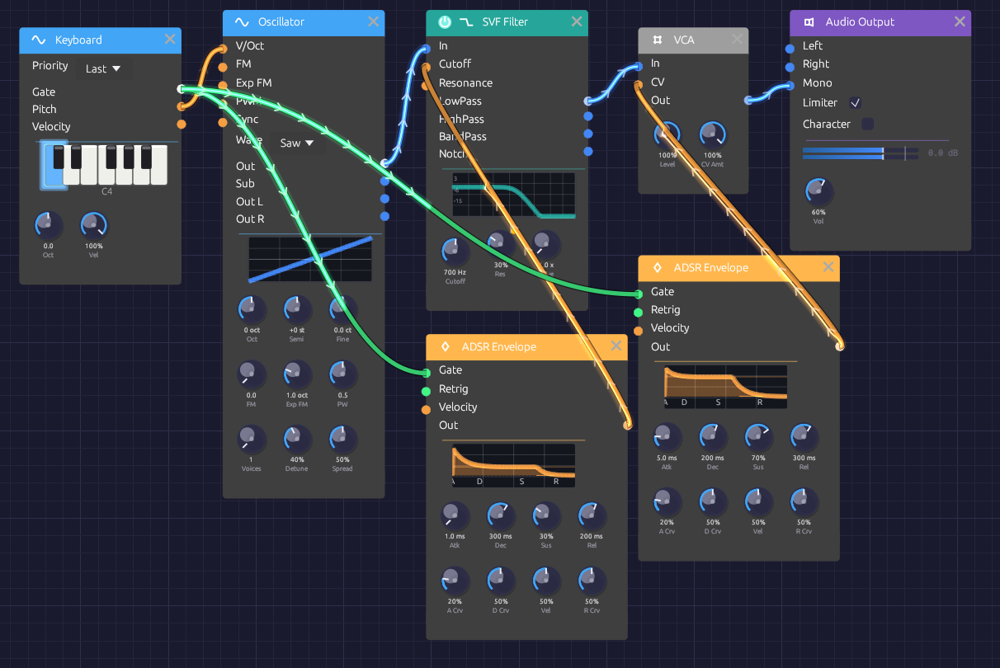

# Basic Subtractive Synth

A saw wave through a lowpass filter, with one envelope shaping its brightness and another its volume. Every note opens bright and settles darker as you hold it. This is the architecture behind most classic monosynths, and the patch to learn first: once you understand it, most other patches are variations on it.

> **Load it:** choose **📚 Examples → Basic Subtractive** in the toolbar. Press **▶ Play**, then play the Z to M keys.
> The patch file is [`patches/basic-subtractive.json`](https://github.com/chrischaps/Soba/blob/master/patches/basic-subtractive.json).

<iframe class="patch-embed" src="../play/?patch=basic-subtractive" title="Basic Subtractive Synth, playable in the browser" loading="lazy"></iframe>
*Or play it here: press **▶ Play** in the corner. The full app is a click away under **Open in Soba**.*


*Two envelopes from one gate: one for the filter, one for the VCA.*

## What it teaches

- **Subtractive synthesis.** Start with a waveform rich in harmonics and take some away with a filter.
- **Separate envelopes for tone and volume.** Brightness and loudness can move on different schedules.
- **Filter CV in octaves.** The envelope opens the filter by a musical interval, not a number of hertz.

## Modules

| Module | Settings |
|--------|----------|
| [Keyboard](../modules/midi/keyboard.md) | Defaults |
| [Oscillator](../modules/sources/oscillator.md) | **Wave** Saw |
| [SVF Filter](../modules/filters/svf-filter.md) | **Cutoff** 700 Hz, **Res** 30% |
| [ADSR Envelope](../modules/modulation/adsr.md) (filter) | **Atk** 1 ms, **Dec** 300 ms, **Sus** 30%, **Rel** 200 ms |
| [ADSR Envelope](../modules/modulation/adsr.md) (amp) | **Atk** 5 ms, **Dec** 200 ms, **Sus** 70%, **Rel** 300 ms |
| [VCA](../modules/utilities/vca.md) | Defaults |
| [Audio Output](../modules/output/audio-output.md) | **Vol** 60% |

## How it's built

### The audio path

```text
[Keyboard Pitch] ──> [Oscillator V/Oct]
[Oscillator Out] ──> [SVF Filter In]
[SVF Filter LowPass] ──> [VCA In]
[VCA Out] ──> [Audio Output Mono]
```

The saw wave contains every harmonic, so it's the richest raw material for a filter. The SVF's lowpass output keeps what's below the cutoff. At 700 Hz with a little resonance, the tone is warm, with a slight edge at the cutoff.

### Two envelopes from one gate

```text
[Keyboard Gate] ──> [ADSR (filter) Gate]
                ──> [ADSR (amp) Gate]
[ADSR (filter) Out] ──> [SVF Filter Cutoff]
[ADSR (amp) Out] ──> [VCA CV]
```

One output can feed any number of inputs, so the Keyboard's gate starts both envelopes at once.

The **amp envelope** shapes the volume through the VCA. It rises in 5 ms, which is quick but not a click, falls to 70% over 200 ms, and fades out over 300 ms after you let go.

The **filter envelope** shapes the brightness. The SVF's **Cutoff** input works in octaves: +1 doubles the cutoff. So as the envelope jumps to its peak of 1.0, the filter opens one octave above the knob, to 1.4 kHz. Over the next 300 ms it settles to its 30% sustain, about 860 Hz. That fall in brightness, faster than the fall in volume, is what makes each note sound plucked rather than switched on.

## Variations

**Fatter bass.** Replace the SVF with a [Ladder Filter](../modules/filters/ladder-filter.md) and use its **LP24** output. Turn **Oct** on the Keyboard down to −1, set the Ladder's **Drive** to about 2x, and lower its **Cutoff** to 300 Hz.

**Acid squelch.** Raise **Res** to 70% and lower **Cutoff** to 400 Hz. The filter envelope now sweeps a sharp resonant peak across each note.

**Pluck.** Set the amp envelope's **Sus** to 0% and **Dec** to 400 ms, so every note dies away even while held.

**Supersaw.** On the Oscillator, set **Voices** to 7 and **Detune** to about 40%. Seven detuned saws through the same filter make a wide, shimmering lead.

**More sweep.** To open the filter by more than an octave, double the envelope by patching it into both inputs of a [Mix](../modules/utilities/mix.md), as the [Rhythmic Sequence](./rhythmic-sequence.md) example does.

**Space.** Add a [Stereo Delay](../modules/effects/delay.md) and a [Reverb](../modules/effects/reverb.md) between the VCA and the Audio Output.

## Related

- [Your First Patch](../getting-started/your-first-patch.md) – build a similar voice step by step
- [FM Synthesis](./fm-synthesis.md) – a different way to make harmonics
