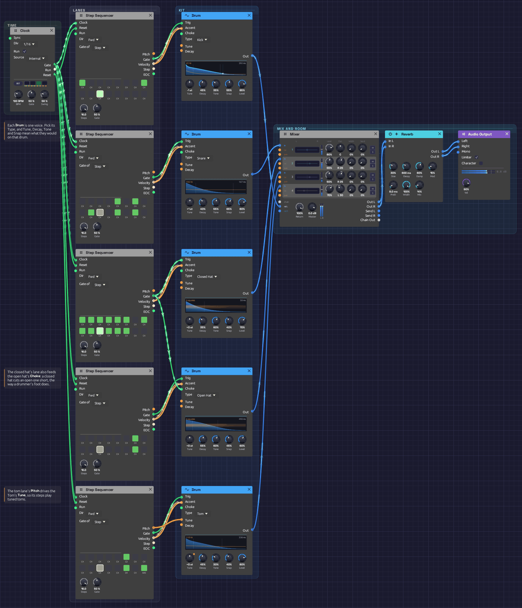

# Drum Machine

A drum machine in 14 modules: one Clock, five sequencer lanes, and a [Drum](../modules/sources/drum.md) voice on each lane. It plays a swung groove with a kick, a snare with ghost notes, closed and open hats, and three tuned toms. [Backbeat](./backbeat.md) builds a kit like this from oscillators, noise and envelopes, in 35 modules and 66 cables. Here each drum is one module, and the whole patch has 31 cables. It plays itself; press Play and let it run.

> **Load it:** choose **📚 Examples → Drum Machine** in the toolbar and press **▶ Play**. It needs no keyboard.
> The patch file is [`patches/drum-machine.json`](https://github.com/chrischaps/Modular/blob/master/patches/drum-machine.json).

<iframe class="patch-embed" src="../play/?patch=drum-machine" title="Drum Machine, playable in the browser" loading="lazy"></iframe>
*Or play it here: press **▶ Play** in the corner. The full app is a click away under **Open in Modular**.*


*Time on the left, then one lane per drum from the top: kick, snare, closed hat, open hat, toms. Each sequencer plays the Drum beside it. The Mixer, a touch of room and the output sit at the right.*

## What it teaches

- **One module per drum.** A Drum's **Type** makes it a kick, a snare or a hat, and its five knobs mean what they would on that drum.
- **Velocity as accent.** Each lane's **Velocity** goes to its Drum's **Accent**. A soft hit is quieter and darker, so a ghost note sounds different from a backbeat, not just quieter.
- **A choke group.** The closed hat's trigger also chokes the open hat, as the pedal does on a real kit.
- **Tuned percussion.** The tom lane's **Pitch** drives its Drum's **Tune**, so the sequencer plays the toms like a bassline.
- **Swing.** The Clock's **Swing** at 56% pushes every second sixteenth a little late, which puts the groove in a pocket.

## The pattern

Sixteen steps a bar at 100 BPM. `X` is an accent, `x` a softer hit, `g` a ghost note, `o` a short open hat, `O` a long one, `~` a hat still ringing. The tom notes are on the steps they play.

```text
step     1 . . . 5 . . . 9 . . . 13. . .
kick     X . . . . . . x . . X . . . . .
snare    . . . . X . g . . g . . X . g .
hats     X x X x X x o x X x X x X x O ~
toms     . . . . . G . . . . . . . D . A#
```

## Modules

| Module | Settings |
|--------|----------|
| [Clock](../modules/modulation/clock.md) | **BPM** 100, **Div** 1/16, **Gate** 50%, **Swing** 56% |
| [Step Sequencer](../modules/utilities/sequencer.md) ×5 (kick, snare, closed hat, open hat, toms) | **Steps** 16, **Gate** 50%, **Gate of** Step. Steps as in the pattern above |
| [Drum](../modules/sources/drum.md) (kick) | **Type** Kick, **Tune** -1 st, **Decay** 45%, **Tone** 35%, **Snap** 55%, **Level** 85% |
| [Drum](../modules/sources/drum.md) (snare) | **Type** Snare, **Tune** +1 st, **Decay** 40%, **Tone** 55%, **Snap** 65%, **Level** 80% |
| [Drum](../modules/sources/drum.md) (closed hat) | **Type** Closed Hat, **Decay** 35%, **Tone** 60%, **Snap** 40%, **Level** 70% |
| [Drum](../modules/sources/drum.md) (open hat) | **Type** Open Hat, **Decay** 55%, **Tone** 60%, **Snap** 45%, **Level** 60% |
| [Drum](../modules/sources/drum.md) (toms) | **Type** Tom, **Decay** 45%, **Tone** 30%, **Snap** 40%, **Level** 80% |
| [Mixer](../modules/utilities/mixer.md) | Snare 80% centre, closed hat 55% and open hat 50% at R 25, toms 70% at L 30; the kick on **Chain L**; **Master** 0 dB |
| [Reverb](../modules/effects/reverb.md) | **Size** 30%, **Decay** 0.6 s, **Damp** 60%, **PreD** 8 ms, **Mix** 14% |
| [Audio Output](../modules/output/audio-output.md) | **Vol** 90% |

## How it's built

### Five lanes

```text
[Clock Gate]  ──> [every Sequencer Clock]
[Clock Reset] ──> [every Sequencer Reset]
[Sequencer Gate]     ──> [its Drum Trig]
[Sequencer Velocity] ──> [its Drum Accent]
```

The Clock ticks sixteenths into all five sequencers, and its **Reset** starts them together on step 1 whenever it starts. Each sequencer is one lane of the kit: a step that's on strikes the Drum beside it, at the step's velocity.

A drum only cares when its trigger rises, so the length of the gate doesn't matter. Each hit lasts as long as its Drum's **Decay**.

### The kick and snare

The kick hits on 1, the last sixteenth of beat 2 and the *and* of 3. Each hit drops two and a half octaves to 45 Hz, most of the way in the first 20 ms. **Snap** at 55% sets how far it falls and how hard the beater clicks. **Tone** at 35% rounds the sine off a little, so the kick carries on small speakers.

The snare's backbeats on 2 and 4 play at full velocity. Its three ghost notes play at 34 to 46 out of 127, about a third. At that accent the Drum plays them about 10 dB down and darker, with less of the wires, so they sit under the groove like a drummer's left hand.

### The hats, and the choke

```text
[Closed Seq Gate] ──> [Closed Hat Trig]
                 └──> [Open Hat Choke]
[Open Seq Gate]   ──> [Open Hat Trig]
```

The closed hats play every sixteenth except steps 7, 15 and 16, with the eighths louder than the sixteenths between them. The open hat plays on 7 and 15. Its decay is long, but it never rings out. On step 7 the closed hat on 8 cuts it off after a sixteenth, a quick *tsk*. On step 15 nothing closes it until the next bar's first step, so it breathes for two sixteenths. That's what a drummer's foot does.

Both hats are panned a little right, where they sit on a kit seen from the audience.

### The toms

```text
[Tom Seq Pitch]    ──> [Tom Tune]
[Tom Seq Gate]     ──> [Tom Trig]
[Tom Seq Velocity] ──> [Tom Accent]
```

The tom lane's notes become its pitch: middle C plays the tom at the **Tune** knob's 110 Hz, and each semitone away moves it one semitone. G3 on step 6 is a low answer to the kick. D4 and A#3 at the end of the bar lead back into the downbeat.

### The mix

Snare, hats and toms take the Mixer's four channels. The kick comes in on **Chain L** alone, which puts it dead centre at its own **Level**. The mix goes through a small room, mostly dry at 14% wet, with 8 ms of pre-delay so each hit's crack stays clear of its reverb.

## Variations

**A clap.** Set the snare's **Type** to **Clap**. Its four bursts land on the backbeats, and the ghost notes become soft claps. For both, add a second Drum set to Clap, patch the snare lane's **Gate** to it too, and mix it in.

**The 808 cowbell.** Set the toms' **Type** to **Cowbell**. The tom lane's three notes become a cowbell figure.

**An 808 boom.** Set the kick's **Decay** to 85%, **Tone** to 10% and **Snap** to 30%. The kick becomes a long, pure sub that rings into the next hit. Tune it to the key of whatever plays over it.

**Let the hat breathe.** Turn off the closed hat's step 8. The open hat on 7 now rings until step 9.

**A cymbal.** Set the open hat's **Type** to **Cymbal** and **Decay** to 30%. The closed hats still choke it, so it plays as a short splash.

**Straight or shuffled.** Turn the Clock's **Swing** to 50% for a straight, programmed feel. At 62% the groove leans back, and at 66% it becomes a full shuffle.

**Make it yours.** Click a step on any lane's grid to turn its gate on or off, and the Drum beside it plays the new pattern. Steps you add play at velocity 100. Velocities can't be edited on the node yet, so ghost notes need the patch file.

## Related

- [Drum](../modules/sources/drum.md) – each type, what its knobs do, and how a choke works
- [Roll Call](./roll-call.md) – eight drums on one Trigger Sequencer, with rolls and a fill every four bars
- [Backbeat](./backbeat.md) – the same kind of kit built from oscillators, noise and envelopes, and a fill every fourth bar
- [Step Sequencer](../modules/utilities/sequencer.md) – pitch, gate, velocity, and what the outputs carry
- [Clock](../modules/modulation/clock.md) – tempo and swing
