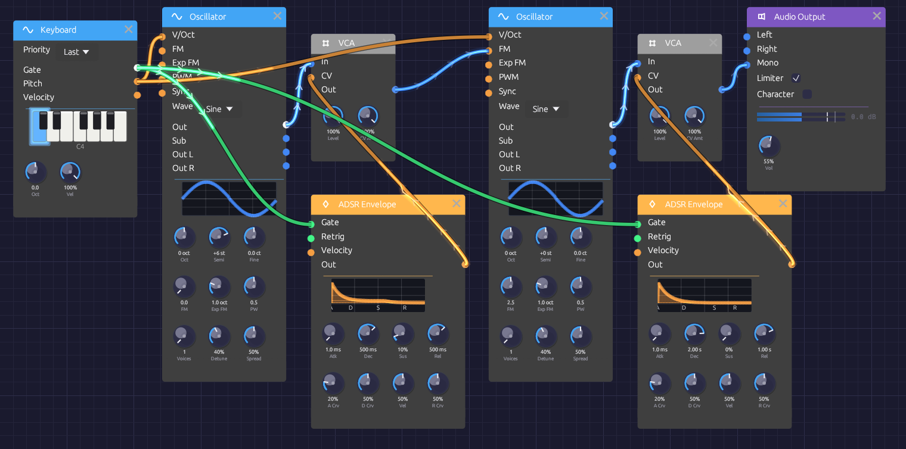

# FM Synthesis

One sine wave bends the pitch of another, hundreds of times a second, and a bell comes out: bright and clangorous when struck, fading to a pure tone as it rings. There's no filter in this patch. All the harmonics come from frequency modulation, and an envelope on the modulator's level decides how many there are.

> **Load it:** choose **📚 Examples → FM Synthesis** in the toolbar. Press **▶ Play**, then play the Z to M keys.
> The patch file is [`patches/fm-synthesis.json`](https://github.com/chrischaps/Modular/blob/master/patches/fm-synthesis.json).


*A modulator and a carrier, each with its own VCA and envelope.*

## What it teaches

- **Carrier and modulator.** The carrier is the oscillator you hear. The modulator is an oscillator you don't hear directly: it wobbles the carrier's pitch so fast that the wobble becomes tone color.
- **Ratio sets the character.** Whole-number pitch ratios between the two sound harmonic. Other ratios sound like bells and metal.
- **Index sets the brightness.** The more the modulator moves the carrier, the more harmonics appear. An envelope on the index makes the tone evolve.

## Modules

| Module | Settings |
|--------|----------|
| [Keyboard](../modules/midi/keyboard.md) | Defaults |
| [Oscillator](../modules/sources/oscillator.md) (modulator) | **Wave** Sine, **Semi** +6 |
| [VCA](../modules/utilities/vca.md) (modulator) | Defaults |
| [ADSR Envelope](../modules/modulation/adsr.md) (modulator) | **Atk** 1 ms, **Dec** 500 ms, **Sus** 10%, **Rel** 500 ms |
| [Oscillator](../modules/sources/oscillator.md) (carrier) | **Wave** Sine, **FM** 2.5 |
| [VCA](../modules/utilities/vca.md) (carrier) | Defaults |
| [ADSR Envelope](../modules/modulation/adsr.md) (carrier) | **Atk** 1 ms, **Dec** 2 s, **Sus** 0%, **Rel** 1 s |
| [Audio Output](../modules/output/audio-output.md) | **Vol** 55% |

## How it's built

### Two oscillators, one keyboard

```text
[Keyboard Pitch] ──> [Oscillator (modulator) V/Oct]
                 ──> [Oscillator (carrier) V/Oct]
```

Both oscillators follow the keyboard, so the ratio between them stays the same on every note and the timbre stays the same up and down the keyboard. The modulator's **Semi** is +6, a tritone above the carrier. That's a frequency ratio of √2 : 1, about 1.41. No whole-number ratio is that close, so the harmonics it creates don't line up with the carrier's harmonic series. The result sounds like a bell, not a string.

### The modulator, through a VCA

```text
[Oscillator (modulator) Out] ──> [VCA (modulator) In]
[ADSR (modulator) Out] ──> [VCA (modulator) CV]
[VCA (modulator) Out] ──> [Oscillator (carrier) FM]
[Keyboard Gate] ──> [ADSR (modulator) Gate]
```

The carrier's **FM** input is through-zero linear FM: it multiplies the carrier's pitch by `1 + FM × input`. With **FM** at 2.5 and the modulator at full level, the carrier's frequency swings well past zero and back on every cycle. That's what produces the glassy, crowded spectrum of a struck bell.

The **FM** knob has no CV input, so the patch controls the depth from the other side, by turning the modulator down. The modulator's VCA, driven by its envelope, does that: the modulation is at full depth for the strike, then decays over 500 ms to 10%. As it falls, the harmonics fall away, and the bell's clang mellows into a near-pure tone.

### The carrier, through a VCA

```text
[Oscillator (carrier) Out] ──> [VCA (carrier) In]
[ADSR (carrier) Out] ──> [VCA (carrier) CV]
[VCA (carrier) Out] ──> [Audio Output Mono]
[Keyboard Gate] ──> [ADSR (carrier) Gate]
```

The carrier's envelope is a bell's: an instant strike and a 2-second decay to silence, with a 1-second release if you let go early. Because the modulator's envelope is shorter, the tone gets purer as it gets quieter, the way real bells and struck metal behave.

## Variations

**Harmonic tones.** Set the modulator's **Semi** to +12 (a 2:1 ratio) or +19 (3:1). The harmonics now line up with the note, giving organ-like and reedy tones in place of bells.

**Electric piano.** Set the modulator's **Semi** to 0 (1:1), lower the carrier's **FM** to about 1.5, and shorten the modulator envelope's **Dec** to 150 ms. The bright attack becomes a short "tine" over a mellow body.

**Gong.** Lengthen the carrier envelope's **Dec** to 8 s and the modulator's to 3 s. Try **Oct** −1 on the Keyboard.

**Shimmer.** Add a few cents of **Fine** to the modulator. The ratio drifts off true, and the spectrum slowly beats and turns.

**Brighter or darker.** Turn the carrier's **FM** up toward 5 for a harsher, more metallic strike, or down toward 1 for a gentler one.

**Space.** Bells want a room. Put a [Reverb](../modules/effects/reverb.md) between the carrier VCA and the Audio Output.

## Related

- [Oscillator](../modules/sources/oscillator.md#through-zero-fm) – how through-zero FM works
- [Basic Subtractive Synth](./basic-subtractive.md) – the other way to shape harmonics
