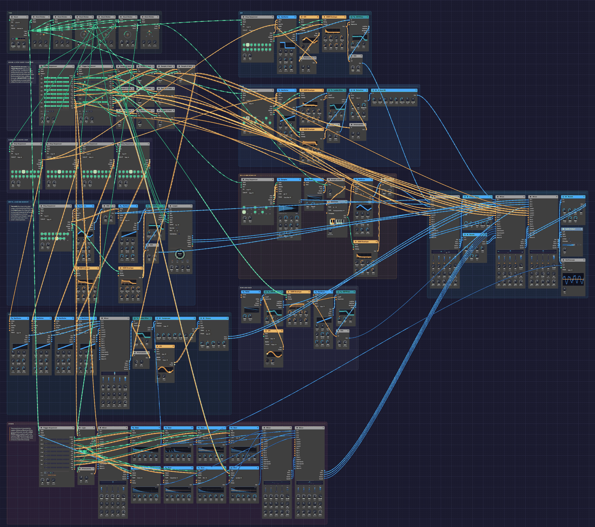

# From One Sine

A whole song in one patch: four and a half minutes of D minor at 112 BPM, from a first note to a last one, with nobody at the keys. It opens the way every patch in this manual opens, on one sine wave playing a short tune, and part by part the rest of the rack joins in: a pad, an arpeggio, a bass, drums, bells, a supersaw lead. In the breakdown a [Looper](../modules/utilities/looper.md) plays the opening back to itself, reversed and an octave down. The song ends where it began, on the sine alone.

Nothing outside the patch tells it what to do. Two [Trigger Sequencers](../modules/utilities/trigger-sequencer.md) take one step every four bars, and those 32 steps are the score: each lane rides one part's fader, picks the drum pattern, or presses a pedal. Ninety-five modules play their part, of 27 kinds: every module in the rack except the five that wait for a player. Left running, it plays the song again from the top.

> **Load it:** choose **📚 Examples → From One Sine** in the toolbar and press **▶ Play**. It needs no keyboard.
> The patch file is [`patches/from-one-sine.json`](https://github.com/chrischaps/Soba/blob/master/patches/from-one-sine.json).

<iframe class="patch-embed" src="../play/?patch=from-one-sine" title="From One Sine, playable in the browser" loading="lazy"></iframe>
*Or play it here: press **▶ Play** in the corner. The full app is a click away under **Open in Soba**.*


*The whole song at the widest zoom. The score and harmony are on the top left, the instruments are in strips with signal running left to right, the drums run along the bottom, and the mixing desk is on the right. Orange cables from the score reach every fader.*

## The song

Each section is four units of four bars, sixteen bars in all.

| Bars | Section | What happens |
|------|---------|--------------|
| 1–16 | First Sound | The sine plays the motif alone, with echoes and a hall, over a breath of wind. The pad, then sparkles, then a soft arpeggio fade in around it. The Looper records bars 5–8. |
| 17–32 | Pulse | The sine rests. The arpeggio steps forward, then the bass and the bells come in, over a heartbeat of kick, rim and offbeat hats. A small riser leads out. |
| 33–48 | Groove | A crash, and the full beat. The pad ducks under the kick. A fill closes the section. |
| 49–64 | Lift | The motif comes back on a seven-voice supersaw. The pad and bass grow brighter. |
| 65–80 | Memory | The drums, bass and lead drop out. The Looper's take of bars 5–8 plays reversed at half speed under the open pad and sparkles. The sine answers its own ghost. Then a four-bar build with a riser. |
| 81–96 | Everything | Drums, bass, arpeggio, pad, bells, sparkles and the lead at once, at the brightest the score sets. |
| 97–112 | Second wave | The lead rests and the sine sings over the groove instead, with the ghost underneath. The lead returns for the last eight bars. |
| 113–128 | Return | Parts leave one at a time until the sine is alone again. |

## What it teaches

- **A patch can hold its own arrangement.** Trigger Sequencer lanes are more than drum triggers: a lane's **Vel** holds its last hit's velocity, so a slow sequencer is a set of faders that move on cue.
- **Smoothing a control voltage.** A [Sample & Hold](../modules/utilities/sample-hold.md) with **Slew** turns a jump into a glide. Triggered by the lane's own gate, it samples exactly when the level changes.
- **Mix adds control voltages.** A [Mix](../modules/utilities/mix.md) adds its inputs into one **Out**, so it can add two CVs, here the score's drum pattern and a fill.
- **Harmony from mono parts.** A sequencer for each pad voice, stepping once a bar, sings real chords with real voice-leading. A root sequencer transposes the arpeggio and bass through **Exp FM**.
- **Gates make decisions.** A [Clock Divider](../modules/utilities/divider.md), [Logic](../modules/utilities/logic.md) and an [Attenuverter](../modules/utilities/attenuverter.md) put a fill in the last bar of a phrase only when the score asks for one.
- **Sidechain ducking.** The [Compressor](../modules/effects/compressor.md) on the pad listens to the kick.
- **Send and return.** Four [Mixers](../modules/utilities/mixer.md) chain their mixes and their sends along one cable each, so one delay and two reverbs serve the whole song.

## Modules

| Module | Role |
|--------|------|
| [Clock](../modules/modulation/clock.md) | **BPM** 112, **Div** 1/16, **Swing** 54% |
| [Clock Divider](../modules/utilities/divider.md) ×6 | Beats (÷4), eighths (÷2), bars (÷16), units (÷64), each unit's last bar (÷64, **Offset** 48, **Length** 16), and ÷3 for the sparkles |
| [Trigger Sequencer](../modules/utilities/trigger-sequencer.md) ×2 | The score, clocked once per unit. **Chain** A B: 32 steps |
| [Sample & Hold](../modules/utilities/sample-hold.md) ×11 | Ten fader glides: **Slew** 1 s for the pad, wind, sparkles, Looper and brightness, 0.8 s for the sine, 0.3 s for the lead, 40 ms for the arp, bass and bells. The eleventh samples the sparkles' random voltage |
| [Step Sequencer](../modules/utilities/sequencer.md) ×8 | Roots and three pad voices (a step a bar), the motif (quarters), the arp and bass (sixteenths), the bells (eighths) |
| [Oscillator](../modules/sources/oscillator.md) ×10 | The sine, the supersaw lead (**Voices** 7), four pad saws, the arp (Square), the bass (Saw), the sparkles (Tri), the riser |
| [ADSR Envelope](../modules/modulation/adsr.md) ×7 | One per voice, two for the bass (filter and amp) |
| [SVF Filter](../modules/filters/svf-filter.md) ×4 | Lead, arp, wind (band-pass) and riser (high-pass) |
| [Ladder Filter](../modules/filters/ladder-filter.md) ×2 | Pad and bass |
| [VCA](../modules/utilities/vca.md) ×6 | Each voice's envelope |
| [LFO](../modules/modulation/lfo.md) ×3 | The chorus depth and the wind's sweep (4 bars), the arp's pulse width (1 bar) |
| [Attenuverter](../modules/utilities/attenuverter.md) ×4 | Scaling: the pad's brightness, the bass drive, the arp's PWM, the fill |
| [Noise](../modules/sources/noise.md) ×2 | Pink wind, and the Random voltage for the sparkles |
| [Quantizer](../modules/utilities/quantizer.md) | D minor pentatonic for the sparkles |
| [Sampler](../modules/sources/sampler.md) | The bell from [Sampled Keys](./sampled-keys.md) |
| [Looper](../modules/utilities/looper.md) | **Bars** 4, **Speed** ½×, **Reverse** on, **Dry** 0 |
| [Drum](../modules/sources/drum.md) ×8 | Kick (tuned to A1), Snare, Clap, Closed Hat, Open Hat (choked by the closed hat), Rim, Tom (A2), and a Cymbal for the crash |
| [Trigger Sequencer](../modules/utilities/trigger-sequencer.md) | The drums: four patterns, picked by **Pattern** CV |
| [Logic](../modules/utilities/logic.md) | Lets the fill gate through when the score asks for fills |
| [Compressor](../modules/effects/compressor.md) | Pad, sidechained by the kick |
| [Chorus](../modules/effects/chorus.md) | Pad, into stereo |
| [Distortion](../modules/effects/distortion.md) | Bass, **Tube** |
| [3-Band EQ](../modules/effects/eq.md) | Bass: lows up, boxiness out |
| [Mix](../modules/utilities/mix.md) ×2 | The pad's four voices, and the fill adder |
| [Mixer](../modules/utilities/mixer.md) ×5 | Two for the kit, and Echoes, Body and Sky |
| [Stereo Delay](../modules/effects/delay.md) | **Sync** 1/8D, **P-P** and **Tape** on, on the Echoes send |
| [Reverb](../modules/effects/reverb.md) ×2 | A hall on Echoes, a plate on the send everyone shares |
| [Oscilloscope](../modules/visualization/oscilloscope.md) | The mix and the kick, to watch |
| [Audio Output](../modules/output/audio-output.md) | **Limiter** and **Character** on |

## How it's built

### The score

```text
[Clock Gate] ──> [Clock Divider ÷64 Clock]
[Clock Divider ÷64 Trig] ──> [Score I Clock]
                         ──> [Score II Clock]
[Score I Vel 2] ──> [Sample & Hold In]        (the pad's level)
[Score I Gate 2] ──> [Sample & Hold Trig]
[Sample & Hold Out] ──> [Mixer Body Level 2]
                    ──> [Mixer Body Level 3]
```

The divider passes one sixteenth in 64, so each score steps once every four bars, a *unit*. Each has two patterns of sixteen steps, chained A then B: 32 units, 128 bars, the whole song.

Score I's lanes are the sine, pad, wind, arp, bass, drums, bells and lead. Score II's are the sparkles, the Looper's **Rec** and **Clear**, the Looper's level, the riser, the crash and a *brightness* lane. A level lane has a hit in every unit, and the hit's velocity is the part's fader for the next four bars: 70% is a fader at 70%, and 0% is silence. On the Echoes, Body and Sky mixers each channel's **Level** knob is at zero, and its **Level** input adds the score's level on top.

The mixer adds a control voltage without smoothing it, so a jump at a section change would click if a note were still ringing. Each level therefore passes through a Sample & Hold. The lane's own gate fires as the level changes, so it samples the new value then, and **Slew** glides to it. The sustained parts glide for a second, so they fade. The rhythmic ones glide for 40 ms, so they still land on the downbeat but never cut a tail short.

The event lanes use the gates. Score II's **Gate Length** is 95%, so a hit holds its gate for nearly four bars. That's what lets the riser's envelope climb for the whole unit and let go just before the downbeat.

### Harmony, a chord a bar

```text
[Clock Divider ÷16 Trig] ──> [Roots Clock], [Pad Voice 1–3 Clock]
[Roots Pitch] ──> [Pad Root Oscillator V/Oct]
              ──> [Arp Oscillator Exp FM]
              ──> [Bass Oscillator Exp FM]
[Pad Voice n Pitch] ──> [Pad Oscillator n V/Oct]
```

Sixteen bars of chords: Dm9, Bbmaj7, Fmaj7 and Cadd9 twice, then Gm7, Bb, Dm, C, Gm7, Bbmaj7, Csus4 and C. Four sequencers each take a step a bar. **Roots** plays the low voice, an octave down. The other three are the upper voices, and each one sings its own line through the changes, so the chords move by step instead of jumping in parallel. The four saws meet in a [Mix](../modules/utilities/mix.md), pass through one Ladder Filter, and duck under the kick in the Compressor. The Chorus spreads them into stereo.

The arpeggio and the bass are written over C, and **Roots** moves them to each chord through **Exp FM** at 1 octave per volt, as in [Afterglow](./afterglow.md). That only stays in key if the shapes have no third, so the arpeggio is made of roots, ninths and fifths, and the bass of roots, fifths and octaves. Over these roots, every note they play is in D minor.

### The motif and its memory

```text
[Clock Divider ÷4 Trig] ──> [Motif Clock]
[Motif Pitch] ──> [Sine V/Oct], [Supersaw V/Oct]
[Sine VCA Out] ──> [Mixer Echoes Ch 1]
               ──> [Looper In L]
[Score II Gate 2] ──> [Looper Rec]
[Clock Divider ÷16 Trig] ──> [Looper Clock]
[Looper Loop L/R] ──> [Mixer Sky Ch 2/3]
```

The motif is four bars of quarter notes, A, D E | F, D | C, A C | G, with ties for the long notes. It leans on notes that both halves of the progression share. A over Dm is the fifth and over Gm the ninth. C over F is the fifth and over Dm the seventh. So it fits whichever chords it lands on.

The Looper listens to the sine. At bar 5, Score II presses **Rec**. With bar pulses on its **Clock** and **Bars** at 4, the take starts on the downbeat and closes itself after four bars. The Looper is set to **½×** and **Rev** from the start. Neither changes what it records, only how it plays it back, so the loop plays reversed, an octave down, at half speed: eight bars, landing on the progression's own eight-bar grid. Its level stays at zero until the breakdown. Score II presses **Clear** at bar 1, so each time the song comes round the Looper records the opening afresh.

### Drums and fills

```text
[Score I Vel 6] ──> [Mix Pattern In 1]
                ──> [Logic CV]                 (Threshold 0.55)
[Clock Divider "last bar" Gate] ──> [Logic A]
[Logic AND] ──> [Attenuverter In]              (Amount 0.25)
[Attenuverter Out] ──> [Mix Pattern In 2]
[Mix Pattern Out] ──> [Drum Trigger Sequencer Pattern]
```

The drum sequencer's **Pattern** input picks a pattern for each new bar in quarters: 0 to 0.25 is A, then B, C and D. A is silence, B is a pulse of kick, rim and offbeat hats, C is the groove, and D is a build: four-on-the-floor kicks, toms, and a snare roll whose ratchets climb to four hits a step.

The score's drum lane sets the pattern for a whole unit: 0.10 for A, 0.35 for B, 0.52 for C and 0.85 for D. For a fill, one Clock Divider opens a gate for the last bar of every unit. Logic passes it through only while the score's CV is above 0.55, the Attenuverter scales it to 0.25, and the pattern Mix adds it to the score's CV. So a unit marked 0.60 plays C for three bars and D for one. The divider's gate is a **Gate**, and the Mix's inputs are audio, which a gate can't drive. The Attenuverter takes the gate as a control voltage, and scales it.

The closed hat's gate chokes the open hat. The kick is tuned to A1, the fifth of D, and the tom to A2, so the drums sit in the key.

### The desk

```text
[Mixer Kit 2 Chain Out] ──> [Mixer Kit Chain In]
[Mixer Kit Chain Out] ──> [Mixer Body Chain In]
[Mixer Body Chain Out] ──> [Mixer Sky Chain In]
[Mixer Sky Out L/R] ──> [Audio Output Left/Right]
[Mixer Sky Send L/R] ──> [Plate Reverb In L/R] ──> [Mixer Sky Return L/R]
[Mixer Echoes Send L/R] ──> [Stereo Delay] ──> [Mixer Echoes Return L/R]
[Mixer Echoes Out L/R] ──> [Hall Reverb] ──> [Mixer Body Return L/R]
```

The sine, arpeggio, bells and sparkles share the Echoes mixer, whose send feeds a ping-pong tape delay on dotted eighths. Its output passes through a big hall and comes back on Body's **Return**. Body carries the bass, the pad in stereo and the wind. Sky carries the lead, the Looper's two sides and the riser. The two kit mixers chain into Body, and Body into Sky. Each chain cable carries a mixer's mix and its sends together, so the sends of all four ride along to Sky, where one plate reverb serves them. Echoes keeps its send for the delay.

## Variations

**Rearrange it.** Every number in the two score sequencers is a fader. Open Score I and change a step's velocity to bring a part in early, or take it out. Set a drum-lane step to 52% for a unit of groove without a fill.

**A shorter song.** Set both scores' **Chain** to A alone. The song becomes its first sixty-four bars, from the lone sine to the end of the lift, and starts again.

**Remember something else.** Patch the Arp's VCA into the Looper's **In L** instead of the sine. The breakdown then hears the arpeggio, slowed and backwards.

**Brighter all through.** Raise the **Offset** on the pad's brightness Attenuverter: each 0.1 opens the Ladder a tenth of an octave further, all song long.

**Straighter.** Set the Clock's **Swing** to 50%. Arp, bass and drums all straighten together, because they share its sixteenths.

## Related

- [Afterglow](./afterglow.md): transposing an arpeggio with a second sequencer
- [Roll Call](./roll-call.md): one Trigger Sequencer, eight drums
- [Live Looper](./live-looper.md): the Looper with your own instrument
- [Interlock](./interlock.md): Logic deciding whose turn it is
- [Tempo and Sync](../concepts/tempo-and-sync.md): one Clock for the whole patch
